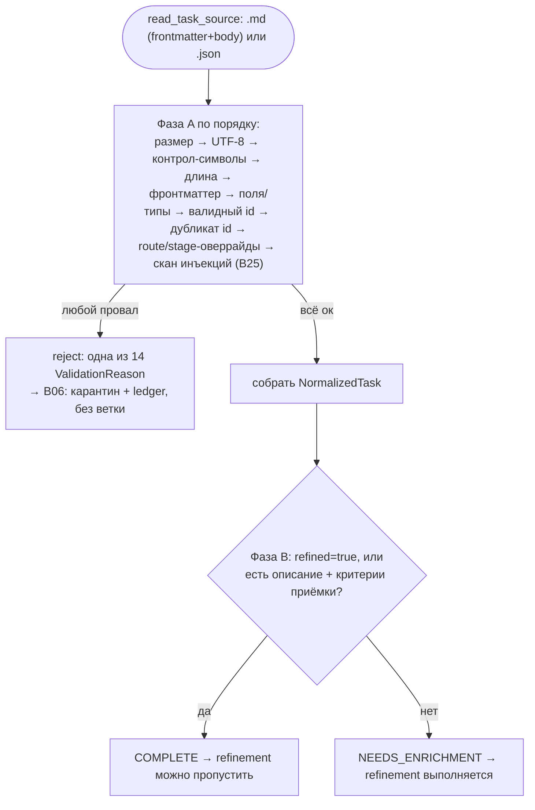

# B16 — Модель задачи, парсинг и шлюз валидации

## Назначение

Превращает файл задачи (`.md` с фронтматтером + тело, или `.json`-объект) в нормализованную модель и применяет приёмочный шлюз §19 — детерминированную проверку, которая допускает или отклоняет задачу **до** захвата слота и создания ветки. Это вход данных в систему: всё, что проходит дальше по конвейеру, уже провалидировано и нормализовано.

## Ответственность

- Зафиксировать форму `NormalizedTask`, регэксп id и схему фронтматтера ([model.py](../../../src/wastech_orchestrator/task/model.py)).
- Структурно разобрать файл на фронтматтер+тело, отказывая на дубль-ключах ([parser.py:95-167](../../../src/wastech_orchestrator/task/parser.py#L95)).
- Применить шлюз: Фаза A (жёсткий reject, первый провал — короткое замыкание) и Фаза B (классификация полноты, без reject) ([validation_gate.py:121-128](../../../src/wastech_orchestrator/task/validation_gate.py#L121)).
- Записать/прочитать `task.normalized.json`; записать `validation_report.json`; сделать slug заголовка.

## Границы блока

### Входит в ответственность блока

- Структурный разбор `.md`/`.json` и отказ на дубликатах ключей.
- Все проверки Фазы A §19 (размер, кодировка, контрол-символы, длина, фронтматтер, поля, типы, id, дубликат id, route/stage-оверрайды, скан инъекций) и классификация полноты Фазы B.
- Сборка `NormalizedTask`; IO нормализованного манифеста и отчёта валидации; `slugify`.

### Не входит в ответственность блока

- **Перемещение файла** в карантин/lifecycle-папку — это [B06](./B06-orchestrator-pipeline.md) (`_quarantine`/`_relocate_task_file`); шлюз только пишет отчёт и возвращает результат.
- **Источник данных для дедупа id** — инъектируемые колбэки `store_has_task_id` ([B07](./B07-state-machine-and-store.md)) и `ledger_has_task_id` ([B08](./B08-ledger-and-failure-reports.md)) ([validation_gate.py:108-119](../../../src/wastech_orchestrator/task/validation_gate.py#L108)).
- **Валидация route-оверрайда** делегируется в [B05 `check_task_route_override`](./B05-configuration.md) ([validation_gate.py:315-318](../../../src/wastech_orchestrator/task/validation_gate.py#L315)).
- **Скан инъекций** делегируется в [B25 `scan_frontmatter`](./B25-security-policy.md) ([validation_gate.py:236](../../../src/wastech_orchestrator/task/validation_gate.py#L236)).
- Захват слота, создание ветки, запуск провайдеров.

## Точки входа

- `read_task_source(path)` ([parser.py:61](../../../src/wastech_orchestrator/task/parser.py#L61)) — `run_task` ([orchestrator.py:352](../../../src/wastech_orchestrator/core/orchestrator.py#L352)).
- `ValidationGate.validate(source)` ([validation_gate.py:121](../../../src/wastech_orchestrator/task/validation_gate.py#L121)) — `run_task` ([orchestrator.py:353](../../../src/wastech_orchestrator/core/orchestrator.py#L353)); конструируется в `build_orchestrator` ([orchestrator.py:2631](../../../src/wastech_orchestrator/core/orchestrator.py#L2631)).
- `ValidationGate.phase_b(task)` ([validation_gate.py:399](../../../src/wastech_orchestrator/task/validation_gate.py#L399)) — также при resume ([orchestrator.py:763,768](../../../src/wastech_orchestrator/core/orchestrator.py#L763)).
- `write_normalized` / `load_normalized` ([parser.py:201,235](../../../src/wastech_orchestrator/task/parser.py#L201)) — регистрация задачи и recovery ([orchestrator.py:2408,739](../../../src/wastech_orchestrator/core/orchestrator.py#L739)).
- `write_validation_report` ([validation_gate.py:447](../../../src/wastech_orchestrator/task/validation_gate.py#L447)) — регистрация и `_reject`.
- `slugify(title)` ([parser.py:191](../../../src/wastech_orchestrator/task/parser.py#L191)) — имя ветки.

## Входные данные и состояние

`ParsedSource` (сырые байты + суффикс); лимиты из `config.validation`; инъектированные колбэки дедупа и `is_recovery_rerun`. Сама `validate` — без IO; запись/чтение артефактов — отдельными функциями.

## Основной сценарий (`validate`)

1. **Фаза A**, по порядку (первый провал → reject с машинной причиной): размер ≤ `max_task_bytes` → декод UTF-8 strict → контрол-символы (NUL → reject; доля > `max_control_ratio`) → длина (`max_task_lines`, `max_line_bytes`) → фронтматтер (есть? не битый?) → валидация полей: неизвестный ключ (fail-closed по `ALLOWED_TASK_KEYS`), обязательные id/title/Description, типы полей, валидный id, дубликат id, route-оверрайд, stage-оверрайды, скан инъекций → сборка `NormalizedTask`.
2. **Фаза B** (никогда не reject): `refined: true` → `COMPLETE`; иначе при наличии описания и критериев приёмки → `COMPLETE`, иначе `NEEDS_ENRICHMENT` ([validation_gate.py:399-413](../../../src/wastech_orchestrator/task/validation_gate.py#L399)).
3. Возврат `ValidationResult(passed, reason, detail, normalized, completeness)`.

Двухфазный шлюз §19: Фаза A — жёсткий reject с коротким замыканием на первом провале; Фаза B — классификация полноты (никогда не reject):

## Альтернативные сценарии

### Recovery-rerun обходит дубликат id

Если `is_recovery_rerun(id)` истинно, проверка `DUPLICATE_TASK_ID` пропускается (тот же id допускается к повторному прогону) ([validation_gate.py:219-222](../../../src/wastech_orchestrator/task/validation_gate.py#L219)).

### `.json` против `.md`

Для `.json` тело берётся из ключа `description`; не-объект на верхнем уровне трактуется как «фронтматтер отсутствует» ([parser.py:149-167](../../../src/wastech_orchestrator/task/parser.py#L149)).

## Проверки и ограничения

- 14 машинных причин reject (`ValidationReason`): file_too_large, not_utf8, binary_or_control_chars, too_long, frontmatter_missing, frontmatter_malformed, unknown_top_level_field, missing_required_field, invalid_field_type, invalid_task_id, duplicate_task_id, invalid_route_override, invalid_stage_override, review_skip_not_allowed, injection_suspected ([validation_gate.py:56-73](../../../src/wastech_orchestrator/task/validation_gate.py#L56)).
- Дубликаты ключей фронтматтера (YAML и JSON) → `frontmatter_malformed` (а не «тихо последнее») ([parser.py:67-92](../../../src/wastech_orchestrator/task/parser.py#L67)).
- `id` — строгий `^[a-z0-9][a-z0-9._-]{0,63}$`, **reject, не санитизировать** ([model.py:19-42](../../../src/wastech_orchestrator/task/model.py#L19)).
- Триgstate `decompose`/`auto_merge` (true/false/None); `model`/`reasoning` валидируются (reasoning ∈ {low, medium, high, xhigh, max}) ([validation_gate.py:50,426-444](../../../src/wastech_orchestrator/task/validation_gate.py#L426)).
- `stages.<stage>`: `model`/`reasoning` только для `ROUTABLE_STAGES`, `enabled` только для `SKIPPABLE_STAGES`; `stages.review.enabled: false` требует `agents.allow_review_skip` ([validation_gate.py:321-395](../../../src/wastech_orchestrator/task/validation_gate.py#L321)).

## Результат

`ValidationResult`: при `passed` — `NormalizedTask` + `Completeness`. Артефакты (через отдельные функции, вызываемые конвейером): `task.normalized.json` и `validation_report.json` под `logs/<id>/`.

## Побочные эффекты

- `validate`/`phase_b`/парсер-сплиттеры — **без** побочных эффектов (чистые).
- `write_normalized` / `write_validation_report` — запись JSON-файлов под `logs/<task-id>/`.
- `read_task_source` — чтение файла задачи.

## Ошибки и граничные случаи

- Невалидная задача — это **возврат** reject-результата, не исключение; шлюз никогда не «чинит» вход.
- `read_task_source` может бросить `OSError` при отсутствующем файле (вызывается до шлюза).
- Пустой результат slug → `"task"` (ветка всегда корректна) ([parser.py:197-198](../../../src/wastech_orchestrator/task/parser.py#L197)).

## Связи

### Использует

- [B25 — Security](./B25-security-policy.md) — `scan_frontmatter`.
- [B05 — Конфигурация](./B05-configuration.md) — `check_task_route_override`, `ROUTABLE_STAGES`/`SKIPPABLE_STAGES`, лимиты `validation.*`.
- [B07](./B07-state-machine-and-store.md) / [B08](./B08-ledger-and-failure-reports.md) — колбэки дедупа id (`task_id_exists` / `has_task_id`).
- [B20](./B20-artifact-layout.md) — `task_artifact_dir` для нормализованного манифеста и отчёта.

### Используется в

- [B06 — Конвейер](./B06-orchestrator-pipeline.md) — `run_task` (валидация на входе), resume (`phase_b`, `load_normalized`), регистрация (`write_normalized`), `slugify` для веток, rerun.

## Место в общей системе

Первый шлюз конвейера. На `passed` оркестратор захватывает слот и идёт к ветке/стадиям; на reject — [B06](./B06-orchestrator-pipeline.md) перемещает файл в карантин и пишет запись в [ledger](./B08-ledger-and-failure-reports.md), **не создавая ветку** (§19.4). Классификация Фазы B управляет детерминированным пропуском стадии refinement.

## Подтверждение в коде

- [task/model.py:19-104](../../../src/wastech_orchestrator/task/model.py#L19) — id-регэксп, схема ключей, `NormalizedTask`, `model_for`/`reasoning_for`/`disabled_stages`.
- [task/parser.py:61-262](../../../src/wastech_orchestrator/task/parser.py#L61) — чтение, сплит фронтматтера (отказ на дубликатах), `extract_section`, `slugify`, нормализованный манифест.
- [task/validation_gate.py:121-413](../../../src/wastech_orchestrator/task/validation_gate.py#L121) — Фаза A/B, причины, делегирование инъекций и route-оверрайда.
- Тесты: [test_model.py](../../../tests/task/test_model.py), [test_parser.py](../../../tests/task/test_parser.py), [test_validation_gate.py](../../../tests/task/test_validation_gate.py) — допуск/reject по каждой причине, дубликаты ключей, классификация полноты.
