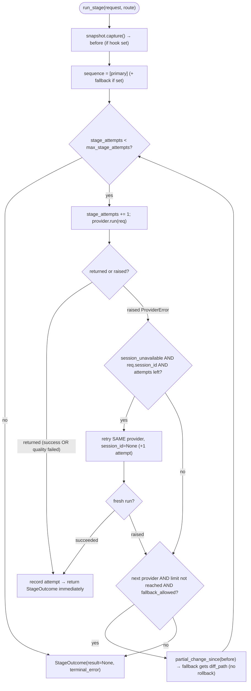

# B17 — Agent Router and Fallback

> Reconstructed from code (`routing/router.py`, `routing/snapshots.py`, `security/profiles.py`) and tests (`tests/routing/`). The code is the only source of truth; this document was rebuilt from the implementation, not from prose or comments. Significant claims carry a `file:line` reference.

**Status:** documented · **Source modules:** `src/wastech_orchestrator/routing/router.py`, `src/wastech_orchestrator/routing/snapshots.py`, `src/wastech_orchestrator/security/profiles.py`

## Responsibility

The `AgentRouter` is the layer between a flow node runner ([B30](B30-flow-node-runners.md)) and the provider adapters ([B18](B18-agent-providers.md)). For one node it does two things: it resolves a `(primary, fallback)` provider pair from the node's declared `provider` (else the config's single global primary), and it runs that sequence with **infrastructure-only** fallback, returning a `StageOutcome` that records every attempt. It depends solely on the `AgentProvider` contract — it knows no CLI syntax and no provider internals ([router.py:14-18](../../../src/wastech_orchestrator/routing/router.py#L14)) — and it changes **no** state-machine state: it is stateless beyond the `StageOutcome` it returns, and persistence/transitions are the caller's job.

A returned quality failure (`AgentRunResult(status=failed)`) is never a fallback trigger; only a raised infrastructure `ProviderError` is ([router.py:345-354](../../../src/wastech_orchestrator/routing/router.py#L345)). The `Stage` threaded through `resolve_route` is carried for audit/identity only (logging, output schema, node_runs rows) — it no longer selects the provider ([router.py:160-162](../../../src/wastech_orchestrator/routing/router.py#L160)).

## Public surface

- `fallback_allowed(error_class, *, primary_profile, fallback_profile)` ([router.py:59](../../../src/wastech_orchestrator/routing/router.py#L59)) — pure decision: True for `FALLBACK_ELIGIBLE`, conditional for auth/permission, False otherwise.
- `RouteSource` ([router.py:92](../../../src/wastech_orchestrator/routing/router.py#L92)) — `FLOW_NODE` (node declared a provider) vs `CONFIG` (defaulted to the global primary); persisted in node_runs.
- `ResolvedRoute(stage, primary, fallback, source)` ([router.py:99](../../../src/wastech_orchestrator/routing/router.py#L99)) — the chosen pair + its source.
- `ProviderAttempt(provider, attempt, status, error_class, result)` ([router.py:109](../../../src/wastech_orchestrator/routing/router.py#L109)) — one provider invocation; `status=None` when the run raised.
- `StageOutcome(route, result, provider_used, stage_attempts, terminal_error, attempts, partial_change)` ([router.py:120](../../../src/wastech_orchestrator/routing/router.py#L120)) — everything the caller needs to act on a run.
- `AgentRouter(config, providers, *, monotonic=time.monotonic)` ([router.py:135](../../../src/wastech_orchestrator/routing/router.py#L135)) — holds the provider instances; resolves the global primary at construction.
- `AgentRouter.resolve_route(stage, provider=None)` ([router.py:150](../../../src/wastech_orchestrator/routing/router.py#L150)) — node-based route resolution.
- `AgentRouter.run_stage(request, route, *, snapshot=None)` ([router.py:170](../../../src/wastech_orchestrator/routing/router.py#L170)) — runs the sequence with infra-only fallback.
- `SnapshotHook` Protocol, `WorkingTreeSnapshot`, `PartialChange` ([snapshots.py:43](../../../src/wastech_orchestrator/routing/snapshots.py#L43), [:19](../../../src/wastech_orchestrator/routing/snapshots.py#L19), [:29](../../../src/wastech_orchestrator/routing/snapshots.py#L29)) — the partial-change contract.
- `is_same_or_stricter(candidate, reference)` ([profiles.py:23](../../../src/wastech_orchestrator/security/profiles.py#L23)) — profile strictness comparison.

## Behavior

### Node-based route resolution

`resolve_route(stage, provider=None)` picks the primary from the **node's** declared `provider`; when that is `None`, it defaults to the config's single global primary ([router.py:164](../../../src/wastech_orchestrator/routing/router.py#L164)). `source` is `FLOW_NODE` when a provider was supplied, else `CONFIG` ([router.py:165](../../../src/wastech_orchestrator/routing/router.py#L165)). The fallback is **always** the global primary — the sole infra-fallback target — **unless** the resolved primary already _is_ the global primary, in which case `fallback` is `None` and a primary infra failure is terminal (no double-fallback) ([router.py:166](../../../src/wastech_orchestrator/routing/router.py#L166)). This is verified by `test_no_provider_defaults_to_global_primary`, `test_node_provider_falls_back_to_global_primary`, and `test_node_provider_equal_to_primary_has_no_fallback` ([test_route_resolution.py:26-46](../../../tests/routing/test_route_resolution.py#L26)).

The single global primary is the one provider with `agents.providers.<id>.primary: true`, computed once at construction by `_resolve_global_primary`; if zero or more than one are flagged, the router refuses to construct (raises `ConfigError`) rather than silently picking one ([router.py:77-89](../../../src/wastech_orchestrator/routing/router.py#L77), `test_router_requires_exactly_one_global_primary`). `resolve_route` then defensively re-checks the resolved primary and fallback against `agents.allowed`, `agents.providers`, and the in-memory provider instances via `_assert_available`; any miss is a fatal `ConfigError`, never a silent skip ([router.py:378-400](../../../src/wastech_orchestrator/routing/router.py#L378), `test_node_provider_not_allowlisted_is_rejected`, `test_missing_provider_instance_is_rejected`).

### Infrastructure-only fallback

`fallback_allowed` is the §7.2/§7.3 decision table ([router.py:59-74](../../../src/wastech_orchestrator/routing/router.py#L59)):

- Unconditionally True for the infrastructure classes in `FALLBACK_ELIGIBLE` — `binary_not_found`, `unsupported_version`, `authentication_failed`, `rate_limited`, `network_unavailable`, `provider_unavailable`, `timeout`, `process_crashed`, `invalid_output` ([base.py:59-71](../../../src/wastech_orchestrator/providers/base.py#L59)).
- Conditional for `authorization_failed` / `permission_denied` (the `CONDITIONAL_FALLBACK` set, [router.py:51-56](../../../src/wastech_orchestrator/routing/router.py#L51)): allowed only when the **fallback** profile `is_same_or_stricter` than the primary's — the policy is never relaxed to enable a fallback ([router.py:72-73](../../../src/wastech_orchestrator/routing/router.py#L72)).
- False for everything else: `configuration_error`, `task_failure`, and `session_unavailable` never fall back ([router.py:74](../../../src/wastech_orchestrator/routing/router.py#L74)). `session_unavailable` is deliberately absent from `FALLBACK_ELIGIBLE` ([base.py:49-53](../../../src/wastech_orchestrator/providers/base.py#L49)).

A quality `status=failed` never reaches `fallback_allowed` at all — when `provider.run` _returns_ (rather than raising), the result (success or quality failure) is recorded and `run_stage` returns immediately, so the fallback is never invoked ([router.py:345-354](../../../src/wastech_orchestrator/routing/router.py#L345), `test_quality_failure_is_not_a_fallback_trigger`, `test_non_fallback_infra_error_stops_at_primary`).

### Attempt loop and `stage_attempts` counting

`run_stage` builds the sequence `[primary]` (+ `fallback` if not `None`) ([router.py:186-188](../../../src/wastech_orchestrator/routing/router.py#L186)) and walks it while `stage_attempts < agents.max_stage_attempts` ([router.py:205-206](../../../src/wastech_orchestrator/routing/router.py#L205)). Each provider invocation increments `stage_attempts` ([router.py:210](../../../src/wastech_orchestrator/routing/router.py#L210)). On a raised `ProviderError` it records a `ProviderAttempt(status=None, error_class=...)` and keeps `last_error`; if a next provider exists, the limit isn't reached, and `fallback_allowed(...)` (evaluated with `_profile_of(primary)` vs `_profile_of(next)`) is True, it advances to the fallback; otherwise it breaks and the loop exits with `result=None` + `terminal_error=last_error` ([router.py:295-324](../../../src/wastech_orchestrator/routing/router.py#L295), [router.py:356-364](../../../src/wastech_orchestrator/routing/router.py#L356)). When both attempts raise, the **last** error wins as `terminal_error` ([test_stage_attempts.py:82-98](../../../tests/routing/test_stage_attempts.py#L82)). `max_stage_attempts=1` blocks any fallback entirely ([test_stage_attempts.py:63-79](../../../tests/routing/test_stage_attempts.py#L63)).

### `session_unavailable`: same-provider fresh retry (not a fallback)

When a resume attempt raises `ErrorClass.SESSION_UNAVAILABLE` _and_ the request carried a `session_id` _and_ an attempt budget remains, the router retries the **same** provider once with a fresh request (`session_id=None`) — it does not fall back to another provider ([router.py:248-294](../../../src/wastech_orchestrator/routing/router.py#L248)). This costs a second `stage_attempt` (`stage_attempts += 1` at [router.py:255](../../../src/wastech_orchestrator/routing/router.py#L255)), so a resume that fails then succeeds fresh reports `stage_attempts == 2` ([test_session_unavailable.py:74-82](../../../tests/routing/test_session_unavailable.py#L74)). It is explicitly infrastructure, not a quality failure: it stays inside one node run and never charges the engine's fix iterations (the fix loop is engine-owned, [B09](B09-fix-loop-control.md)/[B28](B28-flow-engine.md)). If the fresh retry also raises, the original `exc` is replaced by `fresh_exc` so the subsequent fallback decision uses the fresh error ([router.py:275](../../../src/wastech_orchestrator/routing/router.py#L275)); if it succeeds, `run_stage` returns immediately with that result ([router.py:286-294](../../../src/wastech_orchestrator/routing/router.py#L286)). The retried request's session id sequence is asserted as `["stale-session", None]` ([test_session_unavailable.py:80](../../../tests/routing/test_session_unavailable.py#L80)).

### Partial-change capture between primary and fallback (no rollback)

The Router takes a `before` snapshot via `snapshot.capture()` (if a hook is supplied) at the top of `run_stage` ([router.py:184](../../../src/wastech_orchestrator/routing/router.py#L184)). When it decides to fall back after an infra failure, and both a hook and a `before` exist, it calls `snapshot.partial_change_since(before)` and stores the result in `partial` ([router.py:322-323](../../../src/wastech_orchestrator/routing/router.py#L322)). The next (fallback) attempt's request then gets the partial's `diff_path` substituted via `_build_request` — replacing any prior cumulative diff — while `permission_profile` is left untouched ([router.py:366-373](../../../src/wastech_orchestrator/routing/router.py#L366), `test_infra_failure_after_changes_hands_diff_to_fallback`). There is deliberately **no** rollback/restore method on the `SnapshotHook` Protocol — its absence is the no-auto-rollback guarantee; files changed by the failed primary are never reverted ([snapshots.py:43-56](../../../src/wastech_orchestrator/routing/snapshots.py#L43)). The `PartialChange.note` is carried for the caller to weave into the fallback's prompt context; the Router itself only uses `diff_path` ([snapshots.py:29-40](../../../src/wastech_orchestrator/routing/snapshots.py#L29)).

### Profile strictness

`is_same_or_stricter(candidate, reference)` ranks profiles by `_PROFILE_STRICTNESS` (`read-only`=0 strictest, `workspace-write`=1) and returns `rank(candidate) <= rank(reference)` ([profiles.py:17-34](../../../src/wastech_orchestrator/security/profiles.py#L17)). It is **fail-closed**: an unrecognized profile on _either_ side returns `False`, because the orchestrator may never relax policy to enable a fallback ([profiles.py:30-34](../../../src/wastech_orchestrator/security/profiles.py#L30)). This drives the conditional auth/permission rule and is exercised through `test_conditional_auth_permission_rule` (including the two `"bogus"` fail-closed cases) ([test_fallback_policy.py:43-65](../../../tests/routing/test_fallback_policy.py#L43)).

## Invariants & guarantees

- **Contract-only, CLI-blind.** The Router calls `self._providers[pid].run(req)` ([router.py:221](../../../src/wastech_orchestrator/routing/router.py#L221)) and nothing else on a provider; it never builds a command or touches provider internals ([router.py:14-15](../../../src/wastech_orchestrator/routing/router.py#L14)).
- **No state-machine mutation.** The Router writes nothing to the DB or files and holds no state beyond the returned `StageOutcome` ([router.py:15-17](../../../src/wastech_orchestrator/routing/router.py#L15)).
- **Fallback is infrastructure-only.** A returned quality `status=failed` is never retried on another provider; only raised infra `ProviderError`s can fall back, and auth/permission only under a same-or-stricter profile ([router.py:345-354](../../../src/wastech_orchestrator/routing/router.py#L345), [router.py:299-313](../../../src/wastech_orchestrator/routing/router.py#L299)).
- **At most one fallback hop.** The sequence is `[primary]` + at most one `fallback`; when the primary is already the global primary there is no fallback target at all ([router.py:166](../../../src/wastech_orchestrator/routing/router.py#L166), [router.py:186-188](../../../src/wastech_orchestrator/routing/router.py#L186)).
- **`session_unavailable` never crosses providers and never charges a fix iteration**; it is a single same-provider fresh retry that consumes one `stage_attempt` ([router.py:248-294](../../../src/wastech_orchestrator/routing/router.py#L248)).
- **No auto-rollback.** Partial changes from a failed primary are handed forward as a diff, never reverted; the contract has no restore method ([snapshots.py:43-48](../../../src/wastech_orchestrator/routing/snapshots.py#L43)).
- **Permission profile is never relaxed across a fallback.** `_build_request` intentionally leaves `permission_profile` untouched ([router.py:366-373](../../../src/wastech_orchestrator/routing/router.py#L366)); profile comparison is fail-closed ([profiles.py:30-34](../../../src/wastech_orchestrator/security/profiles.py#L30)).
- **`Stage` is identity, not selection.** It is recorded on `ResolvedRoute`/logs but never used to choose a provider ([router.py:160-168](../../../src/wastech_orchestrator/routing/router.py#L160)).

## Dependencies

- **Uses:** [B18](B18-agent-providers.md) (the `AgentProvider.run` contract, `ErrorClass`, `FALLBACK_ELIGIBLE`, `ProviderError` from `providers/base.py`), [B25](B25-security-policy.md) (`is_same_or_stricter` profile ranking), [B05](B05-configuration.md) (`agents.providers`, the single global `primary`, `max_stage_attempts`, `allowed`), [B22](B22-git-manager.md) (concrete `SnapshotHook` implementation), [B27](B27-observability.md) (structured per-route/per-attempt logs via `bind`).
- **Used by:** [B30](B30-flow-node-runners.md) (the agent and evaluator node runners call `resolve_route(stage, node.provider)` then `run_stage(...)`), [B31](B31-supervisor.md) (the supervisor layer resolves a route and runs a stage for its per-step review), [B28](B28-flow-engine.md) (the engine model that drives those runners), [B07](B07-state-machine-and-store.md) (the `attempts`/`StageOutcome` are persisted as `provider_attempts` rows by the node observability writer).

## Audit candidates

- `docs/functional/blocks/B17-agent-router-and-fallback.md` (the prior revision) — the doc carried several stale `file:line` references (e.g. partial-diff at `router.py:270-272,314-321`, immediate-return at `router.py:294-303`, `_assert_available` at `router.py:326-348`) that no longer match the current `router.py`. Recorded in [the audit](../../backlog/2026-06-21-audit.md).

## Tests

- `tests/routing/test_route_resolution.py` — node-based resolution: default-to-global-primary, node→global-primary fallback, primary-is-global-primary (no fallback), allowlist/instance fail-closed, exactly-one-global-primary enforcement, and that the route carries only a `ProviderId` (command/args stay in config).
- `tests/routing/test_fallback_policy.py` — the `fallback_allowed` decision table: all `FALLBACK_ELIGIBLE` classes unconditional, `configuration_error`/`task_failure` never, the conditional auth/permission rule (same/stricter/looser/fail-closed), and that a returned quality `failed` never invokes the fallback.
- `tests/routing/test_stage_attempts.py` — `stage_attempts` counting and bounding: success-on-primary skips fallback, increment across fallback, `max_stage_attempts=1` blocks fallback, both-infra exhaustion (last error wins), non-fallback infra error stops at primary.
- `tests/routing/test_session_unavailable.py` — `session_unavailable` triggers a same-provider fresh retry (`stage_attempts==2`, session ids `["stale", None]`), never falls back to the other provider.
- `tests/routing/test_router_integration.py` — end-to-end over the real Codex/Claude adapters on the fake CLI: a successful infra fallback (rate-limit → fallback succeeds), fallback denied on a quality failure, and the §7.4 partial-diff handoff (the fallback request receives the partial `diff_path`, not the cumulative one; no rollback).

> Note: `is_same_or_stricter` (`security/profiles.py`) has no dedicated unit test; it is covered only indirectly through `test_fallback_policy.py::test_conditional_auth_permission_rule`.
