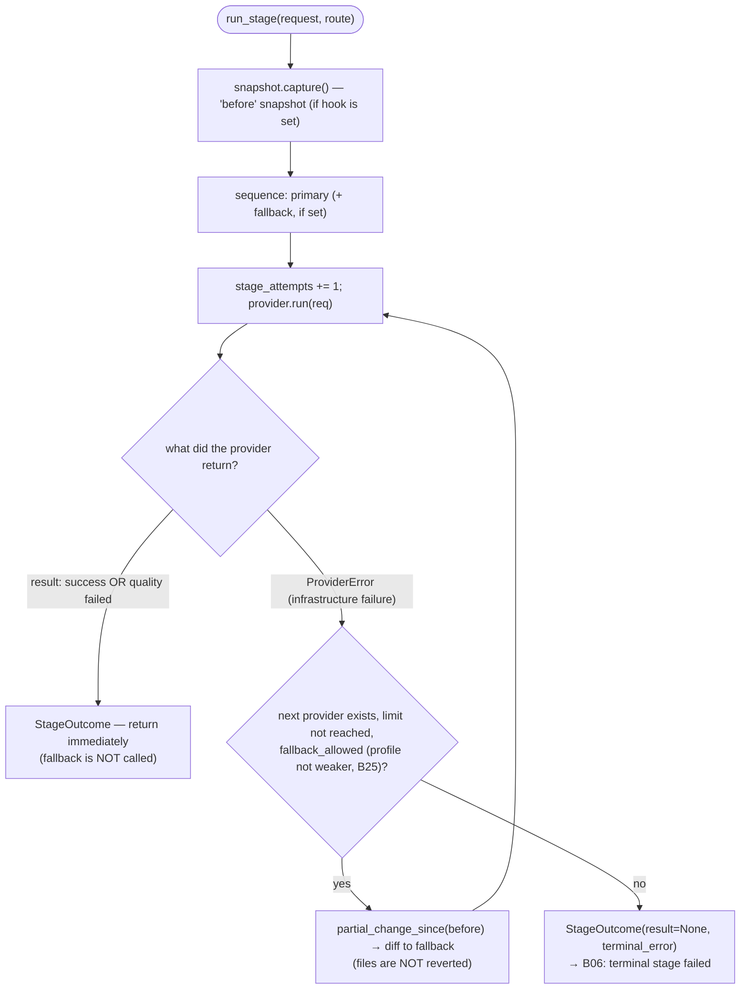

# B17 — Agent Router and Fallback Policy

## Purpose

The layer between the core pipeline and provider adapters. For each agent node it resolves a `(primary, fallback)` pair, runs the primary, and — **only on infrastructure errors** (plus the conditional auth/permission case) — switches to the fallback while counting attempts. Implements the invariant "fallback only for infrastructure errors; a quality failure goes to fixing, not to another provider".

## Responsibilities

- Resolve the route from the flow node's `provider` (else the config's single global primary) — record `RouteSource.FLOW_NODE` when the node declared a provider, else `RouteSource.CONFIG` (defaulted to the global primary). The fallback is always that global primary (the sole infra-fallback target), unless the resolved primary already _is_ the global primary — then there is no fallback (a primary infra failure is terminal) ([router.py:150-168](../../../src/wastech_orchestrator/routing/router.py#L150)).
- Decide whether a raised error permits a fallback (`fallback_allowed`) ([router.py:59-74](../../../src/wastech_orchestrator/routing/router.py#L59)).
- Run the provider sequence, counting `stage_attempts` (bounded by `max_stage_attempts`), and return a `StageOutcome` ([router.py:170-312](../../../src/wastech_orchestrator/routing/router.py#L170)).
- Pass the partial diff of the previous attempt to the fallback provider **without reverting** files ([router.py:270-272,314-321](../../../src/wastech_orchestrator/routing/router.py#L270)).

## Block Boundaries

### Within this block's responsibility

- Route resolution (node `provider` → primary, global primary → fallback), fallback decision, sequence execution, attempt counting, partial diff handoff.

### Outside this block's responsibility

- **Building the CLI command and launching the provider** — that is [B18](./B18-agent-providers.md); the Router only calls `AgentProvider.run` ([router.py:221](../../../src/wastech_orchestrator/routing/router.py#L221)).
- **State transitions and persistence** — that is [B06](./B06-orchestrator-pipeline.md); the Router does not modify the state machine and holds state only in the returned `StageOutcome` ([router.py:14-18](../../../src/wastech_orchestrator/routing/router.py#L14)).
- **Working-tree snapshot/diff** — the `SnapshotHook` contract is implemented by [B22](./B22-git-manager.md) and the object is passed by [B06](./B06-orchestrator-pipeline.md) ([snapshots.py:43-56](../../../src/wastech_orchestrator/routing/snapshots.py#L43)).
- **Error classification** — that is [B18](./B18-agent-providers.md); the Router only consumes `ErrorClass`.
- **What to do with a quality `status=failed`** — that is [B06](./B06-orchestrator-pipeline.md).

## Entry Points

- `AgentRouter.resolve_route(stage, provider=None)` ([router.py:150](../../../src/wastech_orchestrator/routing/router.py#L150)) — called by [B06](./B06-orchestrator-pipeline.md) for each node, passing the node's declared `provider` (or `None` to default to the global primary); `stage` is carried for audit/logging only and no longer selects the provider.
- `AgentRouter.run_stage(request, route, *, snapshot=None)` ([router.py:170](../../../src/wastech_orchestrator/routing/router.py#L170)) — called by [B06](./B06-orchestrator-pipeline.md) with `snapshot=self._git`.
- `fallback_allowed(error_class, *, primary_profile, fallback_profile)` ([router.py:59](../../../src/wastech_orchestrator/routing/router.py#L59)) — pure function, tested in isolation.

## Input Data and State

`AgentRunRequest` (prepared by [B06](./B06-orchestrator-pipeline.md)), `ResolvedRoute`, optional `SnapshotHook`. The Router holds a dict of provider instances and config; it has no other state (stateless beyond the returned `StageOutcome`).

## Happy Path (`run_stage`)

1. Take a "before" snapshot via `snapshot.capture()` (if a hook is provided).
2. Build the sequence `[primary]` (+ `fallback` if it is not None).
3. For each provider, while `stage_attempts < max_stage_attempts`: assemble a per-attempt request, increment `stage_attempts`, call `provider.run(req)`.
4. If `run` returned a result (success **or** quality `failed`) — record the attempt and **immediately** return `StageOutcome` (fallback is not invoked) ([router.py:294-303](../../../src/wastech_orchestrator/routing/router.py#L294)).
5. If all attempts raised `ProviderError` — return `StageOutcome(result=None, terminal_error=...)`.

Attempt loop with the invariant "fallback only for infrastructure failure": any returned result (including a quality `failed`) terminates the stage immediately, the fallback is not called:

## Alternative Scenarios

### Infrastructure failure → fallback

`ProviderError` from primary: record the attempt (status=None); if the next provider exists, the limit is not reached, and `fallback_allowed(...)` is true — take `partial_change_since(before)` and move to the fallback (its request receives `diff_path` of the partial diff) ([router.py:243-272](../../../src/wastech_orchestrator/routing/router.py#L243)).

### Fallback not allowed → terminal for the stage

If `fallback_allowed` is false (error is not infrastructure-level, or the fallback profile is weaker) — exit the loop with `result=None` and `terminal_error` ([router.py:247-261](../../../src/wastech_orchestrator/routing/router.py#L247)).

### Node pinned to the global primary

When a node's resolved primary already _is_ the global primary, `fallback` is `None` (there is no other infra-fallback target), so a primary infrastructure failure is terminal for the stage with no second attempt ([router.py:166](../../../src/wastech_orchestrator/routing/router.py#L166)).

## Checks and Constraints

- `fallback_allowed`: unconditionally for `FALLBACK_ELIGIBLE` ([base.py:60-72](../../../src/wastech_orchestrator/providers/base.py#L60)); conditionally for `authorization_failed`/`permission_denied` — only if the fallback profile is not weaker (`is_same_or_stricter`); never for `task_failure`/`configuration_error` ([router.py:70-74](../../../src/wastech_orchestrator/routing/router.py#L70)).
- The fallback's `permission_profile` is **never weakened** ([router.py:314-321](../../../src/wastech_orchestrator/routing/router.py#L314)).
- `stage_attempts` is bounded by `agents.max_stage_attempts`; `max_stage_attempts=1` fully blocks fallback.
- `resolve_route` defensively re-validates allowed/configured/instance presence for the resolved primary/fallback → `ConfigError` ([router.py:326-348](../../../src/wastech_orchestrator/routing/router.py#L326)).
- No rollback operation — partial changes are not reverted ([snapshots.py:43-48](../../../src/wastech_orchestrator/routing/snapshots.py#L43)).

## Output

`StageOutcome`: route, final `result` (or `None` if all attempts were infrastructure failures), `provider_used`, `stage_attempts`, `terminal_error`, `attempts` tuple, `partial_change`. No further decisions are made here — they are made by [B06](./B06-orchestrator-pipeline.md).

## Side Effects

- Structured log records for the route and each attempt (via [B27](./B27-observability.md)).
- Indirectly: the provider writes artifacts on launch (that is [B18](./B18-agent-providers.md)).
- The Router itself writes nothing to the DB or files.

## Errors and Edge Cases

- No route for the stage or unavailable provider → `ConfigError` (from `resolve_route`).
- All attempts are infrastructure failures → `result=None` + `terminal_error`; [B06](./B06-orchestrator-pipeline.md) treats this as a terminal stage `failed`.
- A quality `failed` is not treated as a Router failure — it passes through as a result.

## Relationships

### Uses

- [B18 — Provider Adapters](./B18-agent-providers.md) — `AgentProvider.run`, `ErrorClass`, `FALLBACK_ELIGIBLE`.
- [B25 — Security](./B25-security-policy.md) — `is_same_or_stricter` (conditional fallback).
- [B05 — Configuration](./B05-configuration.md) — `agents.providers` + the single global `primary`.
- [B22 — Git Manager](./B22-git-manager.md) — `SnapshotHook` implementation (snapshot/partial diff).
- [B27 — Observability](./B27-observability.md) — structured attempt log.

### Used by

- [B06 — Pipeline](./B06-orchestrator-pipeline.md) — the sole caller of `resolve_route`/`run_stage`.

## Place in the Overall System

The Router isolates the core from providers: the core prepares a request and reacts to `StageOutcome`, while the Router encapsulates "try primary, on infrastructure failure — fallback". This upholds the separation-of-responsibility invariant (the core does not know CLI syntax) and the "fallback only for infrastructure" invariant.

## Code Evidence

- [routing/router.py:59-74](../../../src/wastech_orchestrator/routing/router.py#L59) — fallback decision table.
- [routing/router.py:77-89](../../../src/wastech_orchestrator/routing/router.py#L77) — `_resolve_global_primary` (the single `agents.providers.<id>.primary`).
- [routing/router.py:150-168](../../../src/wastech_orchestrator/routing/router.py#L150) — route resolution (node `provider` → primary, global primary → fallback).
- [routing/router.py:170-312](../../../src/wastech_orchestrator/routing/router.py#L170) — attempt loop, fallback, `StageOutcome`.
- [routing/snapshots.py:43-56](../../../src/wastech_orchestrator/routing/snapshots.py#L43) — `SnapshotHook` without rollback.
- Tests: [test_fallback_policy.py](../../../tests/routing/test_fallback_policy.py), [test_route_resolution.py](../../../tests/routing/test_route_resolution.py), [test_stage_attempts.py](../../../tests/routing/test_stage_attempts.py), [test_router_integration.py](../../../tests/routing/test_router_integration.py) — eligibility classes, node-based resolution, attempt limit, partial diff handoff, "quality failed does not trigger fallback".
