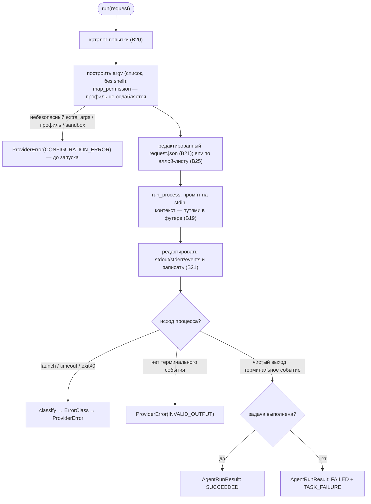

# B18 — Адаптеры провайдеров и контракт (Codex/Claude)

## Назначение

Единственное место в системе, знающее синтаксис CLI кодинг-агентов. Определяет контракт
`AgentProvider` и реализует его для `codex` и `claude`: транслирует `AgentRunRequest` в argv,
запускает процесс, парсит вывод в нормализованный `AgentRunResult` и классифицирует инфраструктурные
сбои в `ErrorClass`. Поддерживает инвариант «ядро не знает синтаксиса CLI» — всё CLI-специфичное
изолировано здесь.

## Ответственность

- Задать контракт и канонические перечисления/структуры (`AgentProvider`, `ProviderId`, `Stage`,
  `RunStatus`, `ErrorClass`, `AgentRunRequest`/`AgentRunResult`, `ProviderError`)
  ([base.py:16-171](../../../src/wastech_orchestrator/providers/base.py#L16)).
- Построить argv (список, без shell) для `claude -p` и `codex exec`
  ([claude.py:247-305](../../../src/wastech_orchestrator/providers/claude.py#L247), [codex.py:153-213](../../../src/wastech_orchestrator/providers/codex.py#L153)).
- Запустить процесс (промпт на stdin, контекст — только путями), редактировать все стоки, парсить
  событийный поток ([claude.py:449-563](../../../src/wastech_orchestrator/providers/claude.py#L449), [codex.py:354-475](../../../src/wastech_orchestrator/providers/codex.py#L354)).
- Классифицировать инфраструктурный сбой в `ErrorClass` ([errors.py:63-87](../../../src/wastech_orchestrator/providers/errors.py#L63)).
- `preflight` (`<cli> --version`) и `isolation_reasons` (офлайн-проверка изоляции).

## Границы блока

### Входит в ответственность блока

- Трансляция запроса в argv, безопасный запуск (через B19), парсинг вывода, классификация ошибок,
  `preflight`, `isolation_reasons`, редакция стоков и запись артефактов попытки.

### Не входит в ответственность блока

- **Fallback/повторы** — это [B17 Router](./B17-agent-router-and-fallback.md); адаптер fallback не
  делает ([claude.py:9-11](../../../src/wastech_orchestrator/providers/claude.py#L9)).
- **Машина состояний / персист** — это [B06](./B06-orchestrator-pipeline.md); адаптер её не трогает.
- **Выбор провайдера/маршрута** — это [B17](./B17-agent-router-and-fallback.md).
- **Сборка текста промпта** — это [B06](./B06-orchestrator-pipeline.md)/[B15](./B15-prompt-templates.md); адаптер лишь добавляет футер с путями к контексту.
- **Раскладка артефактов** — [B20](./B20-artifact-layout.md); **правила редакции** — [B21](./B21-secret-redaction.md); **аллой-лист env** — [B25](./B25-security-policy.md).
- **commit/push/PR** — никогда: Claude дополнительно запрещает это как `--disallowedTools`.

## Точки входа

- Контракт: `AgentProvider.preflight()` / `run(request)` ([base.py:154-171](../../../src/wastech_orchestrator/providers/base.py#L154)).
- Реализации: `ClaudeCodeProvider` ([claude.py:382](../../../src/wastech_orchestrator/providers/claude.py#L382)), `CodexProvider` ([codex.py:287](../../../src/wastech_orchestrator/providers/codex.py#L287)). Конструируются в `build_providers` ([orchestrator.py:2564](../../../src/wastech_orchestrator/core/orchestrator.py#L2564)).
- Вспомогательные (используются другими блоками): `isolation_reasons` (импортирует [B25](./B25-security-policy.md)), `errors.classify`.
- Вызовы: `run` — только из [B17](./B17-agent-router-and-fallback.md) ([router.py:222](../../../src/wastech_orchestrator/routing/router.py#L222)); `preflight` — из [B01 preflight](./B01-cli-and-operator-commands.md) ([cli.py:1074](../../../src/wastech_orchestrator/cli.py#L1074)) и [B23 discovery_factory](./B23-check-discovery.md).

## Входные данные и состояние

`AgentRunRequest` (стадия, рабочий каталог, промпт, профиль разрешений, таймаут, пути к контексту,
output_schema, model/reasoning, session_id). Конфиг провайдера (`ProviderConfig`) и `SecurityConfig`.
Состояние не хранится между запусками (кроме файловых артефактов).

## Основной сценарий (`run`)

1. Создаётся каталог попытки ([B20](./B20-artifact-layout.md)); пишется `output-schema.json` (если есть).
2. Строится argv; при небезопасных `extra_args`/запрещённом профиле — `ProviderError`
   (`CONFIGURATION_ERROR`), запрос пишется с `argv=None`, ошибка пробрасывается.
3. Пишется редактированный `request.json`; строится env (аллой-лист).
4. Запуск `run_process(argv, cwd=working_directory, env, timeout, stdout_path, stdin_text=промпт+футер)`
   под heartbeat'ом ([claude.py:483-497](../../../src/wastech_orchestrator/providers/claude.py#L483)).
5. Все стоки (stdout/stderr/events) редактируются и пишутся на диск; парсинг идёт по сырому stdout.
6. При инфра-сбое (`launch_error`/`timed_out`/`exit_code != 0`) — `classify(...)` → запись
   failure-результата → `raise ProviderError`.
7. При чистом выходе — парсинг событий: `succeeded` → `SUCCEEDED`, иначе `FAILED` + `TASK_FAILURE`;
   пишется `result.json`, возвращается `AgentRunResult`.

Поток `run` — всё CLI-специфичное изолировано здесь; профиль разрешений никогда не ослабляется:

## Альтернативные сценарии

### Невалидный вывод

Нет терминального события в потоке → `ProviderError(INVALID_OUTPUT)` из парсера → finalize + raise
([claude.py:370-371](../../../src/wastech_orchestrator/providers/claude.py#L370), [codex.py:273-274](../../../src/wastech_orchestrator/providers/codex.py#L273)).

### Codex: файл последнего сообщения

`--output-last-message <path>` пишет финальное сообщение в отдельный файл; он редактируется на диске и
переопределяет `final_message` из потока ([codex.py:431-437,276-277](../../../src/wastech_orchestrator/providers/codex.py#L431)).

### preflight

`<cli> --version`: launch_error → executable_found=False; ненулевой выход/таймаут → found, но не
готов; иначе парсится версия ([claude.py:406-447](../../../src/wastech_orchestrator/providers/claude.py#L406)).

## Проверки и ограничения

- **argv-список, без shell**; промпт всегда на stdin (Codex — через трейлинг `-`), контекст — только
  путями в футере ([claude.py:140-168](../../../src/wastech_orchestrator/providers/claude.py#L140)).
- **Профиль не ослабляется**: Claude `map_permission` (read-only→`plan`, workspace-write→`acceptEdits`;
  forbidden/unknown→`CONFIGURATION_ERROR`; никогда `bypassPermissions`) + `_reject_weaker_permission_override`; Codex отвергает `danger-full-access` ([claude.py:201-244](../../../src/wastech_orchestrator/providers/claude.py#L201), [codex.py:174-176](../../../src/wastech_orchestrator/providers/codex.py#L174)).
- `find_forbidden_args` отвергает небезопасные `extra_args` (defense-in-depth поверх [B05](./B05-configuration.md)).
- **Claude** транслирует `denied_commands` → `Bash(<cmd>:*)` и `denied_read_paths` → `Read(<glob>)` в
  `--disallowedTools` (агент не может публиковать/читать секреты) ([claude.py:171-198,284-286](../../../src/wastech_orchestrator/providers/claude.py#L171)). **Codex** не имеет per-tool-deny — изоляцию даёт sandbox ([codex.py:222-223](../../../src/wastech_orchestrator/providers/codex.py#L222)).
- Все стоки и финальное сообщение редактируются перед записью (литералы: секрето-именованные env + содержимое `denied_read_paths`).
- `classify` precedence: launch → timeout → stderr-сигнатура → `exit 0`=`TASK_FAILURE` → иначе `PROCESS_CRASHED`; сообщение всегда без секретов ([errors.py:77-86](../../../src/wastech_orchestrator/providers/errors.py#L77)).

## Отличия адаптеров

| Аспект | Claude | Codex |
|---|---|---|
| запуск | `claude -p --output-format stream-json --verbose` | `codex --ask-for-approval never exec --json` |
| изоляция | `--permission-mode {plan\|acceptEdits}` + allow/deny tools | `--sandbox {workspace-write}` |
| reasoning | `--effort {low…max}` | `--reasoning-effort {low…xhigh}` (`max`→`xhigh`) |
| сессия | `--resume <id>` | нет (session_id не передаётся) |
| финальное сообщение | из события `result` | файл `--output-last-message` (приоритетно) |
| терминальное событие | `type=result` | `result`/`task_complete`/`turn.completed` |
| успех | `subtype=success and not is_error` | `status ∉ {error,failed,failure,incomplete,aborted}` |

## Результат

`AgentRunResult` (status, provider, stage, attempt, exit_code, final_message, structured_output,
usage, session_id, пути к stdout/stderr/events, error) — возвращается [B17](./B17-agent-router-and-fallback.md).
`ProviderHealth` из `preflight`. Инфраструктурный сбой → `ProviderError`.

## Побочные эффекты

- Порождение дочернего процесса CLI (через [B19](./B19-subprocess-runner.md)).
- Запись артефактов попытки: `request.json`, `stdout.log`, `stderr.log`, `events.jsonl`,
  `result.json`, опц. `output-schema.json`/`last-message.txt` — все редактированы.
- Heartbeat-лог во время запуска.

## Ошибки и граничные случаи

- Небезопасные `extra_args`/запрещённый профиль/sandbox → `ProviderError(CONFIGURATION_ERROR)` до запуска.
- launch/timeout/abnormal exit → `ProviderError` соответствующего класса (с записью failure-результата).
- `INVALID_OUTPUT`, когда поток без терминального события.
- Чистый выход без выполнения задачи → `AgentRunResult(status=failed, error=task_failure)` (не исключение).

## Связи

### Использует

- [B19 — Запуск подпроцессов](./B19-subprocess-runner.md) — `run_process`.
- [B20 — Артефакты](./B20-artifact-layout.md) — каталог попытки, запись request/result.
- [B21 — Redaction](./B21-secret-redaction.md) — `redact_text`/`redact_mapping`/`read_denied_secrets`.
- [B25 — Security](./B25-security-policy.md) — `build_child_env`, `find_forbidden_args`, `FORBIDDEN_SANDBOX_VALUE`.
- [B27 — Наблюдаемость](./B27-observability.md) — heartbeat и логирование.
- [B05 — Конфигурация](./B05-configuration.md) — `ProviderConfig`, `SecurityConfig`.

### Используется в

- [B17 — Router](./B17-agent-router-and-fallback.md) — единственный вызыватель `run`.
- [B01 — CLI](./B01-cli-and-operator-commands.md) и [B23 — Discovery](./B23-check-discovery.md) — `preflight`.
- [B25 — Security](./B25-security-policy.md) — импортирует `isolation_reasons` для префлайта изоляции.

## Место в общей системе

Адаптеры — граница между детерминированным ядром и недетерминированными агентами. Они переводят
абстрактный «запрос стадии» в конкретный запуск CLI и обратно — в нормализованный результат, скрывая
все различия Codex/Claude за единым контрактом, который потребляет только Router.

## Подтверждение в коде

- [providers/base.py:16-171](../../../src/wastech_orchestrator/providers/base.py#L16) — контракт, перечисления, структуры, `FALLBACK_ELIGIBLE`.
- [providers/claude.py:201-563](../../../src/wastech_orchestrator/providers/claude.py#L201) — маппинг профиля, argv, парсинг, `run`/`preflight`, редакция.
- [providers/codex.py:153-475](../../../src/wastech_orchestrator/providers/codex.py#L153) — argv, парсинг (мульти-событие + last-message), `run`/`preflight`.
- [providers/errors.py:63-91](../../../src/wastech_orchestrator/providers/errors.py#L63) — `classify` и секрет-free сообщения.
- Тесты: [test_providers_base.py](../../../tests/test_providers_base.py), [test_claude_command.py](../../../tests/providers/test_claude_command.py), [test_claude_parsing.py](../../../tests/providers/test_claude_parsing.py), [test_claude_run.py](../../../tests/providers/test_claude_run.py), [test_codex_command.py](../../../tests/providers/test_codex_command.py), [test_codex_parsing.py](../../../tests/providers/test_codex_parsing.py), [test_codex_run.py](../../../tests/providers/test_codex_run.py), [test_errors.py](../../../tests/providers/test_errors.py), [test_prompt_argv_isolation.py](../../../tests/providers/test_prompt_argv_isolation.py), [test_redaction_sinks.py](../../../tests/providers/test_redaction_sinks.py), [test_provider_integration.py](../../../tests/providers/test_provider_integration.py).
