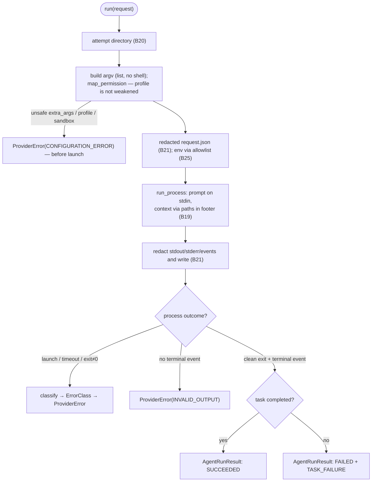

# B18 — Agent Provider Adapters and Contract (Codex/Claude)

## Purpose

The single place in the system that knows the CLI syntax of coding agents. Defines the `AgentProvider` contract and implements it for `codex` and `claude`: translates `AgentRunRequest` into argv, launches the process, parses output into a normalized `AgentRunResult`, and classifies infrastructure failures into `ErrorClass`. Upholds the invariant "the core does not know the CLI syntax" — all CLI-specific logic is isolated here.

## Responsibility

- Define the contract and canonical enumerations/structures (`AgentProvider`, `ProviderId`, `Stage`, `RunStatus`, `ErrorClass`, `AgentRunRequest`/`AgentRunResult`, `ProviderError`) ([base.py:16-171](../../../src/wastech_orchestrator/providers/base.py#L16)).
- Build argv (a list, without shell) for `claude -p` and `codex exec` ([claude.py:247-305](../../../src/wastech_orchestrator/providers/claude.py#L247), [codex.py:153-213](../../../src/wastech_orchestrator/providers/codex.py#L153)).
- Launch the process (prompt on stdin, context via paths only), redact all streams, parse the event stream ([claude.py:449-563](../../../src/wastech_orchestrator/providers/claude.py#L449), [codex.py:354-475](../../../src/wastech_orchestrator/providers/codex.py#L354)).
- Classify infrastructure failures into `ErrorClass` ([errors.py:63-87](../../../src/wastech_orchestrator/providers/errors.py#L63)).
- `preflight` (`<cli> --version`) and `isolation_reasons` (offline isolation check).

## Block Boundaries

### Within scope

- Translating the request into argv, safe launch (via B19), output parsing, error classification, `preflight`, `isolation_reasons`, stream redaction, and writing attempt artifacts.

### Out of scope

- **Fallback/retries** — that is [B17 Router](./B17-agent-router-and-fallback.md); the adapter does not perform fallback ([claude.py:9-11](../../../src/wastech_orchestrator/providers/claude.py#L9)).
- **State machine / persistence** — that is [B06](./B06-orchestrator-pipeline.md); the adapter does not touch it.
- **Provider/route selection** — that is [B17](./B17-agent-router-and-fallback.md).
- **Prompt text assembly** — that is [B06](./B06-orchestrator-pipeline.md)/[B15](./B15-prompt-templates.md); the adapter only appends a footer with context file paths.
- **Artifact layout** — [B20](./B20-artifact-layout.md); **redaction rules** — [B21](./B21-secret-redaction.md); **env allowlist** — [B25](./B25-security-policy.md).
- **commit/push/PR** — never: Claude additionally forbids this via `--disallowedTools`.

## Entry Points

- Contract: `AgentProvider.preflight()` / `run(request)` ([base.py:154-171](../../../src/wastech_orchestrator/providers/base.py#L154)).
- Implementations: `ClaudeCodeProvider` ([claude.py:382](../../../src/wastech_orchestrator/providers/claude.py#L382)), `CodexProvider` ([codex.py:287](../../../src/wastech_orchestrator/providers/codex.py#L287)). Constructed in `build_providers` ([orchestrator.py:2564](../../../src/wastech_orchestrator/core/orchestrator.py#L2564)).
- Helpers (used by other blocks): `isolation_reasons` (imported by [B25](./B25-security-policy.md)), `errors.classify`.
- Callers: `run` — only from [B17](./B17-agent-router-and-fallback.md) ([router.py:222](../../../src/wastech_orchestrator/routing/router.py#L222)); `preflight` — from [B01 preflight](./B01-cli-and-operator-commands.md) ([cli.py:1074](../../../src/wastech_orchestrator/cli.py#L1074)) and [B23 discovery_factory](./B23-check-discovery.md).

## Input Data and State

`AgentRunRequest` (stage, working directory, prompt, permission profile, timeout, context file paths, output_schema, model/reasoning, session_id). Provider config (`ProviderConfig`) and `SecurityConfig`. No state is stored between runs (except file artifacts).

## Main Scenario (`run`)

1. An attempt directory is created ([B20](./B20-artifact-layout.md)); `output-schema.json` is written (if present).
2. argv is built; if `extra_args` are unsafe or the profile is forbidden — `ProviderError` (`CONFIGURATION_ERROR`), the request is written with `argv=None`, the error is propagated.
3. The redacted `request.json` is written; env is built (allowlist).
4. Launch `run_process(argv, cwd=working_directory, env, timeout, stdout_path, stdin_text=prompt+footer)` under a heartbeat ([claude.py:483-497](../../../src/wastech_orchestrator/providers/claude.py#L483)).
5. All streams (stdout/stderr/events) are redacted and written to disk; parsing proceeds over raw stdout.
6. On infrastructure failure (`launch_error`/`timed_out`/`exit_code != 0`) — `classify(...)` → write failure result → `raise ProviderError`.
7. On clean exit — parse events: `succeeded` → `SUCCEEDED`, otherwise `FAILED` + `TASK_FAILURE`; write `result.json`, return `AgentRunResult`.

The `run` flow — all CLI-specific logic is isolated here; the permission profile is never weakened:

## Alternative Scenarios

### Invalid output

No terminal event in the stream → `ProviderError(INVALID_OUTPUT)` from the parser → finalize + raise ([claude.py:370-371](../../../src/wastech_orchestrator/providers/claude.py#L370), [codex.py:273-274](../../../src/wastech_orchestrator/providers/codex.py#L273)).

### Codex: last-message file

`--output-last-message <path>` writes the final message to a separate file; it is redacted on disk and overrides `final_message` from the stream ([codex.py:431-437,276-277](../../../src/wastech_orchestrator/providers/codex.py#L431)).

### preflight

`<cli> --version`: launch_error → executable_found=False; non-zero exit/timeout → found but not ready; otherwise the version is parsed ([claude.py:406-447](../../../src/wastech_orchestrator/providers/claude.py#L406)).

## Checks and Constraints

- **argv list, no shell**; prompt always on stdin (Codex — via trailing `-`), context only via paths in the footer ([claude.py:140-168](../../../src/wastech_orchestrator/providers/claude.py#L140)).
- **Profile is not weakened**: Claude `map_permission` (read-only→`plan`, workspace-write→`acceptEdits`; forbidden/unknown→`CONFIGURATION_ERROR`; never `bypassPermissions`) + `_reject_weaker_permission_override`; Codex rejects `danger-full-access` ([claude.py:201-244](../../../src/wastech_orchestrator/providers/claude.py#L201), [codex.py:174-176](../../../src/wastech_orchestrator/providers/codex.py#L174)).
- `find_forbidden_args` rejects unsafe `extra_args` (defense-in-depth on top of [B05](./B05-configuration.md)).
- **Claude** translates `denied_commands` → `Bash(<cmd>:*)` and `denied_read_paths` → `Read(<glob>)` into `--disallowedTools` (the agent cannot publish/read secrets) ([claude.py:171-198,284-286](../../../src/wastech_orchestrator/providers/claude.py#L171)). **Codex** has no per-tool-deny — isolation is provided by the sandbox ([codex.py:222-223](../../../src/wastech_orchestrator/providers/codex.py#L222)).
- All streams and the final message are redacted before writing (literals: secret-named env vars + content of `denied_read_paths`).
- `classify` precedence: launch → timeout → stderr signature → `exit 0`=`TASK_FAILURE` → otherwise `PROCESS_CRASHED`; message is always free of secrets ([errors.py:77-86](../../../src/wastech_orchestrator/providers/errors.py#L77)).

## Adapter Differences

| Aspect | Claude | Codex |
| --- | --- | --- |
| launch | `claude -p --output-format stream-json --verbose` | `codex --ask-for-approval never exec --json` |
| isolation | `--permission-mode {plan\|acceptEdits}` + allow/deny tools | `--sandbox {workspace-write}` |
| reasoning | `--effort {low…max}` | `--reasoning-effort {low…xhigh}` (`max`→`xhigh`) |
| session | `--resume <id>` | none (session_id is not passed) |
| final message | from the `result` event | file `--output-last-message` (takes priority) |
| terminal event | `type=result` | `result`/`task_complete`/`turn.completed` |
| success | `subtype=success and not is_error` | `status ∉ {error,failed,failure,incomplete,aborted}` |

## Output

`AgentRunResult` (status, provider, stage, attempt, exit_code, final_message, structured_output, usage, session_id, paths to stdout/stderr/events, error) — returned to [B17](./B17-agent-router-and-fallback.md). `ProviderHealth` from `preflight`. Infrastructure failure → `ProviderError`.

## Side Effects

- Spawning a child CLI process (via [B19](./B19-subprocess-runner.md)).
- Writing attempt artifacts: `request.json`, `stdout.log`, `stderr.log`, `events.jsonl`, `result.json`, optionally `output-schema.json`/`last-message.txt` — all redacted.
- Heartbeat logging during the run.

## Errors and Edge Cases

- Unsafe `extra_args`/forbidden profile/sandbox → `ProviderError(CONFIGURATION_ERROR)` before launch.
- launch/timeout/abnormal exit → `ProviderError` of the corresponding class (with failure result written).
- `INVALID_OUTPUT` when the stream has no terminal event.
- Clean exit without task completion → `AgentRunResult(status=failed, error=task_failure)` (not an exception).

## Relationships

### Uses

- [B19 — Subprocess Runner](./B19-subprocess-runner.md) — `run_process`.
- [B20 — Artifacts](./B20-artifact-layout.md) — attempt directory, writing request/result.
- [B21 — Redaction](./B21-secret-redaction.md) — `redact_text`/`redact_mapping`/`read_denied_secrets`.
- [B25 — Security](./B25-security-policy.md) — `build_child_env`, `find_forbidden_args`, `FORBIDDEN_SANDBOX_VALUE`.
- [B27 — Observability](./B27-observability.md) — heartbeat and logging.
- [B05 — Configuration](./B05-configuration.md) — `ProviderConfig`, `SecurityConfig`.

### Used by

- [B17 — Router](./B17-agent-router-and-fallback.md) — the sole caller of `run`.
- [B01 — CLI](./B01-cli-and-operator-commands.md) and [B23 — Discovery](./B23-check-discovery.md) — `preflight`.
- [B25 — Security](./B25-security-policy.md) — imports `isolation_reasons` for isolation preflight.

## Place in the Overall System

The adapters are the boundary between the deterministic core and non-deterministic agents. They translate an abstract "stage request" into a concrete CLI launch and back — into a normalized result, hiding all Codex/Claude differences behind a single contract consumed only by the Router.

## Code Confirmation

- [providers/base.py:16-171](../../../src/wastech_orchestrator/providers/base.py#L16) — contract, enumerations, structures, `FALLBACK_ELIGIBLE`.
- [providers/claude.py:201-563](../../../src/wastech_orchestrator/providers/claude.py#L201) — profile mapping, argv, parsing, `run`/`preflight`, redaction.
- [providers/codex.py:153-475](../../../src/wastech_orchestrator/providers/codex.py#L153) — argv, parsing (multi-event + last-message), `run`/`preflight`.
- [providers/errors.py:63-91](../../../src/wastech_orchestrator/providers/errors.py#L63) — `classify` and secret-free messages.
- Tests: [test_providers_base.py](../../../tests/test_providers_base.py), [test_claude_command.py](../../../tests/providers/test_claude_command.py), [test_claude_parsing.py](../../../tests/providers/test_claude_parsing.py), [test_claude_run.py](../../../tests/providers/test_claude_run.py), [test_codex_command.py](../../../tests/providers/test_codex_command.py), [test_codex_parsing.py](../../../tests/providers/test_codex_parsing.py), [test_codex_run.py](../../../tests/providers/test_codex_run.py), [test_errors.py](../../../tests/providers/test_errors.py), [test_prompt_argv_isolation.py](../../../tests/providers/test_prompt_argv_isolation.py), [test_redaction_sinks.py](../../../tests/providers/test_redaction_sinks.py), [test_provider_integration.py](../../../tests/providers/test_provider_integration.py).
