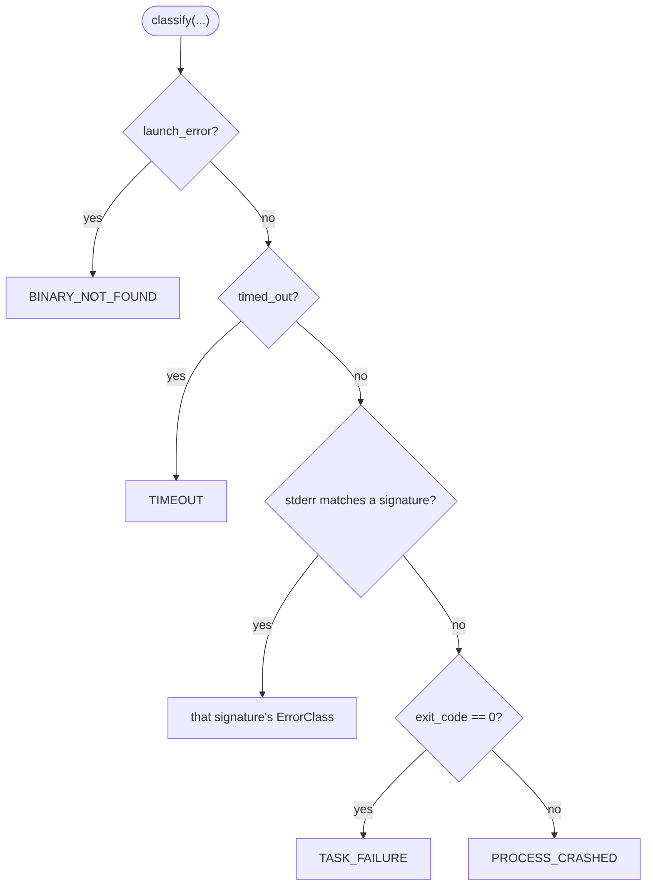

# B18 — Agent Providers (Codex/Claude)

> Reconstructed from code (`providers/base.py`, `providers/claude.py`, `providers/codex.py`, `providers/errors.py`) and tests (`tests/providers/`). The code is the only source of truth; this document was rebuilt from the implementation, not from prose or comments. Significant claims carry a `file:line` reference.

**Status:** documented · **Source modules:** `src/wastech_orchestrator/providers/base.py`, `src/wastech_orchestrator/providers/claude.py`, `src/wastech_orchestrator/providers/codex.py`, `src/wastech_orchestrator/providers/errors.py`

## Responsibility

The only place in the system that knows coding-agent CLI syntax. `base.py` defines the provider-agnostic contract (`AgentProvider` and its data structures); `claude.py` and `codex.py` are the two adapters that implement it, each translating an `AgentRunRequest` into an argv **list** for its CLI, launching the process via the shared subprocess runner, parsing the structured event stream into a normalized `AgentRunResult`, and mapping infrastructure failures to a normalized `ErrorClass`. `errors.py` holds the shared classification taxonomy and the secret-free messages.

The adapters honour a hard contract: no fallback, no git, no state-machine changes, no shell interpolation of user strings, and no secret in any artifact ([claude.py:8-17](../../../src/wastech_orchestrator/providers/claude.py#L8), [codex.py:8-14](../../../src/wastech_orchestrator/providers/codex.py#L8)). Fallback, retries, and provider selection belong to the router ([B17](B17-agent-router-and-fallback.md)).

## Public surface

- `ProviderId` ([base.py:10](../../../src/wastech_orchestrator/providers/base.py#L10)) — the only two providers: `codex`, `claude`.
- `Stage` ([base.py:17](../../../src/wastech_orchestrator/providers/base.py#L17)) — a `StrEnum` of stage identities carried on the request/result; now a transitional _identity_ (output schema / HITL parsing / audit path), not the router key.
- `RunStatus` ([base.py:28](../../../src/wastech_orchestrator/providers/base.py#L28)) — `succeeded` / `failed`.
- `ErrorClass` ([base.py:33](../../../src/wastech_orchestrator/providers/base.py#L33)) — the normalized error taxonomy, including `SESSION_UNAVAILABLE` ([base.py:53](../../../src/wastech_orchestrator/providers/base.py#L53)), deliberately **not** in `FALLBACK_ELIGIBLE`.
- `FALLBACK_ELIGIBLE` ([base.py:59](../../../src/wastech_orchestrator/providers/base.py#L59)) — the frozenset of unconditionally fallback-eligible classes; `authorization_failed` / `permission_denied` are excluded (the router decides those conditionally).
- `AgentRunRequest` ([base.py:88](../../../src/wastech_orchestrator/providers/base.py#L88)) — the run input; context arrives as **paths only**, plus `network_access` ([base.py:116](../../../src/wastech_orchestrator/providers/base.py#L116)).
- `AgentRunResult` ([base.py:126](../../../src/wastech_orchestrator/providers/base.py#L126)), `ProviderHealth` ([base.py:78](../../../src/wastech_orchestrator/providers/base.py#L78)), `NormalizedError` ([base.py:120](../../../src/wastech_orchestrator/providers/base.py#L120)), `ProviderError` ([base.py:144](../../../src/wastech_orchestrator/providers/base.py#L144)).
- `AgentProvider` ([base.py:160](../../../src/wastech_orchestrator/providers/base.py#L160)) — the runtime-checkable `Protocol` with `preflight()` and `run()`.
- `ClaudeCodeProvider` ([claude.py:398](../../../src/wastech_orchestrator/providers/claude.py#L398)) and `build_claude_argv` ([claude.py:258](../../../src/wastech_orchestrator/providers/claude.py#L258)), `map_permission` ([claude.py:212](../../../src/wastech_orchestrator/providers/claude.py#L212)), `parse_stream_json` ([claude.py:345](../../../src/wastech_orchestrator/providers/claude.py#L345)), `isolation_reasons` ([claude.py:324](../../../src/wastech_orchestrator/providers/claude.py#L324)).
- `CodexProvider` ([codex.py:310](../../../src/wastech_orchestrator/providers/codex.py#L310)) and `build_codex_argv` ([codex.py:160](../../../src/wastech_orchestrator/providers/codex.py#L160)), `parse_events` ([codex.py:252](../../../src/wastech_orchestrator/providers/codex.py#L252)), `isolation_reasons` ([codex.py:235](../../../src/wastech_orchestrator/providers/codex.py#L235)).
- `classify` ([errors.py:63](../../../src/wastech_orchestrator/providers/errors.py#L63)), `make_signatures` ([errors.py:52](../../../src/wastech_orchestrator/providers/errors.py#L52)), `message_for` ([errors.py:39](../../../src/wastech_orchestrator/providers/errors.py#L39)).

## Behavior

### The contract: argv list, stdin prompt, paths-only context, no fallback/git/state

Both adapters build an argv **list** and never a shell string, so no user-supplied text can be interpreted as a flag or command. `build_claude_argv` returns a list ([claude.py:289-321](../../../src/wastech_orchestrator/providers/claude.py#L289)); `build_codex_argv` returns a list ending in `-` so the prompt is read from stdin ([codex.py:231-232](../../../src/wastech_orchestrator/providers/codex.py#L231)). The effective prompt (the Core prompt plus a deterministic context-file footer) is delivered on stdin via `stdin_text=build_effective_prompt(request)` ([claude.py:506](../../../src/wastech_orchestrator/providers/claude.py#L506), [codex.py:419](../../../src/wastech_orchestrator/providers/codex.py#L419)); `test_no_prompt_text_is_interpolated_into_argv` and `test_prompt_is_delivered_via_stdin_not_argv` enforce this. The footer only ever lists context **paths**, never their contents ([claude.py:151-171](../../../src/wastech_orchestrator/providers/claude.py#L151)). The child environment is built from the security allowlist via `build_child_env(self._security.allowed_environment)` ([claude.py:491](../../../src/wastech_orchestrator/providers/claude.py#L491), [codex.py:404](../../../src/wastech_orchestrator/providers/codex.py#L404)) — only allowlisted vars reach the process. Neither adapter commits, pushes, opens PRs, or touches the state machine; Claude additionally denies the publish commands at the tool level (below). `test_prompt_argv_isolation.py` proves the argv is byte-identical whether the prompt is benign or hostile (`git commit ... --dangerously-bypass-...` in the prompt body never reaches argv).

### `AgentRunRequest`: context as paths, `network_access` toggles only the network

Every context input is a path field — `task_path`, `plan_path`, `diff_path`, `check_artifacts_path`, `review_artifacts_path`, `human_input_path`, and the advisory read-only `skill_reference_paths` ([base.py:97-105](../../../src/wastech_orchestrator/providers/base.py#L97)). `network_access` defaults to `False` ([base.py:116](../../../src/wastech_orchestrator/providers/base.py#L116)): the flow grants network only by declaring a `network_policy` (P3.2). When granted, the adapter maps it onto its own sandbox and **only** the network — never the filesystem sandbox/approvals:

- Claude appends the web tools `("WebFetch", "WebSearch")` to `--allowedTools`; absent the grant they are omitted, so a headless run cannot reach the network through them, and the permission mode is unchanged ([claude.py:282-286](../../../src/wastech_orchestrator/providers/claude.py#L282)). Verified by `test_network_access_off_by_default_no_web_tools` / `test_network_access_allows_web_tools_when_granted`.
- Codex appends `-c sandbox_workspace_write.network_access=true`; the `--sandbox` value and the `never` approval policy stay in force ([codex.py:207-211](../../../src/wastech_orchestrator/providers/codex.py#L207)). Verified by `test_network_access_*` in `test_codex_command.py`.

### Permission/sandbox mapping; forbidden values raise `CONFIGURATION_ERROR`

Claude maps a profile to a `(permission_mode, allowed_tools)` pair: `read-only → ("plan", Read/Glob/Grep)`, `workspace-write → ("acceptEdits", Read/Glob/Grep/Edit/Write/Bash)` ([claude.py:82-85](../../../src/wastech_orchestrator/providers/claude.py#L82)). `map_permission` raises `ProviderError(CONFIGURATION_ERROR)` for the forbidden full-access profile (`danger-full-access`) and for any unknown profile ([claude.py:219-226](../../../src/wastech_orchestrator/providers/claude.py#L219)), and the mode order never includes selecting `bypassPermissions`. `_reject_weaker_permission_override` rejects an `extra_args` `--permission-mode` (inline `=` or two-token form) that is `bypassPermissions` or ranks more permissive than the required mode ([claude.py:229-255](../../../src/wastech_orchestrator/providers/claude.py#L229)) — defence in depth over the P1 config validator. Codex resolves `sandbox or permission_profile or "workspace-write"` and raises `CONFIGURATION_ERROR` if that is `danger-full-access` ([codex.py:181-183](../../../src/wastech_orchestrator/providers/codex.py#L181)). Both builders first run `find_forbidden_args` over `config.extra_args + request.extra_args` and reject `--dangerously*` / `--yolo` / `--ignore-rules` / `--sandbox danger-full-access` as `CONFIGURATION_ERROR` ([claude.py:273-278](../../../src/wastech_orchestrator/providers/claude.py#L273), [codex.py:174-179](../../../src/wastech_orchestrator/providers/codex.py#L174), see [B25](B25-security-policy.md)). `CONFIGURATION_ERROR` is not in `FALLBACK_ELIGIBLE`, so the router never falls past it.

### Tool-level denials (Claude only)

Claude translates `security.denied_commands` into `Bash(<cmd>:*)` patterns and `security.denied_read_paths` into `Read(<glob>)` patterns, joined into `--disallowedTools` ([claude.py:182-209](../../../src/wastech_orchestrator/providers/claude.py#L182), [claude.py:300-302](../../../src/wastech_orchestrator/providers/claude.py#L300)) — so the agent process itself cannot commit/push/open PRs or read secret files. Codex has no per-tool deny mechanism; for Codex the sandbox _is_ the isolation ([codex.py:240-242](../../../src/wastech_orchestrator/providers/codex.py#L240)), and the denied-read files are still covered by the redaction net.

### Session resume; the raw id lives only in state.db

Claude resumes with `--resume <id>` ([claude.py:311-312](../../../src/wastech_orchestrator/providers/claude.py#L311)); Codex resumes with `exec resume <id>` where the id is **positional** right after `resume`, the prompt still on stdin, and the global security flags preserved ([codex.py:196-197](../../../src/wastech_orchestrator/providers/codex.py#L196)). The emitted resumable id is recovered from the stream: Claude reads any `session_id` field ([claude.py:369-370](../../../src/wastech_orchestrator/providers/claude.py#L369)); Codex reads `thread_id` from a `thread.started` event (or `session_id` from `session`/`session.created`) ([codex.py:276-281](../../../src/wastech_orchestrator/providers/codex.py#L276)).

The raw session id is treated as a secret. The resume id passed in is added to `_extra_secrets` so it is scrubbed from request argv / stdout / stderr / events / result ([claude.py:667-676](../../../src/wastech_orchestrator/providers/claude.py#L667), [codex.py:585-594](../../../src/wastech_orchestrator/providers/codex.py#L585)); the freshly emitted id is additionally replaced with `[REDACTED]` on disk by `_scrub_raw_session` ([claude.py:591-596](../../../src/wastech_orchestrator/providers/claude.py#L591)); and `result.json` records only the normalized correlator `session:<sha256[:12]>` via `_redact_result_session` ([claude.py:695-703](../../../src/wastech_orchestrator/providers/claude.py#L695), `normalized_session_id` in [B21](B21-secret-redaction.md)). The **in-memory** `AgentRunResult.session_id` keeps the raw id so the orchestrator can persist it to `editing_lineage` (state.db only — see [B07](B07-state-machine-and-store.md)). `test_raw_session_id_redacted_in_artifacts` asserts neither the resume id nor the emitted id appears in any on-disk artifact while the in-memory result still carries the raw id.

### Output parsing → success/quality split

A clean OS-level exit is parsed, then split into success vs. a quality `TASK_FAILURE` — task quality is judged later by review/checks, never by the adapter. Claude's `parse_stream_json` treats a `result` event with `subtype == "success"` and `not is_error` as succeeded, tolerates stray non-JSON lines, and raises `ProviderError(INVALID_OUTPUT)` when no terminal `result` event is seen ([claude.py:345-395](../../../src/wastech_orchestrator/providers/claude.py#L345)). Codex's `parse_events` accepts `result` / `task_complete` / `turn.completed` as terminal, marks failure when `status ∈ {error, failed, failure, incomplete, aborted}` ([codex.py:75](../../../src/wastech_orchestrator/providers/codex.py#L75), [codex.py:288-291](../../../src/wastech_orchestrator/providers/codex.py#L288)), and the `--output-last-message` file, when present, overrides the streamed `final_message` ([codex.py:299-300](../../../src/wastech_orchestrator/providers/codex.py#L299)). A non-success parse yields `AgentRunResult(status=failed, error=TASK_FAILURE)` rather than raising ([claude.py:559-565](../../../src/wastech_orchestrator/providers/claude.py#L559), [codex.py:478-484](../../../src/wastech_orchestrator/providers/codex.py#L478)).

### Redaction of every sink

Before anything is written, stdout / stderr / events are passed through `redact_text` and the request representation through `redact_mapping` ([claude.py:518-525](../../../src/wastech_orchestrator/providers/claude.py#L518), [codex.py:431-438](../../../src/wastech_orchestrator/providers/codex.py#L431)); parsing uses the in-memory raw stream for correctness. `_extra_secrets` supplies literals to scrub: secret-named non-allowlisted parent env values (length ≥ 8) ([claude.py:678-685](../../../src/wastech_orchestrator/providers/claude.py#L678)), the contents harvested from `denied_read_paths` files in the workspace, and the raw resume session id. `test_redaction_sinks.py` proves `stdout.log` / `events.jsonl` / `request.json` (not just `stderr.log`) are scrubbed of both a token-shaped and a file-only secret.

### Error classification (`errors.classify`)

`classify` applies a fixed precedence ([errors.py:77-86](../../../src/wastech_orchestrator/providers/errors.py#L77)):

Each adapter passes its own ordered, case-insensitive `make_signatures` table (`SESSION_UNAVAILABLE` first, then rate-limit / auth / authz / network / provider-unavailable / unsupported-version / permission-denied) ([claude.py:97-130](../../../src/wastech_orchestrator/providers/claude.py#L97), [codex.py:78-108](../../../src/wastech_orchestrator/providers/codex.py#L78)). `INVALID_OUTPUT` is raised by the parser, not by `classify` ([errors.py:8-9](../../../src/wastech_orchestrator/providers/errors.py#L8)). The returned message is always the canonical category text and never echoes raw stderr ([errors.py:22-36](../../../src/wastech_orchestrator/providers/errors.py#L22)); `test_message_never_echoes_stderr_secret` enforces it.

### `preflight` and `isolation_reasons`

`preflight` launches `<cli> --version` in a throwaway temp dir with the allowlisted env: a `launch_error` → `executable_found=False`; a timeout or non-zero exit → found-but-not-ready; otherwise the version is regex-parsed and reported ([claude.py:422-463](../../../src/wastech_orchestrator/providers/claude.py#L422), [codex.py:334-375](../../../src/wastech_orchestrator/providers/codex.py#L334)). Authentication is best-effort/offline in P2 (`authenticated` is set from the version-probe outcome, not a real auth check). `isolation_reasons` is pure and offline (no CLI launched) and mirrors what the argv builder enforces, so it can drive the `strict_isolation` preflight in [B25](B25-security-policy.md): Claude requires a concrete non-`bypassPermissions` mode and no isolation-weakening `extra_args` ([claude.py:324-342](../../../src/wastech_orchestrator/providers/claude.py#L324)); Codex requires a non-`danger-full-access` sandbox and safe `extra_args` ([codex.py:235-249](../../../src/wastech_orchestrator/providers/codex.py#L235)).

## Invariants & guarantees

- argv is a **list**, never a shell string; the prompt is always on stdin; context is paths only ([claude.py:289-321](../../../src/wastech_orchestrator/providers/claude.py#L289), [codex.py:231-232](../../../src/wastech_orchestrator/providers/codex.py#L231)).
- Adapters perform **no** fallback, git, or state-machine mutation ([claude.py:8-17](../../../src/wastech_orchestrator/providers/claude.py#L8)); the router is the sole caller of `run` ([B17](B17-agent-router-and-fallback.md)).
- Forbidden permission/sandbox values and isolation-weakening `extra_args` raise `ProviderError(CONFIGURATION_ERROR)` **before** launch; on that path the request artifact is written with `argv=None` and the error propagates ([claude.py:478-487](../../../src/wastech_orchestrator/providers/claude.py#L478), [codex.py:391-400](../../../src/wastech_orchestrator/providers/codex.py#L391)). `test_configuration_error_raises_before_launch` asserts the process is never launched.
- Only the allowlisted env reaches the child process ([claude.py:491](../../../src/wastech_orchestrator/providers/claude.py#L491), [B25](B25-security-policy.md)).
- No secret lands in any artifact: every sink is redacted before writing, and the raw session id only ever reaches state.db ([claude.py:518-525](../../../src/wastech_orchestrator/providers/claude.py#L518), [B21](B21-secret-redaction.md)).
- An infrastructure failure raises `ProviderError`; a clean run that did not satisfy the task returns `AgentRunResult(status=failed, error=TASK_FAILURE)` (never an exception). `TASK_FAILURE` and `SESSION_UNAVAILABLE` are not in `FALLBACK_ELIGIBLE` ([base.py:49-71](../../../src/wastech_orchestrator/providers/base.py#L49)).
- `network_access` toggles only the network, never the filesystem sandbox/approvals ([claude.py:282-286](../../../src/wastech_orchestrator/providers/claude.py#L282), [codex.py:207-211](../../../src/wastech_orchestrator/providers/codex.py#L207)).

## Dependencies

- **Uses:** [B19](B19-subprocess-runner.md) (`run_process` — the safe launcher), [B20](B20-artifact-layout.md) (`create_attempt_dir` / `write_request_artifact` / `write_result_artifact`), [B21](B21-secret-redaction.md) (`redact_text` / `redact_mapping` / `read_denied_secrets` / `normalized_session_id`), [B25](B25-security-policy.md) (`build_child_env`, `find_forbidden_args`, `FORBIDDEN_SANDBOX_VALUE`), [B27](B27-observability.md) (`run_with_heartbeat`, `bind`), [B05](B05-configuration.md) (`ProviderConfig`, `SecurityConfig`).
- **Used by:** [B17](B17-agent-router-and-fallback.md) (the sole caller of `run`, via the `AgentProvider` map it holds), [B25](B25-security-policy.md) (imports `isolation_reasons` for the isolation preflight), [B23](B23-check-discovery.md) and [B01](B01-cli-and-operator-commands.md) (`preflight`). Instances are constructed by `build_providers` ([orchestrator.py:1944-1971](../../../src/wastech_orchestrator/core/orchestrator.py#L1944)). The raw `session_id` returned in-memory is persisted by [B07](B07-state-machine-and-store.md) into `editing_lineage`.

## Audit candidates

See [the audit](../../backlog/2026-06-21-audit.md).

- `src/wastech_orchestrator/providers/claude.py:398` and `src/wastech_orchestrator/providers/codex.py:310` — large-scale DRY duplication: the entire `run()` skeleton, `_write_request`, `_request_representation`, `_finalize_failure`, `_extra_secrets`, `_secret_env_values`, `_scrub_raw_session`, `_write_output_schema`, plus module-level `build_context_footer`, `build_effective_prompt`, the `ParsedEvents` dataclass, and the byte-identical tail (`_read_text`, `_redact_result_session`, `_parse_version`) are parallel between the two adapters — only the argv build, the signature table, and the parser genuinely differ. Roughly the run-loop/redaction/preflight/artifact half of each ~600–700-line module is copy-paste; the divergence is small enough to extract a shared base.
- `src/wastech_orchestrator/providers/codex.py:229` — `_CODEX_EFFORT_MAP[reasoning]` is an unguarded dict subscript: an unvalidated `reasoning` value would raise a bare `KeyError`, not the `ProviderError(CONFIGURATION_ERROR)` the module raises for every other rejected input. It is externally guarded today (config loader `_REASONING_LEVELS` and flow validator `_VALID_REASONING` both pin the closed set `{low, medium, high, xhigh, max}`), so it is a defence-in-depth gap rather than a live bug — but it contradicts the module's stated "defence in depth over the P1 config validator" stance.
- `src/wastech_orchestrator/providers/codex.py:220-226` — `_CODEX_EFFORT_MAP` is a constant defined as a local variable inside `build_codex_argv`, so it is rebuilt on every call; it belongs at module scope alongside the other constants. Minor.

## Tests

- `tests/providers/test_claude_command.py`, `tests/providers/test_codex_command.py` — argv shape, stdin-only prompt, permission/sandbox mapping, forbidden `extra_args` / profiles / sandbox, weaker-override rejection, network toggle, model/reasoning/session/output-schema flags, denied-tool patterns.
- `tests/providers/test_claude_parsing.py`, `tests/providers/test_codex_parsing.py` — terminal-event detection, success/failure subtype/status, stray-line tolerance, `INVALID_OUTPUT` on missing terminal event, Codex `thread.started` and last-message override.
- `tests/providers/test_claude_run.py`, `tests/providers/test_codex_run.py` — full `run()`/`preflight()` with an injected process runner: success, quality failure, timeout, missing binary, rate-limit signature, invalid output, config-error-before-launch, stdin delivery, artifact redaction, and (Codex) raw-session-id redaction.
- `tests/providers/test_errors.py` — `classify` precedence table and the secret-free message guarantee.
- `tests/providers/test_prompt_argv_isolation.py` — argv is independent of (hostile) prompt text for both adapters.
- `tests/providers/test_redaction_sinks.py` — every written sink (stdout/events/stderr/request) is redacted of both token-shaped and file-only secrets; Claude `Read(...)` deny patterns reach argv.
- `tests/providers/test_provider_integration.py` — the same scenario matrix against the dialect-aware fake CLI proves the two adapters are behaviourally interchangeable behind the contract.
- `tests/providers/test_artifacts.py` — attempt-directory layout and request/result serialization (the [B20](B20-artifact-layout.md) writer used here).
