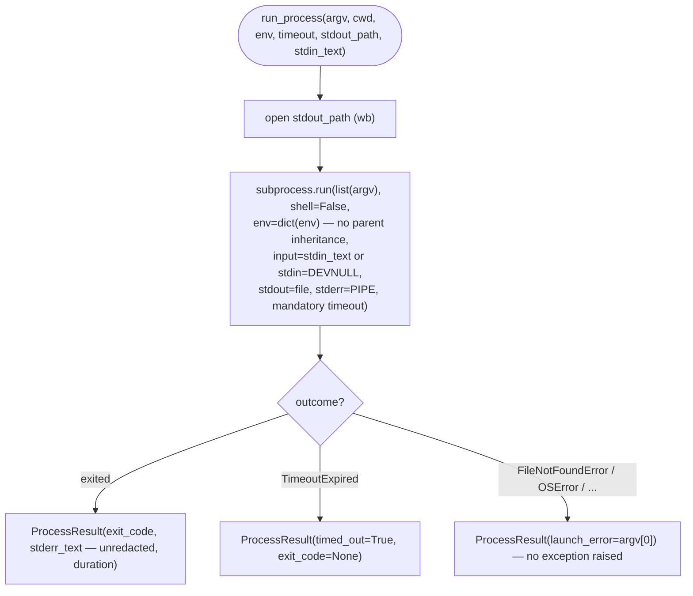

# B19 — Safe Subprocess Runner

## Purpose

The single entry point for launching any external CLI. Enforces the system's process-launch security invariants: argument-list invocation (no shell), a mandatory timeout, an explicitly specified environment, prompt delivery via stdin, and streaming stdout to a file. The primitive itself has no knowledge of Codex/Claude/git syntax or error classes — it simply launches a process and returns a raw result for the caller to normalize.

## Responsibilities

- Launch `argv` as a list via `subprocess.run(..., shell=False)` ([process.py:81-93](../../../src/wastech_orchestrator/providers/process.py#L81)).
- Pass the child process **exactly** the provided environment dictionary (`env=dict(env)`), without merging with the parent ([process.py:84](../../../src/wastech_orchestrator/providers/process.py#L84)).
- Apply a mandatory timeout; on expiry, kill the process and set `timed_out` ([process.py:90,96-98](../../../src/wastech_orchestrator/providers/process.py#L96)).
- Feed `stdin_text` to the process's stdin (via `input=`), or send `DEVNULL` if no text is provided ([process.py:75-77](../../../src/wastech_orchestrator/providers/process.py#L75)).
- Stream stdout to `stdout_path` (file opened `wb`), capture stderr in memory ([process.py:80,86](../../../src/wastech_orchestrator/providers/process.py#L80)).
- Return `ProcessResult` (exit_code/timed_out/launch_error/duration/stdout_path/stderr_text) ([process.py:32-41,105-112](../../../src/wastech_orchestrator/providers/process.py#L32)).

## Block Boundaries

### Within scope

- Safe process launch and duration measurement (via an injectable `monotonic`).
- Capturing stdout to a file and stderr to a string (unredacted).

### Out of scope

- **Building the environment** — performed by [B25 `build_child_env`](./B25-security-policy.md); the caller passes a ready-made `env` here. This module does not import `security.env`.
- **Secret redaction** — stderr is returned as-is; the caller redacts it before writing to an artifact ([B21](./B21-secret-redaction.md)); this is explicitly noted in the result type ([process.py:41](../../../src/wastech_orchestrator/providers/process.py#L41)).
- **Error classification** into `ErrorClass` — that is [B18](./B18-agent-providers.md) (`errors.classify`).
- **Building `argv`** — that is the adapters/managers that call `run_process`.

## Entry Points

- `run_process(argv, *, cwd, env, timeout_seconds, stdout_path, stdin_text=None, monotonic=...)` ([process.py:44](../../../src/wastech_orchestrator/providers/process.py#L44)). Called from provider adapters ([B18](./B18-agent-providers.md)), Git Manager ([B22](./B22-git-manager.md)), Check Runner ([B24](./B24-check-execution.md)), and git detection during setup ([B03/B04](./B03-installer-and-scaffolding.md)).

## Input Data and State

`argv` (list), `cwd`, `env` (full environment for the child), `timeout_seconds` (mandatory), `stdout_path`, optional `stdin_text`. No state is stored — the function is pure with respect to the process (except for creating the stdout file).

## Main Scenario

1. Open `stdout_path` for writing (binary mode).
2. Run `subprocess.run(list(argv), cwd=…, env=dict(env), stdout=file, stderr=PIPE, text=utf-8/replace, timeout=…, shell=False)` with `input=stdin_text` or `stdin=DEVNULL`.
3. On completion, record `exit_code` and `stderr_text`.
4. Return `ProcessResult` with the measured duration.

Safe-launch contract; timeout and launch failure are **values** in the result, not exceptions:

## Alternative Scenarios

### Timeout expiry

`subprocess.TimeoutExpired` → `timed_out=True`, `exit_code=None`, partial stderr from the exception ([process.py:96-98](../../../src/wastech_orchestrator/providers/process.py#L96)).

### Binary cannot be launched

`FileNotFoundError/PermissionError/NotADirectoryError/OSError` → the error is **not re-raised**; it is recorded in `launch_error` (with the name `argv[0]`, no secret); for an empty `argv` the label `"<empty argv>"` is used ([process.py:99-102](../../../src/wastech_orchestrator/providers/process.py#L99)).

## Constraints and Invariants

- `shell=False` always; `argv` must be a list (no shell interpolation of user strings).
- Environment is exactly `dict(env)`; the parent environment is not inherited.
- Timeout is mandatory (type `int`, provided by the caller).
- stdin: either `input` or `DEVNULL` — the parent's stdin is never inherited.

## Output

`ProcessResult` — the raw result of the launch: return code (or `None`), flags `timed_out`, `launch_error`, duration, path to the stdout file, stderr text (unredacted).

## Side Effects

- The file `stdout_path` is created or overwritten.
- One child process is spawned (with the given cwd/env/timeout).

## Errors and Edge Cases

- Timeout and launch failure are **values** in the result, not exceptions (see alternative scenarios). The caller decides how to classify them.
- Duration is always measured, even on a launch error.

## Relationships

### Uses

- Standard library (`subprocess`, `os`, `time`). Does not use any external blocks.

### Used by

- [B18 — Agent Providers](./B18-agent-providers.md) — launching `codex`/`claude`.
- [B22 — Git Manager](./B22-git-manager.md) — launching `git`/`gh`.
- [B24 — Check Execution](./B24-check-execution.md) — launching check commands.
- [B23 — Check Discovery](./B23-check-discovery.md) — launchability probes.
- [B03 — Installer](./B03-installer-and-scaffolding.md) — `git_info` (read-only git probes).

## Role in the Overall System

This is the execution bottleneck: the invariant "launch CLI without shell interpolation of user strings" (see [CLAUDE.md], security rules) is enforced here. Every external process in the system passes through `run_process`, so secret redaction and the environment allowlist are applied consistently across all subsystems.

## Code Confirmation

- [providers/process.py:44-112](../../../src/wastech_orchestrator/providers/process.py#L44) — `run_process`: argv list, `shell=False`, `env=dict(env)`, timeout, stdin, stdout-to-file.
- [providers/process.py:32-41](../../../src/wastech_orchestrator/providers/process.py#L32) — `ProcessResult` (stderr marked as "unredacted").
- [tests/providers/test_process.py](../../../tests/providers/test_process.py) — confirms: stdout to file, stdin not in argv, environment is exactly what was passed (parent secrets do not leak), timeout → `timed_out`, missing binary → `launch_error` without exception.
- [tests/security/test_no_shell_interpolation.py](../../../tests/security/test_no_shell_interpolation.py) — confirms that `subprocess` is used only through this module.
