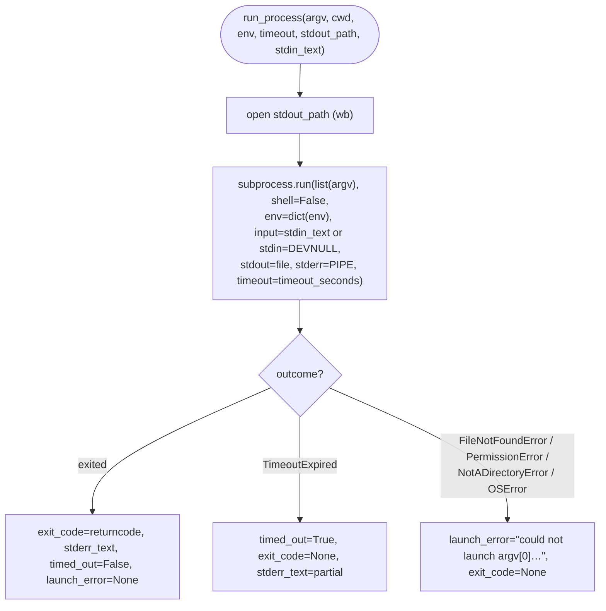

# B19 — Safe Subprocess Launcher

> Reconstructed from code (`providers/process.py`) and tests (`tests/providers/test_process.py`, `tests/security/test_no_shell_interpolation.py`, `tests/providers/test_prompt_argv_isolation.py`). The code is the only source of truth; this document was rebuilt from the implementation, not from prose or comments. Significant claims carry a `file:line` reference.

**Status:** documented · **Source modules:** `src/wastech_orchestrator/providers/process.py`

## Responsibility

The single chokepoint through which every external command in the system is launched. `run_process` ([process.py:44](../../../src/wastech_orchestrator/providers/process.py#L44)) takes an argv **list**, runs it with `shell=False` ([process.py:91](../../../src/wastech_orchestrator/providers/process.py#L91)), hands the child exactly the env mapping it was given ([process.py:84](../../../src/wastech_orchestrator/providers/process.py#L84)), enforces a mandatory timeout ([process.py:90](../../../src/wastech_orchestrator/providers/process.py#L90)), streams stdout to a file and captures stderr in memory ([process.py:80-86](../../../src/wastech_orchestrator/providers/process.py#L80)), and returns a raw `ProcessResult` ([process.py:105-112](../../../src/wastech_orchestrator/providers/process.py#L105)).

It is deliberately provider-agnostic: it knows nothing about Codex/Claude syntax, git, check commands, or `ErrorClass`. It launches a process safely and reports a raw outcome; classification, redaction, and argv construction belong to the callers. Both a timeout and an un-launchable binary are returned as **values**, never raised — the only `subprocess` import in the whole package lives here ([process.py:24](../../../src/wastech_orchestrator/providers/process.py#L24)).

## Public surface

- `run_process(argv, *, cwd, env, timeout_seconds, stdout_path, stdin_text=None, monotonic=time.monotonic) -> ProcessResult` ([process.py:44-53](../../../src/wastech_orchestrator/providers/process.py#L44)) — launch an argv list safely; return a raw result.
- `ProcessResult` ([process.py:32-41](../../../src/wastech_orchestrator/providers/process.py#L32)) — frozen dataclass with `exit_code: int | None`, `timed_out: bool`, `launch_error: str | None`, `duration_seconds: float`, `stdout_path: str`, `stderr_text: str`.
- `_coerce_stderr(raw) -> str` ([process.py:115-120](../../../src/wastech_orchestrator/providers/process.py#L115)) — module-private; normalizes the `str | bytes | None` stderr salvaged from a `TimeoutExpired` into text.

## Behavior

### Safe launch

`run_process` opens `stdout_path` in binary write mode (`wb`) and calls `subprocess.run(list(argv), …)` inside that context ([process.py:80-93](../../../src/wastech_orchestrator/providers/process.py#L80)). `list(argv)` is passed positionally with `shell=False` ([process.py:82](../../../src/wastech_orchestrator/providers/process.py#L82), [process.py:91](../../../src/wastech_orchestrator/providers/process.py#L91)) — there is no command string and therefore no shell to interpolate user input into. `cwd` is normalized via `os.fspath` ([process.py:83](../../../src/wastech_orchestrator/providers/process.py#L83)). Output is decoded as UTF-8 with `errors="replace"` ([process.py:88-89](../../../src/wastech_orchestrator/providers/process.py#L88)), so undecodable bytes can never raise.

### Environment isolation

The child receives `env=dict(env)` — a copy of exactly the mapping passed in, never merged with the parent's `os.environ` ([process.py:84](../../../src/wastech_orchestrator/providers/process.py#L84)). The runner itself applies no allowlist; it only guarantees "the child sees what, and only what, you handed me." Building the allowlisted env is the caller's job (the env allowlist, [B25](B25-security-policy.md)). `test_child_env_is_exactly_what_is_passed` ([test_process.py:106-121](../../../tests/providers/test_process.py#L106)) sets a secret in the parent and asserts the child reports it absent.

### stdin / stdout / stderr

stdin is mutually exclusive between the two modes ([process.py:73-77](../../../src/wastech_orchestrator/providers/process.py#L73)): with `stdin_text` the prompt is fed via `input=` (keeping argv free of task content); with `stdin_text=None` the child's stdin is `subprocess.DEVNULL`, so a prompt-less child sees immediate EOF and can never hang on inherited parent stdin. stdout is streamed straight to the open file via the `stdout=stdout_file` handle ([process.py:85](../../../src/wastech_orchestrator/providers/process.py#L85)) rather than buffered in memory. stderr is captured with `stderr=subprocess.PIPE` ([process.py:86](../../../src/wastech_orchestrator/providers/process.py#L86)) into `stderr_text` — it is small and secret-prone, and the field is documented as **not yet redacted** ([process.py:41](../../../src/wastech_orchestrator/providers/process.py#L41)); the caller redacts before it touches an artifact ([B21](B21-secret-redaction.md)).

### Outcomes (values, not exceptions)

- **Clean exit** — `exit_code` is set to `completed.returncode` and `stderr_text` to `completed.stderr or ""` ([process.py:94-95](../../../src/wastech_orchestrator/providers/process.py#L94)). A non-zero exit is a value, not an error; `test_nonzero_exit_is_reported` ([test_process.py:54-64](../../../tests/providers/test_process.py#L54)).
- **Timeout** — `subprocess.TimeoutExpired` is caught ([process.py:96-98](../../../src/wastech_orchestrator/providers/process.py#L96)); `subprocess.run` kills the child on expiry, `timed_out=True`, `exit_code` stays `None`, and any partial stderr from the exception is salvaged via `_coerce_stderr`. `test_timeout_maps_to_timed_out` ([test_process.py:78-87](../../../tests/providers/test_process.py#L78)).
- **Un-launchable binary** — `FileNotFoundError | PermissionError | NotADirectoryError | OSError` is caught and recorded in `launch_error` rather than raised ([process.py:99-102](../../../src/wastech_orchestrator/providers/process.py#L99)). The message names `argv[0]` (which comes from config and is not a secret) or `"<empty argv>"` for an empty list, plus `exc.strerror` or the exception type name. `test_missing_binary_sets_launch_error` ([test_process.py:90-103](../../../tests/providers/test_process.py#L90)) also asserts the (empty) stdout file still exists for the audit trail, since it is opened before the launch attempt.

### Duration measurement

`duration_seconds` is `monotonic() - start` and is always computed, even on a launch error ([process.py:67](../../../src/wastech_orchestrator/providers/process.py#L67), [process.py:104](../../../src/wastech_orchestrator/providers/process.py#L104)). The clock is an injectable seam (`monotonic: Callable[[], float] = time.monotonic`, [process.py:52](../../../src/wastech_orchestrator/providers/process.py#L52)); `test_duration_uses_injected_monotonic` ([test_process.py:124-134](../../../tests/providers/test_process.py#L124)) feeds two ticks and asserts the exact delta.

## Invariants & guarantees

- **argv list, never a shell string.** Positional `list(argv)` with `shell=False` ([process.py:82](../../../src/wastech_orchestrator/providers/process.py#L82), [process.py:91](../../../src/wastech_orchestrator/providers/process.py#L91)); user strings are never spliced into a command.
- **`subprocess` is imported in exactly one module.** Enforced structurally by `test_subprocess_is_only_used_in_the_safe_runner` ([test_no_shell_interpolation.py:27-35](../../../tests/security/test_no_shell_interpolation.py#L27)), which fails if any other package module contains the substring `subprocess`; `test_no_module_enables_a_shell` ([test_no_shell_interpolation.py:43-51](../../../tests/security/test_no_shell_interpolation.py#L43)) forbids the literal `shell=True` anywhere but this file.
- **The child gets only the passed env.** `env=dict(env)`, no parent inheritance ([process.py:84](../../../src/wastech_orchestrator/providers/process.py#L84)).
- **Timeout is mandatory.** `timeout_seconds: int` is a required keyword argument with no default ([process.py:49](../../../src/wastech_orchestrator/providers/process.py#L49)).
- **Parent stdin is never inherited.** Either `input=stdin_text` or `stdin=DEVNULL` ([process.py:75-77](../../../src/wastech_orchestrator/providers/process.py#L75)).
- **Timeout and launch failure are values, not exceptions** ([process.py:96-102](../../../src/wastech_orchestrator/providers/process.py#L96)); the caller classifies them. Only the `open(stdout_path)` itself can still propagate (it is outside the try that wraps the launch — [process.py:79-80](../../../src/wastech_orchestrator/providers/process.py#L79)).
- **stderr is returned unredacted.** Documented on the field; redaction is the caller's responsibility ([process.py:41](../../../src/wastech_orchestrator/providers/process.py#L41)).

## Dependencies

- **Uses:** standard library only (`subprocess`, `os`, `time`); no internal blocks. Notably it does **not** import the env allowlist ([B25](B25-security-policy.md)) — callers pass a ready-made env.
- **Used by:** [B18](B18-agent-providers.md) (Codex/Claude adapters, [codex.py:339](../../../src/wastech_orchestrator/providers/codex.py#L339), [claude.py:427](../../../src/wastech_orchestrator/providers/claude.py#L427)), [B22](B22-git-manager.md) (git/gh, [git_manager.py:206](../../../src/wastech_orchestrator/git_manager.py#L206)), [B24](B24-check-execution.md) (check commands, [check_runner.py:134](../../../src/wastech_orchestrator/check_runner.py#L134)), [B23](B23-check-discovery.md) (launchability probes, [probe.py:63](../../../src/wastech_orchestrator/checks/probe.py#L63)), [B32](B32-flow-checkers.md) (the `dependency_scan` checker, [dependency_scan.py:73](../../../src/wastech_orchestrator/core/flow/checkers/dependency_scan.py#L73)), and install-time git detection, [B04](B04-install-registry-and-config-discovery.md) ([detect.py:50](../../../src/wastech_orchestrator/install/detect.py#L50)). Every caller injects `run_process` as a default-valued parameter for test substitution.

## Audit candidates

- [process.py:99](../../../src/wastech_orchestrator/providers/process.py#L99) — `FileNotFoundError`/`PermissionError`/`NotADirectoryError` are all subclasses of `OSError`, which is also caught in the same `except` tuple; the three named classes are redundant and the broad `OSError` makes `launch_error` swallow _any_ OS-level failure (including ones unrelated to "binary not launchable"). Tracked in [the audit](../../backlog/2026-06-21-audit.md).
- [process.py:79-80](../../../src/wastech_orchestrator/providers/process.py#L79) — `open(stdout_path, "wb")` sits outside the `try`, so an unwritable `stdout_path` raises rather than becoming a `launch_error`. The asymmetry (launch failures are values, output-file failures are exceptions) is undocumented in the result type. Tracked in [the audit](../../backlog/2026-06-21-audit.md).
- [test_no_shell_interpolation.py:38-40](../../../tests/security/test_no_shell_interpolation.py#L38) — `test_safe_runner_launches_without_a_shell` asserts the literal substring `"shell=False"` is present in the source rather than asserting launch behavior; a refactor to `shell=bool(False)` or a constant would silently defeat the guard. Tracked in [the audit](../../backlog/2026-06-21-audit.md).

## Tests

- `tests/providers/test_process.py` ([test_process.py](../../../tests/providers/test_process.py)) — a portable Python one-liner ([test_process.py:17-18](../../../tests/providers/test_process.py#L17)) stands in for any CLI on both POSIX and Windows: stdout streamed to file, prompt delivered on stdin and absent from argv, non-zero exit reported, stderr captured (not streamed), timeout → `timed_out`/`exit_code=None`, missing binary → `launch_error` with the stdout file still present, child env is exactly what was passed (parent secret absent), and injected-`monotonic` duration.
- `tests/security/test_no_shell_interpolation.py` ([test_no_shell_interpolation.py](../../../tests/security/test_no_shell_interpolation.py)) — structural proof that `subprocess` is imported only by this module, that `shell=True` appears nowhere else, and that check commands are tokenized into argv rather than shell-interpreted.
- `tests/providers/test_prompt_argv_isolation.py` ([test_prompt_argv_isolation.py](../../../tests/providers/test_prompt_argv_isolation.py)) — complements the runner from the adapter side: a hostile prompt produces byte-identical argv, proving no template can inject a flag or command into the launch.
