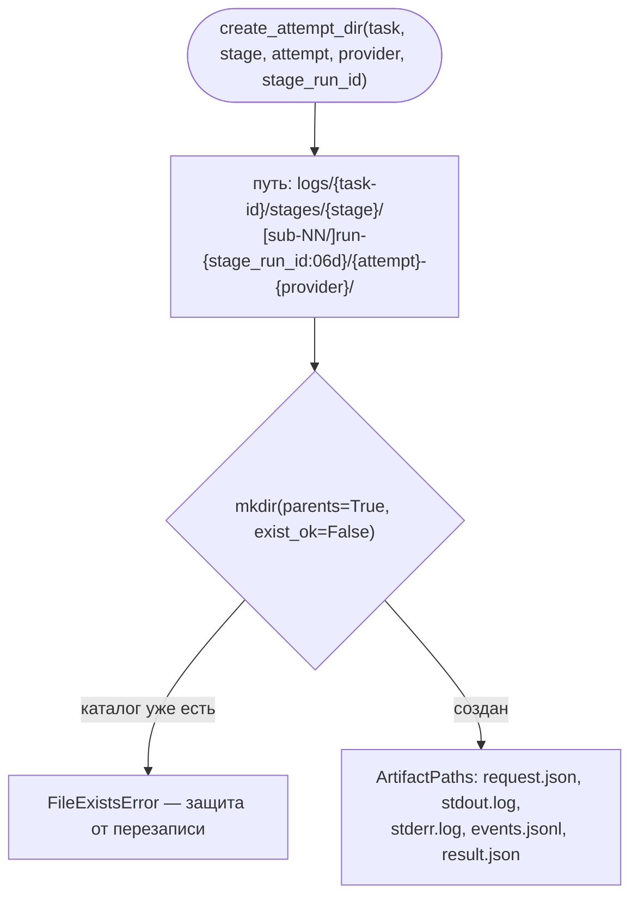

# B20 — Файловая раскладка артефактов запусков

## Назначение

Единый владелец расположения артефактов на диске и правила **«логи никогда не перезаписываются»**. Даёт детерминированный путь для каждой попытки запуска стадии и для артефактов уровня задачи, чтобы все подсистемы складывали файлы в одно и то же место, а не реконструировали раскладку по отдельности.

## Ответственность

- Вернуть корень артефактов задачи `<artifacts_root>/logs/<task-id>/` ([artifacts.py:46-53](../../../src/wastech_orchestrator/providers/artifacts.py#L46)).
- Создать каталог попытки запуска стадии и вернуть пути её файлов (request/stdout/stderr/events/result) ([artifacts.py:80-109](../../../src/wastech_orchestrator/providers/artifacts.py#L80)).
- Записать уже-редактированный `request.json` и машинный `result.json` ([artifacts.py:112-125](../../../src/wastech_orchestrator/providers/artifacts.py#L112)).
- Заархивировать артефакты прошлой попытки в `attempt-<N>/` при `rerun` ([artifacts.py:56-77](../../../src/wastech_orchestrator/providers/artifacts.py#L56)).
- Посчитать sha256 файла для регистрации артефакта в SQLite ([artifacts.py:128-134](../../../src/wastech_orchestrator/providers/artifacts.py#L128)).

## Границы блока

### Входит в ответственность блока

- Раскладка каталогов и инвариант «не перезаписывать».
- Сериализация переданного содержимого в JSON-файлы.

### Не входит в ответственность блока

- **Редактирование** содержимого: модуль не импортирует [B21](./B21-secret-redaction.md); request приходит уже редактированным ([artifacts.py:112-114](../../../src/wastech_orchestrator/providers/artifacts.py#L112)).
- **Регистрация** артефакта в БД (`register_artifact`) — это [B07](./B07-state-machine-and-store.md), вызывается из [B06](./B06-orchestrator-pipeline.md); здесь только вычисляется checksum.
- Знание о синтаксисе провайдеров.

## Точки входа

- `task_artifact_dir(artifacts_root, task_id)` ([artifacts.py:46](../../../src/wastech_orchestrator/providers/artifacts.py#L46)) — используется повсеместно (B06, B16, B08, B12).
- `create_attempt_dir(artifacts_root, task_id, stage, attempt, provider, *, stage_run_id, subtask=None)` ([artifacts.py:80](../../../src/wastech_orchestrator/providers/artifacts.py#L80)) — [B18](./B18-agent-providers.md).
- `write_request_artifact` / `write_result_artifact` ([artifacts.py:112,117](../../../src/wastech_orchestrator/providers/artifacts.py#L112)) — [B18](./B18-agent-providers.md).
- `archive_task_artifacts(artifacts_root, task_id, attempt)` ([artifacts.py:56](../../../src/wastech_orchestrator/providers/artifacts.py#L56)) — [B06](./B06-orchestrator-pipeline.md) `rerun_task`.
- `sha256_file(path)` ([artifacts.py:128](../../../src/wastech_orchestrator/providers/artifacts.py#L128)) — [B06](./B06-orchestrator-pipeline.md) `_register_artifact`.

## Входные данные и состояние

`artifacts_root`, `task_id`, для попытки — `stage`, `attempt`, `provider`, `stage_run_id`, опц. `subtask`. Состояние не хранится; источник истины о раскладке — сам код путей.

## Основной сценарий (создание попытки)

1. Базовый каталог: `<root>/logs/<task-id>/stages/<stage>/[sub-<NN>/]run-<stage_run_id:06d>/<attempt>-<provider>/`.
2. `mkdir(parents=True, exist_ok=False)` — каталог **не должен** существовать; коллизия → `FileExistsError` ([artifacts.py:97-101](../../../src/wastech_orchestrator/providers/artifacts.py#L97)).
3. Возвращается `ArtifactPaths` с путями `request.json`, `stdout.log`, `stderr.log`, `events.jsonl`, `result.json`.

Детерминированный путь попытки и инвариант «логи не перезаписываются» (`exist_ok=False`):

## Альтернативные сценарии

### Архивирование при rerun

`archive_task_artifacts` переносит всё из `logs/<task-id>/`, кроме существующих `attempt-*`, в `attempt-<N>/`; если переносить нечего — возвращает `None`; уже существующее имя в назначении пропускается (идемпотентно при прерванном rerun) ([artifacts.py:64-77](../../../src/wastech_orchestrator/providers/artifacts.py#L64)).

## Проверки и ограничения

- `stage_run_id` резервируется в SQLite до старта провайдера, поэтому повторный fixing-цикл или recovery-запуск получает отдельный каталог даже при счётчике попыток, начинающемся с 1 ([artifacts.py:90-96](../../../src/wastech_orchestrator/providers/artifacts.py#L90)).
- `exist_ok=False` — гарантия «не перезаписывать логи».

## Результат

`ArtifactPaths` (каталог попытки и пути пяти файлов); пути записанных JSON-файлов; путь архива или `None`; hex-строка sha256.

## Побочные эффекты

- Создание каталогов; запись `request.json`/`result.json` (UTF-8, `indent=2`); перенос файлов при архивировании. `task_artifact_dir`/`sha256_file` — без записи.

## Ошибки и граничные случаи

- Коллизия каталога попытки → `FileExistsError` (намеренно, защита от перезаписи).
- Нечего архивировать → `None`; повторный архив идемпотентен.

## Связи

### Использует

- [B18 base](./B18-agent-providers.md) — типы `AgentRunResult`, `Stage` (для сериализации result).

### Используется в

- [B18 — Адаптеры провайдеров](./B18-agent-providers.md) — каталог попытки, запись request/result.
- [B06 — Конвейер](./B06-orchestrator-pipeline.md) — `task_artifact_dir` для plan/summary/review/…, `archive_task_artifacts` при rerun, `sha256_file` при регистрации.
- [B16](./B16-task-parsing-and-validation-gate.md), [B08](./B08-ledger-and-failure-reports.md), [B12](./B12-hitl-and-typed-output.md) — присоединяются к `task_artifact_dir`.

## Место в общей системе

Определяет, где на диске лежат все следы запусков (промпты, ответы агентов, логи проверок, ревью, HITL, отчёты о провале). Раскладка одинакова для свежего запуска и для возобновления, поэтому recovery находит артефакты по тем же путям.

## Подтверждение в коде

- [providers/artifacts.py:46-134](../../../src/wastech_orchestrator/providers/artifacts.py#L46) — все точки входа и инвариант `exist_ok=False`.
- [tests/providers/test_artifacts.py](../../../tests/providers/test_artifacts.py) — подтверждает раскладку, отказ при коллизии, поведение архивирования.
