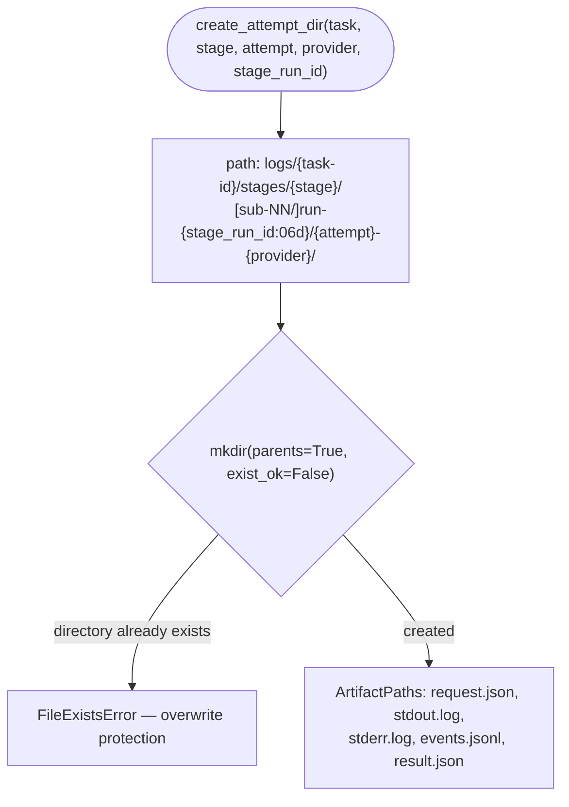

# B20 — Artifact Layout for Stage Runs

## Purpose

Single owner of the on-disk artifact layout and the **"logs are never overwritten"** invariant. Provides a deterministic path for every stage-run attempt and for task-level artifacts, so that all subsystems write files to the same location rather than each reconstructing the layout independently. The `artifacts_root` is the gitignored `<repo>/.worc/` home (`worc_home_for(config)`, [cli.py:606](../../../src/wastech_orchestrator/cli.py#L606)), so all run traces — plan, diffs, stage logs, `summary.json`, validation reports — live under `<repo>/.worc/logs/...`; the committed audit trail (the task file and its `<id>.summary.md`) is separate, at the repo-root `tasks/` (owned by [B06](./B06-orchestrator-pipeline.md)/[B22](./B22-git-manager.md)).

## Responsibilities

- Return the task artifact root `<artifacts_root>/logs/<task-id>/` ([artifacts.py:46-53](../../../src/wastech_orchestrator/providers/artifacts.py#L46)).
- Create the stage-run attempt directory and return its file paths (request/stdout/stderr/events/result) ([artifacts.py:80-109](../../../src/wastech_orchestrator/providers/artifacts.py#L80)).
- Write the already-redacted `request.json` and the machine-readable `result.json` ([artifacts.py:112-125](../../../src/wastech_orchestrator/providers/artifacts.py#L112)).
- Archive the artifacts of the previous attempt into `attempt-<N>/` on `rerun` ([artifacts.py:56-77](../../../src/wastech_orchestrator/providers/artifacts.py#L56)).
- Compute the sha256 of a file for registering the artifact in SQLite ([artifacts.py:128-134](../../../src/wastech_orchestrator/providers/artifacts.py#L128)).

## Block Boundaries

### Within scope

- Directory layout and the "do not overwrite" invariant.
- Serialization of provided content into JSON files.

### Out of scope

- **Redacting** content: this module does not import [B21](./B21-secret-redaction.md); the request arrives already redacted ([artifacts.py:112-114](../../../src/wastech_orchestrator/providers/artifacts.py#L112)).
- **Registering** the artifact in the database (`register_artifact`) — that is [B07](./B07-state-machine-and-store.md), called from [B06](./B06-orchestrator-pipeline.md); only the checksum is computed here.
- Knowledge of provider CLI syntax.

## Entry Points

- `task_artifact_dir(artifacts_root, task_id)` ([artifacts.py:46](../../../src/wastech_orchestrator/providers/artifacts.py#L46)) — used broadly (B06, B16, B08, B12).
- `create_attempt_dir(artifacts_root, task_id, stage, attempt, provider, *, stage_run_id, subtask=None)` ([artifacts.py:80](../../../src/wastech_orchestrator/providers/artifacts.py#L80)) — [B18](./B18-agent-providers.md).
- `write_request_artifact` / `write_result_artifact` ([artifacts.py:112,117](../../../src/wastech_orchestrator/providers/artifacts.py#L112)) — [B18](./B18-agent-providers.md).
- `archive_task_artifacts(artifacts_root, task_id, attempt)` ([artifacts.py:56](../../../src/wastech_orchestrator/providers/artifacts.py#L56)) — [B06](./B06-orchestrator-pipeline.md) `rerun_task`.
- `sha256_file(path)` ([artifacts.py:128](../../../src/wastech_orchestrator/providers/artifacts.py#L128)) — [B06](./B06-orchestrator-pipeline.md) `_register_artifact`.

## Inputs and State

`artifacts_root`, `task_id`, and for an attempt — `stage`, `attempt`, `provider`, `stage_run_id`, optional `subtask`. No state is stored; the source of truth for the layout is the path-construction code itself.

## Main Scenario (creating an attempt)

1. Base directory: `<root>/logs/<task-id>/stages/<stage>/[sub-<NN>/]run-<stage_run_id:06d>/<attempt>-<provider>/`.
2. `mkdir(parents=True, exist_ok=False)` — the directory **must not** already exist; a collision raises `FileExistsError` ([artifacts.py:97-101](../../../src/wastech_orchestrator/providers/artifacts.py#L97)).
3. Returns `ArtifactPaths` with paths for `request.json`, `stdout.log`, `stderr.log`, `events.jsonl`, `result.json`.

Deterministic attempt path and the "logs are not overwritten" invariant (`exist_ok=False`):

## Alternative Scenarios

### Archiving on rerun

`archive_task_artifacts` moves everything from `logs/<task-id>/`, except existing `attempt-*` directories, into `attempt-<N>/`; if there is nothing to move it returns `None`; an already-existing destination name is skipped (idempotent for an interrupted rerun) ([artifacts.py:64-77](../../../src/wastech_orchestrator/providers/artifacts.py#L64)).

## Checks and Constraints

- `stage_run_id` is reserved in SQLite before the provider starts, so a repeated fixing cycle or a recovery run receives its own directory even when the attempt counter starts from 1 ([artifacts.py:90-96](../../../src/wastech_orchestrator/providers/artifacts.py#L90)).
- `exist_ok=False` — guarantees that logs are never overwritten.

## Output

`ArtifactPaths` (attempt directory and paths to five files); paths to written JSON files; archive path or `None`; sha256 hex string.

## Side Effects

- Directory creation; writing `request.json`/`result.json` (UTF-8, `indent=2`); moving files during archiving. `task_artifact_dir`/`sha256_file` — no writes.

## Errors and Edge Cases

- Attempt directory collision → `FileExistsError` (intentional, overwrite protection).
- Nothing to archive → `None`; repeated archiving is idempotent.

## Relations

### Uses

- [B18 base](./B18-agent-providers.md) — types `AgentRunResult`, `Stage` (for result serialization).

### Used by

- [B18 — Agent Provider Adapters](./B18-agent-providers.md) — attempt directory, writing request/result.
- [B06 — Pipeline](./B06-orchestrator-pipeline.md) — `task_artifact_dir` for plan/summary/review/…, `archive_task_artifacts` on rerun, `sha256_file` during registration.
- [B16](./B16-task-parsing-and-validation-gate.md), [B08](./B08-ledger-and-failure-reports.md), [B12](./B12-hitl-and-typed-output.md) — attach to `task_artifact_dir`.

## Place in the Overall System

Defines where on disk all run traces live (prompts, agent responses, check logs, reviews, HITL, failure reports). The layout is identical for a fresh run and for a resume, so recovery finds artifacts via the same paths.

## Code Confirmation

- [providers/artifacts.py:46-134](../../../src/wastech_orchestrator/providers/artifacts.py#L46) — all entry points and the `exist_ok=False` invariant.
- [tests/providers/test_artifacts.py](../../../tests/providers/test_artifacts.py) — confirms the layout, collision rejection, and archiving behavior.
