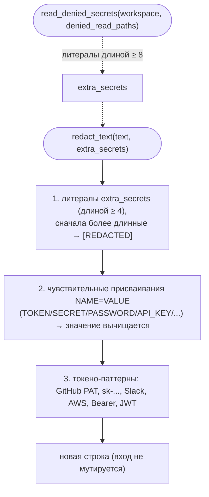

# B21 — Редактирование секретов (redaction)

## Назначение

Сквозной набор чистых функций, вычищающих секрето-подобные значения из текста и из словарей
**до** того, как что-либо попадёт в артефакт, лог или SQLite. Поддерживает системный инвариант
«никаких секретов в логах, БД и артефактах»: даже если агент случайно выведет содержимое запретного
файла в stdout/stderr, эти значения будут заменены на `[REDACTED]` перед записью.

## Ответственность

- Заменить известные секреты в строке: переданные литералы + чувствительные присваивания
  `NAME=VALUE` + токено-подобные паттерны ([redaction.py:94-105](../../../src/wastech_orchestrator/providers/redaction.py#L94)).
- Сделать «глубокую» редактированную копию словаря: значения под чувствительными ключами вычищаются
  целиком, строки — через `redact_text`, списки/словари — рекурсивно
  ([redaction.py:108-131](../../../src/wastech_orchestrator/providers/redaction.py#L108)).
- Собрать литералы-секреты из файлов `denied_read_paths` рабочего дерева для последующей редакции
  ([redaction.py:134-202](../../../src/wastech_orchestrator/providers/redaction.py#L134)).
- Определить, выглядит ли имя ключа как «секрето-несущее»
  ([redaction.py:85-91](../../../src/wastech_orchestrator/providers/redaction.py#L85)).

## Границы блока

### Входит в ответственность блока

- Чистое преобразование текста/словаря: вход не мутируется.
- Чтение (только чтение) файлов `denied_read_paths` для сбора литералов-секретов.

### Не входит в ответственность блока

- Решение, **что именно** редактировать у конкретного процесса (какие `extra_secrets` передать) —
  это вызывающие адаптеры/менеджеры.
- Запись редактированного контента в артефакты/логи — это [B20](./B20-artifact-layout.md),
  [B18](./B18-agent-providers.md), [B27](./B27-observability.md).
- Аллой-лист переменных окружения — это [B25](./B25-security-policy.md).

## Точки входа

- `redact_text(text, *, extra_secrets=())` ([redaction.py:94](../../../src/wastech_orchestrator/providers/redaction.py#L94)).
- `redact_mapping(obj, *, extra_secrets=())` ([redaction.py:108](../../../src/wastech_orchestrator/providers/redaction.py#L108)).
- `read_denied_secrets(workspace, denied_read_paths, *, max_bytes=65536)` ([redaction.py:134](../../../src/wastech_orchestrator/providers/redaction.py#L134)).
- `is_sensitive_key(name)` ([redaction.py:85](../../../src/wastech_orchestrator/providers/redaction.py#L85)).

## Входные данные и состояние

Текст или словарь + набор литералов `extra_secrets`; либо путь к рабочему дереву и список glob-ов
`denied_read_paths`. Состояние не хранится.

## Основной сценарий

`redact_text`:

1. Литералы из `extra_secrets` длиной ≥ 4 заменяются на `[REDACTED]` (сначала более длинные —
   сортировка по длине убыв.) ([redaction.py:97-101](../../../src/wastech_orchestrator/providers/redaction.py#L97)).
2. Чувствительные присваивания `NAME=VALUE`/`NAME: VALUE`/`"NAME":"VALUE"` (имя содержит
   TOKEN/SECRET/PASSWORD/API_KEY/… ) — имя сохраняется, значение вычищается
   ([redaction.py:57-59,102](../../../src/wastech_orchestrator/providers/redaction.py#L57)).
3. Токено-подобные паттерны заменяются: GitHub PAT/OAuth (`gh[opsur]_…`, `github_pat_…`),
   OpenAI-ключ (`sk-…`), Slack (`xox[baprs]-…`), AWS (`AKIA…`), Bearer-токен, JWT
   ([redaction.py:41-49](../../../src/wastech_orchestrator/providers/redaction.py#L41)).

`read_denied_secrets`:

1. Каждый glob из `denied_read_paths` раскрывается относительно `workspace`; файлы — добавляются,
   каталоги — рекурсивно ([redaction.py:148-162](../../../src/wastech_orchestrator/providers/redaction.py#L148)).
2. Каждый файл читается до `max_bytes`; из непустых не-комментарных строк извлекаются кандидаты:
   значение после первого `=`, каждый непрерывный не-разделительный фрагмент, и вся строка целиком —
   с фильтром длины ≥ 8 ([redaction.py:178-202](../../../src/wastech_orchestrator/providers/redaction.py#L178)).
3. Возвращается дедуплицированный кортеж литералов.

Два пути: трёхслойная редакция строки и сбор литералов из запретных файлов (которые затем тоже
вычищаются из стоков):

## Проверки и ограничения

- Литералы короче 4 символов игнорируются (иначе портили бы обычный текст)
  ([redaction.py:27-29](../../../src/wastech_orchestrator/providers/redaction.py#L27)).
- Токены из запретных файлов короче 8 символов игнорируются
  ([redaction.py:31-34](../../../src/wastech_orchestrator/providers/redaction.py#L31)).
- Чувствительность ключа определяется по **сегментам** имени, поэтому `access_token`/`API_KEY`
  чувствительны, а счётчик `input_tokens` (сегмент `tokens`) — нет
  ([redaction.py:63-91](../../../src/wastech_orchestrator/providers/redaction.py#L63)).
- Комментарии (`#`) и пустые строки в запретных файлах пропускаются; ошибки glob/чтения молча
  игнорируются ([redaction.py:156,170,195](../../../src/wastech_orchestrator/providers/redaction.py#L156)).

## Результат

Новая редактированная строка / новый словарь (вход не изменяется), либо кортеж литералов-секретов.

## Побочные эффекты

- `redact_text` / `redact_mapping` / `is_sensitive_key` — побочных эффектов нет.
- `read_denied_secrets` — только чтение файлов рабочего дерева (никакой записи); собранные значения
  никуда не записываются, используются только как литералы для редакции.

## Ошибки и граничные случаи

- Отсутствующие пути `denied_read_paths` молча пропускаются.
- Нестроковые значения в словаре (числа/булевы/None) проходят без изменений, если не под
  чувствительным ключом ([redaction.py:124-131](../../../src/wastech_orchestrator/providers/redaction.py#L124)).

## Связи

### Использует

- стандартную библиотеку (`re`, `pathlib`). Внешних блоков не использует.

### Используется в

- [B18 — Адаптеры провайдеров](./B18-agent-providers.md) — редакция stdout/stderr/request и сбор
  секретов из запретных файлов.
- [B22 — Git Manager](./B22-git-manager.md) — редакция stderr git и диффов перед записью.
- [B27 — Наблюдаемость](./B27-observability.md) — `RedactionFilter` пропускает каждую лог-запись.
- [B06 — Конвейер](./B06-orchestrator-pipeline.md) — редакция отрендеренного промпта и секции навыков.
- [B26 — Telegram](./B26-notifications-telegram.md) — редакция исходящих сообщений и ответов.

## Место в общей системе

Это второй (defense-in-depth) рубеж защиты секретов: места вызова логируют/пишут только безопасные
идентификаторы, а этот блок дополнительно вычищает любые токено-подобные значения. Совместно с
[B25](./B25-security-policy.md) (запрет передачи секретов в окружение) обеспечивает инвариант «нет
секретов в артефактах/логах/БД».

## Подтверждение в коде

- [providers/redaction.py:41-59](../../../src/wastech_orchestrator/providers/redaction.py#L41) —
  паттерны токенов и чувствительных присваиваний.
- [providers/redaction.py:94-131](../../../src/wastech_orchestrator/providers/redaction.py#L94) —
  `redact_text` / `redact_mapping` (чистые, вход не мутируется).
- [providers/redaction.py:134-202](../../../src/wastech_orchestrator/providers/redaction.py#L134) —
  `read_denied_secrets` (read-only сбор литералов, фильтр длины 8).
- [tests/providers/test_redaction.py](../../../tests/providers/test_redaction.py),
  [tests/providers/test_redaction_sinks.py](../../../tests/providers/test_redaction_sinks.py),
  [tests/security/test_denied_reads.py](../../../tests/security/test_denied_reads.py) — подтверждают
  паттерны, неизменяемость входа, сбор и применение секретов из `.env`/glob.
