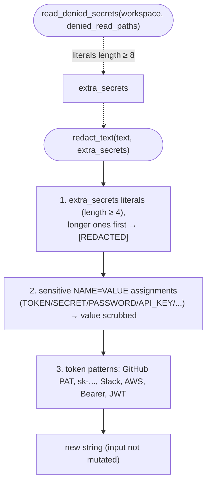

# B21 — Secret Redaction

## Purpose

A cross-cutting set of pure functions that scrub secret-like values from text and dictionaries **before** anything reaches an artifact, log, or SQLite. Enforces the system invariant "no secrets in logs, DB, or artifacts": even if an agent accidentally prints the contents of a forbidden file to stdout/stderr, those values will be replaced with `[REDACTED]` before being written.

## Responsibilities

- Replace known secrets in a string: passed literals + sensitive `NAME=VALUE` assignments + token-like patterns ([redaction.py:94-105](../../../src/wastech_orchestrator/providers/redaction.py#L94)).
- Produce a "deep" redacted copy of a dictionary: values under sensitive keys are scrubbed entirely, strings are processed through `redact_text`, lists/dicts are handled recursively ([redaction.py:108-131](../../../src/wastech_orchestrator/providers/redaction.py#L108)).
- Collect secret literals from `denied_read_paths` files in the workspace for subsequent redaction ([redaction.py:134-202](../../../src/wastech_orchestrator/providers/redaction.py#L134)).
- Determine whether a key name looks like a "secret-bearing" key ([redaction.py:85-91](../../../src/wastech_orchestrator/providers/redaction.py#L85)).

## Block Boundaries

### Within scope

- Pure transformation of text/dictionaries: the input is never mutated.
- Reading (read-only) `denied_read_paths` files to collect secret literals.

### Out of scope

- Deciding **what exactly** to redact for a specific process (which `extra_secrets` to pass) — that is the responsibility of the calling adapters/managers.
- Writing redacted content to artifacts/logs — that is [B20](./B20-artifact-layout.md), [B18](./B18-agent-providers.md), [B27](./B27-observability.md).
- The environment variable allowlist — that is [B25](./B25-security-policy.md).

## Entry Points

- `redact_text(text, *, extra_secrets=())` ([redaction.py:94](../../../src/wastech_orchestrator/providers/redaction.py#L94)).
- `redact_mapping(obj, *, extra_secrets=())` ([redaction.py:108](../../../src/wastech_orchestrator/providers/redaction.py#L108)).
- `read_denied_secrets(workspace, denied_read_paths, *, max_bytes=65536)` ([redaction.py:134](../../../src/wastech_orchestrator/providers/redaction.py#L134)).
- `is_sensitive_key(name)` ([redaction.py:85](../../../src/wastech_orchestrator/providers/redaction.py#L85)).

## Inputs and State

Text or a dictionary plus a set of `extra_secrets` literals; or a path to the workspace and a list of `denied_read_paths` globs. No state is stored.

## Main Scenario

`redact_text`:

1. Literals from `extra_secrets` with length ≥ 4 are replaced with `[REDACTED]` (longer ones first — sorted by length descending) ([redaction.py:97-101](../../../src/wastech_orchestrator/providers/redaction.py#L97)).
2. Sensitive `NAME=VALUE` / `NAME: VALUE` / `"NAME":"VALUE"` assignments (where the name contains TOKEN/SECRET/PASSWORD/API_KEY/…) — the name is preserved, the value is scrubbed ([redaction.py:57-59,102](../../../src/wastech_orchestrator/providers/redaction.py#L57)).
3. Token-like patterns are replaced: GitHub PAT/OAuth (`gh[opsur]_…`, `github_pat_…`), OpenAI key (`sk-…`), Slack (`xox[baprs]-…`), AWS (`AKIA…`), Bearer token, JWT ([redaction.py:41-49](../../../src/wastech_orchestrator/providers/redaction.py#L41)).

`read_denied_secrets`:

1. Each glob from `denied_read_paths` is expanded relative to `workspace`; files are added directly, directories are traversed recursively ([redaction.py:148-162](../../../src/wastech_orchestrator/providers/redaction.py#L148)).
2. Each file is read up to `max_bytes`; from non-empty, non-comment lines candidates are extracted: the value after the first `=`, each continuous non-delimiter fragment, and the whole line — filtered to length ≥ 8 ([redaction.py:178-202](../../../src/wastech_orchestrator/providers/redaction.py#L178)).
3. A deduplicated tuple of literals is returned.

Two paths: three-layer string redaction and literal collection from forbidden files (which are then also scrubbed from sinks):

## Checks and Constraints

- Literals shorter than 4 characters are ignored (otherwise they would corrupt normal text) ([redaction.py:27-29](../../../src/wastech_orchestrator/providers/redaction.py#L27)).
- Tokens from forbidden files shorter than 8 characters are ignored ([redaction.py:31-34](../../../src/wastech_orchestrator/providers/redaction.py#L31)).
- Key sensitivity is determined by **segments** of the name, so `access_token`/`API_KEY` are sensitive, but the counter `input_tokens` (segment `tokens`) is not ([redaction.py:63-91](../../../src/wastech_orchestrator/providers/redaction.py#L63)).
- Comments (`#`) and blank lines in forbidden files are skipped; glob/read errors are silently ignored ([redaction.py:156,170,195](../../../src/wastech_orchestrator/providers/redaction.py#L156)).

## Output

A new redacted string / new dictionary (input is not modified), or a tuple of secret literals.

## Side Effects

- `redact_text` / `redact_mapping` / `is_sensitive_key` — no side effects.
- `read_denied_secrets` — reads workspace files only (no writes); collected values are not written anywhere, used only as literals for redaction.

## Errors and Edge Cases

- Missing `denied_read_paths` paths are silently skipped.
- Non-string values in a dictionary (numbers/booleans/None) pass through unchanged unless they are under a sensitive key ([redaction.py:124-131](../../../src/wastech_orchestrator/providers/redaction.py#L124)).

## Relationships

### Uses

- Standard library (`re`, `pathlib`). Does not use any external blocks.

### Used by

- [B18 — Agent Provider Adapters](./B18-agent-providers.md) — redaction of stdout/stderr/request and collection of secrets from forbidden files.
- [B22 — Git Manager](./B22-git-manager.md) — redaction of git stderr and diffs before writing.
- [B27 — Observability](./B27-observability.md) — `RedactionFilter` passes every log record through.
- [B06 — Pipeline](./B06-orchestrator-pipeline.md) — redaction of rendered prompts and skill sections.
- [B26 — Telegram](./B26-notifications-telegram.md) — redaction of outgoing messages and responses.

## Role in the Overall System

This is the second (defense-in-depth) layer of secret protection: call sites log/write only safe identifiers, and this block additionally scrubs any token-like values. Together with [B25](./B25-security-policy.md) (which prevents secrets from being passed into the environment), it enforces the "no secrets in artifacts/logs/DB" invariant.

## Code Evidence

- [providers/redaction.py:41-59](../../../src/wastech_orchestrator/providers/redaction.py#L41) — token patterns and sensitive assignment patterns.
- [providers/redaction.py:94-131](../../../src/wastech_orchestrator/providers/redaction.py#L94) — `redact_text` / `redact_mapping` (pure, input not mutated).
- [providers/redaction.py:134-202](../../../src/wastech_orchestrator/providers/redaction.py#L134) — `read_denied_secrets` (read-only literal collection, length filter of 8).
- [tests/providers/test_redaction.py](../../../tests/providers/test_redaction.py), [tests/providers/test_redaction_sinks.py](../../../tests/providers/test_redaction_sinks.py), [tests/security/test_denied_reads.py](../../../tests/security/test_denied_reads.py) — verify patterns, input immutability, collection and application of secrets from `.env`/glob.
