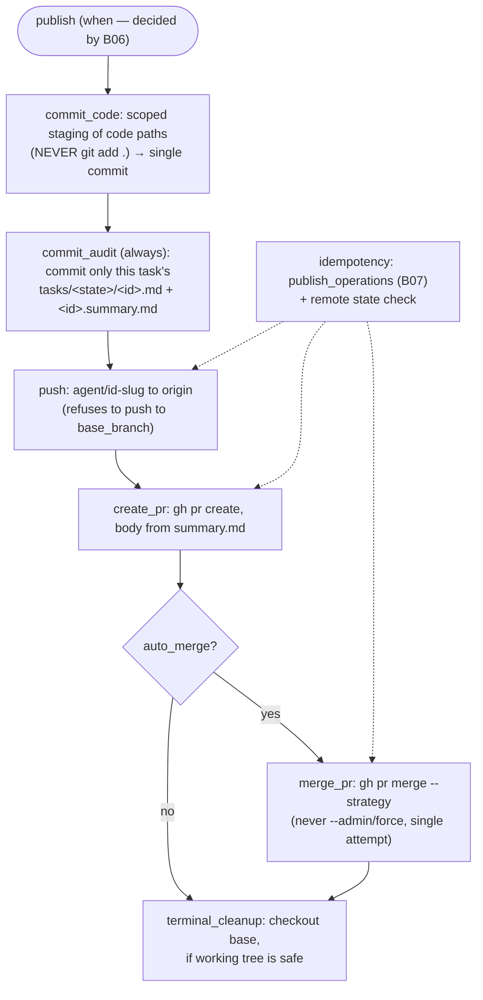

# B22 — Git and GitHub Operations (Git Manager)

## Purpose

The sole component that commits, pushes, and opens Pull Requests — agents never do this. All git/gh calls go through a safe runner as an argv list (no shell, no interpolation of user strings) with an environment allowlist. Implements the invariants "only the orchestrator does commit/push/PR" and "launch without shell interpolation".

## Responsibilities

- Branch flow: `fetch` → checkout `base_branch` → `pull` → create/reuse `agent/<task-id>-<slug>` ([git_manager.py:249-264](../../../src/wastech_orchestrator/git_manager.py#L249)).
- **Scoped staging** (§21.1): only code paths + `:(exclude)tasks/` — **never** `git add .` ([git_manager.py:447-454](../../../src/wastech_orchestrator/git_manager.py#L447)).
- The canonical single-layout footprint (§21): the orchestrator's runtime files live under the gitignored `<repo>/.worc/` home; `install` appends the single `.worc/` line to the repo's tracked `.gitignore` (`tasks/` is intentionally NOT ignored) ([git_manager.py:50-85](../../../src/wastech_orchestrator/git_manager.py#L50)).
- The always-on, task-scoped **audit commit** of the task file + its `<id>.summary.md` ([git_manager.py:515-563](../../../src/wastech_orchestrator/git_manager.py#L515)).
- Idempotent commit/push/PR/merge via `publish_operations` + remote state verification ([git_manager.py:567-668](../../../src/wastech_orchestrator/git_manager.py#L567)).
- Terminal cleanup to `base_branch` when provably safe ([git_manager.py:725-749](../../../src/wastech_orchestrator/git_manager.py#L725)).
- `SnapshotHook` implementation for capturing partial changes ([git_manager.py:365-398](../../../src/wastech_orchestrator/git_manager.py#L365)).

## Block Boundaries

### Within this block's responsibility

- All git/gh operations, publication idempotency, the `.worc/` gitignore exclude, the task-scoped audit commit, working tree snapshots, redaction of stderr/diffs before writing.

### Outside this block's responsibility

- **When** to commit/push/create PR and status transitions — that is [B06](./B06-orchestrator-pipeline.md).
- **Process launch security** — that is [B19](./B19-subprocess-runner.md).
- **Redaction rules** — [B21](./B21-secret-redaction.md) (Git Manager applies them).
- **Environment allowlist** — [B25](./B25-security-policy.md).
- **Partial change contract shape** — that is [B17/snapshots](./B17-agent-router-and-fallback.md); Git Manager implements it.
- **Writing `check_runs`/ledger** — that is [B07](./B07-state-machine-and-store.md)/[B08](./B08-ledger-and-failure-reports.md).

## Entry Points

- `GitManager(...)` ([git_manager.py:174](../../../src/wastech_orchestrator/git_manager.py#L174)); constructed in `build_orchestrator`.
- Branch/diffs/publication/cleanup: `prepare_branch`, `reset_branch_to_base`, `delete_branch`, `commit_code`/`commit_subtask`/`commit_audit`, `push`, `create_pr`, `merge_pr`, `write_current_diff`/`cumulative_committed_diff`/`diff_stat`, `terminal_cleanup`, `ensure_runtime_excludes`.
- Read probes: `unaccounted_dirty_paths`, `remote_branch_exists`, `recorded_pr_url`, `verify_pr_state`, `refresh_base`, `commit_on_branch`.
- `SnapshotHook`: `capture`, `partial_change_since` (calls [B17](./B17-agent-router-and-fallback.md)).
- Module-level function `append_runtime_excludes(repo_root)` ([git_manager.py:80](../../../src/wastech_orchestrator/git_manager.py#L80)) — [B03 install](./B03-installer-and-scaffolding.md).

## Input Data and State

`OrchestratorConfig` (repo, `git.footprint`, security, auto_merge), `StateStore` (for `publish_operations`), `artifacts_root`. Internal state — the current active task `_ActiveTask` (for partial diff paths) and the environment allowlist built once in the constructor.

## Main Scenario (publishing a successful task)

1. `commit_code` — scoped staging of code paths and a single commit (or current HEAD if there is nothing to change).
2. `commit_audit` — a separate, always-on commit that stages **only this task's** moved task file plus its `<id>.summary.md` (in `tasks/done` or `tasks/failed`) — never the whole `tasks/` tree, so a concurrently-pending task is never swept in. Working artifacts live under the gitignored `.worc/` home and are never committed. The commit lands on the task branch, or on a `…-audit` sibling branch when `git.footprint.audit_on_branch` is `sibling`.
3. `push` — push `agent/<id>-<slug>` to `origin` (refuses to push to base).
4. `create_pr` — `gh pr create` with body from `summary.md`.
5. (opt.) `merge_pr` — `gh pr merge --<strategy> [--auto]`.
6. `terminal_cleanup` — checkout `base_branch` if the working tree is safe.

All steps are idempotent: a repeated call after a restart checks `publish_operations` and/or the remote state and does not duplicate the operation.

## Alternative Scenarios

### Partial Changes (SnapshotHook)

`capture` takes a snapshot of HEAD/porcelain/diff-checksum; `partial_change_since` writes `.worc/logs/<task>/partial/NNN.diff` and returns `PartialChange` (without rollback) when the diff has changed ([git_manager.py:374-398](../../../src/wastech_orchestrator/git_manager.py#L374)).

### Rerun (branch reset)

`reset_branch_to_base`: checkout base, optionally delete the remote branch (closes PR), force-delete the local branch — so that a fresh `prepare_branch` recreates it from the current base ([git_manager.py:266-287](../../../src/wastech_orchestrator/git_manager.py#L266)).

### Already-merged PR

`merge_pr` on failure with a marker "already merged/not open/was merged" treats this as an idempotent success (`"merged"`), otherwise raises `GitCommandError` ([git_manager.py:659-665](../../../src/wastech_orchestrator/git_manager.py#L659)).

## Checks and Constraints

- **argv list, no shell**; stderr is always redacted ([git_manager.py:196-242](../../../src/wastech_orchestrator/git_manager.py#L196)).
- **Never `git add .`** — only an explicit pathspec + `:(exclude)tasks/` (the `.worc/` home is gitignored, so it needs no guard) ([git_manager.py:443-454](../../../src/wastech_orchestrator/git_manager.py#L443)).
- The audit commit stages only this task's own files (`tasks/<state>/<id>.md` + `<id>.summary.md`), never `git add -- tasks/` wholesale ([git_manager.py:539-546](../../../src/wastech_orchestrator/git_manager.py#L539)).
- Refuses to push directly to `base_branch` (§12.12) → `GitCommandError` ([git_manager.py:574-578](../../../src/wastech_orchestrator/git_manager.py#L574)).
- `merge_pr` **never** uses `--admin`/force, exactly one attempt (branch protections are preserved) ([git_manager.py:653-655](../../../src/wastech_orchestrator/git_manager.py#L653)).
- Environment — allowlist only; git/gh credentials are configured outside the orchestrator ([git_manager.py:188](../../../src/wastech_orchestrator/git_manager.py#L188)).
- `verify_pr_state`/`recorded_pr_url`/`refresh_base`/`fetch` — best-effort (do not raise errors).

## Output

Branch creation/switching; commits (SHA); push; PR URL; merge marker; `CleanupOutcome`; diffs on disk; `PartialChange`. Idempotent markers are written to `publish_operations` ([B07](./B07-state-machine-and-store.md)).

## Side Effects

- Git mutations (branches, commits), network (`fetch`/`pull`/`push`/PR/merge via `gh`).
- Files (under the gitignored `.worc/` home): `logs/<task>/current.diff`, `partial/NNN.diff`, `publish/terminal-cleanup.json`; the single `.worc/` line in the repo's tracked `.gitignore`.
- `publish_operations` rows in the State Store (idempotency).
- Heartbeat log during long operations.

## Errors and Edge Cases

- Failed required git/gh call → `GitCommandError`.
- Blocked merge (branch protection/conflict) → `GitCommandError` (Core sets `manual_action_required`, PR remains open).
- Dirty working tree during cleanup → `CleanupOutcome(safe=False)`; status becomes `manual_action_required` on successful publication.

## Relationships

### Uses

- [B19 — Subprocess Runner](./B19-subprocess-runner.md) — `run_process`.
- [B21 — Redaction](./B21-secret-redaction.md) — redaction of stderr and diffs; `read_denied_secrets`.
- [B25 — Security](./B25-security-policy.md) — `build_child_env`.
- [B07 — State Store](./B07-state-machine-and-store.md) — `publish_operations` (idempotency).
- [B27 — Observability](./B27-observability.md) — heartbeat and logging.
- [B17/snapshots](./B17-agent-router-and-fallback.md) — `WorkingTreeSnapshot`/`PartialChange` types.

### Used by

- [B06 — Pipeline](./B06-orchestrator-pipeline.md) — the entire git and publication flow.
- [B17 — Router](./B17-agent-router-and-fallback.md) — as `SnapshotHook` (snapshot/partial diff).
- [B03 — Installer](./B03-installer-and-scaffolding.md) — `append_runtime_excludes` (gitignore `.worc/`).
- [B01 — CLI](./B01-cli-and-operator-commands.md) — read probes via the rerun/finalize plan in [B06](./B06-orchestrator-pipeline.md).

## Place in the Overall System

Git Manager is the system's gateway to Git/GitHub. It upholds the invariant "only the orchestrator publishes", isolates the core from git syntax, and makes publication resilient to failures (idempotency) and safe (scoped staging, refusal to push to base, no `--admin`).

## Code Evidence

- [git_manager.py:50-85](../../../src/wastech_orchestrator/git_manager.py#L50) — `EXCLUDED_DIRS` (`.worc`, `tasks`), `RUNTIME_GITIGNORE_LINES` (the single `.worc/` line), `append_runtime_excludes`.
- [git_manager.py:196-242](../../../src/wastech_orchestrator/git_manager.py#L196) — argv launch, stderr redaction, `_git_checked`/`_gh`.
- [git_manager.py:249-287](../../../src/wastech_orchestrator/git_manager.py#L249) — branch flow, `reset_branch_to_base`.
- [git_manager.py:402-563](../../../src/wastech_orchestrator/git_manager.py#L402) — scoped staging, idempotent commits, task-scoped audit commit.
- [git_manager.py:567-668](../../../src/wastech_orchestrator/git_manager.py#L567) — push/PR/merge (idempotent, no `--admin`).
- [git_manager.py:725-788](../../../src/wastech_orchestrator/git_manager.py#L725) — terminal cleanup + artifact.
- Test: [tests/git/test_git_manager.py](../../../tests/git/test_git_manager.py) — `agent/<id>-<slug>` branch, absence of `git add .`, the `.worc/` gitignore line, task-scoped audit commit, push/PR/merge idempotency, already-merged, refusal to push to base, redacted diff, terminal cleanup.
