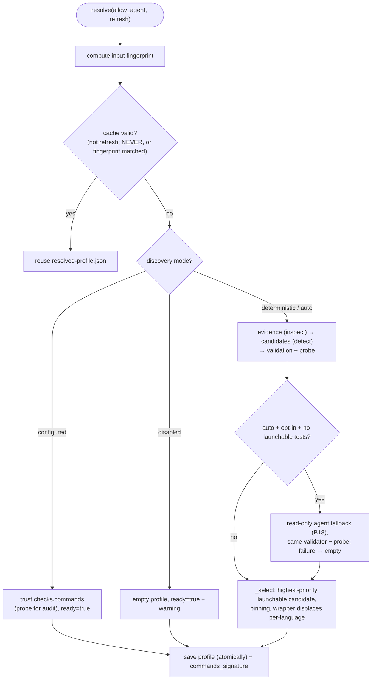

# B23 — Check Discovery and Resolution

## Purpose

Determines **which** set of check commands (quality gate) to run for a repository and packages the result into a cacheable "profile". Supports three modes: trust `checks.commands`; deterministically discover based on repository "evidence"; or (optionally) supplement with an agent suggestion. The profile is cached by fingerprint and invalidated when input data changes; re-resolution is allowed on infrastructure proof (launch failure).

## Responsibilities

- Collect read-only repository "evidence" (manifests, lock files, wrappers, venv, CI names, instructions) ([inspect.py:91-116](../../../src/wastech_orchestrator/checks/inspect.py#L91)).
- Deterministically propose candidates by ecosystem ([detect.py:25-150](../../../src/wastech_orchestrator/checks/detect.py#L25)).
- Validate and probe the launchability of candidates ([validate.py:35-56](../../../src/wastech_orchestrator/checks/validate.py#L35), [probe.py:44-72](../../../src/wastech_orchestrator/checks/probe.py#L44)).
- Optionally run a **read-only** agent fallback ([agent.py:92-127](../../../src/wastech_orchestrator/checks/agent.py#L92), [discovery_factory.py:32-44](../../../src/wastech_orchestrator/checks/discovery_factory.py#L32)).
- Select a profile, cache it by fingerprint, and support re-resolution ([resolver.py:109-225](../../../src/wastech_orchestrator/checks/resolver.py#L109)).
- Provide the canonical check model `ResolvedCheck` and argv safety predicates ([model.py:56-148](../../../src/wastech_orchestrator/checks/model.py#L56)).

## Block Boundaries

### Within scope

- Inspection, detection, validation + probe, agent fallback, profile selection and cache, re-resolution, diagnostic views, the `ResolvedCheck` model, and `commands_signature`.

### Out of scope

- **Running** the profile (executing checks) — that is [B24](./B24-check-execution.md).
- **The approval gate** for a changed command set (§1.2): comparing `commands_signature` and HITL — that is [B06 `_gate_check_commands`](./B06-orchestrator-pipeline.md) (uses the signature from here).
- **The decision to trigger** re-resolution mid-task — that is [B06](./B06-orchestrator-pipeline.md) (calls `reresolve` on launch failure).
- **Secure process launching** — [B19](./B19-subprocess-runner.md); **env allowlist** — [B25](./B25-security-policy.md); **provider launching** — [B18](./B18-agent-providers.md).

## Entry Points

- `CheckResolver.resolve(*, allow_agent=False, refresh=False)` / `reresolve(*, allow_agent, reason)` / property `store` ([resolver.py:109,126,105](../../../src/wastech_orchestrator/checks/resolver.py#L109)). Constructed in `build_orchestrator` ([orchestrator.py:2627-2630](../../../src/wastech_orchestrator/core/orchestrator.py#L2627)).
- `build_discovery` / `select_discovery_provider` ([discovery_factory.py](../../../src/wastech_orchestrator/checks/discovery_factory.py)).
- Diagnostics: `check_preflight`, `load_profile`, `summarize_profile` ([diagnostics.py](../../../src/wastech_orchestrator/checks/diagnostics.py)) — [B01 preflight/status](./B01-cli-and-operator-commands.md).
- Model: `ResolvedCheck`, `normalize_check_command`/`normalize_commands`, `shell_metachars`, `argv_matches_denied` ([model.py](../../../src/wastech_orchestrator/checks/model.py)); `commands_signature`/`ResolvedCheckProfile` ([profile.py](../../../src/wastech_orchestrator/checks/profile.py)).

## Inputs and State

`OrchestratorConfig` (`checks.discovery`, `checks.commands`, `security.*`), repository root, `artifacts_root`. Persistent state — cache at `<artifacts_root>/checks/resolved-profile.json`.

## Main Scenario (`resolve`)

1. A fingerprint is computed from input files and executables.
2. If not `refresh` and policy is not `ALWAYS`: the cache is reused (`NEVER` — always; otherwise when the fingerprint matches).
3. Otherwise `_resolve_fresh` by mode:
   - **configured**: trust `checks.commands` (probe for audit only), `ready=True` even with an empty set;
   - **deterministic/auto**: collect evidence → candidates (configured + detected) → validation + probe → (auto + opt-in + no launchable `tests`) agent fallback → `_select`;
   - **disabled**: empty profile `ready=True` with a warning.
4. The profile is saved (atomically) and returned.

Profile resolution: first cache by fingerprint, then by discovery mode:

## Alternative Scenarios

### Agent fallback (auto)

Only when `mode=auto`, `allow_agent`, `agent_fallback`, a provider is available, and there is no launchable `tests`: one **read-only** provider run (`permission_profile="read-only"`, cheap model, low reasoning, timeout) with evidence facts (names only, no content/env); output is strictly validated and passes through the same validator + probe ([resolver.py:208-215](../../../src/wastech_orchestrator/checks/resolver.py#L208), [agent.py:96-127](../../../src/wastech_orchestrator/checks/agent.py#L96)). Any failure → `()` (deterministic result is preserved).

### Re-resolution (`reresolve`)

A forced fresh-resolve (ignoring cache) only on "infrastructure proof" (`launch_failed`/`fingerprint_changed`/`low_confidence`); the reason is written to the profile's `notes` ([resolver.py:126-138](../../../src/wastech_orchestrator/checks/resolver.py#L126)). Never triggered because a check **reported** a failure (otherwise the gate would rewrite its own command until it turned "green").

## Checks and Constraints

- **Inspection** is read-only and size-limited (262 KB/file); `denied_read_paths` are skipped; CI files expose only names ([inspect.py:120-132](../../../src/wastech_orchestrator/checks/inspect.py#L120)).
- **Candidate validation**: empty argv, shell metacharacters, bypass flags, denied commands, dependency installation commands (install/sync/add/update, `npm ci`) — all rejected ([validate.py:41-65](../../../src/wastech_orchestrator/checks/validate.py#L41)).
- **Probe**: path → file exists; `python -m <module>` → `python -c "import <module>"`; bare command → `shutil.which`; launch failure → `not_launchable` ([probe.py:47-72](../../../src/wastech_orchestrator/checks/probe.py#L47)).
- **Selection** (`_select`): for each logical name, the highest-priority launchable candidate is chosen (CONFIGURED takes priority); **pinning** — a name with a configured candidate is filled only by configured; a launchable `checks` wrapper (e.g. `make check`) displaces per-language checks ([resolver.py:302-339](../../../src/wastech_orchestrator/checks/resolver.py#L302)).
- **argv safety** is enforced at three levels: agent schema ([schema_validate.py](../../../src/wastech_orchestrator/checks/schema_validate.py)), validator, and [B05](./B05-configuration.md) at load time.
- The profile is structurally secret-free (argv/evidence/paths, not env values/content) ([profile.py:1-7](../../../src/wastech_orchestrator/checks/profile.py#L1)).

## Output

`ResolvedCheckProfile` (ready, source, checks=`ResolvedCheck[]`, candidates audit, fingerprint, `commands_signature`, approval fields, notes). From diagnostics — `(ready, lines)` or summary strings. `build_discovery` → `AgentCheckDiscovery | None`.

## Side Effects

- Reading repository files (read-only, bounded).
- Writing `checks/resolved-profile.json` (atomically).
- Probes launch lightweight subprocesses (`python -c "import …"`); agent fallback launches the provider.

## Errors and Edge Cases

- Unreadable/corrupt profile → `None` (treated as absent → re-discovery) ([profile.py:154-155](../../../src/wastech_orchestrator/checks/profile.py#L154)).
- Agent failure/invalid output → `()` (silently; deterministic result is preserved).
- Nothing launchable in deterministic/auto → `ready=False` (Core stops before branching).
- In `configured` `ready=True` even with no launchable commands — launch failure is caught at execution time ([B24](./B24-check-execution.md)).

## Relationships

### Uses

- [B19 — Subprocess Runner](./B19-subprocess-runner.md) — launchability probes.
- [B25 — Security](./B25-security-policy.md) — `build_child_env` (probes), `find_forbidden_args` (validator).
- [B18 — Provider Adapters](./B18-agent-providers.md) — `provider.run` (agent fallback), `preflight` (provider selection).
- [B05 — Configuration](./B05-configuration.md) — `checks.discovery`/`checks.commands`/`security.*`.

### Used by

- [B06 — Pipeline](./B06-orchestrator-pipeline.md) — `resolve`/`reresolve`, `profile.checks`, `commands_signature` for the §1.2 gate.
- [B24 — Check Execution](./B24-check-execution.md) — `ResolvedCheck`/`normalize_commands` model.
- [B05 — Configuration](./B05-configuration.md) — `model` predicates (`shell_metachars`/`argv_matches_denied`/`normalize_check_command`) during command validation.
- [B01 — CLI](./B01-cli-and-operator-commands.md) — `check_preflight`/`load_profile`/`summarize_profile`.
- [B03 — Installer](./B03-installer-and-scaffolding.md) — profile seed on install (agent resolution).

## Place in the Overall System

Check discovery is decoupled from check execution: this block works offline (deterministically + optionally with an agent) to prepare a launchable profile and cache it, while [B06](./B06-orchestrator-pipeline.md) verifies its readiness before branch creation (preflight §11) and hands it off to [B24](./B24-check-execution.md) at the `testing` stage. Re-resolution is strictly tied to infrastructure signals, which prevents the quality gate from "rewriting itself."

## Code Evidence

- [checks/resolver.py:109-347](../../../src/wastech_orchestrator/checks/resolver.py#L109) — resolve/reresolve, fingerprint cache, modes, `_select`/pinning/wrapper.
- [checks/inspect.py:91-277](../../../src/wastech_orchestrator/checks/inspect.py#L91) — evidence collection (bounded, denied-skip, scope §1.1).
- [checks/detect.py:25-199](../../../src/wastech_orchestrator/checks/detect.py#L25) — candidates by ecosystem.
- [checks/validate.py:41-65](../../../src/wastech_orchestrator/checks/validate.py#L41), [checks/probe.py:44-72](../../../src/wastech_orchestrator/checks/probe.py#L44) — safety and launchability.
- [checks/agent.py:76-153](../../../src/wastech_orchestrator/checks/agent.py#L76), [checks/schema_validate.py:42-93](../../../src/wastech_orchestrator/checks/schema_validate.py#L42) — read-only agent fallback + strict validation.
- [checks/profile.py:28-156](../../../src/wastech_orchestrator/checks/profile.py#L28), [checks/store.py:19-55](../../../src/wastech_orchestrator/checks/store.py#L19), [checks/fingerprint.py:51-89](../../../src/wastech_orchestrator/checks/fingerprint.py#L51) — profile, cache, fingerprint.
- Tests: [tests/checks/\*.py](../../../tests/checks/) (resolver, detect, inspect, validate, probe, agent, fingerprint, model, profile, store, schema_validate, diagnostics), [tests/config/test_checks_discovery.py](../../../tests/config/test_checks_discovery.py).
