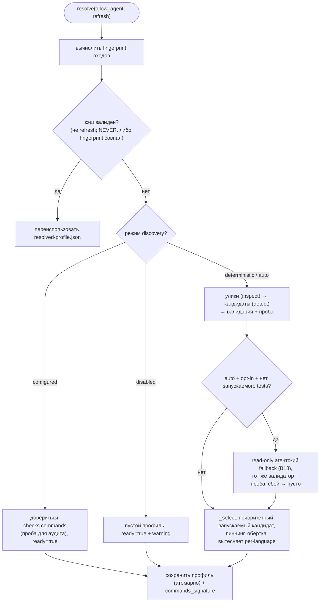

# B23 — Обнаружение и резолвинг проверок

## Назначение

Определяет, **какой** набор команд-проверок (quality gate) запускать для репозитория, и оформляет его в кэшируемый «профиль». Поддерживает три режима: доверять `checks.commands`; детерминированно обнаружить по «уликам» репозитория; либо (опционально) дополнить агентским предложением. Профиль кэшируется по fingerprint и инвалидируется при изменении входных данных; при инфраструктурном доказательстве (launch-сбой) допускается повторный резолвинг.

## Ответственность

- Собрать read-only «улики» репозитория (манифесты, локи, обёртки, venv, CI-имена, инструкции) ([inspect.py:91-116](../../../src/wastech_orchestrator/checks/inspect.py#L91)).
- Детерминированно предложить кандидатов по экосистемам ([detect.py:25-150](../../../src/wastech_orchestrator/checks/detect.py#L25)).
- Провалидировать и пробить запускаемость кандидатов ([validate.py:35-56](../../../src/wastech_orchestrator/checks/validate.py#L35), [probe.py:44-72](../../../src/wastech_orchestrator/checks/probe.py#L44)).
- Опционально запустить **read-only** агентский fallback ([agent.py:92-127](../../../src/wastech_orchestrator/checks/agent.py#L92), [discovery_factory.py:32-44](../../../src/wastech_orchestrator/checks/discovery_factory.py#L32)).
- Выбрать профиль, закэшировать по fingerprint, поддержать повторный резолвинг ([resolver.py:109-225](../../../src/wastech_orchestrator/checks/resolver.py#L109)).
- Дать каноническую модель проверки `ResolvedCheck` и предикаты безопасности argv ([model.py:56-148](../../../src/wastech_orchestrator/checks/model.py#L56)).

## Границы блока

### Входит в ответственность блока

- Инспекция, детекция, валидация+проба, агентский fallback, выбор и кэш профиля, повторный резолвинг, диагностические представления, модель `ResolvedCheck` и `commands_signature`.

### Не входит в ответственность блока

- **Запуск** профиля (исполнение проверок) — это [B24](./B24-check-execution.md).
- **Шлюз согласования** изменившегося набора команд (§1.2): сравнение `commands_signature` и HITL — это [B06 `_gate_check_commands`](./B06-orchestrator-pipeline.md) (использует сигнатуру отсюда).
- **Решение запустить** повторный резолвинг в середине задачи — это [B06](./B06-orchestrator-pipeline.md) (вызывает `reresolve` при launch-сбое).
- **Безопасный запуск процессов** — [B19](./B19-subprocess-runner.md); **аллой-лист env** — [B25](./B25-security-policy.md); **запуск провайдера** — [B18](./B18-agent-providers.md).

## Точки входа

- `CheckResolver.resolve(*, allow_agent=False, refresh=False)` / `reresolve(*, allow_agent, reason)` / свойство `store` ([resolver.py:109,126,105](../../../src/wastech_orchestrator/checks/resolver.py#L109)). Конструируется в `build_orchestrator` ([orchestrator.py:2627-2630](../../../src/wastech_orchestrator/core/orchestrator.py#L2627)).
- `build_discovery` / `select_discovery_provider` ([discovery_factory.py](../../../src/wastech_orchestrator/checks/discovery_factory.py)).
- Диагностика: `check_preflight`, `load_profile`, `summarize_profile` ([diagnostics.py](../../../src/wastech_orchestrator/checks/diagnostics.py)) — [B01 preflight/status](./B01-cli-and-operator-commands.md).
- Модель: `ResolvedCheck`, `normalize_check_command`/`normalize_commands`, `shell_metachars`, `argv_matches_denied` ([model.py](../../../src/wastech_orchestrator/checks/model.py)); `commands_signature`/`ResolvedCheckProfile` ([profile.py](../../../src/wastech_orchestrator/checks/profile.py)).

## Входные данные и состояние

`OrchestratorConfig` (`checks.discovery`, `checks.commands`, `security.*`), корень репозитория, `artifacts_root`. Постоянное состояние — кэш `<artifacts_root>/checks/resolved-profile.json`.

## Основной сценарий (`resolve`)

1. Вычисляется fingerprint по входным файлам/исполняемым.
2. Если не `refresh` и политика не `ALWAYS`: кэш переиспользуется (`NEVER` — всегда; иначе при совпадении fingerprint).
3. Иначе `_resolve_fresh` по режиму:
   - **configured**: довериться `checks.commands` (проба только для аудита), `ready=True` даже при пустом наборе;
   - **deterministic/auto**: собрать улики → кандидаты (configured + detected) → валидация+проба → (auto + opt-in + нет запускаемого `tests`) агентский fallback → `_select`;
   - **disabled**: пустой профиль `ready=True` с предупреждением.
4. Профиль сохраняется (атомарно) и возвращается.

Резолвинг профиля: сначала кэш по fingerprint, затем — по режиму discovery:

## Альтернативные сценарии

### Агентский fallback (auto)

Только когда `mode=auto`, `allow_agent`, `agent_fallback`, есть провайдер и нет запускаемого `tests`: один **read-only** запуск провайдера (`permission_profile="read-only"`, дешёвая модель, низкий reasoning, таймаут) с фактами-уликами (имена, без содержимого/env); вывод строго валидируется и проходит тот же валидатор+пробу ([resolver.py:208-215](../../../src/wastech_orchestrator/checks/resolver.py#L208), [agent.py:96-127](../../../src/wastech_orchestrator/checks/agent.py#L96)). Любой сбой → `()` (детерминированный результат остаётся).

### Повторный резолвинг (`reresolve`)

Принудительный fresh-резолв (игнор кэша) только при «инфраструктурном доказательстве» (`launch_failed`/`fingerprint_changed`/`low_confidence`); причина пишется в `notes` профиля ([resolver.py:126-138](../../../src/wastech_orchestrator/checks/resolver.py#L126)). Никогда — из-за того, что проверка **сообщила** о провале (иначе шлюз переписывал бы свою команду до «зелёного»).

## Проверки и ограничения

- **Инспекция** read-only и ограничена по размеру (262 КБ/файл); пути `denied_read_paths` пропускаются; CI-файлы дают только имена ([inspect.py:120-132](../../../src/wastech_orchestrator/checks/inspect.py#L120)).
- **Валидация кандидата**: пустой argv, shell-метасимволы, bypass-флаги, denied-команды, команды установки зависимостей (install/sync/add/update, `npm ci`) — отклоняются ([validate.py:41-65](../../../src/wastech_orchestrator/checks/validate.py#L41)).
- **Проба**: путь → файл существует; `python -m <module>` → `python -c "import <module>"`; голая команда → `shutil.which`; launch-сбой → `not_launchable` ([probe.py:47-72](../../../src/wastech_orchestrator/checks/probe.py#L47)).
- **Выбор** (`_select`): на логическое имя берётся самый приоритетный запускаемый кандидат (CONFIGURED имеет приоритет); **пиннинг** — имя с configured-кандидатом заполняется только configured; запускаемая обёртка `checks` (например `make check`) вытесняет per-language проверки ([resolver.py:302-339](../../../src/wastech_orchestrator/checks/resolver.py#L302)).
- **Безопасность argv** дублируется на трёх уровнях: схема агента ([schema_validate.py](../../../src/wastech_orchestrator/checks/schema_validate.py)), валидатор, и [B05](./B05-configuration.md) на загрузке.
- Профиль структурно секрет-free (argv/улики/пути, не значения env/содержимое) ([profile.py:1-7](../../../src/wastech_orchestrator/checks/profile.py#L1)).

## Результат

`ResolvedCheckProfile` (ready, source, checks=`ResolvedCheck[]`, candidates-аудит, fingerprint, `commands_signature`, поля approval, notes). Из диагностики — `(ready, lines)` или строки summary. `build_discovery` → `AgentCheckDiscovery | None`.

## Побочные эффекты

- Чтение файлов репозитория (read-only, ограниченное).
- Запись `checks/resolved-profile.json` (атомарно).
- Пробы запускают лёгкие подпроцессы (`python -c "import …"`); агентский fallback запускает провайдера.

## Ошибки и граничные случаи

- Нечитаемый/битый профиль → `None` (трактуется как отсутствующий → ре-дискавери) ([profile.py:154-155](../../../src/wastech_orchestrator/checks/profile.py#L154)).
- Агентский сбой/невалидный вывод → `()` (молча; детерминированный результат остаётся).
- Ничего не запускаемо в deterministic/auto → `ready=False` (Core останавливается до ветки).
- В `configured` `ready=True` даже без запускаемых команд — launch-сбой ловится во время выполнения ([B24](./B24-check-execution.md)).

## Связи

### Использует

- [B19 — Запуск подпроцессов](./B19-subprocess-runner.md) — пробы запускаемости.
- [B25 — Security](./B25-security-policy.md) — `build_child_env` (пробы), `find_forbidden_args` (валидатор).
- [B18 — Адаптеры провайдеров](./B18-agent-providers.md) — `provider.run` (агентский fallback), `preflight` (выбор провайдера).
- [B05 — Конфигурация](./B05-configuration.md) — `checks.discovery`/`checks.commands`/`security.*`.

### Используется в

- [B06 — Конвейер](./B06-orchestrator-pipeline.md) — `resolve`/`reresolve`, `profile.checks`, `commands_signature` для шлюза §1.2.
- [B24 — Выполнение проверок](./B24-check-execution.md) — модель `ResolvedCheck`/`normalize_commands`.
- [B05 — Конфигурация](./B05-configuration.md) — предикаты `model` (`shell_metachars`/`argv_matches_denied`/`normalize_check_command`) при валидации команд.
- [B01 — CLI](./B01-cli-and-operator-commands.md) — `check_preflight`/`load_profile`/`summarize_profile`.
- [B03 — Установщик](./B03-installer-and-scaffolding.md) — seed профиля при install (агентский резолвинг).

## Место в общей системе

Обнаружение проверок отделено от их выполнения: этот блок офлайн (детерминированно + опц. агент) готовит запускаемый профиль и кэширует его, а [B06](./B06-orchestrator-pipeline.md) проверяет его готовность до создания ветки (префлайт §11) и передаёт [B24](./B24-check-execution.md) на стадии `testing`. Повторный резолвинг строго привязан к инфраструктурным сигналам, что не даёт quality-gate «переписать себя».

## Подтверждение в коде

- [checks/resolver.py:109-347](../../../src/wastech_orchestrator/checks/resolver.py#L109) — resolve/reresolve, кэш по fingerprint, режимы, `_select`/пиннинг/обёртка.
- [checks/inspect.py:91-277](../../../src/wastech_orchestrator/checks/inspect.py#L91) — сбор улик (bounded, denied-skip, scope §1.1).
- [checks/detect.py:25-199](../../../src/wastech_orchestrator/checks/detect.py#L25) — кандидаты по экосистемам.
- [checks/validate.py:41-65](../../../src/wastech_orchestrator/checks/validate.py#L41), [checks/probe.py:44-72](../../../src/wastech_orchestrator/checks/probe.py#L44) — безопасность и запускаемость.
- [checks/agent.py:76-153](../../../src/wastech_orchestrator/checks/agent.py#L76), [checks/schema_validate.py:42-93](../../../src/wastech_orchestrator/checks/schema_validate.py#L42) — read-only агентский fallback + строгая валидация.
- [checks/profile.py:28-156](../../../src/wastech_orchestrator/checks/profile.py#L28), [checks/store.py:19-55](../../../src/wastech_orchestrator/checks/store.py#L19), [checks/fingerprint.py:51-89](../../../src/wastech_orchestrator/checks/fingerprint.py#L51) — профиль, кэш, fingerprint.
- Тесты: [tests/checks/\*.py](../../../tests/checks/) (resolver, detect, inspect, validate, probe, agent, fingerprint, model, profile, store, schema_validate, diagnostics), [tests/config/test_checks_discovery.py](../../../tests/config/test_checks_discovery.py).
