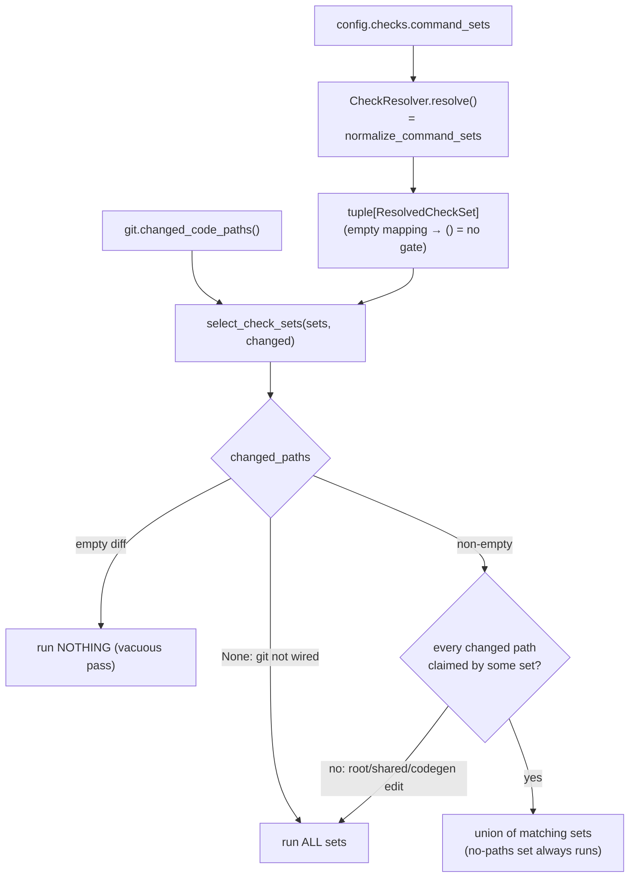

# B23 — Check Resolution and Selection

> Reconstructed from code (`checks/model.py`, `checks/resolver.py`, `checks/selection.py`) and tests (`tests/checks/`). The code is the only source of truth; this document was rebuilt from the implementation, not from prose or comments. Significant claims carry a `file:line` reference.

**Status:** documented · **Source modules:** `src/wastech_orchestrator/checks/model.py`, `src/wastech_orchestrator/checks/resolver.py`, `src/wastech_orchestrator/checks/selection.py`

## Responsibility

Turn the operator's `checks.command_sets` config into runnable, normalized check sets and decide **which** of them run for a given task's diff. There is no automatic discovery: the quality gate is exactly what the operator listed in `config.yaml` (an empty `command_sets` mapping means **no gate**, every task passes the checks node). This block owns three pure, IO-free pieces — the canonical check/check-set model and argv-safety predicates (`model.py`), the trivial resolver that normalizes config into check sets (`resolver.py`), and the deterministic diff-to-sets selector (`selection.py`). It does not _execute_ the suite (that is [B24](B24-check-execution.md)) and it launches no process, reads no file, and keeps no cache.

The 2026-06-23 checks-monorepo change deleted the prior discovery subsystem (inspector → detector → read-only agent → validator → prober → resolver, the fingerprint cache, the resolved-profile artifact, and the changed-command-set approval gate). What remains is the always-applied "operator lists the commands" behavior plus monorepo-aware selection by diff.

## Public surface

- `ResolvedCheck(name, argv, cwd="")` ([model.py:33](../../../src/wastech_orchestrator/checks/model.py#L33)) — the canonical resolved check: a logical name, an argv tuple (never a shell string), and a repo-relative `cwd` (`""` => the clone root) the runner joins onto `clone_dir`.
- `ResolvedCheckSet(name, paths, checks, timeout_seconds=None, skip_if_unavailable=False)` ([model.py:46](../../../src/wastech_orchestrator/checks/model.py#L46)) — a named, normalized command set: its selection `paths` globs, its `checks`, and the per-set runtime knobs (`timeout_seconds` `None` => the global `checks.timeout_seconds`; `skip_if_unavailable` => the set may be skipped when a binary is absent).
- `normalize_check_command(item)` / `normalize_command_sets(command_sets)` ([model.py:90](../../../src/wastech_orchestrator/checks/model.py#L90), [model.py:109](../../../src/wastech_orchestrator/checks/model.py#L109)) — turn a `CheckCommandSpec` / mapping / existing `ResolvedCheck` into a `ResolvedCheck`, and a `checks.command_sets` mapping into a tuple of `ResolvedCheckSet`s.
- `is_safe_relpath(value)` ([model.py:130](../../../src/wastech_orchestrator/checks/model.py#L130)) — the repo-relative-path predicate (no absolute / `~` / `..` traversal / Windows-absolute) used by the config validator to reject an unsafe check `cwd`. Relocated from the deleted `inspect.py` `_safe_scope_paths` rule.
- `shell_metachars(argv)` / `argv_matches_denied(argv, denied)` ([model.py:142](../../../src/wastech_orchestrator/checks/model.py#L142), [model.py:150](../../../src/wastech_orchestrator/checks/model.py#L150)) — the shared safety predicates (enforced by the config loader, B05).
- `CheckResolver(config).resolve() -> tuple[ResolvedCheckSet, ...]` ([resolver.py:15](../../../src/wastech_orchestrator/checks/resolver.py#L15)) — normalize `config.checks.command_sets`; an empty mapping → `()`.
- `select_check_sets(sets, changed_paths) -> tuple[ResolvedCheckSet, ...]` ([selection.py:17](../../../src/wastech_orchestrator/checks/selection.py#L17)) — the pure diff-to-sets selector.

## Behavior

### The canonical model: argv, never a shell string

A check is `ResolvedCheck(name, argv: tuple[str, ...], cwd: str = "")` ([model.py:33-43](../../../src/wastech_orchestrator/checks/model.py#L33)). `normalize_check_command` accepts a `CheckCommandSpec`-like object or `{name, argv, cwd?}` mapping (and still splits a legacy shell string with `shlex.split(..., posix=True)` so config validation can reuse it on any argv-bearing shape), always yielding an argv tuple; when no name is given it is derived from `argv[0]`'s basename across both POSIX and Windows path flavors ([model.py:64-69](../../../src/wastech_orchestrator/checks/model.py#L64), [model.py:90-106](../../../src/wastech_orchestrator/checks/model.py#L90)). A mapping without a non-empty `argv` (or an empty/blank string) raises `CheckCommandError` ([model.py:82-83](../../../src/wastech_orchestrator/checks/model.py#L82), [model.py:102-103](../../../src/wastech_orchestrator/checks/model.py#L102)).

The module is "shapes and normalization only: no provider/CLI syntax, no process launching, no filesystem I/O" ([model.py:8-9](../../../src/wastech_orchestrator/checks/model.py#L8)). Metacharacter and denied-command _rejection_ is not done inside `normalize_*`; it lives in the predicates `shell_metachars` (rejecting any token containing a shell metacharacter — the `_SHELL_METACHARS` frozenset of `; | & $` backtick `> < ( ) { } * ?` plus CR/LF) ([model.py:26](../../../src/wastech_orchestrator/checks/model.py#L26), [model.py:142-147](../../../src/wastech_orchestrator/checks/model.py#L142)) and `argv_matches_denied` (whitespace-normalized prefix match, mirroring the provider adapters so a check can never be `git commit` / `git push`) ([model.py:150-161](../../../src/wastech_orchestrator/checks/model.py#L150)). Those predicates are enforced at config-load time (B05), so the policy holds in depth.

### Resolution: normalize the operator's command sets

`CheckResolver(config).resolve()` is trivial — it returns `normalize_command_sets(config.checks.command_sets)` ([resolver.py:21-23](../../../src/wastech_orchestrator/checks/resolver.py#L21)). `normalize_command_sets` walks the mapping in loader-insertion order; each set's name is the mapping key, each command normalizes via `normalize_check_command` (carrying its `cwd`), and `paths` / `timeout_seconds` / `skip_if_unavailable` are carried through verbatim ([model.py:109-127](../../../src/wastech_orchestrator/checks/model.py#L109)). No modes, no cache, no fingerprint, no agent, no `reresolve` — an empty `command_sets` mapping resolves to `()` (no gate). The orchestrator-owned Check Runner ([B24](B24-check-execution.md)) remains the sole quality-gate authority.

### Selection: which sets run for the diff (deterministic, no LLM)

`select_check_sets(sets, changed_paths)` is a pure function — which command sets run is decided by the changed paths and each set's `paths` globs, never by an agent ([selection.py:1-6](../../../src/wastech_orchestrator/checks/selection.py#L1)). `changed_paths` is **tri-state** ([selection.py:35-52](../../../src/wastech_orchestrator/checks/selection.py#L35)):

- `None` — the diff could not be computed (e.g. git is not wired in a unit harness) → run **all** sets (a subset cannot be proven safe).
- `[]` — the diff is empty (the task changed no code) → run **nothing** (the checks node then passes vacuously).
- a non-empty list — match each set's `paths` globs against the changed paths and run the **union**. A set with no `paths` always runs (on any non-empty diff). **Fail-safe to full:** if any changed path is claimed by no path-bearing set (a root / shared / codegen edit), run **all** sets ([selection.py:42-44](../../../src/wastech_orchestrator/checks/selection.py#L42)). The result preserves `sets` order and de-dups by set name.

The glob matcher `_compile_glob` translates a repo-relative glob into an anchored regex, dependency-free so it works on the 3.12 floor: `**/` is zero-or-more leading directories (so `**/*.md` matches both `README.md` and `docs/a/b.md`), `**` crosses separators, a single `*` and `?` stay within one path segment ([selection.py:59-92](../../../src/wastech_orchestrator/checks/selection.py#L59)). It is `lru_cache`d.

## Invariants & guarantees

- Checks are always argv tuples, never shell strings; shell metacharacters and denied/forbidden commands are rejected by the predicates at config-load (B05), with the runner launching the list with `shell=False` (B24) ([model.py:26](../../../src/wastech_orchestrator/checks/model.py#L26), [model.py:142-161](../../../src/wastech_orchestrator/checks/model.py#L142)).
- Resolution and selection are pure: no process launch, no file read, no cache, no fingerprint ([model.py:8-9](../../../src/wastech_orchestrator/checks/model.py#L8), [resolver.py:1-7](../../../src/wastech_orchestrator/checks/resolver.py#L1), [selection.py:1-6](../../../src/wastech_orchestrator/checks/selection.py#L1)).
- An empty `command_sets` mapping is a no-gate config — `resolve()` returns `()` and the checks node passes vacuously ([resolver.py:22-23](../../../src/wastech_orchestrator/checks/resolver.py#L22)).
- Selection is conservative by construction: it only ever _narrows_ from "run all" when every changed path is attributable to a path-bearing set; an unclaimed path or an unknown diff falls back to running all sets ([selection.py:35-44](../../../src/wastech_orchestrator/checks/selection.py#L35)).
- The "flow never supplies commands" ceiling is preserved: commands come from config, and selection is a pure function of the diff — never an agent decision ([selection.py:1-6](../../../src/wastech_orchestrator/checks/selection.py#L1)).
- A check `cwd` is repo-relative and validated against traversal at config-load by `is_safe_relpath` ([model.py:130-139](../../../src/wastech_orchestrator/checks/model.py#L130)).

## Dependencies

- **Uses:** [B05](B05-configuration.md) (`checks.command_sets` / `CommandSet` / `CheckCommandSpec` config shapes, and the shared safety predicates `shell_metachars` / `argv_matches_denied` / `is_safe_relpath` at load time). Nothing else — no subprocess runner, no provider, no security policy at runtime (resolution/selection are pure).
- **Used by:** [B06](B06-orchestrator-pipeline.md) (`_check_preflight` calls `CheckResolver.resolve()` to normalize the command sets onto the pipeline before any branch; `build_orchestrator` constructs the resolver), [B30](B30-flow-node-runners.md) (the flow `checks` node's `command_profile` path calls `select_check_sets(check_sets, git.changed_code_paths())` and hands the selected sets to the Check Runner), [B24](B24-check-execution.md) (consumes `ResolvedCheckSet` / `ResolvedCheck` and reuses `normalize_command_sets` for its `selected=None` fallback), [B01](B01-cli-and-operator-commands.md) (the `preflight` / `status` commands print a command-set summary, without resolving or running anything).

## Tests

- `tests/checks/test_checks_model.py` — normalization of `CheckCommandSpec` / mappings / legacy strings, name derivation across path flavors, the `cwd` round-trip, blank/malformed rejection, `normalize_command_sets` carrying `paths` / `timeout_seconds` / `skip_if_unavailable` / `cwd`, the `shell_metachars` / `argv_matches_denied` predicates, and `is_safe_relpath` (rejecting traversal/absolute/`~`).
- `tests/checks/test_selection.py` — the tri-state contract (`None` → all, `[]` → none, non-empty → union), the no-`paths` set always running, fail-safe-to-full on an unclaimed path, the union of multiple matched sets, and the `_compile_glob` `**/` vs `*` (single-segment) vs `?` matching.
- `CheckResolver.resolve()` (normalizing the operator's command sets, no shell splitting) is exercised on the real path by `tests/security/test_no_shell_interpolation.py` and end-to-end in `tests/core/test_orchestrator.py`.
