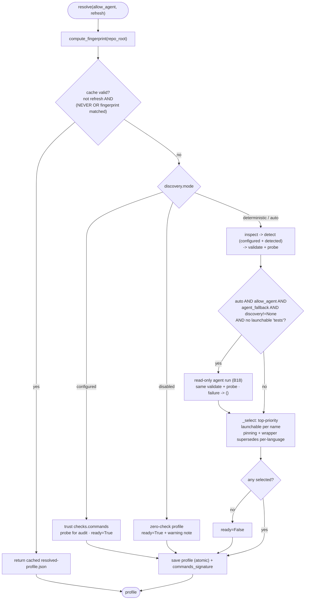

# B23 — Check Discovery and Resolution

> Reconstructed from code (`checks/model.py`, `checks/resolver.py`, `checks/detect.py`, `checks/profile.py`, `checks/discovery_factory.py`, and the supporting `inspect.py`/`validate.py`/`probe.py`/`store.py`/`fingerprint.py`/`agent.py`) and tests (`tests/checks/`). The code is the only source of truth; this document was rebuilt from the implementation, not from prose or comments. Significant claims carry a `file:line` reference.

**Status:** documented · **Source modules:** `src/wastech_orchestrator/checks/model.py`, `src/wastech_orchestrator/checks/resolver.py`, `src/wastech_orchestrator/checks/detect.py`, `src/wastech_orchestrator/checks/profile.py`, `src/wastech_orchestrator/checks/discovery_factory.py`

## Responsibility

Decide **which** set of quality-gate check commands a repository should run and package the decision into a cacheable, secret-free profile. This block runs the deterministic pipeline `inspect → detect → (optional read-only agent) → validate → probe → select → store`, honoring `checks.discovery.mode` and the cache/fingerprint rules. It is strictly provider-agnostic and proposal-only: every check is a `ResolvedCheck` — a logical name plus an **argv tuple, never a shell string** ([model.py:56-61](../../../src/wastech_orchestrator/checks/model.py#L56)). It does not _execute_ the suite (that is [B24](B24-check-execution.md)) and it does not own the sensitive-change approval gate (that is [B06](B06-orchestrator-pipeline.md)).

The block also defines the canonical check model and the shared argv-safety predicates consumed by both the resolver and the config loader, and emits the `commands_signature` that [B06](B06-orchestrator-pipeline.md)'s §1.2 gate compares to detect a changed command set.

## Public surface

- `ResolvedCheck(name, argv)` ([model.py:56](../../../src/wastech_orchestrator/checks/model.py#L56)) — the canonical resolved check: a logical name and an argv tuple.
- `CheckCandidate(name, argv, source, evidence, confidence, probe_status)` ([model.py:64](../../../src/wastech_orchestrator/checks/model.py#L64)) — a proposed check before validation/probing.
- `CheckSource` ([model.py:27](../../../src/wastech_orchestrator/checks/model.py#L27)) — `configured`/`detected`/`agent`/`disabled`, recorded in the profile.
- `Confidence` ([model.py:36](../../../src/wastech_orchestrator/checks/model.py#L36)) — `low`/`medium`/`high`; drives selection priority and the agent-fallback trigger.
- `ProbeStatus` ([model.py:44](../../../src/wastech_orchestrator/checks/model.py#L44)) — `launchable`/`not_launchable`/`unsupported`.
- `normalize_check_command(item)` / `normalize_commands(items)` ([model.py:99](../../../src/wastech_orchestrator/checks/model.py#L99), [model.py:118](../../../src/wastech_orchestrator/checks/model.py#L118)) — turn a legacy string / mapping / `CheckCommandSpec` / `ResolvedCheck` into argv tuples.
- `shell_metachars(argv)` / `argv_matches_denied(argv, denied)` ([model.py:128](../../../src/wastech_orchestrator/checks/model.py#L128), [model.py:136](../../../src/wastech_orchestrator/checks/model.py#L136)) — the shared safety predicates.
- `CheckResolver` ([resolver.py:74](../../../src/wastech_orchestrator/checks/resolver.py#L74)) — `resolve(*, allow_agent=False, refresh=False)`, `reresolve(*, allow_agent, reason)`, and the `store` property.
- `ReResolveReason` ([resolver.py:61](../../../src/wastech_orchestrator/checks/resolver.py#L61)) — `launch_failed`/`fingerprint_changed`/`low_confidence`.
- `CheckCandidateDetector.detect(evidence)` ([detect.py:28](../../../src/wastech_orchestrator/checks/detect.py#L28)) — deterministic per-ecosystem candidates.
- `ResolvedCheckProfile` + `commands_signature(checks)` ([profile.py:88](../../../src/wastech_orchestrator/checks/profile.py#L88), [profile.py:28](../../../src/wastech_orchestrator/checks/profile.py#L28)) — the artifact and its order-independent signature.
- `build_discovery(config, providers, artifacts_root)` ([discovery_factory.py:32](../../../src/wastech_orchestrator/checks/discovery_factory.py#L32)) — constructs the agent fallback, or `None` (opt-in).

## Behavior

### The canonical model: argv, never a shell string

A check is `ResolvedCheck(name, argv: tuple[str, ...])` ([model.py:56-61](../../../src/wastech_orchestrator/checks/model.py#L56)). `normalize_check_command` accepts a legacy shell-style string (split with `shlex.split(..., posix=True)`), a `{name, argv}` mapping, a `CheckCommandSpec`-like object, or an existing `ResolvedCheck`, and always yields an argv tuple; when no name is given it is derived from `argv[0]`'s basename across both POSIX and Windows path flavors ([model.py:76-81](../../../src/wastech_orchestrator/checks/model.py#L76), [model.py:99-115](../../../src/wastech_orchestrator/checks/model.py#L99)). An empty/blank command or a mapping without a non-empty `argv` raises `CheckCommandError` ([model.py:92-93](../../../src/wastech_orchestrator/checks/model.py#L92), [model.py:111-112](../../../src/wastech_orchestrator/checks/model.py#L111)); `normalize_commands` additionally skips blank legacy strings as a no-op ([model.py:122-123](../../../src/wastech_orchestrator/checks/model.py#L122)).

Normalization is **shape-only** by design — the module is "shapes and normalization only: no provider/CLI syntax" ([model.py:8-9](../../../src/wastech_orchestrator/checks/model.py#L8)). The metacharacter and denied-command _rejection_ is not performed inside `normalize_*`; it lives in the predicates `shell_metachars` (rejecting any token containing a shell metacharacter — the `_SHELL_METACHARS` frozenset of `; | & $` backtick `> < ( ) { } * ?` plus CR/LF) ([model.py:24](../../../src/wastech_orchestrator/checks/model.py#L24), [model.py:128-133](../../../src/wastech_orchestrator/checks/model.py#L128)) and `argv_matches_denied` (whitespace-normalized prefix match, mirroring the provider adapters so a check can never be `git commit` / `git push`) ([model.py:136-147](../../../src/wastech_orchestrator/checks/model.py#L136)). Those predicates are enforced by the validator below and at config-load time (B05), so the policy holds in depth.

### Repository inspection (read-only, bounded)

`RepositoryInspector.collect()` reads only well-known, non-secret files and the presence of local interpreters/tool scripts ([inspect.py:98-116](../../../src/wastech_orchestrator/checks/inspect.py#L98)). Each read is size-capped at 262 144 bytes and any path matching `security.denied_read_paths` is skipped ([inspect.py:19-20](../../../src/wastech_orchestrator/checks/inspect.py#L19), [inspect.py:120-132](../../../src/wastech_orchestrator/checks/inspect.py#L120)). It parses `pyproject.toml` (TOML, with a loose text-scan fallback on a parse error), `package.json` scripts, Makefile/Justfile targets (regex `name:` but not `name :=`), Taskfile tasks (YAML), local `.venv`/`venv` layouts (POSIX `bin` + Windows `Scripts`), CI workflow **file names** only, and instruction-doc presence ([inspect.py:136-225](../../../src/wastech_orchestrator/checks/inspect.py#L136)). It also extracts the configured tool _scope_ (§1.1): `[tool.mypy] files` (normalized to safe repo-relative tokens, rejecting absolute/`..`-traversal entries), `[tool.mypy] exclude`, and `[tool.ruff]` scope keys ([inspect.py:228-277](../../../src/wastech_orchestrator/checks/inspect.py#L228)). Nothing here launches a process or resolves environment-variable values.

### Deterministic detection

`CheckCandidateDetector.detect(evidence)` returns **all** matches (not first-match) across four bands, in this order ([detect.py:28-34](../../../src/wastech_orchestrator/checks/detect.py#L28)), so the resolver can probe in precedence order and keep the highest-confidence launchable candidate per logical name:

- **Project-owned wrappers** (logical name `checks`): the first present of make `check`/`test`, just `check`/`test`, task `check`/`test`, plus `tox` (when `tox.ini` present) and `nox` (when `noxfile.py` present) ([detect.py:38-56](../../../src/wastech_orchestrator/checks/detect.py#L38)).
- **Local venv** (first detected venv only): `tests` = the `bin/pytest[.exe]` script when present, else `<venv>/python -m pytest` at **medium** confidence; `lint` = `<venv>/ruff`; `types` = `<venv>/mypy` ([detect.py:60-89](../../../src/wastech_orchestrator/checks/detect.py#L60)).
- **Manifests/lock files**: `uv.lock`→`uv run …`, `poetry.lock`→`poetry run …` (each gated on the tool being declared in `pyproject`), node `package.json` with `pnpm`/`yarn`/`npm` chosen by lockfile and gated on the `test`/`lint` scripts existing, `Cargo.toml`→`cargo test`, `go.mod`→`go test ./...` ([detect.py:93-136](../../../src/wastech_orchestrator/checks/detect.py#L93)).
- **Plain-python defaults** (lowest confidence): `pyproject.toml` present → bare `pytest` (LOW), plus bare `ruff`/`mypy` when declared ([detect.py:140-150](../../../src/wastech_orchestrator/checks/detect.py#L140)).

Ruff/mypy argv honor the configured scope (§1.1): `ruff check` keeps a trailing `.` only when no `[tool.ruff]` scope is pinned; `mypy` uses `[tool.mypy] files` when set, a bare `mypy` when any scope (files/exclude) is configured, else `mypy .` ([detect.py:173-190](../../../src/wastech_orchestrator/checks/detect.py#L173)). Detection inspects the actual manifest before proposing a script/target — file presence alone is never enough ([detect.py:6-7](../../../src/wastech_orchestrator/checks/detect.py#L6), confirmed by `test_package_json_without_test_script_proposes_nothing`).

### Validation and launchability probing

Every candidate (deterministic or agent-supplied) passes through `CheckCandidateValidator.validate` ([validate.py:41-56](../../../src/wastech_orchestrator/checks/validate.py#L41)): reject empty argv, reject any shell metacharacter, reject sandbox-weakening flags via `find_forbidden_args` (B25), reject a denied command, and reject a dependency-install/setup command (any of `install`/`sync`/`add`/`update`, or a node PM with `ci`) — a check must not mutate the environment ([validate.py:23-24](../../../src/wastech_orchestrator/checks/validate.py#L23), [validate.py:59-64](../../../src/wastech_orchestrator/checks/validate.py#L59)). A rejected candidate is recorded with `probe_status=unsupported` and an evidence note, never silently dropped ([resolver.py:242-254](../../../src/wastech_orchestrator/checks/resolver.py#L242)).

Probing (`CheckProbeRunner`, B19) classifies launchability **without running the suite**: a path-shaped `argv[0]` must be an existing file (and a `python -m <module>` candidate must additionally pass `python -c "import <module>"`), otherwise a bare command must resolve via `shutil.which` ([probe.py:47-72](../../../src/wastech_orchestrator/checks/probe.py#L47)). Any probe launch failure is `not_launchable` — an infrastructure signal, never a quality verdict.

### Discovery modes and what "ready" means

`resolve` dispatches on `checks.discovery.mode` in `_resolve_fresh` ([resolver.py:142-161](../../../src/wastech_orchestrator/checks/resolver.py#L142)):

- **`configured`** (the default): trust `checks.commands` as-is; each is validated and probed for the audit trail only, and the profile is **`ready=True` even when empty** — the runtime launch/quality split (B24) still protects the fix budget ([resolver.py:157-194](../../../src/wastech_orchestrator/checks/resolver.py#L157)).
- **`deterministic`**: collect evidence, build candidates (configured pins + detected), validate + probe, select. An empty result is **`ready=False`** so the task stops before any branch ([resolver.py:196-225](../../../src/wastech_orchestrator/checks/resolver.py#L196), confirmed by `test_nothing_launchable_is_not_ready`).
- **`auto`**: deterministic plus an opt-in agent fallback, fired only when there is no launchable `tests` candidate ([resolver.py:208-215](../../../src/wastech_orchestrator/checks/resolver.py#L208)).
- **`disabled`**: an explicit zero-check profile, `ready=True`, source `disabled`, with a prominent warning note that the quality gate is OFF ([resolver.py:147-155](../../../src/wastech_orchestrator/checks/resolver.py#L147)).

### Selection, pinning, and the wrapper rule

`_select` groups candidates by logical name and, per name, picks the highest-priority launchable candidate ([resolver.py:302-339](../../../src/wastech_orchestrator/checks/resolver.py#L302)). Priority puts CONFIGURED ahead of everything (`100 + confidence` vs `confidence`) ([resolver.py:293-295](../../../src/wastech_orchestrator/checks/resolver.py#L293)). **Pinning (§1.2):** when a name has a CONFIGURED candidate, only a configured candidate may fill that slot — a deliberate operator pin is never silently replaced by detection; if the pin does not probe launchable the name is left unchosen and reported not-ready, not masked ([resolver.py:315-327](../../../src/wastech_orchestrator/checks/resolver.py#L315), confirmed by `test_configured_pin_not_replaced_by_detection_when_unlaunchable`). A launchable project-owned wrapper (`checks`) supersedes all per-language checks ([resolver.py:329-333](../../../src/wastech_orchestrator/checks/resolver.py#L329), confirmed by `test_wrapper_supersedes_language_checks`). Every considered candidate is preserved in the profile's `candidates` audit list with its `selected` flag ([resolver.py:335-339](../../../src/wastech_orchestrator/checks/resolver.py#L335)).

### Agent fallback (opt-in)

The agent fallback runs only in `auto` mode and only when `allow_agent` (passed by the orchestrator from `run_at_task_start`), `checks.discovery.agent_fallback`, a discovery component is wired, and there is no launchable `tests` ([resolver.py:208-215](../../../src/wastech_orchestrator/checks/resolver.py#L208)). `build_discovery` is the opt-in seam: it returns `None` unless `agent_fallback` is set **and** a discovery `model` is configured, and a provider is available — otherwise resolution stays purely deterministic ([discovery_factory.py:32-44](../../../src/wastech_orchestrator/checks/discovery_factory.py#L32)). The chosen provider is the explicit `checks.discovery.provider`, else the first allowed provider whose CLI is present ([discovery_factory.py:18-29](../../../src/wastech_orchestrator/checks/discovery_factory.py#L18)). The run itself is advisory: one bounded `read-only` provider call seeded with secret-free structural facts (names only), whose strictly-validated proposals flow through the _same_ validator + prober as deterministic candidates; any provider/validation failure yields `()` and the deterministic result stands ([agent.py:92-127](../../../src/wastech_orchestrator/checks/agent.py#L92)).

### Caching and re-resolution

`compute_fingerprint` hashes the discovery-input files (capped at 1 MiB each), the workflow file names, and the presence of local executables; missing inputs contribute a stable "absent" marker ([fingerprint.py:51-89](../../../src/wastech_orchestrator/checks/fingerprint.py#L51)). `resolve` reuses the cached profile when not `refresh` and the policy is not `ALWAYS`, honoring the refresh policy: `NEVER` reuses unconditionally, otherwise reuse only when the fingerprint matches (`ON_CHANGE`) ([resolver.py:111-124](../../../src/wastech_orchestrator/checks/resolver.py#L111), policy enum at [schema.py:91-96](../../../src/wastech_orchestrator/config/schema.py#L91)). A fresh resolve is saved atomically (temp + `os.replace`) to `<artifacts_root>/checks/resolved-profile.json` ([store.py:43-54](../../../src/wastech_orchestrator/checks/store.py#L43)); an unreadable or corrupt profile loads as `None`, i.e. treated as absent → rediscover ([profile.py:154-155](../../../src/wastech_orchestrator/checks/profile.py#L154), [store.py:30-41](../../../src/wastech_orchestrator/checks/store.py#L30)).

`reresolve` forces a fresh resolve ignoring the cache and stamps a `re-resolved: <reason>` note into the profile ([resolver.py:126-138](../../../src/wastech_orchestrator/checks/resolver.py#L126)). By contract the reason is only ever _infrastructure proof_ (`launch_failed`/`fingerprint_changed`/`low_confidence`), never a reported check failure — otherwise the gate could rewrite its own command until it passed ([resolver.py:61-67](../../../src/wastech_orchestrator/checks/resolver.py#L61)).

### The profile artifact and approval signature

`ResolvedCheckProfile` carries `ready`, `source`, the selected `checks`, the `candidates` audit, `platform`, `fingerprint`, timestamps, `notes`, and — added in profile schema v2 — `commands_signature` plus the approval fields `approved`/`approved_at`/`approved_interaction_id` ([profile.py:88-107](../../../src/wastech_orchestrator/checks/profile.py#L88)). It is structurally secret-free: argv lists, evidence strings, and paths only — never env values or file contents ([profile.py:3-7](../../../src/wastech_orchestrator/checks/profile.py#L3)). `commands_signature` is an order-independent SHA-256 over the selected set's `name + argv` ([profile.py:28-35](../../../src/wastech_orchestrator/checks/profile.py#L28)); this is the exact value [B06](B06-orchestrator-pipeline.md)'s §1.2 sensitive-change gate compares to decide whether a _changed_ command set needs human approval. The approval is **stamped by the orchestrator, not by this block** — `_stamp_check_approval` writes the approved profile back via `resolver.store.save` ([orchestrator.py:1310-1322](../../../src/wastech_orchestrator/core/orchestrator.py#L1310)). A v1 profile lacking the new keys loads with `approved=False`, so the next _change_ to the set simply triggers an approval ([profile.py:24-25](../../../src/wastech_orchestrator/checks/profile.py#L24), confirmed by `test_v1_profile_loads_with_approved_false`).

## Invariants & guarantees

- Checks are always argv tuples, never shell strings; shell metacharacters and denied/forbidden commands are rejected by the validator and at config-load (defense in depth) ([model.py:24](../../../src/wastech_orchestrator/checks/model.py#L24), [validate.py:45-53](../../../src/wastech_orchestrator/checks/validate.py#L45)).
- Discovery is read-only: inspection reads bounded non-secret files only and the agent runs `read-only`; nothing in this block performs commit/push/PR ([inspect.py:1-7](../../../src/wastech_orchestrator/checks/inspect.py#L1), [agent.py:100-101](../../../src/wastech_orchestrator/checks/agent.py#L100)).
- The profile is structurally secret-free (argv/evidence/paths, never env values or file contents) ([profile.py:3-7](../../../src/wastech_orchestrator/checks/profile.py#L3)).
- `ready` semantics are mode-specific: `configured` and `disabled` are always ready; `deterministic`/`auto` are ready only when at least one launchable check was selected ([resolver.py:147-225](../../../src/wastech_orchestrator/checks/resolver.py#L147)).
- An operator pin is never silently replaced by detection; a launchable wrapper supersedes per-language checks ([resolver.py:307-333](../../../src/wastech_orchestrator/checks/resolver.py#L307)).
- A dependency-install/setup command can never become a check ([validate.py:54-64](../../../src/wastech_orchestrator/checks/validate.py#L54)).
- Re-resolution is allowed only on infrastructure proof, never on a reported quality failure ([resolver.py:61-67](../../../src/wastech_orchestrator/checks/resolver.py#L61), [resolver.py:127-132](../../../src/wastech_orchestrator/checks/resolver.py#L127)).
- Profile writes are atomic; an interrupted write never leaves a half-profile ([store.py:46-53](../../../src/wastech_orchestrator/checks/store.py#L46)).

## Dependencies

- **Uses:** B19 (the safe subprocess runner — launchability probes and the agent fallback launch), B25 (`build_child_env` for the probe env, `find_forbidden_args` for the validator), B18 (`AgentProvider.run` / `preflight` for the agent fallback), B05 (`checks.discovery`/`checks.commands`/`security.*` config and the shared safety predicates at load time), B32 (the `RepositoryEvidence`/candidate types are also consumed by the flow checkers' shape). **Used by:** B06 (`_check_preflight` calls `resolve`; `_reresolve_on_launch_failure` calls `reresolve`; the §1.2 gate compares `commands_signature` and stamps approval), B30 (the flow `checks` node consumes the resolved `ResolvedCheck` list and triggers `check_reresolve` on a launch failure), B24 (executes the resolved checks and reuses `ResolvedCheck`/`normalize_commands`), B01 (the operator `check`/`status` commands surface the profile via diagnostics).

## Audit candidates

- `src/wastech_orchestrator/checks/resolver.py:261` — dead defensive branch — `_run_agent_fallback` does `getattr(self._discovery, "discover", None)` and returns `[]` when absent, but the only caller already guards `self._discovery is not None` ([resolver.py:213](../../../src/wastech_orchestrator/checks/resolver.py#L213)) and the wired `AgentCheckDiscovery` always defines `discover`; the duck-typed `discovery: object | None` makes this reachable only via a misconfigured stub. See [the audit](../../backlog/2026-06-21-audit.md).
- `src/wastech_orchestrator/checks/agent.py:99` — vestigial stage label — the discovery `AgentRunRequest` sets `stage=Stage.PLANNING` with the inline comment "a label only — this runs outside the state machine", a lingering use of the transitional `Stage` enum for a request that is not a flow node; a discovery-specific identity would be clearer. See [the audit](../../backlog/2026-06-21-audit.md).

## Tests

- `tests/checks/test_checks_resolver.py` — end-to-end resolution: configured-as-is, venv pytest script vs `python -m pytest` fallback, nothing-launchable → not-ready, wrapper supersession, auto agent fallback, fingerprint cache invalidation across an ecosystem switch, `reresolve` reason note + signature, and the unlaunchable-pin-not-replaced rule.
- `tests/checks/test_checks_detect.py` — per-ecosystem candidate detection (uv/poetry/pnpm/npm/cargo/go, make/tox/nox wrappers, POSIX/Windows venv layouts, plain-pyproject low-confidence defaults) and the §1.1 ruff/mypy scope handling, including rejection of unsafe `[tool.mypy] files` entries.
- `tests/checks/test_checks_model.py` — normalization of legacy strings / mappings / `CheckCommandSpec`, name derivation across path flavors, blank/malformed rejection, and the `shell_metachars`/`argv_matches_denied` predicates.
- `tests/checks/test_checks_validate.py` — argv rejection rules: shell metacharacters, sandbox-weakening flags, denied commands, and install/`npm ci` commands.
- `tests/checks/test_checks_profile.py` — `commands_signature` order-independence and argv-sensitivity, approval-field round-trip, and v1-profile backward-compatible load.
- `tests/checks/test_checks_store.py` — save/load round-trip, missing → `None`, corrupt → `None`.
- `tests/checks/test_checks_probe.py`, `tests/checks/test_checks_fingerprint.py`, `tests/checks/test_checks_agent.py`, `tests/checks/test_checks_diagnostics.py`, `tests/checks/test_checks_schema_validate.py` — probing classification, fingerprint stability, the read-only agent fallback contract, diagnostic views, and the strict agent-output schema validation.
