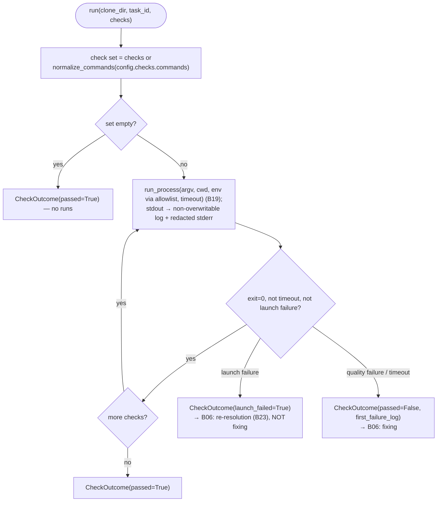

# B24 — Check Execution (testing stage)

## Purpose

Runs the allowed check commands (quality gate) for a task or subtask and reports pass/fail. This is the executor of the `testing` stage: it runs commands in order, stops on the first failure, writes logs, and distinguishes "quality failure" (the test ran and found problems) from "launch failure" (binary or module not found).

## Responsibilities

- Determine the check set: the provided `checks` profile or normalized `checks.commands` ([check_runner.py:102-105](../../../src/wastech_orchestrator/check_runner.py#L102)).
- Run each check as an **argv list without shell** via the safe runner, with an environment allowlist and a `checks.timeout_seconds` timeout ([check_runner.py:126-140](../../../src/wastech_orchestrator/check_runner.py#L126)).
- Write each check's stdout to a non-overwritable `checks/<run-id>.log`, append redacted stderr and a status footer ([check_runner.py:178-198](../../../src/wastech_orchestrator/check_runner.py#L178)).
- Stop on the first failure and return a `CheckOutcome` flagged as a launch failure where applicable ([check_runner.py:167-176](../../../src/wastech_orchestrator/check_runner.py#L167)).

## Block Boundaries

### Within block responsibility

- Sequential execution of checks, result aggregation, logging, and launch/quality distinction.

### Outside block responsibility

- **Selecting which checks to run** (profile resolution) — that is [B23](./B23-check-discovery.md); the runner receives `checks` or normalizes `config.checks.commands`.
- **State transitions, writing `check_runs`, the fixing cycle, re-resolution on launch failure** — that is [B06](./B06-orchestrator-pipeline.md) ([check_runner.py:7-9](../../../src/wastech_orchestrator/check_runner.py#L7)).
- **Launch security** — that is [B19 `run_process`](./B19-subprocess-runner.md).
- **Environment allowlist** — [B25](./B25-security-policy.md); **stderr redaction** — [B21](./B21-secret-redaction.md).

## Entry Points

- `CheckRunner.run(*, clone_dir, artifacts_root, task_id, subtask=None, checks=None)` ([check_runner.py:85](../../../src/wastech_orchestrator/check_runner.py#L85)) — [B06](./B06-orchestrator-pipeline.md) `_run_checks` ([orchestrator.py:2204-2211](../../../src/wastech_orchestrator/core/orchestrator.py#L2204)).
- Constructed in `build_orchestrator` ([orchestrator.py:2624](../../../src/wastech_orchestrator/core/orchestrator.py#L2624)).
- `split_command(command)` ([check_runner.py:201](../../../src/wastech_orchestrator/check_runner.py#L201)) — public helper for `shlex.split`.

## Input Data and State

`clone_dir` (working copy), `artifacts_root`, `task_id`, optional `subtask`, optional `checks` (`ResolvedCheck` argv from profile). Config provides `checks.timeout_seconds` and `security.allowed_environment`. No state is stored.

## Main Scenario

1. Check set = `checks` (if provided) or `normalize_commands(config.checks.commands)`.
2. Build environment `build_child_env(allowed_environment)`; create `logs/<task-id>/checks/`.
3. For each check in order: argv = `check.argv`; log path = next non-overwritable slot; run `run_process(argv, cwd=clone_dir, env, timeout, stdout_path=log)` under a heartbeat.
4. Append redacted stderr and a status footer; `passed = exit_code==0 and not timed_out and not launch_failed`.
5. If a check fails — immediately return `CheckOutcome(passed=False, first_failure_log, launch_failed, first_launch_error)` (first failure stops execution).
6. All passed → `CheckOutcome(passed=True, runs=…)`.

Profile runs in order; first failure stops; launch failure is distinguished from quality failure:

## Alternative Scenarios

### No checks

Empty set → `CheckOutcome(passed=True)` with no runs ([check_runner.py:176](../../../src/wastech_orchestrator/check_runner.py#L176); confirmed by test `test_no_commands_passes`).

### Launch failure

`result.launch_error is not None` → `launch_failed=True`, `passed=False`, `launch_failed`/`first_launch_error` are set in `CheckOutcome`; [B06](./B06-orchestrator-pipeline.md) treats this as an infrastructure event (re-resolution/preflight), not a reason for fixing ([check_runner.py:142-143,167-174](../../../src/wastech_orchestrator/check_runner.py#L142)).

## Checks and Constraints

- Only argv list, no shell (launched via [B19](./B19-subprocess-runner.md)); `shlex.split` is applied at most during normalization of config strings, not in shell.
- Mandatory per-check timeout (`checks.timeout_seconds`).
- Environment — allowlist only; parent environment is not inherited.
- Log files are not overwritten (numbering `NNN.log`, with `sub-NN-` prefix for subtasks) ([check_runner.py:178-182](../../../src/wastech_orchestrator/check_runner.py#L178)).
- First failure short-circuits (subsequent checks are not run).

## Output

`CheckOutcome(passed, runs, first_failure_log, launch_failed, first_launch_error)` and a `CheckRunResult` for each check that ran. On disk — a log for each run.

## Side Effects

- Creation of the `checks/` directory and writing log files (stdout + redacted stderr + footer).
- Spawning one child process per check (via [B19](./B19-subprocess-runner.md)).
- Heartbeat log during a long-running check (via [B27](./B27-observability.md)).

## Errors and Edge Cases

- Launch failure is a **result value** (`launch_failed`), not an exception.
- Timeout — `timed_out=True` → `passed=False`.
- stderr is always redacted before being written to the log.

## Connections

### Uses

- [B19 — Subprocess Runner](./B19-subprocess-runner.md) — `run_process`.
- [B25 — Security](./B25-security-policy.md) — `build_child_env`.
- [B21 — Redaction](./B21-secret-redaction.md) — `redact_text` for stderr.
- [B20 — Artifacts](./B20-artifact-layout.md) — `task_artifact_dir`.
- [B23 — Check Discovery](./B23-check-discovery.md) — `ResolvedCheck`/`normalize_commands` (check model).
- [B27 — Observability](./B27-observability.md) — heartbeat and logging.

### Used by

- [B06 — Pipeline](./B06-orchestrator-pipeline.md) — `testing` stage (`_run_checks`).

## Position in the Overall System

This is the "quality gate" for tests/linters. Its result determines the branching in [B06](./B06-orchestrator-pipeline.md): `passed` → review; quality failure → fixing; launch failure → check re-resolution ([B23](./B23-check-discovery.md)) or terminal failure. The invariant "test errors go to fixing, not to another provider" relies on this distinction.

## Code Confirmation

- [check_runner.py:85-176](../../../src/wastech_orchestrator/check_runner.py#L85) — run loop, first failure, launch distinction.
- [check_runner.py:142-143](../../../src/wastech_orchestrator/check_runner.py#L142) — `passed` and `launch_failed` formula.
- [check_runner.py:178-198](../../../src/wastech_orchestrator/check_runner.py#L178) — non-overwritable logs, redacted stderr.
- Test: [tests/check/test_check_runner.py](../../../tests/check/test_check_runner.py) — empty set → pass, first failure stops, launch failure is flagged, argv without shell.
