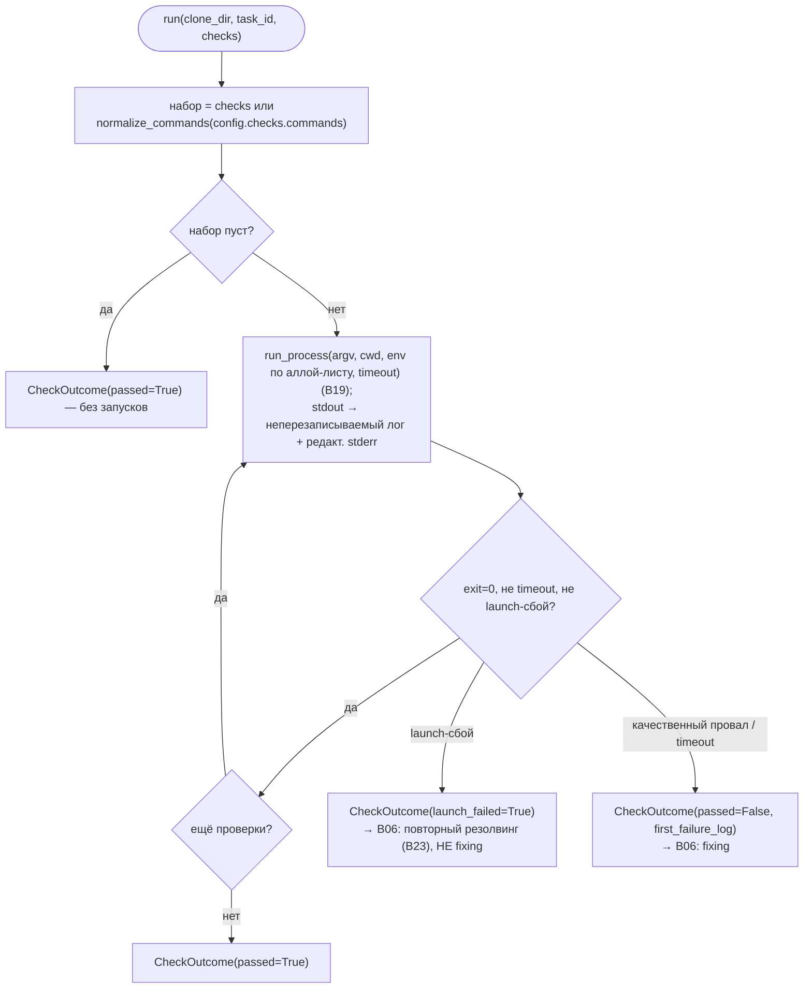

# B24 — Выполнение проверок (стадия testing)

## Назначение

Запускает разрешённые команды-проверки (quality gate) для задачи или сабтаска и сообщает pass/fail. Это исполнитель стадии `testing`: он гоняет команды по порядку, останавливается на первом провале, пишет логи и отличает «провал качества» (тест отработал и нашёл проблемы) от «сбоя запуска» (бинарь или модуль не найден).

## Ответственность

- Определить набор проверок: переданный профиль `checks` или нормализованные `checks.commands` ([check_runner.py:102-105](../../../src/wastech_orchestrator/check_runner.py#L102)).
- Запустить каждую проверку как **argv-список без shell** через безопасный раннер, с аллой-листом окружения и таймаутом `checks.timeout_seconds` ([check_runner.py:126-140](../../../src/wastech_orchestrator/check_runner.py#L126)).
- Писать stdout каждой проверки в неперезаписываемый `checks/<run-id>.log`, дописывать редактированный stderr и статус-футер ([check_runner.py:178-198](../../../src/wastech_orchestrator/check_runner.py#L178)).
- Остановиться на первом провале и вернуть `CheckOutcome` с пометкой launch-сбоя ([check_runner.py:167-176](../../../src/wastech_orchestrator/check_runner.py#L167)).

## Границы блока

### Входит в ответственность блока

- Последовательный запуск проверок, агрегирование результата, логи, различение launch/quality.

### Не входит в ответственность блока

- **Выбор того, какие проверки запускать** (резолвинг профиля) — это [B23](./B23-check-discovery.md); раннер получает `checks` или нормализует `config.checks.commands`.
- **Переходы состояний, запись `check_runs`, цикл fixing, повторный резолвинг при launch-сбое** — это [B06](./B06-orchestrator-pipeline.md) ([check_runner.py:7-9](../../../src/wastech_orchestrator/check_runner.py#L7)).
- **Безопасность запуска** — это [B19 `run_process`](./B19-subprocess-runner.md).
- **Аллой-лист окружения** — [B25](./B25-security-policy.md); **редакция stderr** — [B21](./B21-secret-redaction.md).

## Точки входа

- `CheckRunner.run(*, clone_dir, artifacts_root, task_id, subtask=None, checks=None)` ([check_runner.py:85](../../../src/wastech_orchestrator/check_runner.py#L85)) — [B06](./B06-orchestrator-pipeline.md) `_run_checks` ([orchestrator.py:2204-2211](../../../src/wastech_orchestrator/core/orchestrator.py#L2204)).
- Конструируется в `build_orchestrator` ([orchestrator.py:2624](../../../src/wastech_orchestrator/core/orchestrator.py#L2624)).
- `split_command(command)` ([check_runner.py:201](../../../src/wastech_orchestrator/check_runner.py#L201)) — публичный хелпер `shlex.split`.

## Входные данные и состояние

`clone_dir` (рабочая копия), `artifacts_root`, `task_id`, опц. `subtask`, опц. `checks` (`ResolvedCheck`-argv из профиля). Конфиг даёт `checks.timeout_seconds` и `security.allowed_environment`. Состояние не хранится.

## Основной сценарий

1. Набор проверок = `checks` (если передан) или `normalize_commands(config.checks.commands)`.
2. Строится окружение `build_child_env(allowed_environment)`; создаётся `logs/<task-id>/checks/`.
3. Для каждой проверки по порядку: argv = `check.argv`; путь лога — следующий неперезаписываемый; запуск `run_process(argv, cwd=clone_dir, env, timeout, stdout_path=log)` под heartbeat'ом.
4. Дописываются редактированный stderr и статус-футер; `passed = exit_code==0 and not timed_out and not launch_failed`.
5. Если проверка не прошла — немедленный возврат `CheckOutcome(passed=False, first_failure_log, launch_failed, first_launch_error)` (первый провал останавливает).
6. Все прошли → `CheckOutcome(passed=True, runs=…)`.

Запуск профиля по порядку; первый провал останавливает; launch-сбой отличается от качественного:

## Альтернативные сценарии

### Нет проверок

Пустой набор → `CheckOutcome(passed=True)` без запусков ([check_runner.py:176](../../../src/wastech_orchestrator/check_runner.py#L176); подтверждено тестом `test_no_commands_passes`).

### Сбой запуска (launch failure)

`result.launch_error is not None` → `launch_failed=True`, `passed=False`, в `CheckOutcome` проставляются `launch_failed`/`first_launch_error`; [B06](./B06-orchestrator-pipeline.md) трактует это как инфраструктурное событие (повторный резолвинг/префлайт), а не как повод для fixing ([check_runner.py:142-143,167-174](../../../src/wastech_orchestrator/check_runner.py#L142)).

## Проверки и ограничения

- Только argv-список, без shell (запуск через [B19](./B19-subprocess-runner.md)); `shlex.split` применяется максимум при нормализации конфиг-строк, не в shell.
- Обязательный таймаут на проверку (`checks.timeout_seconds`).
- Окружение — только аллой-лист; родительское не наследуется.
- Лог-файлы не перезаписываются (нумерация `NNN.log`, с префиксом `sub-NN-` для сабтаска) ([check_runner.py:178-182](../../../src/wastech_orchestrator/check_runner.py#L178)).
- Первый провал — короткое замыкание (последующие проверки не запускаются).

## Результат

`CheckOutcome(passed, runs, first_failure_log, launch_failed, first_launch_error)` и `CheckRunResult` на каждую запущенную проверку. На диске — лог каждого запуска.

## Побочные эффекты

- Создание каталога `checks/` и запись лог-файлов (stdout + редактированный stderr + футер).
- Порождение по одному дочернему процессу на проверку (через [B19](./B19-subprocess-runner.md)).
- Heartbeat-лог во время долгой проверки (через [B27](./B27-observability.md)).

## Ошибки и граничные случаи

- Launch-сбой — это **значение** результата (`launch_failed`), не исключение.
- Таймаут — `timed_out=True` → `passed=False`.
- stderr всегда редактируется перед записью в лог.

## Связи

### Использует

- [B19 — Запуск подпроцессов](./B19-subprocess-runner.md) — `run_process`.
- [B25 — Security](./B25-security-policy.md) — `build_child_env`.
- [B21 — Redaction](./B21-secret-redaction.md) — `redact_text` для stderr.
- [B20 — Артефакты](./B20-artifact-layout.md) — `task_artifact_dir`.
- [B23 — Обнаружение проверок](./B23-check-discovery.md) — `ResolvedCheck`/`normalize_commands` (модель проверок).
- [B27 — Наблюдаемость](./B27-observability.md) — heartbeat и логирование.

### Используется в

- [B06 — Конвейер](./B06-orchestrator-pipeline.md) — стадия `testing` (`_run_checks`).

## Место в общей системе

Это «качественный шлюз» по тестам/линтерам. Его результат определяет ветвление в [B06](./B06-orchestrator-pipeline.md): `passed` → review; качественный провал → fixing; launch-сбой → повторный резолвинг проверок ([B23](./B23-check-discovery.md)) или терминальный провал. Инвариант «ошибки тестов идут в fixing, а не на другого провайдера» опирается на это разграничение.

## Подтверждение в коде

- [check_runner.py:85-176](../../../src/wastech_orchestrator/check_runner.py#L85) — цикл запуска, первый провал, launch-различение.
- [check_runner.py:142-143](../../../src/wastech_orchestrator/check_runner.py#L142) — формула `passed` и `launch_failed`.
- [check_runner.py:178-198](../../../src/wastech_orchestrator/check_runner.py#L178) — неперезаписываемые логи, редактированный stderr.
- Тест: [tests/check/test_check_runner.py](../../../tests/check/test_check_runner.py) — пустой набор → pass, первый провал останавливает, launch-сбой помечается, argv без shell.
