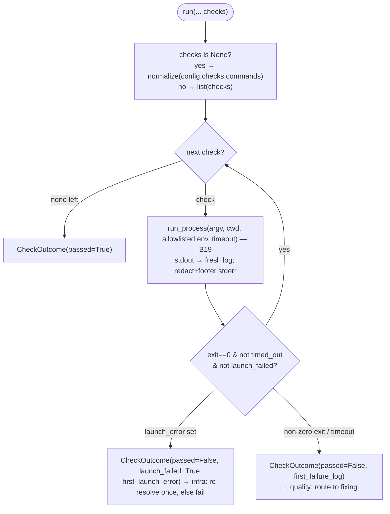

# B24 — Check Execution

> Reconstructed from code (`src/wastech_orchestrator/check_runner.py`) and tests (`tests/check/test_check_runner.py`, `tests/security/test_no_shell_interpolation.py`). The code is the only source of truth; this document was rebuilt from the implementation, not from prose or comments. Significant claims carry a `file:line` reference.

**Status:** documented · **Source modules:** `src/wastech_orchestrator/check_runner.py`

## Responsibility

`CheckRunner` is the **command-profile execution engine**: given a resolved list of quality-gate checks (each an argv list), it launches each one **in order through the safe runner** ([B19](B19-subprocess-runner.md)), stops at the **first failure**, writes a per-run log, and returns an aggregate `CheckOutcome` ([check_runner.py:91](../../../src/wastech_orchestrator/check_runner.py#L91)). It never transitions state, never touches git, and does not decide what to run — the resolved profile is supplied by the caller (the [checks](B30-flow-node-runners.md) node) and resolved by [B23](B23-check-discovery.md).

Its load-bearing distinction is **launch failure vs. quality failure**. A check whose executable could not be launched (`launch_error != None`) short-circuits with `launch_failed=True` ([check_runner.py:148](../../../src/wastech_orchestrator/check_runner.py#L148), [check_runner.py:174](../../../src/wastech_orchestrator/check_runner.py#L174)) so the node treats it as **infrastructure** (re-resolve once, then fail) — never spending a fix iteration on a problem no code change can fix. A non-zero **exit** after a successful launch is a **quality** failure that routes to fixing.

## Public surface

- `CheckRunner.run(*, clone_dir, artifacts_root, task_id, subtask=None, checks=None) -> CheckOutcome` ([check_runner.py:91](../../../src/wastech_orchestrator/check_runner.py#L91)) — run the resolved checks in order; stop at the first failure.
- `CheckRunner.run_process` (property) ([check_runner.py:85](../../../src/wastech_orchestrator/check_runner.py#L85)) — exposes the injected safe runner. **Note:** no caller reads it today (see Audit candidates).
- `CheckOutcome` ([check_runner.py:56](../../../src/wastech_orchestrator/check_runner.py#L56)) — `passed`, `runs: tuple[CheckRunResult, ...]`, `first_failure_log`, `launch_failed`, `first_launch_error`.
- `CheckRunResult` ([check_runner.py:41](../../../src/wastech_orchestrator/check_runner.py#L41)) — one check's `command`, `name`, `exit_code`, `timed_out`, `passed`, `log_path`, `launch_failed`, `launch_error`.

## Behavior

### Resolving what to run

`run` normalizes its `checks` argument into a concrete list ([check_runner.py:108](../../../src/wastech_orchestrator/check_runner.py#L108)):

- `checks=None` → fall back to the configured `checks.commands`, run through `normalize_commands` (legacy path) ([check_runner.py:111](../../../src/wastech_orchestrator/check_runner.py#L111)). `normalize_commands` skips blank legacy strings ([model.py:118](../../../src/wastech_orchestrator/checks/model.py#L118), confirmed by `test_blank_command_is_skipped`).
- an explicit, possibly **empty** tuple → run exactly those checks. An empty tuple is a **vacuous pass**: the loop runs zero times and returns `CheckOutcome(passed=True, runs=())` ([check_runner.py:182](../../../src/wastech_orchestrator/check_runner.py#L182), confirmed by `test_no_commands_passes`).

The runner consumes the canonical `ResolvedCheck` shape (`name` + argv tuple) — string→argv translation lives in [B23](B23-check-discovery.md)'s `checks.model`, never here.

### The run loop

Before the loop: the per-check timeout is read from `checks.timeout_seconds` ([check_runner.py:112](../../../src/wastech_orchestrator/check_runner.py#L112), confirmed by `test_timeout_value_passed_through`), the child env is built from the **allowlist** only ([check_runner.py:113](../../../src/wastech_orchestrator/check_runner.py#L113)), and `<artifacts_root>/logs/<task-id>/checks/` is created ([check_runner.py:114](../../../src/wastech_orchestrator/check_runner.py#L114)).

For each check ([check_runner.py:119](../../../src/wastech_orchestrator/check_runner.py#L119)):

1. `argv = list(check.argv)` — passed verbatim to the safe runner, no shell, no `shlex` at this point ([check_runner.py:120](../../../src/wastech_orchestrator/check_runner.py#L120), confirmed by `test_argv_split_no_shell` and `test_explicit_resolved_checks_override_config`).
2. A fresh, non-overwriting log path is chosen ([check_runner.py:121](../../../src/wastech_orchestrator/check_runner.py#L121)).
3. The launch runs under a heartbeat ([check_runner.py:132](../../../src/wastech_orchestrator/check_runner.py#L132)): `run_process(argv, cwd=clone_dir, env=<allowlisted>, timeout_seconds=<configured>, stdout_path=<log>)`. Only stdout is streamed to the log; stderr is captured.
4. `_append_stderr` appends the **redacted** stderr and a status footer to the log ([check_runner.py:147](../../../src/wastech_orchestrator/check_runner.py#L147)).
5. The pass formula: `passed = result.exit_code == 0 and not result.timed_out and not launch_failed`, where `launch_failed = result.launch_error is not None` ([check_runner.py:148](../../../src/wastech_orchestrator/check_runner.py#L148)).
6. A `CheckRunResult` is appended ([check_runner.py:161](../../../src/wastech_orchestrator/check_runner.py#L161)). If it did not pass, `run` returns immediately with `first_failure_log` set and `launch_failed` / `first_launch_error` mirrored from this check ([check_runner.py:173](../../../src/wastech_orchestrator/check_runner.py#L173)). The remaining checks never run (confirmed by `test_stops_at_first_failure`).

If every check passes, the loop falls through to `CheckOutcome(passed=True, runs=...)` ([check_runner.py:182](../../../src/wastech_orchestrator/check_runner.py#L182), confirmed by `test_all_commands_pass`).

### Logs

`_next_log_path` returns `<NNN>.log` (3-digit, 1-based) — or `sub-<NN>-<NNN>.log` for a subtask — sized from the count of already-present matching logs so a fix-loop re-run **never clobbers** an earlier log ([check_runner.py:184](../../../src/wastech_orchestrator/check_runner.py#L184), confirmed by `test_logs_not_overwritten_across_runs` and `test_subtask_logs_are_prefixed`). `_append_stderr` writes a `----- stderr -----` section only when redacted stderr is non-empty and a `----- status -----` footer carrying `launch_error: …` and/or `timed_out: true` when set ([check_runner.py:190](../../../src/wastech_orchestrator/check_runner.py#L190), confirmed by `test_stderr_redacted_in_log`).

### Structured logging

Each check emits a `check started` and a `check completed` log bound to `task_id` and `stage="testing"`, the latter carrying `passed`, `launch_failed`, `exit_code`, `timed_out`, and a rounded `duration_seconds` ([check_runner.py:118](../../../src/wastech_orchestrator/check_runner.py#L118), [check_runner.py:150](../../../src/wastech_orchestrator/check_runner.py#L150), confirmed by `test_check_logs_start_completion_and_duration`). The heartbeat emits `check heartbeat` while a check runs long ([check_runner.py:142](../../../src/wastech_orchestrator/check_runner.py#L142)).

## Invariants & guarantees

- **Argv, never a shell.** Checks reach `run_process` as a list with `shell=False`; the runner applies no `shlex.split` of its own (that happens once, upstream, in `normalize_commands`) ([check_runner.py:120](../../../src/wastech_orchestrator/check_runner.py#L120)).
- **Allowlisted env only.** The child gets exactly `build_child_env(security.allowed_environment)`, never the parent's full environment ([check_runner.py:113](../../../src/wastech_orchestrator/check_runner.py#L113), [B25](B25-security-policy.md)).
- **Launch failure ≠ quality failure.** A timeout is a quality failure (`launch_failed is False`) because the process did launch (confirmed by `test_timeout_is_failure`); only `launch_error != None` sets `launch_failed=True` (confirmed by `test_launch_error_is_distinct_from_quality_failure`).
- **First failure short-circuits.** No check after the first failure is launched ([check_runner.py:173](../../../src/wastech_orchestrator/check_runner.py#L173)).
- **No state, no git, no overwrite.** The runner only spawns processes and appends to fresh log files; recording `check_runs` and routing are the node's job ([check_runner.py:184](../../../src/wastech_orchestrator/check_runner.py#L184)).
- **Redaction before disk.** stderr is run through `redact_text` before any byte is written ([check_runner.py:197](../../../src/wastech_orchestrator/check_runner.py#L197), [B21](B21-secret-redaction.md)).

## Dependencies

- **Uses:** [B19](B19-subprocess-runner.md) (`run_process` — the safe argv launcher), [B23](B23-check-discovery.md) (`ResolvedCheck` / `normalize_commands` — the check model), [B25](B25-security-policy.md) (`build_child_env` — env allowlist), [B21](B21-secret-redaction.md) (`redact_text` — stderr), [B20](B20-artifact-layout.md) (`task_artifact_dir` — the `checks/` location), [B27](B27-observability.md) (`bind` logging + `run_with_heartbeat`).
- **Used by:** [B30](B30-flow-node-runners.md) — the `checks` node's `command_profile` mode calls `CheckRunner.run` ([nodes/checks.py:227](../../../src/wastech_orchestrator/core/flow/nodes/checks.py#L227)), records one `check_runs` row per command ([nodes/checks.py:234](../../../src/wastech_orchestrator/core/flow/nodes/checks.py#L234), [B07](B07-state-machine-and-store.md)), and maps `launch_failed` to a re-resolve-once-then-`CheckLaunchError` path ([nodes/checks.py:86](../../../src/wastech_orchestrator/core/flow/nodes/checks.py#L86)). Constructed once in `build_orchestrator` ([orchestrator.py:2004](../../../src/wastech_orchestrator/core/orchestrator.py#L2004)). The `citation` / `dependency_scan` checkers ([B32](B32-flow-checkers.md)) are separate node methods, not this runner.

## Audit candidates

See [the audit](../../backlog/2026-06-21-audit.md).

- `check_runner.py:1-16` — the module docstring still **leads with** "Runs the configured `checks.commands`" though the primary path runs the canonical `checks.model.ResolvedCheck` argv lists from the resolver; the `checks.commands` normalization is only the legacy `checks=None` fallback. A lead-with-the-resolver reorder is the optional cleanup (Phase 6 #31).

## Tests

- `tests/check/test_check_runner.py` — empty/blank command set → vacuous pass; all-pass aggregation and per-check logs; argv split without shell; explicit `ResolvedCheck` overriding config; first-failure short-circuit; timeout is a quality (not launch) failure; launch error is distinct and flagged on both `CheckOutcome` and the `CheckRunResult`; timeout value passthrough; logs never overwritten across re-runs; subtask log prefixing; stderr redaction in the log; structured `check started` / `check completed` + duration logging.
- `tests/security/test_no_shell_interpolation.py` — `normalize_check_command` splits a command into argv tokens and does not expand shell substitutions, anchoring the no-shell guarantee on the real resolver path.
