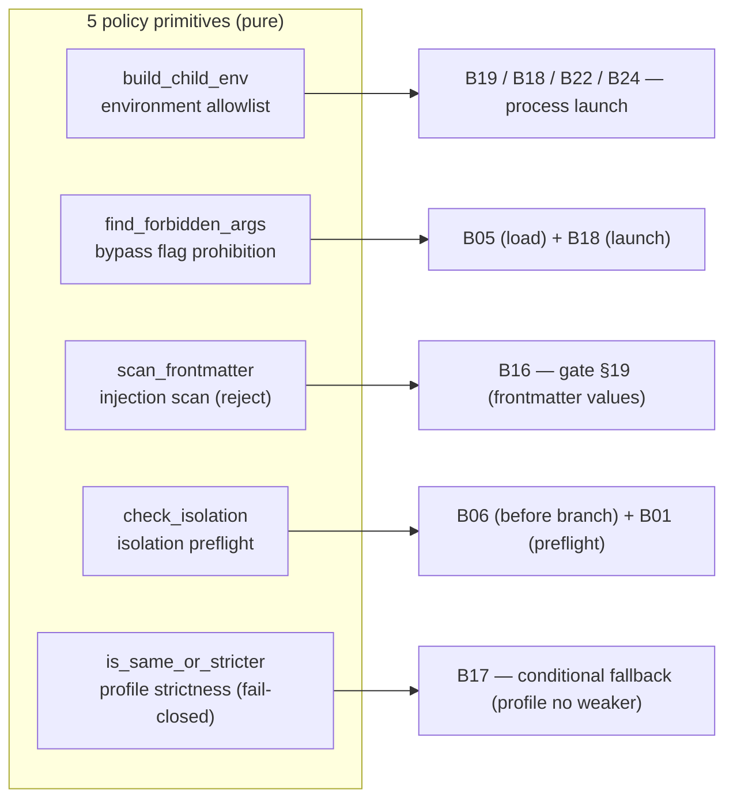

# B25 — Security Policy Enforcement

## Purpose

A set of small, pure primitives that together implement the system invariant "the security policy cannot be weakened through a task or `extra_args`". Each primitive covers its own aspect: environment allowlist, forbidden bypass flags, injection scanning in frontmatter, provider isolation preflight, and permission profile strictness ranking for conditional fallback.

## Responsibilities

- **Environment:** build the child process environment from allowed keys only ([env.py:18-30](../../../src/wastech_orchestrator/security/env.py#L18)).
- **Forbidden flags:** detect flags that disable sandbox/approvals ([forbidden_args.py:38-58](../../../src/wastech_orchestrator/security/forbidden_args.py#L38)).
- **Injections:** scan frontmatter values for argv-like tokens ([injection.py:49-80](../../../src/wastech_orchestrator/security/injection.py#L49)).
- **Isolation:** offline-verify that every "potentially launchable" provider can enable the required isolation ([isolation.py:31-61](../../../src/wastech_orchestrator/security/isolation.py#L31)).
- **Profile strictness:** determine that the `candidate` profile is no weaker than `reference` ([profiles.py:23-34](../../../src/wastech_orchestrator/security/profiles.py#L23)).

## Block Boundaries

### Within scope

- The five pure rules and lists described above (what is forbidden, what is allowed in the environment, what is stricter).

### Out of scope

- **Launching processes** with the built environment — that is [B19](./B19-subprocess-runner.md) (receives a ready `env`).
- **Provider-specific isolation rules** (Codex sandbox, Claude permission-mode) live in the adapters ([B18 `isolation_reasons`](./B18-agent-providers.md)); `isolation.py` only dispatches by `ProviderId` and formats the reasons ([isolation.py:22-28](../../../src/wastech_orchestrator/security/isolation.py#L22)).
- **The fallback decision** is made by [B17 Router](./B17-agent-router-and-fallback.md); `profiles.py` only compares strictness.
- **Where to call** the checks and what to do on failure — that is up to the calling blocks (B05, B06, B16, B18, B22, B24).

## Entry Points

- `build_child_env(allowed_keys, parent_env=None)` ([env.py:18](../../../src/wastech_orchestrator/security/env.py#L18)).
- `find_forbidden_args(args)` ([forbidden_args.py:38](../../../src/wastech_orchestrator/security/forbidden_args.py#L38)).
- `scan_frontmatter(frontmatter)` / `scan_value(key, value)` ([injection.py:49,58](../../../src/wastech_orchestrator/security/injection.py#L49)).
- `check_isolation(config)` ([isolation.py:31](../../../src/wastech_orchestrator/security/isolation.py#L31)).
- `is_same_or_stricter(candidate, reference)` ([profiles.py:23](../../../src/wastech_orchestrator/security/profiles.py#L23)).

## Inputs and State

Allowlist of keys + parent environment; list of argv tokens; frontmatter dictionary; configuration object; two profile names. No state — everything is pure.

## Main Scenario (by rule)

- **Environment:** returns a fresh dict containing only the `allowed_keys` that exist in the parent, in allowlist order; a missing key is skipped (never empty) ([env.py:29-30](../../../src/wastech_orchestrator/security/env.py#L29)).
- **Forbidden flags:** for each token the part before `=` is taken; reject if it starts with `--dangerously` or is in `{--yolo, --ignore-rules}`; for `--sandbox`/`-s` — reject if the value is `danger-full-access` ([forbidden_args.py:44-54](../../../src/wastech_orchestrator/security/forbidden_args.py#L44)).
- **Injections:** a value is rejected if, after stripping, it starts with `-`, or contains any of `; \\ | $( \n \r`, or matches a forbidden flag pattern; nested dicts/lists are processed recursively with key-paths of the form `agents.review`/`contacts[0]` ([injection.py:60-80](../../../src/wastech_orchestrator/security/injection.py#L60)).
- **Isolation:** for each "in-use" provider (`agents.allowed` ∪ all primary/fallback routes) the adapter's `isolation_reasons` is called; reasons are collected with an id prefix; `[]` = all ok ([isolation.py:37-61](../../../src/wastech_orchestrator/security/isolation.py#L37)).
- **Strictness:** `read-only` (rank 0) is stricter than `workspace-write` (rank 1); `candidate` is ok if its rank ≤ the rank of `reference` ([profiles.py:17-34](../../../src/wastech_orchestrator/security/profiles.py#L17)).

Five independent pure primitives — each covers its own aspect of the invariant and is applied at its own points (defense-in-depth):

## Checks and Constraints

- **Fail-closed everywhere:** unknown profile in `is_same_or_stricter` → `False` (policy must not be weakened for fallback) ([profiles.py:32-33](../../../src/wastech_orchestrator/security/profiles.py#L32)).
- The `--dangerously*` prefix catches any future bypass flags.
- Injection scan is "reject, not sanitize"; applied only to **frontmatter values**, not to the task body ([injection.py:7-8,15-16](../../../src/wastech_orchestrator/security/injection.py#L7)).
- Isolation checks only "in-use" providers so that an extra provider block does not break the launch ([isolation.py:47-61](../../../src/wastech_orchestrator/security/isolation.py#L47)).

## Output

- `build_child_env` → new environment dict.
- `find_forbidden_args` → list of reasons (empty = safe).
- `scan_frontmatter` → `InjectionFinding` or `None`.
- `check_isolation` → list of reasons (empty = isolation can be enabled).
- `is_same_or_stricter` → bool.

## Side Effects

None. All functions are pure (isolation does not launch a CLI — it only queries adapters via their pure rules).

## Errors and Edge Cases

- Unknown profile / unknown provider in isolation — skip/`False` (fail-closed).
- `--sandbox` without a value at the end of argv → empty string, not rejected ([forbidden_args.py:51,57-58](../../../src/wastech_orchestrator/security/forbidden_args.py#L51)).

## Relations

### Uses

- `forbidden_args` is used inside `injection.scan_value` ([injection.py:30,66](../../../src/wastech_orchestrator/security/injection.py#L30)).
- `isolation` imports adapter `isolation_reasons` from [B18](./B18-agent-providers.md) ([isolation.py:22-23](../../../src/wastech_orchestrator/security/isolation.py#L22)).

### Used by

- [B19 — Subprocess Runner](./B19-subprocess-runner.md) — the caller builds the environment via `build_child_env`.
- [B18 — Provider Adapters](./B18-agent-providers.md) — `build_child_env`, `find_forbidden_args`, `isolation_reasons`.
- [B22](./B22-git-manager.md), [B24](./B24-check-execution.md) — `build_child_env` for git/checks.
- [B05 — Configuration](./B05-configuration.md) — `find_forbidden_args` when validating `extra_args`.
- [B16 — Validation Gate](./B16-task-parsing-and-validation-gate.md) — `scan_frontmatter`.
- [B17 — Router](./B17-agent-router-and-fallback.md) — `is_same_or_stricter` for conditional fallback.
- [B06 — Pipeline](./B06-orchestrator-pipeline.md) and [B01 — CLI](./B01-cli-and-operator-commands.md) — `check_isolation` (preflight before branch / in `preflight`).

## Role in the Overall System

Implements the invariant "the security policy cannot be weakened" at multiple points (defense-in-depth): forbidden flags are checked both at configuration load time and in adapters at launch time; the environment is restricted on every process launch; isolation is verified before branch creation. Together with [B21](./B21-secret-redaction.md) it forms the orchestrator's security layer.

## Code Confirmation

- [security/env.py:18-30](../../../src/wastech_orchestrator/security/env.py#L18) — environment allowlist.
- [security/forbidden_args.py:21-58](../../../src/wastech_orchestrator/security/forbidden_args.py#L21) — lists and `find_forbidden_args`.
- [security/injection.py:34-80](../../../src/wastech_orchestrator/security/injection.py#L34) — frontmatter scan.
- [security/isolation.py:25-61](../../../src/wastech_orchestrator/security/isolation.py#L25) — isolation dispatcher + `_providers_in_use`.
- [security/profiles.py:17-34](../../../src/wastech_orchestrator/security/profiles.py#L17) — strictness ranking (fail-closed).
- Tests: [test_env.py](../../../tests/security/test_env.py), [test_forbidden_args.py](../../../tests/security/test_forbidden_args.py), [test_injection.py](../../../tests/security/test_injection.py), [test_isolation.py](../../../tests/security/test_isolation.py), [test_no_shell_interpolation.py](../../../tests/security/test_no_shell_interpolation.py), [test_denied_reads.py](../../../tests/security/test_denied_reads.py).
