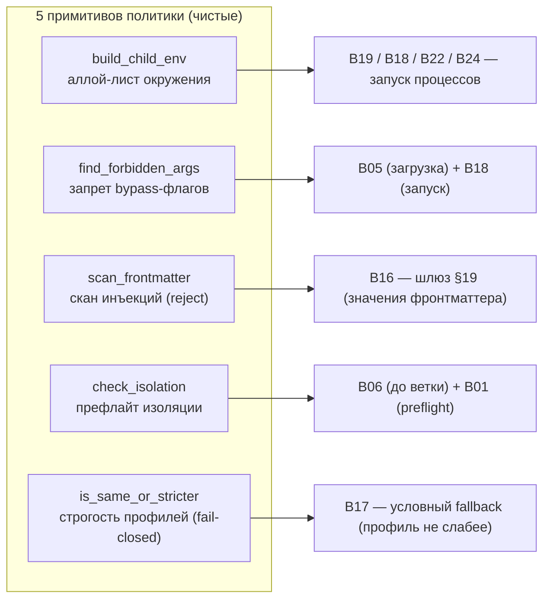

# B25 — Принуждение политики безопасности

## Назначение

Набор небольших чистых примитивов, которые совместно реализуют системный инвариант «политику безопасности нельзя ослабить через задачу или `extra_args`». Каждый примитив закрывает свою грань: аллой-лист окружения, запрет bypass-флагов, скан инъекций во фронтматтере, префлайт изоляции провайдеров и ранжирование строгости профилей разрешений для условного fallback.

## Ответственность

- **Окружение:** построить окружение дочернего процесса только из разрешённых ключей ([env.py:18-30](../../../src/wastech_orchestrator/security/env.py#L18)).
- **Запрещённые флаги:** обнаружить флаги, отключающие sandbox/approvals ([forbidden_args.py:38-58](../../../src/wastech_orchestrator/security/forbidden_args.py#L38)).
- **Инъекции:** просканировать значения фронтматтера на argv-подобные токены ([injection.py:49-80](../../../src/wastech_orchestrator/security/injection.py#L49)).
- **Изоляция:** офлайн-проверить, что каждый «могущий запуститься» провайдер может включить требуемую изоляцию ([isolation.py:31-61](../../../src/wastech_orchestrator/security/isolation.py#L31)).
- **Строгость профилей:** определить, что профиль `candidate` не слабее `reference` ([profiles.py:23-34](../../../src/wastech_orchestrator/security/profiles.py#L23)).

## Границы блока

### Входит в ответственность блока

- Перечисленные пять чистых правил и списков (что запрещено, что разрешено в окружении, что строже).

### Не входит в ответственность блока

- **Запуск процессов** с построенным окружением — это [B19](./B19-subprocess-runner.md) (получает готовый `env`).
- **Конкретные правила изоляции провайдера** (sandbox Codex, permission-mode Claude) живут в адаптерах ([B18 `isolation_reasons`](./B18-agent-providers.md)); `isolation.py` лишь диспетчеризует по `ProviderId` и оформляет причины ([isolation.py:22-28](../../../src/wastech_orchestrator/security/isolation.py#L22)).
- **Решение о fallback** принимает [B17 Router](./B17-agent-router-and-fallback.md); `profiles.py` только сравнивает строгость.
- **Где вызывать** проверки и что делать при провале — это вызывающие блоки (B05, B06, B16, B18, B22, B24).

## Точки входа

- `build_child_env(allowed_keys, parent_env=None)` ([env.py:18](../../../src/wastech_orchestrator/security/env.py#L18)).
- `find_forbidden_args(args)` ([forbidden_args.py:38](../../../src/wastech_orchestrator/security/forbidden_args.py#L38)).
- `scan_frontmatter(frontmatter)` / `scan_value(key, value)` ([injection.py:49,58](../../../src/wastech_orchestrator/security/injection.py#L49)).
- `check_isolation(config)` ([isolation.py:31](../../../src/wastech_orchestrator/security/isolation.py#L31)).
- `is_same_or_stricter(candidate, reference)` ([profiles.py:23](../../../src/wastech_orchestrator/security/profiles.py#L23)).

## Входные данные и состояние

Аллой-лист ключей + родительское окружение; список argv-токенов; словарь фронтматтера; объект конфигурации; два имени профилей. Состояния нет — всё чисто.

## Основной сценарий (по правилам)

- **Окружение:** возвращается свежий dict только из ключей `allowed_keys`, которые есть в родителе, в порядке аллой-листа; отсутствующий ключ пропускается (никогда не пустой) ([env.py:29-30](../../../src/wastech_orchestrator/security/env.py#L29)).
- **Запрещённые флаги:** для каждого токена берётся часть до `=`; reject, если начинается с `--dangerously` или входит в `{--yolo, --ignore-rules}`; для `--sandbox`/`-s` — reject, если значение `danger-full-access` ([forbidden_args.py:44-54](../../../src/wastech_orchestrator/security/forbidden_args.py#L44)).
- **Инъекции:** значение reject, если после strip начинается с `-`, либо содержит один из `; \` | $( \n \r`, либо совпадает по форме с запрещённым флагом; вложенные словари/списки — рекурсивно, ключ-путь вида `agents.review`/`contacts[0]` ([injection.py:60-80](../../../src/wastech_orchestrator/security/injection.py#L60)).
- **Изоляция:** для каждого провайдера «в работе» (`agents.allowed` ∪ все primary/fallback маршрутов) вызывается адаптерный `isolation_reasons`; собираются причины с префиксом id; `[]` = всё ок ([isolation.py:37-61](../../../src/wastech_orchestrator/security/isolation.py#L37)).
- **Строгость:** `read-only` (ранг 0) строже `workspace-write` (ранг 1); `candidate` ок, если его ранг ≤ ранга `reference` ([profiles.py:17-34](../../../src/wastech_orchestrator/security/profiles.py#L17)).

Пять независимых чистых примитивов — каждый закрывает свою грань инварианта и применяется в своих точках (defense-in-depth):

## Проверки и ограничения

- **Fail-closed везде:** неизвестный профиль в `is_same_or_stricter` → `False` (нельзя ослаблять политику ради fallback) ([profiles.py:32-33](../../../src/wastech_orchestrator/security/profiles.py#L32)).
- `--dangerously*`-префикс ловит любые будущие bypass-флаги.
- Скан инъекций — «reject, не санитизировать»; применяется только к **значениям фронтматтера**, не к телу задачи ([injection.py:7-8,15-16](../../../src/wastech_orchestrator/security/injection.py#L7)).
- В изоляции проверяются только провайдеры «в работе», чтобы лишний блок провайдера не ломал запуск ([isolation.py:47-61](../../../src/wastech_orchestrator/security/isolation.py#L47)).

## Результат

- `build_child_env` → новый dict окружения.
- `find_forbidden_args` → список причин (пусто = безопасно).
- `scan_frontmatter` → `InjectionFinding` или `None`.
- `check_isolation` → список причин (пусто = можно включить изоляцию).
- `is_same_or_stricter` → bool.

## Побочные эффекты

Нет. Все функции чистые (изоляция не запускает CLI — она только спрашивает адаптеры по их чистым правилам).

## Ошибки и граничные случаи

- Неизвестный профиль / неизвестный провайдер в изоляции — пропуск/`False` (fail-closed).
- `--sandbox` без значения в конце argv → пустая строка, не reject ([forbidden_args.py:51,57-58](../../../src/wastech_orchestrator/security/forbidden_args.py#L51)).

## Связи

### Использует

- `forbidden_args` используется внутри `injection.scan_value` ([injection.py:30,66](../../../src/wastech_orchestrator/security/injection.py#L30)).
- `isolation` импортирует адаптерные `isolation_reasons` из [B18](./B18-agent-providers.md) ([isolation.py:22-23](../../../src/wastech_orchestrator/security/isolation.py#L22)).

### Используется в

- [B19 — Запуск подпроцессов](./B19-subprocess-runner.md) — окружение строит вызывающая сторона через `build_child_env`.
- [B18 — Адаптеры провайдеров](./B18-agent-providers.md) — `build_child_env`, `find_forbidden_args`, `isolation_reasons`.
- [B22](./B22-git-manager.md), [B24](./B24-check-execution.md) — `build_child_env` для git/проверок.
- [B05 — Конфигурация](./B05-configuration.md) — `find_forbidden_args` при валидации `extra_args`.
- [B16 — Шлюз валидации](./B16-task-parsing-and-validation-gate.md) — `scan_frontmatter`.
- [B17 — Router](./B17-agent-router-and-fallback.md) — `is_same_or_stricter` для условного fallback.
- [B06 — Конвейер](./B06-orchestrator-pipeline.md) и [B01 — CLI](./B01-cli-and-operator-commands.md) — `check_isolation` (префлайт перед веткой / в `preflight`).

## Место в общей системе

Реализует инвариант «политику безопасности нельзя ослабить» в нескольких точках (defense-in-depth): запрещённые флаги проверяются и при загрузке конфигурации, и в адаптерах в момент запуска; окружение ограничивается на каждом запуске процесса; изоляция проверяется до создания ветки. Совместно с [B21](./B21-secret-redaction.md) образует слой безопасности оркестратора.

## Подтверждение в коде

- [security/env.py:18-30](../../../src/wastech_orchestrator/security/env.py#L18) — аллой-лист окружения.
- [security/forbidden_args.py:21-58](../../../src/wastech_orchestrator/security/forbidden_args.py#L21) — списки и `find_forbidden_args`.
- [security/injection.py:34-80](../../../src/wastech_orchestrator/security/injection.py#L34) — скан фронтматтера.
- [security/isolation.py:25-61](../../../src/wastech_orchestrator/security/isolation.py#L25) — диспетчер изоляции + `_providers_in_use`.
- [security/profiles.py:17-34](../../../src/wastech_orchestrator/security/profiles.py#L17) — ранжирование строгости (fail-closed).
- Тесты: [test_env.py](../../../tests/security/test_env.py), [test_forbidden_args.py](../../../tests/security/test_forbidden_args.py), [test_injection.py](../../../tests/security/test_injection.py), [test_isolation.py](../../../tests/security/test_isolation.py), [test_no_shell_interpolation.py](../../../tests/security/test_no_shell_interpolation.py), [test_denied_reads.py](../../../tests/security/test_denied_reads.py).
