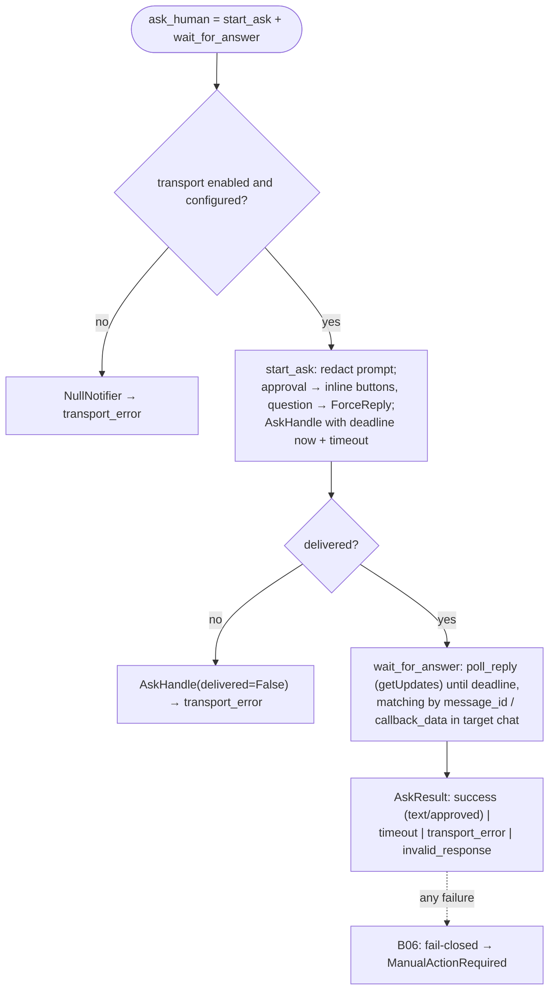

# B26 — Notifications and HITL Transport (Telegram)

## Purpose

Human-in-the-loop transport and terminal notifications via Telegram. The core is typed against the narrow `Notifier` contract, so the transport is an implementation detail: if Telegram is disabled or unconfigured, a silent `NullNotifier` is returned. Sends a correlated request, waits for a response with a timeout, and sends fire-and-forget notifications for terminal outcomes.

## Responsibilities

- Define the `Notifier` contract and its types (`AskHandle`, `AskResult`) plus the null implementation ([interface.py:54-161](../../../src/wastech_orchestrator/notify/interface.py#L54)).
- Resolve the transport from configuration and env (`build_notifier`) ([telegram.py:300-345](../../../src/wastech_orchestrator/notify/telegram.py#L300)).
- Send a request (approval buttons / ForceReply question) and poll for a response until the deadline ([telegram.py:168-264,596-718](../../../src/wastech_orchestrator/notify/telegram.py#L168)).
- Send terminal notifications best-effort and perform a Telegram preflight check ([telegram.py:128-144,348-392](../../../src/wastech_orchestrator/notify/telegram.py#L128)).
- Redact the token/chat_id from all outgoing content and from logs ([telegram.py:283-297](../../../src/wastech_orchestrator/notify/telegram.py#L283)).

## Block Boundaries

### Within this block's responsibility

- `Notifier` contract; Telegram send/polling; correlation by `interaction_id` + `message_id`; timeout; null path; preflight; credential redaction.

### Outside this block's responsibility

- **Durable HITL artifacts** (persist/resume of interactions) — that is [B12](./B12-hitl-and-typed-output.md).
- **Round-trip orchestration** (when to ask) — that is [B06](./B06-orchestrator-pipeline.md).
- **Secret storage** — the token/chat_id are read from env only and never written anywhere.
- **Redaction patterns** — [B21 `redact_text`](./B21-secret-redaction.md).

## Entry Points

- `build_notifier(cfg, env=None, *, client_factory=None)` → `Notifier` ([telegram.py:300](../../../src/wastech_orchestrator/notify/telegram.py#L300)) — in `build_orchestrator` ([orchestrator.py:2638](../../../src/wastech_orchestrator/core/orchestrator.py#L2638)) and [B01](./B01-cli-and-operator-commands.md) (`telegram-test`/`watch`).
- `check_telegram_preflight(cfg, env=None, ...)` → `(ok, line)` ([telegram.py:348](../../../src/wastech_orchestrator/notify/telegram.py#L348)) — [B01 preflight/telegram-test](./B01-cli-and-operator-commands.md).
- `Notifier.send_notification` / `start_ask` / `wait_for_answer` / `ask_human` ([interface.py:58-96](../../../src/wastech_orchestrator/notify/interface.py#L58)) — [B06](./B06-orchestrator-pipeline.md)/[B12](./B12-hitl-and-typed-output.md); `ask_human` — [B01 telegram-test](./B01-cli-and-operator-commands.md).
- `NullNotifier` ([interface.py:99](../../../src/wastech_orchestrator/notify/interface.py#L99)).

## Input Data and State

`TelegramConfig` (`enabled`, `bot_token_env`, `chat_id_env`, `ask_timeout_s`); token/chat_id values from env (by names from the configuration); `AskHandle` (including `expires_at` as a wall-clock deadline that survives restarts). Does not store state between calls (short-lived event loop per operation).

## Main Scenario (`ask_human` = start_ask + wait_for_answer)

1. `start_ask`: formats and redacts the prompt, sends it (approval → inline buttons `hitl:<id>:yes|no`; question → ForceReply), returns `AskHandle` with deadline `now + timeout` (bounded by `ask_timeout_s`).
2. `wait_for_answer`: calculates the remaining time until the wall-clock deadline; `poll_reply` polls `getUpdates` until the deadline, matching the response to `message_id`/`callback_data` in the target chat.
3. Returns `AskResult`: success (text/approved), `timeout`, `transport_error`, or `invalid_response` (free text instead of an approval button).

Round-trip `ask_human`; any transport failure is a typed value (not an exception); the core treats it fail-closed:

## Alternative Scenarios

### Transport disabled / not configured

`build_notifier` → `NullNotifier` (if `enabled=False` or empty token/chat*id); its `ask*\*`methods deterministically return`transport_error` ([interface.py:131-138](../../../src/wastech_orchestrator/notify/interface.py#L131)).

### Undelivered request

`start_ask` caught an exception → `AskHandle(delivered=False)`; `wait_for_answer` immediately returns `transport_error` ([telegram.py:195-218](../../../src/wastech_orchestrator/notify/telegram.py#L195)).

### Polling conflict (409)

A second consumer of `getUpdates` on the same bot token → `RuntimeError` (mapped to `transport_error`), and on preflight — an explicit FAIL ([telegram.py:636-644,504-520](../../../src/wastech_orchestrator/notify/telegram.py#L636)).

## Checks and Constraints

- `build_notifier`/preflight FAIL when env values are absent or empty; preflight FAIL on non-numeric chat_id, a configured webhook (polling is required), or an API error ([telegram.py:361-392](../../../src/wastech_orchestrator/notify/telegram.py#L361)).
- Terminal notifications are best-effort: exceptions are caught and logged (redacted), not re-raised ([telegram.py:266-272](../../../src/wastech_orchestrator/notify/telegram.py#L266)).
- A callback from a foreign chat is never acknowledged (§12.15) ([telegram.py:710-715](../../../src/wastech_orchestrator/notify/telegram.py#L710)).
- Outgoing content is redacted and truncated to 4096 characters ([telegram.py:296-297,430-434](../../../src/wastech_orchestrator/notify/telegram.py#L296)); transport logs (httpx/telegram) are suppressed so that URLs containing the token do not leak ([telegram.py:721-745](../../../src/wastech_orchestrator/notify/telegram.py#L721)).

## Output

`AskResult` (for HITL), a preflight `ProviderHealth`-like string, a sent notification. A transport failure is a typed value, not an exception.

## Side Effects

- Network calls to the Telegram Bot API (send/getUpdates/answerCallback).
- Logging (redacted). Reading env variables. Does not write files (HITL artifacts — [B12](./B12-hitl-and-typed-output.md)).

## Errors and Edge Cases

- All transport errors are returned as `failure` (`timeout`/`transport_error`/`invalid_response`), and the core applies fail-closed semantics ([B06](./B06-orchestrator-pipeline.md): `ManualActionRequired`).
- Update backlog too large to drain → `RuntimeError` ([telegram.py:583](../../../src/wastech_orchestrator/notify/telegram.py#L583)).

## Relations

### Uses

- `python-telegram-bot` (lazy import), [B21 — Redaction](./B21-secret-redaction.md), [B05 — Configuration](./B05-configuration.md) (`TelegramConfig`).

### Used by

- [B06 — Pipeline](./B06-orchestrator-pipeline.md) — terminal notifications and HITL round-trip.
- [B12 — HITL](./B12-hitl-and-typed-output.md) — `AskHandle`/`AskResult`/`AskKind` types.
- [B01 — CLI](./B01-cli-and-operator-commands.md) — `build_notifier`/`check_telegram_preflight`/`ask_human` (preflight, telegram-test).

## Role in the Overall System

Makes human pauses real: plan approval, dangerous diff approval, and changed check-set approval all flow through this transport. Together with [B12](./B12-hitl-and-typed-output.md) (durability), it provides HITL that survives restarts without leaking secrets into logs or the network.

## Code Evidence

- [notify/interface.py:18-161](../../../src/wastech_orchestrator/notify/interface.py#L18) — contract, `AskHandle`/`AskResult`, `NullNotifier`.
- [notify/telegram.py:105-345](../../../src/wastech_orchestrator/notify/telegram.py#L105) — `TelegramNotifier`, `build_notifier`, redaction.
- [notify/telegram.py:442-745](../../../src/wastech_orchestrator/notify/telegram.py#L442) — HTTP client: send_prompt/poll_reply, ack, 409, log suppression.
- Tests: [tests/notify/](../../../tests/notify/) (test_factory, test_ask_human, test_send, test_telegram_preflight, test_http_client) — null path, yes/no mapping, timeout, redaction, best-effort send, preflight.
