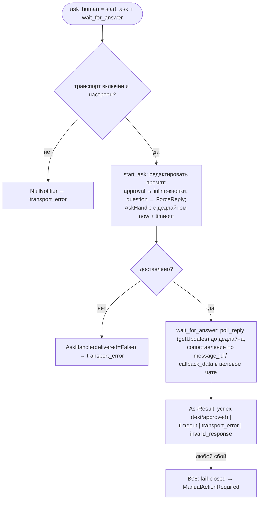

# B26 — Уведомления и транспорт HITL (Telegram)

## Назначение

Транспорт «человека в контуре» и терминальных уведомлений через Telegram. Ядро типизировано против узкого контракта `Notifier`, поэтому транспорт — деталь реализации: при выключенном или непрописанном Telegram возвращается «тихий» `NullNotifier`. Отправляет коррелированный запрос, ждёт ответ с таймаутом и шлёт fire-and-forget уведомления о терминальном исходе.

## Ответственность

- Задать контракт `Notifier` и его типы (`AskHandle`, `AskResult`) + null-реализацию ([interface.py:54-161](../../../src/wastech_orchestrator/notify/interface.py#L54)).
- Резолвить транспорт из конфигурации + env (`build_notifier`) ([telegram.py:300-345](../../../src/wastech_orchestrator/notify/telegram.py#L300)).
- Отправить запрос (кнопки approval / ForceReply question) и опросить ответ до дедлайна ([telegram.py:168-264,596-718](../../../src/wastech_orchestrator/notify/telegram.py#L168)).
- Слать терминальные уведомления best-effort и делать preflight Telegram ([telegram.py:128-144,348-392](../../../src/wastech_orchestrator/notify/telegram.py#L128)).
- Редактировать токен/chat_id во всём исходящем и в логах ([telegram.py:283-297](../../../src/wastech_orchestrator/notify/telegram.py#L283)).

## Границы блока

### Входит в ответственность блока

- Контракт `Notifier`; отправка/поллинг Telegram; корреляция по `interaction_id` + `message_id`; таймаут; null-путь; preflight; редакция учётных данных.

### Не входит в ответственность блока

- **Долговечные HITL-артефакты** (persist/resume взаимодействия) — это [B12](./B12-hitl-and-typed-output.md).
- **Оркестрация round-trip** (когда спрашивать) — это [B06](./B06-orchestrator-pipeline.md).
- **Хранение секретов** — токен/chat_id читаются только из env, никуда не пишутся.
- **Паттерны редакции** — [B21 `redact_text`](./B21-secret-redaction.md).

## Точки входа

- `build_notifier(cfg, env=None, *, client_factory=None)` → `Notifier` ([telegram.py:300](../../../src/wastech_orchestrator/notify/telegram.py#L300)) — в `build_orchestrator` ([orchestrator.py:2638](../../../src/wastech_orchestrator/core/orchestrator.py#L2638)) и [B01](./B01-cli-and-operator-commands.md) (`telegram-test`/`watch`).
- `check_telegram_preflight(cfg, env=None, ...)` → `(ok, line)` ([telegram.py:348](../../../src/wastech_orchestrator/notify/telegram.py#L348)) — [B01 preflight/telegram-test](./B01-cli-and-operator-commands.md).
- `Notifier.send_notification` / `start_ask` / `wait_for_answer` / `ask_human` ([interface.py:58-96](../../../src/wastech_orchestrator/notify/interface.py#L58)) — [B06](./B06-orchestrator-pipeline.md)/[B12](./B12-hitl-and-typed-output.md); `ask_human` — [B01 telegram-test](./B01-cli-and-operator-commands.md).
- `NullNotifier` ([interface.py:99](../../../src/wastech_orchestrator/notify/interface.py#L99)).

## Входные данные и состояние

`TelegramConfig` (`enabled`, `bot_token_env`, `chat_id_env`, `ask_timeout_s`); значения токена/chat_id из env (по именам из конфигурации); `AskHandle` (вкл. `expires_at` как wall-clock дедлайн, переживающий рестарт). Состояние между вызовами не хранит (короткоживущий event loop на операцию).

## Основной сценарий (`ask_human` = start_ask + wait_for_answer)

1. `start_ask`: форматирует и редактирует промпт, отправляет (approval → inline-кнопки `hitl:<id>:yes|no`; question → ForceReply), возвращает `AskHandle` с дедлайном `now + timeout` (ограничен `ask_timeout_s`).
2. `wait_for_answer`: считает остаток до wall-clock дедлайна, `poll_reply` опрашивает `getUpdates` до дедлайна, сопоставляя ответ с `message_id`/`callback_data` в целевом чате.
3. Возвращает `AskResult`: успех (text/approved), `timeout`, `transport_error`, либо `invalid_response` (свободный текст вместо кнопки approval).

Round-trip `ask_human`; любой транспортный сбой — типизированное значение (не исключение), ядро трактует его fail-closed:

## Альтернативные сценарии

### Транспорт выключен / не настроен

`build_notifier` → `NullNotifier` (если `enabled=False` или пустой токен/chat*id); его `ask*\*`детерминированно возвращают`transport_error` ([interface.py:131-138](../../../src/wastech_orchestrator/notify/interface.py#L131)).

### Недоставленный запрос

`start_ask` поймал исключение → `AskHandle(delivered=False)`; `wait_for_answer` сразу `transport_error` ([telegram.py:195-218](../../../src/wastech_orchestrator/notify/telegram.py#L195)).

### Конфликт поллинга (409)

Второй потребитель `getUpdates` на тот же бот-токен → `RuntimeError` (мапится в `transport_error`), а на preflight — явный FAIL ([telegram.py:636-644,504-520](../../../src/wastech_orchestrator/notify/telegram.py#L636)).

## Проверки и ограничения

- `build_notifier`/preflight FAIL при отсутствии/пустоте env; preflight FAIL при не-числовом chat_id, настроенном webhook (нужен polling), ошибке API ([telegram.py:361-392](../../../src/wastech_orchestrator/notify/telegram.py#L361)).
- Терминальное уведомление best-effort: исключения ловятся и логируются (редактированно), не пробрасываются ([telegram.py:266-272](../../../src/wastech_orchestrator/notify/telegram.py#L266)).
- Колбэк из чужого чата никогда не подтверждается (§12.15) ([telegram.py:710-715](../../../src/wastech_orchestrator/notify/telegram.py#L710)).
- Исходящее редактируется и обрезается до 4096 символов ([telegram.py:296-297,430-434](../../../src/wastech_orchestrator/notify/telegram.py#L296)); транспортные логи (httpx/telegram) приглушаются, чтобы URL с токеном не утёк ([telegram.py:721-745](../../../src/wastech_orchestrator/notify/telegram.py#L721)).

## Результат

`AskResult` (для HITL), `ProviderHealth`-подобная строка preflight, отправленное уведомление. Транспортный сбой — типизированное значение, а не исключение.

## Побочные эффекты

- Сетевые вызовы Telegram Bot API (send/getUpdates/answerCallback).
- Логирование (редактированное). Чтение env-переменных. Файлы не пишет (HITL-артефакты — [B12](./B12-hitl-and-typed-output.md)).

## Ошибки и граничные случаи

- Все транспортные ошибки возвращаются как `failure` (`timeout`/`transport_error`/`invalid_response`), а ядро применяет fail-closed семантику ([B06](./B06-orchestrator-pipeline.md): `ManualActionRequired`).
- Бэклог обновлений слишком велик для дренажа → `RuntimeError` ([telegram.py:583](../../../src/wastech_orchestrator/notify/telegram.py#L583)).

## Связи

### Использует

- `python-telegram-bot` (lazy import), [B21 — Redaction](./B21-secret-redaction.md), [B05 — Конфигурация](./B05-configuration.md) (`TelegramConfig`).

### Используется в

- [B06 — Конвейер](./B06-orchestrator-pipeline.md) — терминальные уведомления и HITL round-trip.
- [B12 — HITL](./B12-hitl-and-typed-output.md) — типы `AskHandle`/`AskResult`/`AskKind`.
- [B01 — CLI](./B01-cli-and-operator-commands.md) — `build_notifier`/`check_telegram_preflight`/`ask_human` (preflight, telegram-test).

## Место в общей системе

Делает паузы «на человека» реальными: согласование плана, опасного диффа и изменившегося набора проверок проходит через этот транспорт. Совместно с [B12](./B12-hitl-and-typed-output.md) (долговечность) обеспечивает HITL, переживающий рестарты, не давая секретам утечь в логи/сеть.

## Подтверждение в коде

- [notify/interface.py:18-161](../../../src/wastech_orchestrator/notify/interface.py#L18) — контракт, `AskHandle`/`AskResult`, `NullNotifier`.
- [notify/telegram.py:105-345](../../../src/wastech_orchestrator/notify/telegram.py#L105) — `TelegramNotifier`, `build_notifier`, редакция.
- [notify/telegram.py:442-745](../../../src/wastech_orchestrator/notify/telegram.py#L442) — HTTP-клиент: send_prompt/poll_reply, ack, 409, приглушение логов.
- Тесты: [tests/notify/](../../../tests/notify/) (test_factory, test_ask_human, test_send, test_telegram_preflight, test_http_client) — null-путь, маппинг yes/no, таймаут, редакция, best-effort send, preflight.
