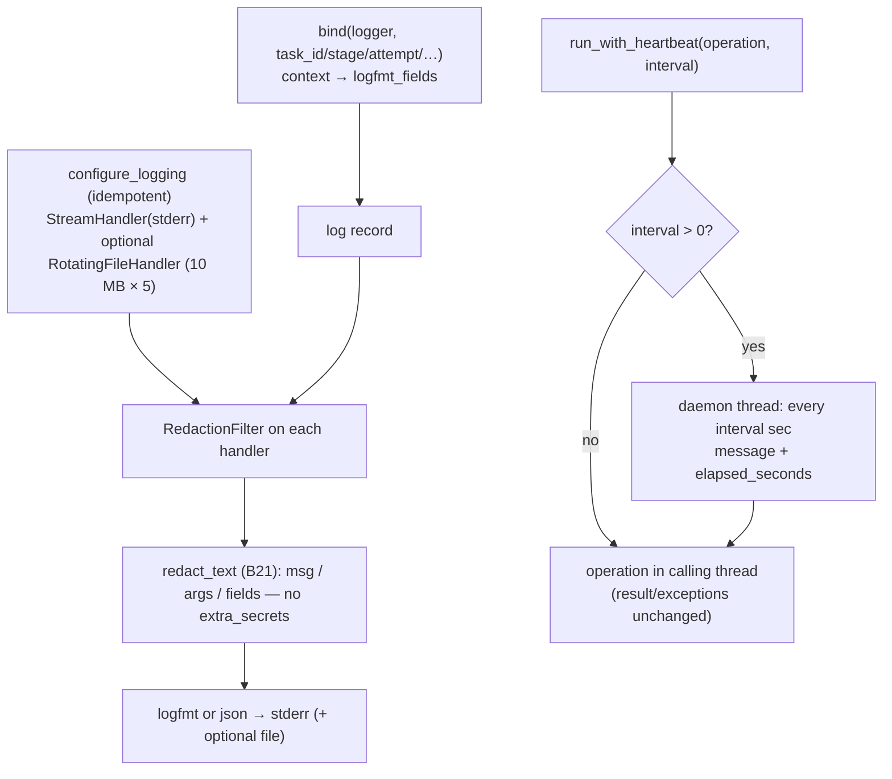

# B27 — Observability: Logging and Heartbeat

> Reconstructed from code (`observability/logging.py`, `observability/progress.py`, `core/flow/observability.py`) and tests (`tests/observability/`). The code is the only source of truth; this document was rebuilt from the implementation, not from prose or comments. Significant claims carry a `file:line` reference.

**Status:** documented · **Source modules:** `src/wastech_orchestrator/observability/logging.py`, `src/wastech_orchestrator/observability/progress.py`, `src/wastech_orchestrator/core/flow/observability.py`

## Responsibility

This block owns the **human-facing operator trace** of a run and nothing machine-authoritative. Three thin, independent concerns: (1) structured, secret-free logging over the stdlib `logging` module ([logging.py:1](../../../src/wastech_orchestrator/observability/logging.py#L1)); (2) a heartbeat helper that emits periodic progress lines while a synchronous external call blocks ([progress.py:1](../../../src/wastech_orchestrator/observability/progress.py#L1)); and (3) the per-node prompt/routing audit written to disk after each provider run ([observability.py:1](../../../src/wastech_orchestrator/core/flow/observability.py#L1)).

The authoritative machine record (SQLite, `events.jsonl`, `completed.jsonl`) lives elsewhere; these surfaces exist so a person watching a run can follow it and so a leaked prompt can be inspected after the fact. Library modules only `getLogger` and `bind`; the single handler/configuration call is made once from the CLI ([logging.py:19](../../../src/wastech_orchestrator/observability/logging.py#L19)).

## Public surface

- `configure_logging(*, level, fmt, stream, file_path, max_bytes, backup_count)` ([logging.py:42](../../../src/wastech_orchestrator/observability/logging.py#L42)) — idempotently install one terminal handler and an optional rotating-file handler, both wired through `RedactionFilter`.
- `bind(logger, **context)` ([logging.py:83](../../../src/wastech_orchestrator/observability/logging.py#L83)) — return a `LoggerAdapter` that stamps stable context (`task_id`/`stage`/`attempt`/…) onto every record.
- `RedactionFilter` ([logging.py:102](../../../src/wastech_orchestrator/observability/logging.py#L102)) — a `logging.Filter` that scrubs each record's message, args, and structured fields through `redact_text` (B21).
- `LOGGER_NAME = "wastech_orchestrator"` ([logging.py:34](../../../src/wastech_orchestrator/observability/logging.py#L34)) — the single package logger every module configures/binds onto.
- `run_with_heartbeat(operation, *, logger, message, interval_seconds, fields, monotonic)` ([progress.py:17](../../../src/wastech_orchestrator/observability/progress.py#L17)) — run a blocking callable, emitting a heartbeat every `interval_seconds` until it returns or raises.
- `record_run_observability(services, *, task_id, node_id, subtask, run_id, prompt, route, outcome, model, started_at)` ([observability.py:31](../../../src/wastech_orchestrator/core/flow/observability.py#L31)) — record provider-attempt rows and (when wired) the rendered prompt + prompt-audit JSON for one node run, keyed by the flow `node_id`.

## Behavior

### Structured logging: levels, formats, sinks

`configure_logging` builds one formatter — `_JsonFormatter` when `fmt == "json"`, else `_LogfmtFormatter` ([logging.py:59](../../../src/wastech_orchestrator/observability/logging.py#L59)) — and installs a `StreamHandler` on `sys.stderr` (or the passed `stream`) with a `RedactionFilter` attached ([logging.py:60](../../../src/wastech_orchestrator/observability/logging.py#L60)). The package logger's handlers are cleared first, the level is set, and `propagate` is turned off so records never reach the root logger ([logging.py:63](../../../src/wastech_orchestrator/observability/logging.py#L63)). A module-level `_configured` flag makes the call a no-op on re-entry (so `watch` may call it repeatedly) ([logging.py:56](../../../src/wastech_orchestrator/observability/logging.py#L56)); `test_configure_logging_is_idempotent` asserts exactly one handler after two calls ([test_logging.py:76](../../../tests/observability/test_logging.py#L76)).

When `file_path` is given, the parent directory is created and a `RotatingFileHandler` is added with `maxBytes` / `backupCount` and UTF-8 encoding, sharing the same formatter and a fresh `RedactionFilter` ([logging.py:66](../../../src/wastech_orchestrator/observability/logging.py#L66)). Defaults are a **10 MB** cap and **5 backups** ([logging.py:48](../../../src/wastech_orchestrator/observability/logging.py#L48)).

The CLI is the only caller. `_configure_runtime_logging` maps `--log-level` through `_LOG_LEVELS` and forwards `--log-format` / `--log-file` ([cli.py:527](../../../src/wastech_orchestrator/cli.py#L527)). The accepted levels are `debug`/`info`/`warning`/`error` ([cli.py:54](../../../src/wastech_orchestrator/cli.py#L54)), the default level is `info` and the default format is `logfmt` ([cli.py:99](../../../src/wastech_orchestrator/cli.py#L99)); `--log-file` self-documents the rotation contract ("10 MB, 5 backups") ([cli.py:111](../../../src/wastech_orchestrator/cli.py#L111)).

The two formatters render the same record differently:

- **logfmt** (default, greppable): `ts=… level=… <fields> msg="…"`, fields drawn from `record.logfmt_fields` ([logging.py:131](../../../src/wastech_orchestrator/observability/logging.py#L131)). `_logfmt_value` quotes a value containing whitespace, `=`, or a quote, normalizes True/False to `true`/`false`, and collapses embedded newlines/tabs ([logging.py:163](../../../src/wastech_orchestrator/observability/logging.py#L163)).
- **json**: one JSON line `{ts, level, msg, **fields}` ([logging.py:146](../../../src/wastech_orchestrator/observability/logging.py#L146)).

### Task-scoped binding

`bind` returns a `_BoundLogger` (a `LoggerAdapter`) holding the bound context ([logging.py:88](../../../src/wastech_orchestrator/observability/logging.py#L88)). Its `process` merges the bound context with any per-call `extra=` mapping and stashes the union under the reserved record attribute `logfmt_fields` (`_FIELDS_ATTR`) ([logging.py:91](../../../src/wastech_orchestrator/observability/logging.py#L91)), which both formatters read. The typical idiom — bind `task_id` once, then pass `stage`/`source` per call — is exercised by `test_logfmt_renders_context_and_quotes_spaces` ([test_logging.py:52](../../../tests/observability/test_logging.py#L52)) and round-tripped through JSON by `test_json_format_round_trips` ([test_logging.py:65](../../../tests/observability/test_logging.py#L65)).

### Redaction as a safety net

`RedactionFilter.filter` mutates the record in place: it redacts `record.msg` when it is a string ([logging.py:110](../../../src/wastech_orchestrator/observability/logging.py#L110)), redacts each string in `record.args` via `_redact_args` ([logging.py:112](../../../src/wastech_orchestrator/observability/logging.py#L112)), and rebuilds the `logfmt_fields` dict redacting every string value while leaving non-strings (counters, floats) untouched ([logging.py:113](../../../src/wastech_orchestrator/observability/logging.py#L113)). It always returns `True` (it filters content, never drops records). This is defence-in-depth: the primary guarantee is that call sites log only ids/enums/counters, and the filter is the net beneath them. `test_seeded_secret_never_reaches_the_sink` deliberately interpolates a token-shaped value through both the message arg and a field and asserts it never appears in the stream ([test_logging.py:82](../../../tests/observability/test_logging.py#L82)); `test_json_file_handler_writes_redacted_records` asserts the same for the file sink while a numeric `elapsed_seconds` survives verbatim ([test_logging.py:90](../../../tests/observability/test_logging.py#L90)).

The redaction catches **token-shaped** secrets (GitHub/OpenAI/Slack/AWS keys, Bearer tokens, JWTs) and sensitive `NAME=VALUE` assignments — these are matched structurally by `redact_text` regardless of any caller-supplied secrets ([redaction.py:53](../../../src/wastech_orchestrator/providers/redaction.py#L53)). It does **not** catch arbitrary literal denied-file / raw session-id values, because the filter calls `redact_text` with no `extra_secrets`.

### Heartbeat for long blocking operations

`run_with_heartbeat` runs `operation` in the **calling** thread and only the timer loop is threaded, so the return value and any exception propagate unchanged ([progress.py:26](../../../src/wastech_orchestrator/observability/progress.py#L26)). A non-positive `interval_seconds` short-circuits — the operation runs directly with no heartbeat ([progress.py:31](../../../src/wastech_orchestrator/observability/progress.py#L31)). Otherwise it records a `monotonic()` start, spawns a daemon thread named `wastech-heartbeat` whose `emit` loop logs `message` with the caller's `fields` plus a computed `elapsed_seconds` on each tick of `stopped.wait(interval_seconds)` ([progress.py:38](../../../src/wastech_orchestrator/observability/progress.py#L38)), and in a `finally` sets the stop event and joins the thread bounded to `min(interval_seconds, 1.0)` ([progress.py:50](../../../src/wastech_orchestrator/observability/progress.py#L50)). Callers pass only safe structured fields (never argv/prompt/env/child output). `test_heartbeat_is_emitted_until_operation_finishes` confirms the bound `fields` and an `elapsed_seconds` reach `logger.info`; `test_non_positive_interval_disables_heartbeat` confirms zero never logs ([test_progress.py:12](../../../tests/observability/test_progress.py#L12)).

The interval is a single global, threaded from the CLI flag `--heartbeat-seconds` (default **30.0**, **0 disables**, `< 0` rejected) ([cli.py:115](../../../src/wastech_orchestrator/cli.py#L115)) ([cli.py:1263](../../../src/wastech_orchestrator/cli.py#L1263)) down to every component that makes a long synchronous call:

- **Codex / Claude providers** wrap the child-process run, message `"provider heartbeat"`, fields `{timeout_seconds}` ([codex.py:412](../../../src/wastech_orchestrator/providers/codex.py#L412)) ([claude.py:499](../../../src/wastech_orchestrator/providers/claude.py#L499)).
- **Git manager** wraps each git invocation, message `"git operation heartbeat"`, fields `{operation, timeout_seconds}` ([git_manager.py:205](../../../src/wastech_orchestrator/git_manager.py#L205)).
- **Check runner** wraps each check, message `"check heartbeat"`, fields including the check name/stage ([check_runner.py:132](../../../src/wastech_orchestrator/check_runner.py#L132)).
- **HITL human-input wait** — the `HumanGate` round-trip (embedded refinement/planning HITL, the dangerous-diff approval, and a standalone `hitl` gate node) is the one long blocking op whose prompt goes only to the notifier; it now logs `"awaiting human input"` on entry, message `"awaiting human input heartbeat"` for each tick, and `"human input resolved"` on exit, with secret-free fields `{interaction_id, kind, subtask, timeout_seconds}` (and `status` = the `AskFailure` or `answered` on resolution). So a run blocked on a Telegram approval is no longer a silent gap ([human_gate.py](../../../src/wastech_orchestrator/core/flow/nodes/human_gate.py)). The interval is the same global, threaded into `NodeServices.ask_heartbeat_seconds`.

Beyond the heartbeat, the **end-of-run tail** emits plain transition log lines so the stretch between the last node and publish is never a silent window: `_engine_finalize` logs `"task finalize: starting"`, then `"task finalize: supervisor summary written"` with an `elapsed_seconds` field around the whole-task summary synthesis (context assembly + one LLM call — the part that previously looked like a hang), then `"task finalize: publish prep"` before the committed summary + task-file move ([orchestrator.py](../../../src/wastech_orchestrator/core/orchestrator.py)).

### Per-node prompt-audit observability

`record_run_observability` is the engine path's audit hook, called by the agent and evaluator node runners right after `router.run_stage` and keyed by the `node_runs` row id so audit files sort chronologically ([agent.py:223](../../../src/wastech_orchestrator/core/flow/nodes/agent.py#L223)) ([evaluator.py:75](../../../src/wastech_orchestrator/core/flow/nodes/evaluator.py#L75)). Both runners pass the node's own id as `node_id`. It does three things, with two distinct gates:

1. **Provider-attempt rows — always recorded.** `record_provider_attempts` writes one `provider_attempts` row per attempt (primary + any fallback), stamping the run's `node_run_id`, provider, attempt index, status, error class, exit code, and the attempt directory ([observability.py:75](../../../src/wastech_orchestrator/core/flow/observability.py#L75)). This is an audit surface, not human logging, and runs even in a bare unit test.
2. **Rendered prompt — gated on the artifact wiring.** When `services.register_artifact` is `None` the function returns before writing any file ([observability.py:46-48](../../../src/wastech_orchestrator/core/flow/observability.py#L46)). Otherwise `write_rendered_prompt` (now passed the run's `run_id`) writes the redacted prompt to `logs/<task-id>/stages/<node_id>/run-<run_id:06d>/rendered-prompt.md` — under the per-run dir (B20 `node_run_dir`), next to that run's provider attempts — and registers it ([observability.py:101](../../../src/wastech_orchestrator/core/flow/observability.py#L101)). Keying by `run_id` (which subsumes the old `sub-NN/` level) means a re-running node keeps every pass's prompt instead of overwriting.
3. **Prompt-audit JSON — additionally gated on `prompt_audit`.** Only when `services.prompt_audit` is true ([observability.py:58](../../../src/wastech_orchestrator/core/flow/observability.py#L58)) does `write_prompt_audit` write one step file `logs/<task-id>/prompt-audit/<run_id:06d>-<node_id>[-sub<NN>].json` ([observability.py:167](../../../src/wastech_orchestrator/core/flow/observability.py#L167)) and append the same record to `prompt-audit/timeline.jsonl`. The record carries a `"node_id"` key plus the route primary, provider used, model, `started_at`, a per-attempt `agents` list (each flagged `is_fallback` when its provider differs from `route.primary`), and the **redacted** prompt ([observability.py:155](../../../src/wastech_orchestrator/core/flow/observability.py#L155)).

The `prompt_audit` gate carried in `NodeServices.prompt_audit` ([base.py:209](../../../src/wastech_orchestrator/core/flow/nodes/base.py#L209)) is resolved per task by the orchestrator: an explicit per-task `prompt_audit: true`/`false` wins verbatim, otherwise it falls back to the global `config.prompt_audit` (default false), and there is no operator gate (B05/B06) ([orchestrator.py:1806](../../../src/wastech_orchestrator/core/orchestrator.py#L1806)). Both `write_rendered_prompt` and `write_prompt_audit` scrub the prompt through `redact_text(..., extra_secrets=services.prompt_secrets)` — here the denied-read secrets ARE passed ([observability.py:121](../../../src/wastech_orchestrator/core/flow/observability.py#L121)) ([observability.py:164](../../../src/wastech_orchestrator/core/flow/observability.py#L164)).

Keying these artifacts by `node_id` (not a `Stage`) means distinct nodes each get their own `stages/<node_id>/` directory and their own `<run_id>-<node_id>.json` step file. This fixes a latent bug: two same-identity nodes (e.g. two same-capability author/critic nodes in a research or audit flow) used to collapse onto one `Stage` value and overwrite each other's `rendered-prompt.md`. The implementation flow is unchanged in practice, because there each node id equals its old stage value ([observability.py:111-116](../../../src/wastech_orchestrator/core/flow/observability.py#L111)). The rendered prompt is additionally keyed by `run_id` (per-run under `run-<id>/`), so even the **same** node re-running in a loop no longer overwrites — see B20's per-run artifact layout. The prompt-audit step file was already `run_id`-keyed and is unchanged.

## Invariants & guarantees

- **No secret reaches a log sink.** Every handler (stream and file) carries an independent `RedactionFilter` ([logging.py:62](../../../src/wastech_orchestrator/observability/logging.py#L62)) ([logging.py:76](../../../src/wastech_orchestrator/observability/logging.py#L76)); both message and structured fields are scrubbed before any handler emits.
- **Library code never configures logging.** Only the CLI calls `configure_logging` ([cli.py:527](../../../src/wastech_orchestrator/cli.py#L527)); modules `getLogger`/`bind` only, so importing the package has no logging side effects and tests stay silent.
- **`configure_logging` is idempotent** and disables propagation so records never duplicate to the root logger ([logging.py:56](../../../src/wastech_orchestrator/observability/logging.py#L56)) ([logging.py:79](../../../src/wastech_orchestrator/observability/logging.py#L79)).
- **The heartbeat is observation-only.** It never alters control flow: the operation runs in the calling thread and the timer thread is a daemon that is always stopped and joined in `finally` ([progress.py:50](../../../src/wastech_orchestrator/observability/progress.py#L50)).
- **Provider-attempt rows are unconditional; on-disk prompt artifacts are gated** (artifact wiring for the rendered prompt, plus `prompt_audit` for the audit JSON) ([observability.py:45-48](../../../src/wastech_orchestrator/core/flow/observability.py#L45)).
- **Stored prompts are redacted with the full secret set** — token shapes plus the per-task denied-read literals — before they touch disk ([observability.py:121](../../../src/wastech_orchestrator/core/flow/observability.py#L121)).
- **Per-node audit namespacing** — the rendered-prompt directory and the prompt-audit step file are keyed by `node_id`, so distinct nodes never overwrite each other's prompt artifacts ([observability.py:116](../../../src/wastech_orchestrator/core/flow/observability.py#L116)).

## Dependencies

- **Uses:** B21 (`redact_text` — the redaction the log filter and prompt-audit rely on), B07 (`ProviderAttemptRow` / `store.record_provider_attempt`), B20 (`task_artifact_dir` — the `logs/<task-id>/` layout), B17 (`ResolvedRoute` / `StageOutcome` consumed by `record_run_observability`).
- **Used by:** B18 (Codex/Claude providers — `run_with_heartbeat`, `bind`), B22 (Git manager — heartbeat), B24 (Check execution — heartbeat), B30 (agent/evaluator runners call `record_run_observability`), B06 (orchestrator resolves the `prompt_audit` gate and wires `NodeServices`), B01/B05 (CLI configures logging and the heartbeat interval from flags/config), B19 (subprocess runner heartbeat idiom referenced in `process_control.py`).

## Tests

- `tests/observability/test_logging.py` — `RedactionFilter` scrubbing of the message and of fields (while keeping safe fields) ([test_logging.py:38](../../../tests/observability/test_logging.py#L38)) ([test_logging.py:44](../../../tests/observability/test_logging.py#L44)); logfmt context rendering + space-quoting ([test_logging.py:52](../../../tests/observability/test_logging.py#L52)); JSON round-trip ([test_logging.py:65](../../../tests/observability/test_logging.py#L65)); `configure_logging` idempotence ([test_logging.py:76](../../../tests/observability/test_logging.py#L76)); a seeded token never reaching the stream sink ([test_logging.py:82](../../../tests/observability/test_logging.py#L82)) or the rotating file sink while a numeric field survives ([test_logging.py:90](../../../tests/observability/test_logging.py#L90)). An autouse fixture isolates the process-wide logger and the `_configured` flag per test ([test_logging.py:17](../../../tests/observability/test_logging.py#L17)).
- `tests/observability/test_progress.py` — heartbeats are emitted with the bound `fields` and a non-negative `elapsed_seconds` until the operation finishes ([test_progress.py:12](../../../tests/observability/test_progress.py#L12)), and a non-positive interval disables the heartbeat entirely ([test_progress.py:36](../../../tests/observability/test_progress.py#L36)).
