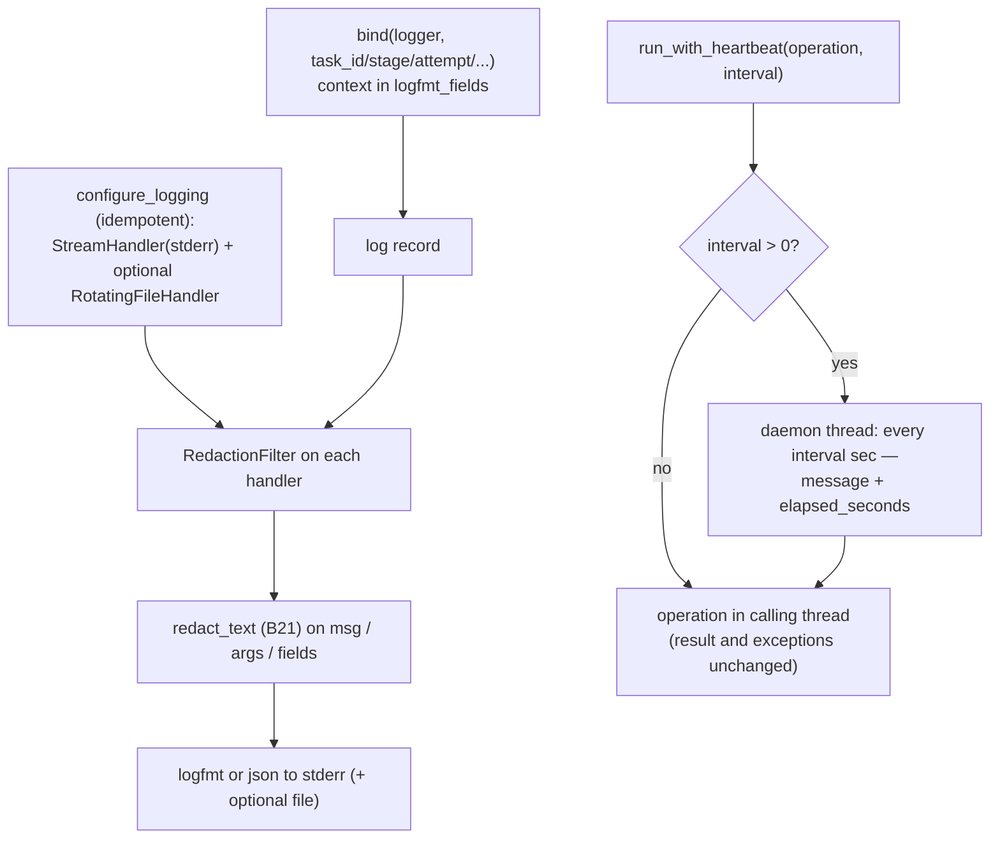

# B27 — Observability: Logging and Heartbeat

## Purpose

Structured operator logging without secrets and heartbeat messages during long blocking operations. Gives the operator a readable trace of a run (keys `task_id`/`stage`/`attempt`/`provider`), guaranteeing that a secret never reaches the log sink.

## Responsibility

- Idempotently configure handlers (terminal + optional file rotation), format (logfmt/json), and redaction filter ([logging.py:42-80](../../../src/wastech_orchestrator/observability/logging.py#L42)).
- Bind context to a logger (`bind`) ([logging.py:83-99](../../../src/wastech_orchestrator/observability/logging.py#L83)).
- Scrub every record through `redact_text` (`RedactionFilter`) ([logging.py:102-128](../../../src/wastech_orchestrator/observability/logging.py#L102)).
- Emit heartbeat from a daemon thread while an operation is running ([progress.py:17-54](../../../src/wastech_orchestrator/observability/progress.py#L17)).

## Block Boundaries

### In scope

- Logging configuration, context binding, redaction net (defense-in-depth), heartbeat.

### Out of scope

- **Redaction patterns** — [B21 `redact_text`](./B21-secret-redaction.md) (the filter only applies them).
- **What to log** — call sites (log only ids/enums/counters, not argv/prompts/env).
- **Machine audit** — that is SQLite ([B07](./B07-state-machine-and-store.md)), `events.jsonl` ([B20](./B20-artifact-layout.md)), `completed.jsonl` ([B08](./B08-ledger-and-failure-reports.md)).

## Entry Points

- `configure_logging(*, level, fmt, stream, file_path, ...)` ([logging.py:42](../../../src/wastech_orchestrator/observability/logging.py#L42)) — [B01 `_configure_runtime_logging`](./B01-cli-and-operator-commands.md).
- `bind(logger, **context)` → LoggerAdapter ([logging.py:83](../../../src/wastech_orchestrator/observability/logging.py#L83)) — used throughout ([B06](./B06-orchestrator-pipeline.md)/[B17](./B17-agent-router-and-fallback.md)/[B18](./B18-agent-providers.md)/[B22](./B22-git-manager.md)/[B24](./B24-check-execution.md)).
- `run_with_heartbeat(operation, *, logger, message, interval_seconds, fields)` ([progress.py:17](../../../src/wastech_orchestrator/observability/progress.py#L17)) — [B18](./B18-agent-providers.md)/[B22](./B22-git-manager.md)/[B24](./B24-check-execution.md).
- `RedactionFilter` ([logging.py:102](../../../src/wastech_orchestrator/observability/logging.py#L102)).

## Input Data and State

Level/format/file path for configuration; context for `bind`; operation + interval + fields for heartbeat. Global flag `_configured` makes setup idempotent.

## Main Scenario

- `configure_logging`: sets up StreamHandler(stderr) once (+ optional RotatingFileHandler 10 MB × 5), both with `RedactionFilter` and the chosen formatter; `propagate=False`; repeated calls are a no-op.
- `bind`: returns an adapter that merges context and per-call `extra` into `record.logfmt_fields`.
- `RedactionFilter.filter`: redacts `msg`, `args`, and string field values before the sink.
- `run_with_heartbeat`: when `interval>0`, starts a daemon thread that logs `message` + `elapsed_seconds` every `interval` seconds; the operation runs in the calling thread (return value/exception behavior is unchanged); the thread is stopped when the operation finishes.

Logging with the redaction net (last barrier for "no secrets") and heartbeat for long operations:

## Checks and Constraints

- Two layers of "no secrets": call sites log safe data, and `RedactionFilter` is the net on top ([logging.py:9-11](../../../src/wastech_orchestrator/observability/logging.py#L9)).
- logfmt quotes values containing space/`=`/quote/newline ([logging.py:163-174](../../../src/wastech_orchestrator/observability/logging.py#L163)).
- `interval_seconds <= 0` disables heartbeat entirely ([progress.py:31-32](../../../src/wastech_orchestrator/observability/progress.py#L31)).
- Library modules only call `getLogger`+`bind`, never configure handlers (tests stay silent, no import-time side effects).

## Output

Redacted log lines to stderr (and optionally to a rotating file); the operation result under heartbeat is unchanged.

## Side Effects

- Installation of logger handlers; writing to a log file (rotation).
- One daemon thread per `run_with_heartbeat` call (started and joined on operation completion).

## Errors and Edge Cases

- Non-string `args`/field values pass through unchanged (only strings are redacted).
- `run_with_heartbeat` does not swallow operation exceptions — they propagate as-is.

## Relationships

### Uses

- [B21 — Redaction](./B21-secret-redaction.md) — `redact_text` in `RedactionFilter`.

### Used by

- [B01 — CLI](./B01-cli-and-operator-commands.md) — `configure_logging`.
- [B06](./B06-orchestrator-pipeline.md), [B17](./B17-agent-router-and-fallback.md), [B18](./B18-agent-providers.md), [B22](./B22-git-manager.md), [B24](./B24-check-execution.md) — `bind` and `run_with_heartbeat`.

## Place in the Overall System

Operator trace for observing a run in real time, separated from machine audit. The redaction net is the last barrier of the "no secrets in logs" invariant, and heartbeat preserves progress visibility during long synchronous provider/check/git calls.

## Code References

- [observability/logging.py:42-128](../../../src/wastech_orchestrator/observability/logging.py#L42) — configuration, `bind`, `RedactionFilter`.
- [observability/logging.py:131-174](../../../src/wastech_orchestrator/observability/logging.py#L131) — logfmt/json formatters.
- [observability/progress.py:17-54](../../../src/wastech_orchestrator/observability/progress.py#L17) — `run_with_heartbeat`.
- Tests: [tests/observability/test_logging.py](../../../tests/observability/test_logging.py), [tests/observability/test_progress.py](../../../tests/observability/test_progress.py) — redaction, logfmt/json, idempotency, heartbeat and its disabling.
