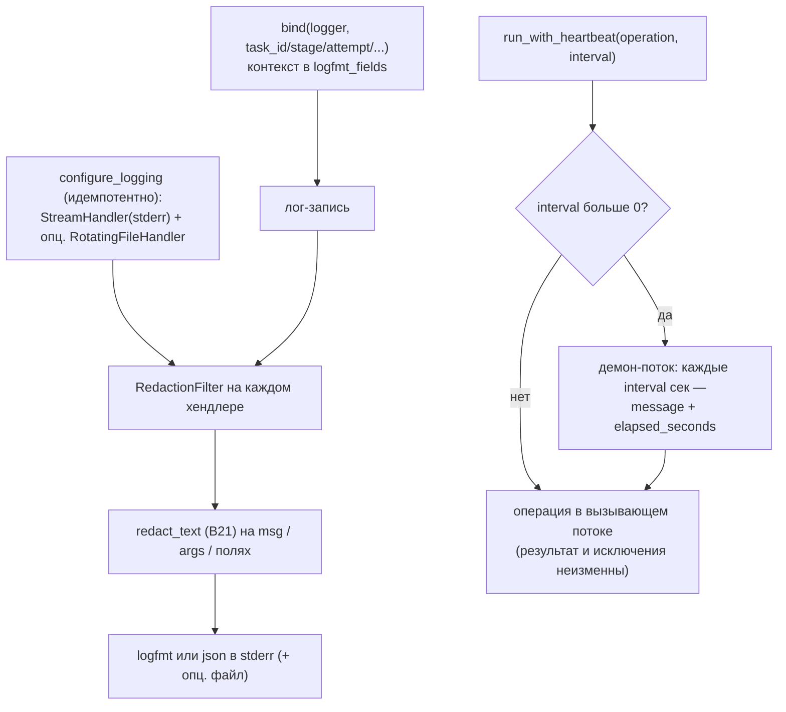

# B27 — Наблюдаемость: логирование и heartbeat

## Назначение

Структурированное операторское логирование без секретов и heartbeat-сообщения во время долгих блокирующих операций. Даёт человеку понятный трейс прогона (ключи `task_id`/`stage`/`attempt`/`provider`), гарантируя, что секрет никогда не попадёт в лог-сток.

## Ответственность

- Идемпотентно настроить хендлеры (терминал + опц. ротация файла), формат (logfmt/json) и фильтр редакции ([logging.py:42-80](../../../src/wastech_orchestrator/observability/logging.py#L42)).
- Привязывать контекст к логгеру (`bind`) ([logging.py:83-99](../../../src/wastech_orchestrator/observability/logging.py#L83)).
- Вычищать каждую запись через `redact_text` (`RedactionFilter`) ([logging.py:102-128](../../../src/wastech_orchestrator/observability/logging.py#L102)).
- Эмитить heartbeat из демон-потока, пока операция выполняется ([progress.py:17-54](../../../src/wastech_orchestrator/observability/progress.py#L17)).

## Границы блока

### Входит в ответственность блока

- Конфигурация логирования, контекстная привязка, сетка редакции (defense-in-depth), heartbeat.

### Не входит в ответственность блока

- **Паттерны редакции** — [B21 `redact_text`](./B21-secret-redaction.md) (фильтр лишь применяет его).
- **Что логировать** — места вызова (логируют только id/enum/счётчики, не argv/промпты/env).
- **Машинный аудит** — это SQLite ([B07](./B07-state-machine-and-store.md)), `events.jsonl` ([B20](./B20-artifact-layout.md)), `completed.jsonl` ([B08](./B08-ledger-and-failure-reports.md)).

## Точки входа

- `configure_logging(*, level, fmt, stream, file_path, ...)` ([logging.py:42](../../../src/wastech_orchestrator/observability/logging.py#L42)) — [B01 `_configure_runtime_logging`](./B01-cli-and-operator-commands.md).
- `bind(logger, **context)` → LoggerAdapter ([logging.py:83](../../../src/wastech_orchestrator/observability/logging.py#L83)) — повсеместно ([B06](./B06-orchestrator-pipeline.md)/[B17](./B17-agent-router-and-fallback.md)/[B18](./B18-agent-providers.md)/[B22](./B22-git-manager.md)/[B24](./B24-check-execution.md)).
- `run_with_heartbeat(operation, *, logger, message, interval_seconds, fields)` ([progress.py:17](../../../src/wastech_orchestrator/observability/progress.py#L17)) — [B18](./B18-agent-providers.md)/[B22](./B22-git-manager.md)/[B24](./B24-check-execution.md).
- `RedactionFilter` ([logging.py:102](../../../src/wastech_orchestrator/observability/logging.py#L102)).

## Входные данные и состояние

Уровень/формат/путь файла для конфигурации; контекст для `bind`; операция + интервал + поля для heartbeat. Глобальный флаг `_configured` делает настройку идемпотентной.

## Основной сценарий

- `configure_logging`: один раз ставит StreamHandler(stderr) (+ опц. RotatingFileHandler 10 МБ × 5), оба с `RedactionFilter` и выбранным форматтером; `propagate=False`; повторный вызов — no-op.
- `bind`: возвращает адаптер, складывающий контекст и per-call `extra` в `record.logfmt_fields`.
- `RedactionFilter.filter`: редактирует `msg`, `args` и строковые значения полей перед стоком.
- `run_with_heartbeat`: при `interval>0` запускает демон-поток, который каждые `interval` секунд логирует `message` + `elapsed_seconds`; операция выполняется в вызывающем потоке (поведение возврата/исключения неизменно); по завершении поток останавливается.

Логирование с сеткой редакции (последний барьер «нет секретов») и heartbeat для долгих операций:

## Проверки и ограничения

- Два рубежа «никаких секретов»: места вызова логируют безопасное, а `RedactionFilter` — сетка поверх ([logging.py:9-11](../../../src/wastech_orchestrator/observability/logging.py#L9)).
- logfmt квотирует значения с пробелом/`=`/кавычкой/переводом строки ([logging.py:163-174](../../../src/wastech_orchestrator/observability/logging.py#L163)).
- `interval_seconds <= 0` полностью отключает heartbeat ([progress.py:31-32](../../../src/wastech_orchestrator/observability/progress.py#L31)).
- Библиотечные модули только `getLogger`+`bind`, никогда не конфигурируют хендлеры (тесты молчат, нет import-time эффектов).

## Результат

Отредактированные строки лога в stderr (и опц. в ротируемый файл); неизменный результат операции под heartbeat'ом.

## Побочные эффекты

- Установка хендлеров логгера; запись в лог-файл (ротация).
- Один демон-поток на вызов `run_with_heartbeat` (стартует и присоединяется по завершении операции).

## Ошибки и граничные случаи

- Нестроковые `args`/значения полей проходят без изменений (редактируются только строки).
- `run_with_heartbeat` не глотает исключения операции — пробрасывает их как есть.

## Связи

### Использует

- [B21 — Redaction](./B21-secret-redaction.md) — `redact_text` в `RedactionFilter`.

### Используется в

- [B01 — CLI](./B01-cli-and-operator-commands.md) — `configure_logging`.
- [B06](./B06-orchestrator-pipeline.md), [B17](./B17-agent-router-and-fallback.md), [B18](./B18-agent-providers.md), [B22](./B22-git-manager.md), [B24](./B24-check-execution.md) — `bind` и `run_with_heartbeat`.

## Место в общей системе

Операторский трейс для наблюдения за прогоном в реальном времени, отделённый от машинного аудита. Сетка редакции — последний барьер инварианта «нет секретов в логах», а heartbeat сохраняет видимость прогресса во время долгих синхронных вызовов провайдера/проверок/git.

## Подтверждение в коде

- [observability/logging.py:42-128](../../../src/wastech_orchestrator/observability/logging.py#L42) — конфигурация, `bind`, `RedactionFilter`.
- [observability/logging.py:131-174](../../../src/wastech_orchestrator/observability/logging.py#L131) — форматтеры logfmt/json.
- [observability/progress.py:17-54](../../../src/wastech_orchestrator/observability/progress.py#L17) — `run_with_heartbeat`.
- Тесты: [tests/observability/test_logging.py](../../../tests/observability/test_logging.py), [tests/observability/test_progress.py](../../../tests/observability/test_progress.py) — редакция, logfmt/json, идемпотентность, heartbeat и его отключение.
