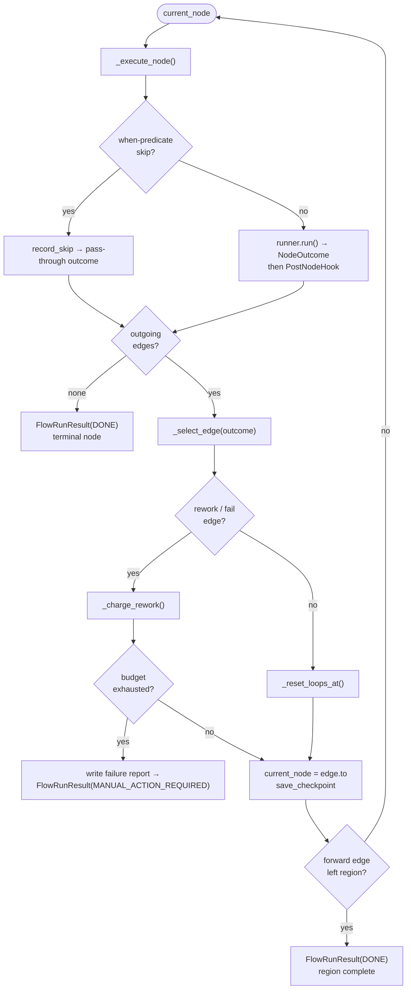

# B28 — Flow Engine and Graph Traversal

> Reconstructed from code (`src/wastech_orchestrator/core/flow/engine.py`, `engine_driver.py`, `run_state.py`) and tests (`tests/core/flow/`). The code is the only source of truth; this document was rebuilt from the implementation, not from prose or comments. Significant claims carry a `file:line` reference.

**Status:** documented · **Source modules:** `core/flow/engine.py`, `core/flow/engine_driver.py`, `core/flow/run_state.py`

## Responsibility

The flow engine is the **single execution model** for every task. It drives one execution unit (the root task, or one subtask of a decomposed task) through a validated flow graph: starting at the entry node it runs each node through its `NodeRunner`, takes the node's `NodeOutcome`, resolves the matching outgoing edge from the snapshot adjacency, charges fix budgets on rework/fail edges, and transitions. **Only the engine moves execution** — a node runner returns an outcome but never picks the next node and never changes the task status ([engine.py:4-8](../../../src/wastech_orchestrator/core/flow/engine.py#L4)). The engine docstring records that this replaced the hardcoded dispatch-on-`Status` pipeline loop the orchestrator used before the flow engine.

The engine is deliberately **domain-free**: it knows nothing about `test_fix` / `review_fix` / `review` / supervisor by name — budgets are generic counters and routing is generic outcome→edge matching ([engine.py:20-26](../../../src/wastech_orchestrator/core/flow/engine.py#L20)). All domain knowledge lives in the flow YAML ([B29](B29-flow-definition-and-validation.md)) and the node runners ([B30](B30-flow-node-runners.md)).

## Public surface

- `FlowEngine` ([engine.py:195](../../../src/wastech_orchestrator/core/flow/engine.py#L195)) — drives one unit; `run()` ([engine.py:231](../../../src/wastech_orchestrator/core/flow/engine.py#L231)) is the main loop.
- `FlowRunResult` ([engine.py:142](../../../src/wastech_orchestrator/core/flow/engine.py#L142)) — terminal outcome: `status` (`DONE` / `FAILED` / `MANUAL_ACTION_REQUIRED`), `final_node`, `stuck_loop`, `limit_name`, `failure_report_path`.
- `NodeOutcome` ([engine.py:79](../../../src/wastech_orchestrator/core/flow/engine.py#L79)) — what a node returned: `kind` (`accept` / `rework` / `pass` / `fail` / `done` / `route:<label>`), `findings`, `structured_output`, `final_message`. It **never names the next node**.
- `NodeResult` ([engine.py:96](../../../src/wastech_orchestrator/core/flow/engine.py#L96)), `NodeContext` ([engine.py:105](../../../src/wastech_orchestrator/core/flow/engine.py#L105)), `Finding` ([engine.py:59](../../../src/wastech_orchestrator/core/flow/engine.py#L59)).
- `NodeRunner` ([engine.py:116](../../../src/wastech_orchestrator/core/flow/engine.py#L116)) and `RunRecorder` ([engine.py:123](../../../src/wastech_orchestrator/core/flow/engine.py#L123)) protocols — the seams to the node layer ([B30](B30-flow-node-runners.md)) and the persistence layer ([B07](B07-state-machine-and-store.md), via `StateStoreRunRecorder` in `recorder.py`).
- `FactResolver` ([engine.py:52](../../../src/wastech_orchestrator/core/flow/engine.py#L52)) and `PostNodeHook` ([engine.py:175](../../../src/wastech_orchestrator/core/flow/engine.py#L175)) — injected callbacks (the orchestrator wires the real fact resolver and the post-node hook that persists `output_artifact` slots and lets the supervisor observe each step).
- `entry_node_id(snapshot)` ([engine.py:178](../../../src/wastech_orchestrator/core/flow/engine.py#L178)) — the single entry node (zero incoming edges); exposed so the driver can seed the first checkpoint before the entry node runs.
- `drive_flow(...)` ([engine_driver.py:105](../../../src/wastech_orchestrator/core/flow/engine_driver.py#L105)) — builds the per-kind runner registry (`build_node_runners`, [engine_driver.py:94](../../../src/wastech_orchestrator/core/flow/engine_driver.py#L94)) and runs one unit; **the** driver used by `run_task`/`resume`.
- `partition_decomposition(snapshot)` ([engine_driver.py:58](../../../src/wastech_orchestrator/core/flow/engine_driver.py#L58)) — splits a decomposed flow into `pre` / `region` / `post` phases (`DecompositionRegions`, [engine_driver.py:42](../../../src/wastech_orchestrator/core/flow/engine_driver.py#L42)).
- `FlowRunState` ([run_state.py:30](../../../src/wastech_orchestrator/core/flow/run_state.py#L30)) — the mutable per-run checkpoint.

## Behavior

### The traversal loop

`FlowEngine.run()` ([engine.py:231](../../../src/wastech_orchestrator/core/flow/engine.py#L231)) loops: a fresh run starts at the entry node; a resumed run (a hydrated `run_state` whose `current_node` is set) continues from there. For each node:

- A node with **no outgoing edge** is terminal → the run ends `DONE` ([engine.py:247-250](../../../src/wastech_orchestrator/core/flow/engine.py#L247)).
- The checkpoint is saved after **every** transition ([engine.py:275](../../../src/wastech_orchestrator/core/flow/engine.py#L275)), so a crash resumes at `current_node` and `publish_operations` deduplicates side effects.

### Node execution and deterministic skip

`_execute_node` ([engine.py:283](../../../src/wastech_orchestrator/core/flow/engine.py#L283)) first checks the node's `when` predicate via the injected `FactResolver`: a node is skipped when `facts(when.fact) != when.equals` ([engine.py:306-310](../../../src/wastech_orchestrator/core/flow/engine.py#L306)). A skipped node yields a **pass-through** outcome so the engine takes the forward edge — `accept` for an evaluator, `pass` for a checks node, `done` otherwise ([engine.py:318-325](../../../src/wastech_orchestrator/core/flow/engine.py#L318)). This is how a per-task `stages.<stage>.enabled: false` toggle (resolved to a `config.*_enabled` fact) removes a node from a run without changing the graph. After an executed (non-skipped) node, the `PostNodeHook` runs with `(node, outcome, node_run_id)` — only for executed nodes, never on a skip ([engine.py:299-303](../../../src/wastech_orchestrator/core/flow/engine.py#L299)).

### Edge resolution

`_select_edge` ([engine.py:332](../../../src/wastech_orchestrator/core/flow/engine.py#L332)) matches the outcome `kind` against the declared outgoing edges. `route:<label>` matches an edge with that exact `route:*` outcome; `done` falls back to the single unconditional (`outcome is None`) edge. A mismatch raises `EngineInternalError` ([engine.py:55](../../../src/wastech_orchestrator/core/flow/engine.py#L55)) — a runtime assertion against a buggy runner, because the fatal validator ([B29](B29-flow-definition-and-validation.md)) already rejects malformed graphs at load.

### Bounded termination and fix budgets

Every `rework`/`fail` edge is charged by `_charge_rework` ([engine.py:355](../../../src/wastech_orchestrator/core/flow/engine.py#L355)) against three counters, all stored in the single `FlowRunState.loop_counters` dict:

1. the **single global** counter `global_fix_iterations`, incremented on every rework/fail edge through `loop_control.record_rework` ([engine.py:367](../../../src/wastech_orchestrator/core/flow/engine.py#L367), [B09](B09-fix-loop-control.md)) — the one accounting path so a rework is never double-counted;
2. a **named loop** counter (`edge.loop`, e.g. `test_fix`) using increment-then-compare `>=` semantics ([engine.py:368-371](../../../src/wastech_orchestrator/core/flow/engine.py#L368));
3. an **inline budget** edge (`edge.budget: N`) keyed by the synthetic `edge_key` ([engine.py:165](../../../src/wastech_orchestrator/core/flow/engine.py#L165), [engine.py:372-376](../../../src/wastech_orchestrator/core/flow/engine.py#L372)) with `allow N` semantics.

When a limit is reached the edge is **not** taken: the engine writes a failure report and ends the run at `MANUAL_ACTION_REQUIRED` ([engine.py:254-270](../../../src/wastech_orchestrator/core/flow/engine.py#L254)). Each cap is `min(flow_budget, config_cap)` — the flow `budgets` parameterize the limit and `agents.max_fix_cycles` / `agents.max_total_fix_iterations` clamp it as the unlosable backstop ([engine.py:395-400](../../../src/wastech_orchestrator/core/flow/engine.py#L395)). Taking a **forward** edge resets the loop/inline counters anchored at that node (`_reset_loops_at`, [engine.py:381](../../../src/wastech_orchestrator/core/flow/engine.py#L381)).

### Decomposition regions

When the engine is constructed with a `region` (a frozenset of node ids), the run is confined to that set: it ends when a **forward** edge leaves the region ([engine.py:276-279](../../../src/wastech_orchestrator/core/flow/engine.py#L276)). Rework/fail edges always point back into the region, so they never trigger the exit. `partition_decomposition` ([engine_driver.py:58](../../../src/wastech_orchestrator/core/flow/engine_driver.py#L58)) carves a decomposed flow into a `pre` prefix (entry…`proposed_by`, runs once), the `region` (`sub_flow`, runs once per subtask), and a `post` suffix (runs once after all subtasks). The orchestrator's `_run_phases` wrapper ([B06](B06-orchestrator-pipeline.md)) calls `drive_flow` once per phase. `FlowRunState.reset_for_next_subtask` ([run_state.py:69](../../../src/wastech_orchestrator/core/flow/run_state.py#L69)) drops every per-loop/inline counter between subtasks but **keeps** the global fix counter (the shared budget across the whole decomposed task).

### The run-state checkpoint

`FlowRunState` ([run_state.py:30](../../../src/wastech_orchestrator/core/flow/run_state.py#L30)) carries `flow_fingerprint`, `current_node`, `completed_nodes` (the ordered execution trace; a node re-appears each loop), and `loop_counters`. `bump`/`reset`/`counter`/`mark_completed` ([run_state.py:51-67](../../../src/wastech_orchestrator/core/flow/run_state.py#L51)) are the generic counter operations. The durable checkpoint persisted by `StateStoreRunRecorder` (`recorder.py`) is `{current_node, loop_counters, flow_fingerprint}` on the `tasks` row; `completed_nodes` is rebuilt from `node_runs` on resume (`hydrate_run_state`, see [B10](B10-recovery-and-resume.md)).

## Invariants & guarantees

- **Outcome ⊆ declared edges** ([engine.py:12-14](../../../src/wastech_orchestrator/core/flow/engine.py#L12)) — the engine never invents a transition.
- **Bounded termination** — every rework/fail edge is charged; exhausting any limit ends at `MANUAL_ACTION_REQUIRED` ([engine.py:15-18](../../../src/wastech_orchestrator/core/flow/engine.py#L15)).
- **Engine owns transitions** — node runners return outcomes only; the task status moves through the [B07](B07-state-machine-and-store.md) state machine, never inside a runner.
- **Resume-safe** — the checkpoint after every transition plus `publish_operations` idempotency means a resumed run never repeats a commit/push/PR ([engine.py:234-237](../../../src/wastech_orchestrator/core/flow/engine.py#L234)).

## Dependencies

- **Uses:** [B29](B29-flow-definition-and-validation.md) (`FlowSnapshot`, `Edge`), [B30](B30-flow-node-runners.md) (the `NodeRunner` registry), [B07](B07-state-machine-and-store.md) (`RunRecorder` → state store + checkpoint), [B09](B09-fix-loop-control.md) (`record_rework`, failure report), [B08](B08-ledger-and-failure-reports.md) (`write_failure_report`).
- **Used by:** [B06](B06-orchestrator-pipeline.md) — the orchestrator builds `NodeServices`/`NodeInputs`, resolves the snapshot via [B29](B29-flow-definition-and-validation.md), and calls `drive_flow` as the single driver.

## Audit candidates

- `partition_decomposition` resolves the region entry and post entry with `next(...)` and **no default** ([engine_driver.py:64-74](../../../src/wastech_orchestrator/core/flow/engine_driver.py#L64)); the validator checks only that decomposition references resolve, not that `proposed_by` connects into the region or that the region has a forward exit ([validator.py:251-259](../../../src/wastech_orchestrator/core/flow/validator.py#L251)), so a structurally-valid but disconnected decomposition would raise `StopIteration` instead of a clean `FlowValidationError`. See [the audit](../../backlog/2026-06-21-audit.md).

## Tests

- `tests/core/flow/` — engine traversal, budget/fix-loop scenarios (`test_record_rework_single_increment`, the P3 abstraction test that forbids domain knowledge in the engine), region/decomposition driving, resume from checkpoint.
