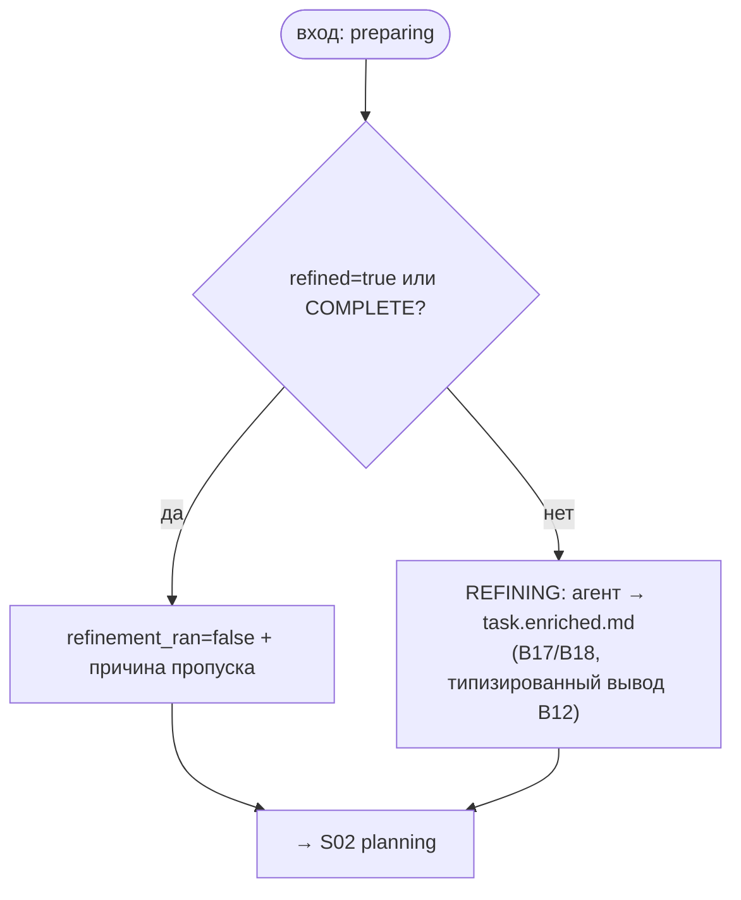

# S01 — Стадия refinement

## Назначение

Первая (необязательная) стадия конвейера: агент обогащает «сырую» задачу до состояния, пригодного для планирования. Пропускается детерминированно, если задача уже полная — тогда конвейер сразу идёт к planning.

## Ответственность

- Решить, нужна ли стадия: пропуск при `task.refined` или классификации полноты `COMPLETE` ([orchestrator.py:1049-1056](../../../../src/wastech_orchestrator/core/orchestrator.py#L1049)).
- При запуске — прогнать агента refinement, записать `task.enriched.md`, отметить `refinement_ran` ([orchestrator.py:1061-1066](../../../../src/wastech_orchestrator/core/orchestrator.py#L1061)).

## Границы шага

### Входит в ответственность шага

- Правило пропуска; запуск агентской стадии; запись обогащённого текста; переход к planning.

### Не входит в ответственность шага

- **Классификация полноты** (Фаза B §19) — [B16](../../blocks/B16-task-parsing-and-validation-gate.md).
- **Запуск агента и fallback** — [B17](../../blocks/B17-agent-router-and-fallback.md)/[B18](../../blocks/B18-agent-providers.md).
- **Валидация типизированного вывода и HITL round-trip** — [B12](../../blocks/B12-hitl-and-typed-output.md).
- **Текст промпта** — [B15](../../blocks/B15-prompt-templates.md).

## Точки входа

- `_refinement(p, completeness)` ([orchestrator.py:1049](../../../../src/wastech_orchestrator/core/orchestrator.py#L1049)) — вызывается из `_drive`.
- `_run_refinement(p)` ([orchestrator.py:1061](../../../../src/wastech_orchestrator/core/orchestrator.py#L1061)) — запуск/перезапуск персистентного чекпойнта `refining`.

## Входные данные и состояние

`NormalizedTask` (флаг `refined`) и `Completeness` из Фазы B ([B16](../../blocks/B16-task-parsing-and-validation-gate.md)). Статус: `preparing` → `refining` (или сразу `planning` при пропуске). Артефакт — `task.enriched.md`.

## Основной сценарий

1. Если `refined` истинно **или** полнота `COMPLETE` → записать `refinement_ran=False` + причину, перейти к [S02 planning](./S02-planning.md).
2. Иначе → перейти в `REFINING`, прогнать агента (`_run_typed_stage`, [B12](../../blocks/B12-hitl-and-typed-output.md)/[B17](../../blocks/B17-agent-router-and-fallback.md)), записать `task.enriched.md`, выставить `refinement_ran=True`, перейти к planning.

## Проверки и ограничения

- refinement **не** входит в `SKIPPABLE_STAGES`: опциональность управляется флагом `refined`/полнотой, а не `agents.skip_stages` ([schema.py:50-63](../../../../src/wastech_orchestrator/config/schema.py#L50)).
- Запросить человека (HITL) могут только refinement и planning ([B12](../../blocks/B12-hitl-and-typed-output.md)).

## Результат / переход

Переход к [S02 planning](./S02-planning.md). При запуске — артефакт `task.enriched.md`; в [B07](../../blocks/B07-state-machine-and-store.md) обновлены `refinement_ran`/`refinement_skip_reason`.

## Побочные эффекты

- Запись `task.enriched.md`; обновление полей задачи в [B07](../../blocks/B07-state-machine-and-store.md).
- Через делегаты: запуск агента ([B18](../../blocks/B18-agent-providers.md)), HITL-транспорт ([B26](../../blocks/B26-notifications-telegram.md)).

## Ошибки и граничные случаи

- Сбой HITL (timeout/transport/невалидный ответ) → `manual_action_required` (fail-closed, [B12](../../blocks/B12-hitl-and-typed-output.md)/[B06](../../blocks/B06-orchestrator-pipeline.md)).
- Нет терминального события агента → `INVALID_OUTPUT` ([B18](../../blocks/B18-agent-providers.md)).

## Связи

### Использует

- [B12](../../blocks/B12-hitl-and-typed-output.md), [B15](../../blocks/B15-prompt-templates.md), [B17](../../blocks/B17-agent-router-and-fallback.md)/[B18](../../blocks/B18-agent-providers.md), [B16](../../blocks/B16-task-parsing-and-validation-gate.md) (Completeness), [B07](../../blocks/B07-state-machine-and-store.md).

### Используется в

- [S02 planning](./S02-planning.md) — следующая стадия; [B06](../../blocks/B06-orchestrator-pipeline.md) — драйвер и владелец переходов.

## Место в потоке

Вход конвейера сразу после подготовки ветки. Готовит почву для планирования; на уже полной/`refined` задаче проходится мгновенно (без агента). См. [обзор потока](./index.md).

## Подтверждение в коде

- [orchestrator.py:1049-1066](../../../../src/wastech_orchestrator/core/orchestrator.py#L1049) — `_refinement` / `_run_refinement`.
- [schema.py:50-63](../../../../src/wastech_orchestrator/config/schema.py#L50) — refinement вне `SKIPPABLE_STAGES`.
- Тесты: [tests/core/test_orchestrator.py](../../../../tests/core/test_orchestrator.py) (правило пропуска), [tests/core/test_hitl.py](../../../../tests/core/test_hitl.py).
