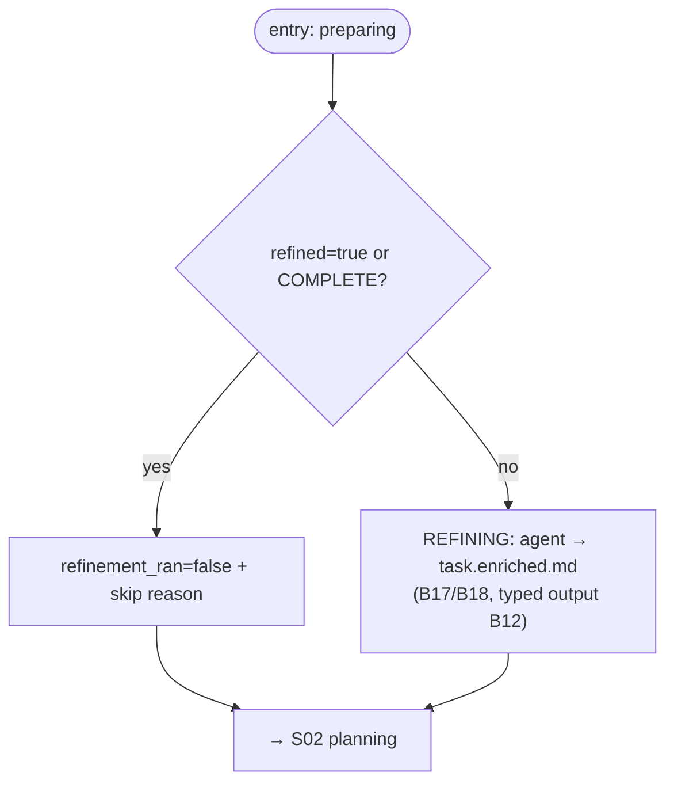

# S01 — refinement stage

## Purpose

The first (optional) stage of the pipeline: the agent enriches a "raw" task into a state suitable for planning. It is skipped deterministically if the task is already complete — in that case the pipeline proceeds directly to planning.

## Responsibility

- Decide whether the stage is needed: skip if `task.refined` is set or if completeness classification returns `COMPLETE` ([orchestrator.py:1049-1056](../../../../src/wastech_orchestrator/core/orchestrator.py#L1049)).
- When running — execute the refinement agent, write `task.enriched.md`, set `refinement_ran` ([orchestrator.py:1061-1066](../../../../src/wastech_orchestrator/core/orchestrator.py#L1061)).

## Stage boundaries

### Within the stage's responsibility

- Skip rule; launching the agent stage; writing the enriched text; transition to planning.

### Outside the stage's responsibility

- **Completeness classification** (Phase B §19) — [B16](../../blocks/B16-task-parsing-and-validation-gate.md).
- **Agent launch and fallback** — [B17](../../blocks/B17-agent-router-and-fallback.md)/[B18](../../blocks/B18-agent-providers.md).
- **Typed output validation and HITL round-trip** — [B12](../../blocks/B12-hitl-and-typed-output.md).
- **Prompt text** — [B15](../../blocks/B15-prompt-templates.md).

## Entry points

- `_refinement(p, completeness)` ([orchestrator.py:1049](../../../../src/wastech_orchestrator/core/orchestrator.py#L1049)) — called from `_drive`.
- `_run_refinement(p)` ([orchestrator.py:1061](../../../../src/wastech_orchestrator/core/orchestrator.py#L1061)) — launch/restart of the persistent checkpoint `refining`.

## Input data and state

`NormalizedTask` (flag `refined`) and `Completeness` from Phase B ([B16](../../blocks/B16-task-parsing-and-validation-gate.md)). Status: `preparing` → `refining` (or directly to `planning` on skip). Artifact — `task.enriched.md`.

## Main scenario

1. If `refined` is true **or** completeness is `COMPLETE` → write `refinement_ran=False` + reason, transition to [S02 planning](./S02-planning.md).
2. Otherwise → transition to `REFINING`, run the agent (`_run_typed_stage`, [B12](../../blocks/B12-hitl-and-typed-output.md)/[B17](../../blocks/B17-agent-router-and-fallback.md)), write `task.enriched.md`, set `refinement_ran=True`, transition to planning.

## Checks and constraints

- refinement is **not** part of `SKIPPABLE_STAGES`: optionality is controlled by the `refined` flag/completeness, not by `agents.skip_stages` ([schema.py:50-63](../../../../src/wastech_orchestrator/config/schema.py#L50)).
- Only refinement and planning may request human input (HITL) ([B12](../../blocks/B12-hitl-and-typed-output.md)).

## Result / transition

Transition to [S02 planning](./S02-planning.md). When run — artifact `task.enriched.md`; `refinement_ran`/`refinement_skip_reason` updated in [B07](../../blocks/B07-state-machine-and-store.md).

## Side effects

- Writing `task.enriched.md`; updating task fields in [B07](../../blocks/B07-state-machine-and-store.md).
- Via delegates: agent launch ([B18](../../blocks/B18-agent-providers.md)), HITL transport ([B26](../../blocks/B26-notifications-telegram.md)).

## Errors and edge cases

- HITL failure (timeout/transport/invalid response) → `manual_action_required` (fail-closed, [B12](../../blocks/B12-hitl-and-typed-output.md)/[B06](../../blocks/B06-orchestrator-pipeline.md)).
- No terminal event from the agent → `INVALID_OUTPUT` ([B18](../../blocks/B18-agent-providers.md)).

## Relations

### Uses

- [B12](../../blocks/B12-hitl-and-typed-output.md), [B15](../../blocks/B15-prompt-templates.md), [B17](../../blocks/B17-agent-router-and-fallback.md)/[B18](../../blocks/B18-agent-providers.md), [B16](../../blocks/B16-task-parsing-and-validation-gate.md) (Completeness), [B07](../../blocks/B07-state-machine-and-store.md).

### Used by

- [S02 planning](./S02-planning.md) — next stage; [B06](../../blocks/B06-orchestrator-pipeline.md) — driver and owner of transitions.

## Position in the flow

Pipeline entry point immediately after branch preparation. Prepares the ground for planning; on an already complete/`refined` task it passes through instantly (without an agent). See [flow overview](./index.md).

## Code confirmation

- [orchestrator.py:1049-1066](../../../../src/wastech_orchestrator/core/orchestrator.py#L1049) — `_refinement` / `_run_refinement`.
- [schema.py:50-63](../../../../src/wastech_orchestrator/config/schema.py#L50) — refinement outside `SKIPPABLE_STAGES`.
- Tests: [tests/core/test_orchestrator.py](../../../../tests/core/test_orchestrator.py) (skip rule), [tests/core/test_hitl.py](../../../../tests/core/test_hitl.py).
