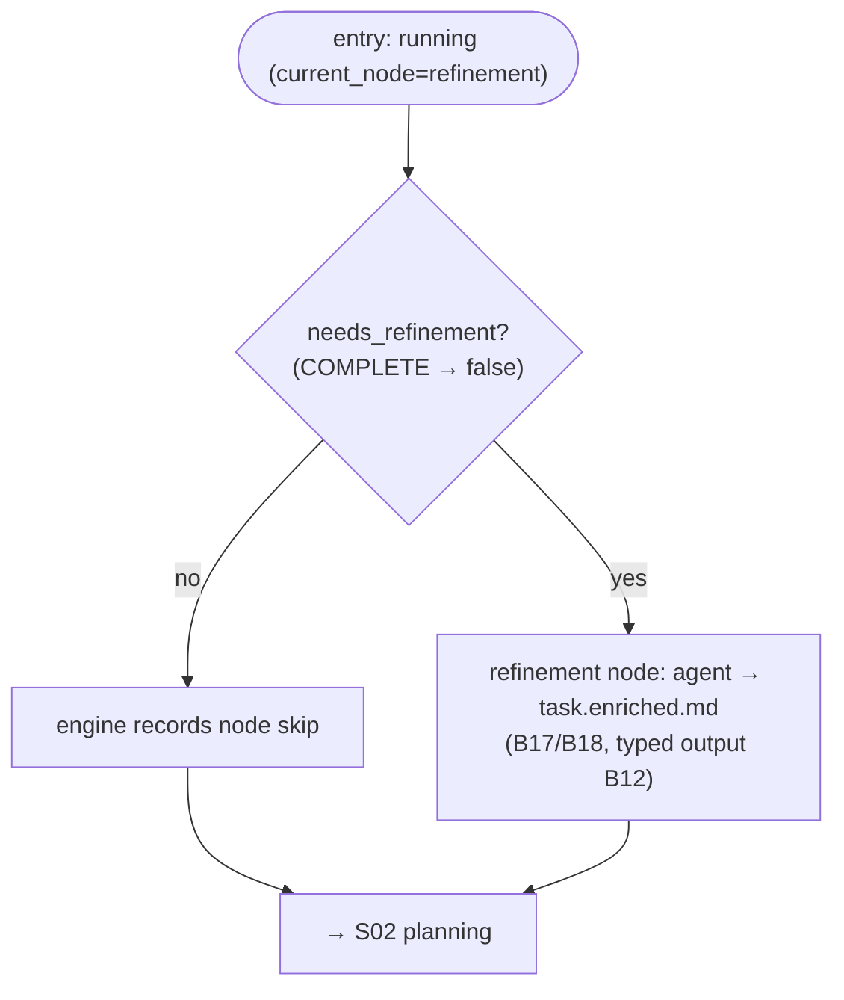

# S01 — refinement stage

## Purpose

The first (optional) stage of the pipeline: the agent enriches a "raw" task into a state suitable for planning. It is skipped deterministically when the task is already complete (completeness classification `COMPLETE`) — in that case the pipeline proceeds directly to planning.

## Responsibility

- Decide whether the node runs: the `refinement` node carries `when: derived.needs_refinement` — the engine skips it when that fact is false (completeness classification `COMPLETE`) and takes the forward edge to planning. The skip is deterministic — driven purely by completeness, never a task flag (PRE.3); there is no `task.refined`. The orchestrator computes the fact in `_engine_facts` ([orchestrator.py:1051-1070](../../../../src/wastech_orchestrator/core/orchestrator.py#L1051)).
- When the node runs — the `AgentNodeRunner` executes the refinement agent and records a `node_runs` row ([nodes/agent.py:60](../../../../src/wastech_orchestrator/core/flow/nodes/agent.py#L60)); the post-node hook persists the enriched-spec artifact slot via the engine post-node hook ([orchestrator.py:1072-1100](../../../../src/wastech_orchestrator/core/orchestrator.py#L1072)).

## Stage boundaries

### Within the stage's responsibility

- Skip rule; launching the agent stage; writing the enriched text; transition to planning.

### Outside the stage's responsibility

- **Completeness classification** (Phase B §19) — [B16](../../blocks/B16-task-parsing-and-validation-gate.md).
- **Agent launch and fallback** — [B17](../../blocks/B17-agent-router-and-fallback.md)/[B18](../../blocks/B18-agent-providers.md).
- **Typed output validation and HITL round-trip** — [B12](../../blocks/B12-hitl-and-typed-output.md).
- **Prompt text** — [B15](../../blocks/B15-prompt-templates.md).

## Entry points

- `AgentNodeRunner.run` for the `refinement` node ([nodes/agent.py:67](../../../../src/wastech_orchestrator/core/flow/nodes/agent.py#L67)) — runs the refinement agent and returns an unconditional `done` outcome.
- The skip is the engine's `when:` check ([engine.py:291-312](../../../../src/wastech_orchestrator/core/flow/engine.py#L291)); the `derived.needs_refinement` fact is resolved by `_engine_facts` ([orchestrator.py:1051-1070](../../../../src/wastech_orchestrator/core/orchestrator.py#L1051)).

## Input data and state

`NormalizedTask` and `Completeness` from Phase B ([B16](../../blocks/B16-task-parsing-and-validation-gate.md)). The task status is `running` throughout the pipeline body; progress is the flow `current_node` (recorded in `node_runs`). On skip the engine records the skip and takes the forward edge to the `planning` node. Artifact — `task.enriched.md`.

## Main scenario

1. If completeness is `COMPLETE` (i.e. `derived.needs_refinement` is false) → the engine records the node skip and takes the forward edge to [S02 planning](./S02-planning.md).
2. Otherwise → the `AgentNodeRunner` runs the refinement agent ([B17](../../blocks/B17-agent-router-and-fallback.md)/[B18](../../blocks/B18-agent-providers.md), typed output [B12](../../blocks/B12-hitl-and-typed-output.md)) and writes `task.enriched.md`; the engine then takes the forward edge to planning.

## Checks and constraints

- refinement is **not** part of `SKIPPABLE_STAGES`: optionality is controlled by completeness classification (the `when: derived.needs_refinement` node condition), not by a per-task stage-skip and never a task flag (PRE.3 — there is no `task.refined`) ([schema.py](../../../../src/wastech_orchestrator/config/schema.py#L59)). The global `agents.skip_stages` list was removed in config v10; per-task `stages.<stage>.enabled: false` is the surviving skip and does not cover refinement.
- Only refinement and planning may request human input (HITL) ([B12](../../blocks/B12-hitl-and-typed-output.md)).

## Result / transition

Forward edge to [S02 planning](./S02-planning.md). When run — artifact `task.enriched.md`; on skip the engine records a `node_runs` skip row with the reason ([B07](../../blocks/B07-state-machine-and-store.md)).

## Side effects

- Writing `task.enriched.md`; recording the `node_runs` row (run or skip) in [B07](../../blocks/B07-state-machine-and-store.md).
- Via delegates: agent launch ([B18](../../blocks/B18-agent-providers.md)), HITL transport ([B26](../../blocks/B26-notifications-telegram.md)).

## Errors and edge cases

- HITL failure (timeout/transport/invalid response) → `manual_action_required` (fail-closed, [B12](../../blocks/B12-hitl-and-typed-output.md)/[B06](../../blocks/B06-orchestrator-pipeline.md)).
- No terminal event from the agent → `INVALID_OUTPUT` ([B18](../../blocks/B18-agent-providers.md)).

## Relations

### Uses

- [B12](../../blocks/B12-hitl-and-typed-output.md), [B15](../../blocks/B15-prompt-templates.md), [B17](../../blocks/B17-agent-router-and-fallback.md)/[B18](../../blocks/B18-agent-providers.md), [B16](../../blocks/B16-task-parsing-and-validation-gate.md) (Completeness), [B07](../../blocks/B07-state-machine-and-store.md).

### Used by

- [S02 planning](./S02-planning.md) — next stage; [B06](../../blocks/B06-orchestrator-pipeline.md) — driver and owner of transitions.

## Position in the flow

Pipeline entry point immediately after branch preparation. Prepares the ground for planning; on an already `COMPLETE` task it passes through instantly (without an agent). See [flow overview](./index.md).

## Code confirmation

- [nodes/agent.py:60](../../../../src/wastech_orchestrator/core/flow/nodes/agent.py#L60) — `AgentNodeRunner` (the `refinement` node runner); `run()` at [nodes/agent.py:67](../../../../src/wastech_orchestrator/core/flow/nodes/agent.py#L67).
- [engine.py:291-312](../../../../src/wastech_orchestrator/core/flow/engine.py#L291) — `_should_skip` / `_skip_outcome` (the `when: derived.needs_refinement` skip).
- [orchestrator.py:1051-1070](../../../../src/wastech_orchestrator/core/orchestrator.py#L1051) — `_engine_facts`: resolves `derived.needs_refinement` (completeness `!= COMPLETE`, no task flag).
- [schema.py:59-72](../../../../src/wastech_orchestrator/config/schema.py#L59) — refinement outside `SKIPPABLE_STAGES` (skipped deterministically by completeness).
- Tests: [tests/core/test_orchestrator.py](../../../../tests/core/test_orchestrator.py) (skip rule), [tests/core/test_hitl.py](../../../../tests/core/test_hitl.py).
