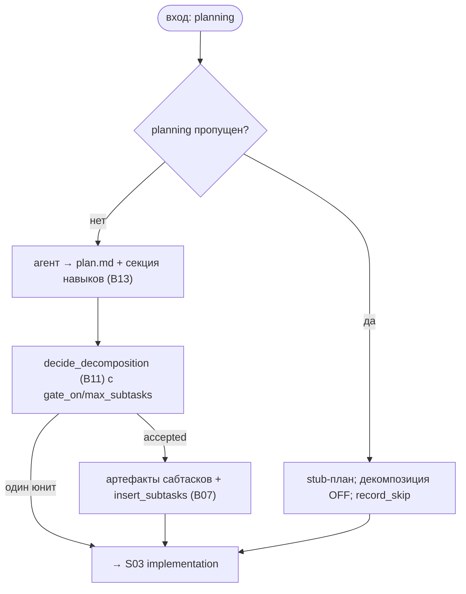

# S02 — Стадия planning

## Назначение

Агент строит план (`plan.md`) и, опционально, рекомендует разбить задачу на сабтаски. Здесь же резолвятся навыки (skills). Стадию можно пропустить — тогда пишется stub-план и задача идёт одной единицей.

## Ответственность

- При пропуске — записать stub-план, **выключить** декомпозицию, перейти к implementation ([orchestrator.py:1068-1088](../../../../src/wastech_orchestrator/core/orchestrator.py#L1068)).
- При запуске — прогнать агента, собрать `plan.md` (+ секция навыков), применить правило приёма декомпозиции и записать артефакты/строки сабтасков ([orchestrator.py:1089-1137](../../../../src/wastech_orchestrator/core/orchestrator.py#L1089)).

## Границы шага

### Входит в ответственность шага

- Запуск/пропуск стадии; сборка `plan.md`; вызов решения о декомпозиции и резолва навыков; запись сабтасков; переход к implementation.

### Не входит в ответственность шага

- **Правило приёма декомпозиции и артефакты сабтасков** — [B11](../../blocks/B11-task-decomposition.md).
- **Инвентарь/выбор навыков и дедуп** — [B13](../../blocks/B13-skill-selection.md).
- **Валидация типизированного вывода и HITL** — [B12](../../blocks/B12-hitl-and-typed-output.md); **резолв `gate_on`** (`decomposition.enabled` + per-task) — [B06 `_decomposition_gate_on`](../../blocks/B06-orchestrator-pipeline.md).
- **Запуск агента** — [B17](../../blocks/B17-agent-router-and-fallback.md)/[B18](../../blocks/B18-agent-providers.md); **промпт** — [B15](../../blocks/B15-prompt-templates.md).

## Точки входа

- `_planning(p)` ([orchestrator.py:1068](../../../../src/wastech_orchestrator/core/orchestrator.py#L1068)) — вызывается из `_drive`.
- `_resolve_and_render_skills(p, proposed)` ([orchestrator.py:1139](../../../../src/wastech_orchestrator/core/orchestrator.py#L1139)) — резолв навыков ([B13](../../blocks/B13-skill-selection.md)) и секция в `plan.md`.

## Входные данные и состояние

Типизированный вывод агента (`decompose`, `subtasks[]`, `skills`); `gate_on`; `max_subtasks`. Статус: `refining`/`preparing` → `planning` → `implementing`. Артефакты — `plan.md`, `subtasks/index.json`, `NN-<slug>.md`; строки `subtasks` в [B07](../../blocks/B07-state-machine-and-store.md).

## Основной сценарий

1. **Пропуск** (`planning` в `skip`): stub-план из задачи, `DecompositionDecision(accepted=False, reason="planning_skipped")`, `record_skip`, переход к implementation (декомпозиция требует структурированный вывод planning, поэтому без него невозможна).
2. **Запуск**: `_run_typed_stage` → `plan.md` = контент + секция навыков ([B13](../../blocks/B13-skill-selection.md)); `decide_decomposition` ([B11](../../blocks/B11-task-decomposition.md)) с `gate_on`/`max_subtasks`; при принятии — `write_subtask_artifacts` + `insert_subtasks` ([B07](../../blocks/B07-state-machine-and-store.md)); переход к implementation.

## Проверки и ограничения

- `planning` входит в `SKIPPABLE_STAGES` ([schema.py:55-63](../../../../src/wastech_orchestrator/config/schema.py#L55)); при пропуске декомпозиция принудительно выключена.
- Агент **предлагает** разбиение — ядро принимает по детерминированному правилу §5.1 ([B11](../../blocks/B11-task-decomposition.md)); агент не может ослабить `max_subtasks`/маршруты.
- Может запросить человека (HITL) — refinement/planning ([B12](../../blocks/B12-hitl-and-typed-output.md)); опасный дифф планом не правится, но его аппрув может покрыть дифф следующих стадий ([S03](./S03-implementation.md)).

## Результат / переход

Переход к [S03 implementation](./S03-implementation.md). Артефакты `plan.md` (+ навыки), при декомпозиции — `subtasks/index.json` и спеки; `decomposition_*`/`subtask_count`/`active_subtask` в [B07](../../blocks/B07-state-machine-and-store.md).

## Побочные эффекты

- Запись `plan.md`, артефактов сабтасков; строки `subtasks` и поля задачи в [B07](../../blocks/B07-state-machine-and-store.md).
- Через делегаты: запуск агента ([B18](../../blocks/B18-agent-providers.md)), HITL ([B26](../../blocks/B26-notifications-telegram.md)), чтение инвентаря навыков ([B13](../../blocks/B13-skill-selection.md)).

## Ошибки и граничные случаи

- Сбой HITL → `manual_action_required` (fail-closed).
- Дефект структуры вывода декомпозиции → «один юнит» с кодом причины (не исключение, [B11](../../blocks/B11-task-decomposition.md)).

## Связи

### Использует

- [B11](../../blocks/B11-task-decomposition.md), [B13](../../blocks/B13-skill-selection.md), [B12](../../blocks/B12-hitl-and-typed-output.md), [B15](../../blocks/B15-prompt-templates.md), [B17](../../blocks/B17-agent-router-and-fallback.md)/[B18](../../blocks/B18-agent-providers.md), [B07](../../blocks/B07-state-machine-and-store.md).

### Используется в

- [S03 implementation](./S03-implementation.md) — следующая стадия (по каждой единице); [B06](../../blocks/B06-orchestrator-pipeline.md) — драйвер.

## Место в потоке

Вторая стадия. Определяет, сколько будет единиц работы (одна или сабтаски) и какой материал-справку (навыки) увидят последующие стадии. См. [обзор потока](./index.md).

## Подтверждение в коде

- [orchestrator.py:1068-1137](../../../../src/wastech_orchestrator/core/orchestrator.py#L1068) — `_planning` (пропуск, декомпозиция, сабтаски).
- [orchestrator.py:1139-1194](../../../../src/wastech_orchestrator/core/orchestrator.py#L1139) — `_resolve_and_render_skills` / секция навыков.
- Тесты: [tests/core/test_decomposition.py](../../../../tests/core/test_decomposition.py), [tests/core/test_skills.py](../../../../tests/core/test_skills.py), [tests/core/test_orchestrator.py](../../../../tests/core/test_orchestrator.py).
