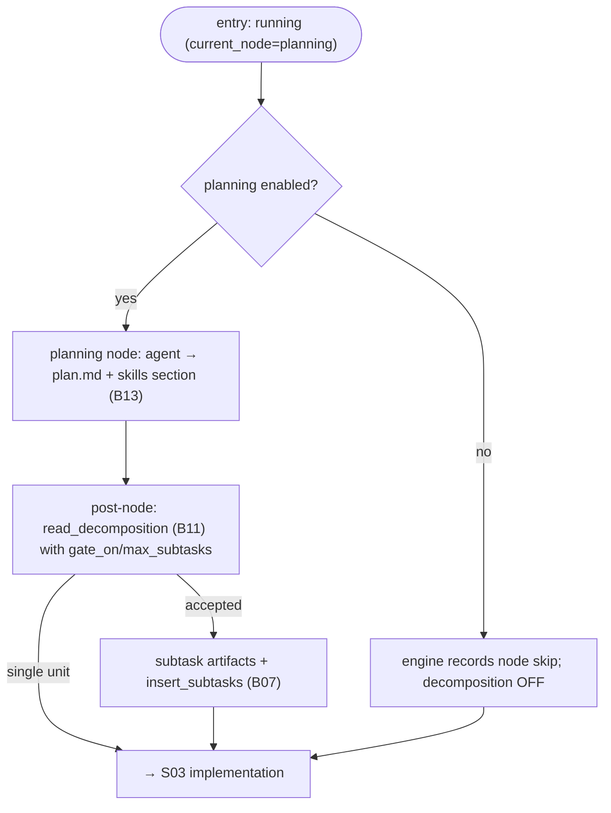

# S02 — planning stage

## Purpose

The agent builds a plan (`plan.md`) and optionally recommends splitting the task into subtasks. Skills are also resolved here. The stage can be skipped — in that case a stub plan is written and the task proceeds as a single unit.

## Responsibility

- On skip — the `planning` node carries `when: config.planning_enabled`; when that fact is false the engine skips the node, decomposition stays disabled (the `proposed_by` node never ran), and the forward edge goes to implementation ([engine.py:291-312](../../../../src/wastech_orchestrator/core/flow/engine.py#L291)).
- On run — the `AgentNodeRunner` executes the planning agent ([nodes/agent.py:58](../../../../src/wastech_orchestrator/core/flow/nodes/agent.py#L58)); the post-node hook reads the node's structured output to persist `plan.md` (+ skills section), apply the decomposition acceptance rule, and write subtask artifacts/rows ([orchestrator.py:1002-1069](../../../../src/wastech_orchestrator/core/orchestrator.py#L1002)).

## Step boundaries

### Within this step's responsibility

- Running/skipping the stage; assembling `plan.md`; invoking the decomposition decision and skill resolution; writing subtasks; transitioning to implementation.

### Outside this step's responsibility

- **Decomposition acceptance rule and subtask artifacts** — [B11](../../blocks/B11-task-decomposition.md).
- **Skill inventory/selection and deduplication** — [B13](../../blocks/B13-skill-selection.md).
- **Typed output validation and HITL** — [B12](../../blocks/B12-hitl-and-typed-output.md); **`gate_on` resolution** (`decomposition.enabled` + per-task) — [B06 `_decomposition_gate_on`](../../blocks/B06-orchestrator-pipeline.md).
- **Agent execution** — [B17](../../blocks/B17-agent-router-and-fallback.md)/[B18](../../blocks/B18-agent-providers.md); **prompt** — [B15](../../blocks/B15-prompt-templates.md).

## Entry points

- `AgentNodeRunner.run` for the `planning` node ([nodes/agent.py:65](../../../../src/wastech_orchestrator/core/flow/nodes/agent.py#L65)) — runs the planning agent; the skip is the engine's `when: config.planning_enabled` check ([engine.py:291-312](../../../../src/wastech_orchestrator/core/flow/engine.py#L291)).
- `_engine_post_node` → `_engine_materialize_decomposition` / `_engine_apply_skills` ([orchestrator.py:1002-1096](../../../../src/wastech_orchestrator/core/orchestrator.py#L1002)) — decomposition decision ([B11](../../blocks/B11-task-decomposition.md)) and skill resolution ([B13](../../blocks/B13-skill-selection.md)) + the section in `plan.md`, driven by the node's structured output.

## Input data and state

Typed agent output (`decompose`, `subtasks[]`, `skills`); `gate_on`; `max_subtasks`. The task status is `running`; progress is the flow `current_node`. Artifacts — `plan.md`, `subtasks/index.json`, `NN-<slug>.md`; `subtasks` rows in [B07](../../blocks/B07-state-machine-and-store.md).

## Main scenario

1. **Skip** (`config.planning_enabled` false): the engine records the node skip; decomposition stays disabled (its `proposed_by` node never ran, so there is no structured output to decide on), forward edge to implementation.
2. **Run**: `AgentNodeRunner` → the post-node hook writes `plan.md` = content + skills section ([B13](../../blocks/B13-skill-selection.md)) and calls `read_decomposition` ([B11](../../blocks/B11-task-decomposition.md)) with `gate_on`/`max_subtasks`; on acceptance — `write_subtask_artifacts` + `insert_subtasks` ([B07](../../blocks/B07-state-machine-and-store.md)); forward edge to implementation.

## Checks and constraints

- `planning` is included in `SKIPPABLE_STAGES` ([schema.py:66-74](../../../../src/wastech_orchestrator/config/schema.py#L66)); when skipped (the `when: config.planning_enabled` node condition is false), decomposition is forcibly disabled.
- The agent **proposes** a split — the core accepts it according to the deterministic rule §5.1 ([B11](../../blocks/B11-task-decomposition.md)); the agent cannot relax `max_subtasks`/routes.
- May request human input (HITL) — refinement/planning ([B12](../../blocks/B12-hitl-and-typed-output.md)); a dangerous diff is not fixed by the plan, but its approval may cover the diff of subsequent stages ([S03](./S03-implementation.md)).

## Result / transition

Transition to [S03 implementation](./S03-implementation.md). Artifacts: `plan.md` (+ skills); on decomposition — `subtasks/index.json` and specs; `decomposition_*`/`subtask_count`/`active_subtask` in [B07](../../blocks/B07-state-machine-and-store.md).

## Side effects

- Writing `plan.md`, subtask artifacts; `subtasks` rows and task fields in [B07](../../blocks/B07-state-machine-and-store.md).
- Via delegates: agent execution ([B18](../../blocks/B18-agent-providers.md)), HITL ([B26](../../blocks/B26-notifications-telegram.md)), reading the skill inventory ([B13](../../blocks/B13-skill-selection.md)).

## Errors and edge cases

- HITL failure → `manual_action_required` (fail-closed).
- Malformed decomposition output structure → single unit with a reason code (not an exception, [B11](../../blocks/B11-task-decomposition.md)).

## Relationships

### Uses

- [B11](../../blocks/B11-task-decomposition.md), [B13](../../blocks/B13-skill-selection.md), [B12](../../blocks/B12-hitl-and-typed-output.md), [B15](../../blocks/B15-prompt-templates.md), [B17](../../blocks/B17-agent-router-and-fallback.md)/[B18](../../blocks/B18-agent-providers.md), [B07](../../blocks/B07-state-machine-and-store.md).

### Used by

- [S03 implementation](./S03-implementation.md) — next stage (per unit); [B06](../../blocks/B06-orchestrator-pipeline.md) — driver.

## Position in the flow

Second stage. Determines how many work units there will be (one or subtasks) and what reference material (skills) subsequent stages will see. See [flow overview](./index.md).

## Code confirmation

- [nodes/agent.py:58](../../../../src/wastech_orchestrator/core/flow/nodes/agent.py#L58) — `AgentNodeRunner` (the `planning` node runner); `run()` at [nodes/agent.py:65](../../../../src/wastech_orchestrator/core/flow/nodes/agent.py#L65).
- [orchestrator.py:1032-1069](../../../../src/wastech_orchestrator/core/orchestrator.py#L1032) — `_engine_materialize_decomposition` (decision, subtask artifacts/rows).
- [orchestrator.py:1081-1096](../../../../src/wastech_orchestrator/core/orchestrator.py#L1081) — `_engine_apply_skills` / skills section.
- Tests: [tests/core/test_decomposition.py](../../../../tests/core/test_decomposition.py), [tests/core/test_skills.py](../../../../tests/core/test_skills.py), [tests/core/test_orchestrator.py](../../../../tests/core/test_orchestrator.py).
