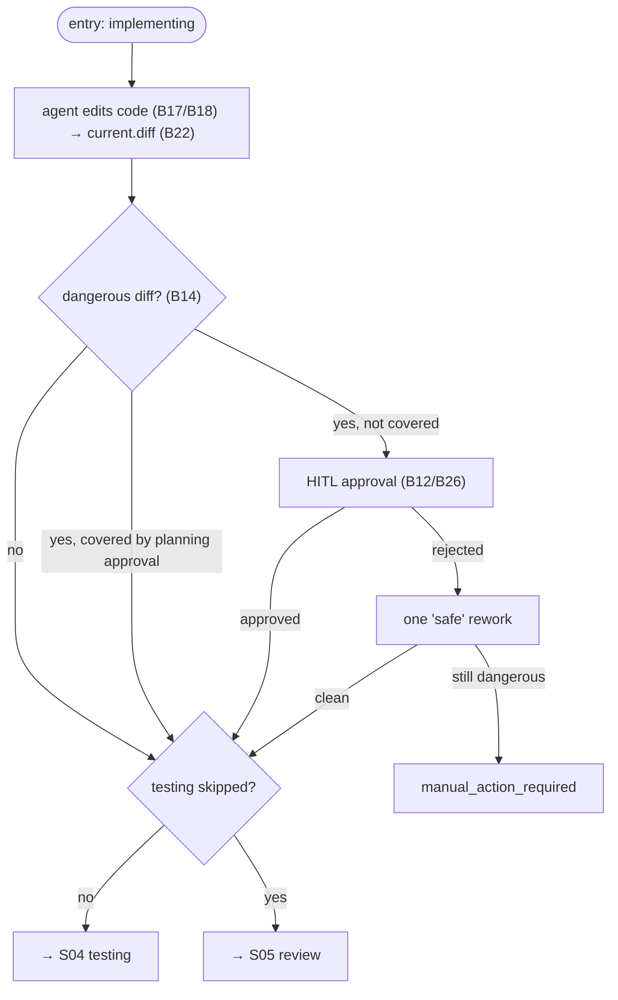

# S03 — implementation Stage

## Purpose

The core of the work: the agent edits the code of a unit (task or subtask). This is an **editing** stage — after it, the "dangerous" diff guardrail fires (deletions and dependency changes require human approval). implementation is **never** skipped.

## Responsibility

- Run the editing agent and capture the current diff ([orchestrator.py:1205-1216](../../../../src/wastech_orchestrator/core/orchestrator.py#L1205), [orchestrator.py:1879-1900](../../../../src/wastech_orchestrator/core/orchestrator.py#L1879)).
- Classify the diff and, if it is dangerous and not covered by a planning approval, request human sign-off; a rejection grants one "safe" rework ([orchestrator.py:1902-1971](../../../../src/wastech_orchestrator/core/orchestrator.py#L1902)).
- Transition to testing (or to review if testing is skipped) — `_after_edit_target` ([orchestrator.py:2249](../../../../src/wastech_orchestrator/core/orchestrator.py#L2249)).

## Step Boundaries

### In scope

- Launching the editing stage; orchestrating the guardrail (request / retry / coverage check); transitioning to the next unit stage.

### Out of scope

- **Dangerous diff classification** — [B14](../../blocks/B14-dangerous-diff-guardrail.md); **diff capture** — [B22](../../blocks/B22-git-manager.md).
- **Agent launch and fallback** — [B17](../../blocks/B17-agent-router-and-fallback.md)/[B18](../../blocks/B18-agent-providers.md); **HITL** — [B12](../../blocks/B12-hitl-and-typed-output.md)/[B26](../../blocks/B26-notifications-telegram.md).

## Entry Points

- `_run_unit` branch `IMPLEMENTING` ([orchestrator.py:1205-1216](../../../../src/wastech_orchestrator/core/orchestrator.py#L1205)).
- `_run_edit_stage_with_guardrail(p, Stage.IMPLEMENTATION, …)` ([orchestrator.py:1879](../../../../src/wastech_orchestrator/core/orchestrator.py#L1879)).

## Input Data and State

`plan.md` / subtask spec as context (by path); repository working tree. Status: `implementing`. Artifacts: `current.diff`; on approval, a HITL guardrail artifact.

## Main Scenario

1. Run the agent ([B17](../../blocks/B17-agent-router-and-fallback.md)/[B18](../../blocks/B18-agent-providers.md)); capture `current.diff` ([B22](../../blocks/B22-git-manager.md)).
2. `classify_dangerous_diff` ([B14](../../blocks/B14-dangerous-diff-guardrail.md)): no danger → proceed.
3. Dangerous but covered by a planning approval (`_planning_approval_matches`) → proceed.
4. Otherwise — HITL approval request ([B12](../../blocks/B12-hitl-and-typed-output.md)/[B26](../../blocks/B26-notifications-telegram.md)); approved → proceed; rejected → one "safe" rework; if still dangerous → `manual_action_required`.
5. Transition to testing or (if testing is skipped) to review.

## Checks and Constraints

- implementation is **not** in `SKIPPABLE_STAGES` ([schema.py:50-63](../../../../src/wastech_orchestrator/config/schema.py#L50)) — it cannot be skipped.
- A dangerous diff means file deletions or edits to dependency manifests/lock files ([B14](../../blocks/B14-dangerous-diff-guardrail.md)); approval is checked against the previously approved set to avoid re-asking for the same set.
- The "safe rework" boundary is persisted before launch (a restart will not trigger it twice) ([orchestrator.py:1950-1962](../../../../src/wastech_orchestrator/core/orchestrator.py#L1950)).

## Result / Transition

Transition to [S04 testing](./S04-testing.md) or, when testing is skipped, to [S05 review](./S05-review.md) (`_after_edit_target`). Artifact: `current.diff`.

## Side Effects

- Working tree changes (by the agent); writing `current.diff` and HITL artifacts; notifications ([B26](../../blocks/B26-notifications-telegram.md)).

## Errors and Edge Cases

- HITL approval failure → `manual_action_required` (fail-closed).
- Diff "expanded" after the approval request on resume → `manual_action_required` ([orchestrator.py:1982-1985](../../../../src/wastech_orchestrator/core/orchestrator.py#L1982)).
- No stage result (infrastructure failure on all attempts) → terminal stage failure ([B17](../../blocks/B17-agent-router-and-fallback.md)).

## Relationships

### Uses

- [B14](../../blocks/B14-dangerous-diff-guardrail.md), [B22](../../blocks/B22-git-manager.md) (diff), [B12](../../blocks/B12-hitl-and-typed-output.md)/[B26](../../blocks/B26-notifications-telegram.md), [B17](../../blocks/B17-agent-router-and-fallback.md)/[B18](../../blocks/B18-agent-providers.md), [B15](../../blocks/B15-prompt-templates.md).

### Used by

- [S04 testing](./S04-testing.md) / [S05 review](./S05-review.md) — next stage; [S06 fixing](./S06-fixing.md) uses the same guardrail mechanism; [B06](../../blocks/B06-orchestrator-pipeline.md) — driver.

## Position in the Flow

The heart of a unit of work: this is where the code changes. The same `_run_edit_stage_with_guardrail` is also used in [S06 fixing](./S06-fixing.md). See the [flow overview](./index.md).

## Code Confirmation

- [orchestrator.py:1205-1216](../../../../src/wastech_orchestrator/core/orchestrator.py#L1205) — `IMPLEMENTING` branch in `_run_unit`.
- [orchestrator.py:1879-1971](../../../../src/wastech_orchestrator/core/orchestrator.py#L1879) — `_run_edit_stage_with_guardrail` (classification, approval, rework).
- [orchestrator.py:2249-2251](../../../../src/wastech_orchestrator/core/orchestrator.py#L2249) — `_after_edit_target`.
- Tests: [tests/core/test_orchestrator.py](../../../../tests/core/test_orchestrator.py), [tests/core/test_hitl.py](../../../../tests/core/test_hitl.py).
