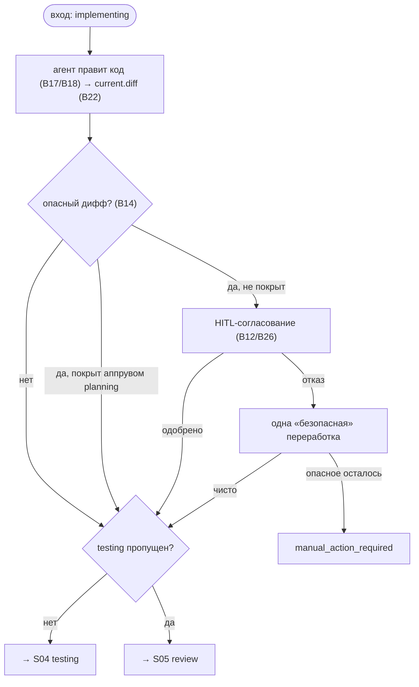

# S03 — Стадия implementation

## Назначение

Ядро работы: агент правит код единицы (задачи или сабтаска). Это **редактирующая** стадия — после неё срабатывает guardrail «опасного» диффа (удаления/зависимости требуют согласования человеком). implementation **никогда** не пропускается.

## Ответственность

- Прогнать агента редактирования и снять текущий дифф ([orchestrator.py:1205-1216](../../../../src/wastech_orchestrator/core/orchestrator.py#L1205), [orchestrator.py:1879-1900](../../../../src/wastech_orchestrator/core/orchestrator.py#L1879)).
- Классифицировать дифф и, если он опасен и не покрыт аппрувом planning, потребовать согласование; отказ даёт одну «безопасную» переработку ([orchestrator.py:1902-1971](../../../../src/wastech_orchestrator/core/orchestrator.py#L1902)).
- Перейти к testing (или к review, если testing пропущен) — `_after_edit_target` ([orchestrator.py:2249](../../../../src/wastech_orchestrator/core/orchestrator.py#L2249)).

## Границы шага

### Входит в ответственность шага

- Запуск редактирующей стадии; оркестрация guardrail (запрос/повтор/проверка покрытия); переход к следующей стадии единицы.

### Не входит в ответственность шага

- **Классификация опасного диффа** — [B14](../../blocks/B14-dangerous-diff-guardrail.md); **снятие диффа** — [B22](../../blocks/B22-git-manager.md).
- **Запуск агента и fallback** — [B17](../../blocks/B17-agent-router-and-fallback.md)/[B18](../../blocks/B18-agent-providers.md); **HITL** — [B12](../../blocks/B12-hitl-and-typed-output.md)/[B26](../../blocks/B26-notifications-telegram.md).

## Точки входа

- `_run_unit` ветка `IMPLEMENTING` ([orchestrator.py:1205-1216](../../../../src/wastech_orchestrator/core/orchestrator.py#L1205)).
- `_run_edit_stage_with_guardrail(p, Stage.IMPLEMENTATION, …)` ([orchestrator.py:1879](../../../../src/wastech_orchestrator/core/orchestrator.py#L1879)).

## Входные данные и состояние

`plan.md`/спека сабтаска как контекст (путями); рабочее дерево репозитория. Статус: `implementing`. Артефакты — `current.diff`, при согласовании — HITL-артефакт guardrail.

## Основной сценарий

1. Прогнать агента ([B17](../../blocks/B17-agent-router-and-fallback.md)/[B18](../../blocks/B18-agent-providers.md)); снять `current.diff` ([B22](../../blocks/B22-git-manager.md)).
2. `classify_dangerous_diff` ([B14](../../blocks/B14-dangerous-diff-guardrail.md)): нет опасности → дальше.
3. Опасно, но покрыто аппрувом planning (`_planning_approval_matches`) → дальше.
4. Иначе — HITL-запрос согласования ([B12](../../blocks/B12-hitl-and-typed-output.md)/[B26](../../blocks/B26-notifications-telegram.md)); одобрено → дальше; отказ → одна «безопасная» переработка; если опасное осталось → `manual_action_required`.
5. Переход к testing или (если testing пропущен) к review.

## Проверки и ограничения

- implementation **не** в `SKIPPABLE_STAGES` ([schema.py:50-63](../../../../src/wastech_orchestrator/config/schema.py#L50)) — пропустить нельзя.
- Опасный дифф = удаления файлов или правки манифестов/локов зависимостей ([B14](../../blocks/B14-dangerous-diff-guardrail.md)); согласование сверяется с ранее одобренным набором, чтобы не спрашивать повторно для того же набора.
- Граница «безопасной переработки» персистится до запуска (рестарт не запустит её дважды) ([orchestrator.py:1950-1962](../../../../src/wastech_orchestrator/core/orchestrator.py#L1950)).

## Результат / переход

Переход к [S04 testing](./S04-testing.md) или, при пропущенном testing, к [S05 review](./S05-review.md) (`_after_edit_target`). Артефакт `current.diff`.

## Побочные эффекты

- Изменения рабочего дерева (агентом); запись `current.diff` и HITL-артефактов; уведомления ([B26](../../blocks/B26-notifications-telegram.md)).

## Ошибки и граничные случаи

- Сбой HITL согласования → `manual_action_required` (fail-closed).
- Дифф «расширился» после запроса согласования при возобновлении → `manual_action_required` ([orchestrator.py:1982-1985](../../../../src/wastech_orchestrator/core/orchestrator.py#L1982)).
- Нет результата стадии (инфра-сбой всех попыток) → терминальный провал стадии ([B17](../../blocks/B17-agent-router-and-fallback.md)).

## Связи

### Использует

- [B14](../../blocks/B14-dangerous-diff-guardrail.md), [B22](../../blocks/B22-git-manager.md) (дифф), [B12](../../blocks/B12-hitl-and-typed-output.md)/[B26](../../blocks/B26-notifications-telegram.md), [B17](../../blocks/B17-agent-router-and-fallback.md)/[B18](../../blocks/B18-agent-providers.md), [B15](../../blocks/B15-prompt-templates.md).

### Используется в

- [S04 testing](./S04-testing.md) / [S05 review](./S05-review.md) — следующая стадия; [S06 fixing](./S06-fixing.md) использует тот же guardrail-механизм; [B06](../../blocks/B06-orchestrator-pipeline.md) — драйвер.

## Место в потоке

Сердце единицы работы: именно здесь меняется код. Тот же `_run_edit_stage_with_guardrail` применяется и в [S06 fixing](./S06-fixing.md). См. [обзор потока](./index.md).

## Подтверждение в коде

- [orchestrator.py:1205-1216](../../../../src/wastech_orchestrator/core/orchestrator.py#L1205) — ветка `IMPLEMENTING` в `_run_unit`.
- [orchestrator.py:1879-1971](../../../../src/wastech_orchestrator/core/orchestrator.py#L1879) — `_run_edit_stage_with_guardrail` (классификация, согласование, переработка).
- [orchestrator.py:2249-2251](../../../../src/wastech_orchestrator/core/orchestrator.py#L2249) — `_after_edit_target`.
- Тесты: [tests/core/test_orchestrator.py](../../../../tests/core/test_orchestrator.py), [tests/core/test_hitl.py](../../../../tests/core/test_hitl.py).
