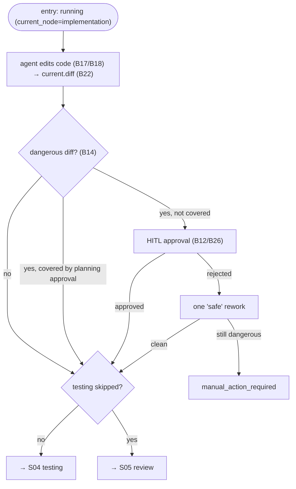

# S03 — implementation Stage

## Purpose

The core of the work: the agent edits the code of a unit (task or subtask). This is an **editing** stage — after it, the "dangerous" diff guardrail fires (deletions and dependency changes require human approval). implementation is **never** skipped.

## Responsibility

- Run the editing agent and capture the current diff — the `AgentNodeRunner` for the `implementation` node ([nodes/agent.py:65](../../../../src/wastech_orchestrator/core/flow/nodes/agent.py#L65)); the diff is written in `_apply_post_edit_guard` ([nodes/agent.py:235-248](../../../../src/wastech_orchestrator/core/flow/nodes/agent.py#L235)).
- Classify the diff and, if it is dangerous and not covered by a planning approval, request human sign-off; a rejection grants one "safe" rework — same `_apply_post_edit_guard` ([nodes/agent.py:235-312](../../../../src/wastech_orchestrator/core/flow/nodes/agent.py#L235)).
- Return an unconditional `done` outcome; the engine takes the forward edge to testing (or to review when testing is skipped — that routing is the graph/`when`, not the node).

## Step Boundaries

### In scope

- Launching the editing stage; orchestrating the guardrail (request / retry / coverage check); transitioning to the next unit stage.

### Out of scope

- **Dangerous diff classification** — [B14](../../blocks/B14-dangerous-diff-guardrail.md); **diff capture** — [B22](../../blocks/B22-git-manager.md).
- **Agent launch and fallback** — [B17](../../blocks/B17-agent-router-and-fallback.md)/[B18](../../blocks/B18-agent-providers.md); **HITL** — [B12](../../blocks/B12-hitl-and-typed-output.md)/[B26](../../blocks/B26-notifications-telegram.md).

## Entry Points

- `AgentNodeRunner.run` for the `implementation` node ([nodes/agent.py:65](../../../../src/wastech_orchestrator/core/flow/nodes/agent.py#L65)).
- `_apply_post_edit_guard` ([nodes/agent.py:235](../../../../src/wastech_orchestrator/core/flow/nodes/agent.py#L235)) — the core-owned dangerous-diff guard that runs after any `workspace-write` edit.

## Input Data and State

`plan.md` / subtask spec as context (by path); repository working tree. The task status is `running` (`current_node = implementation`). Artifacts: `current.diff`; on approval, a HITL guardrail artifact.

## Main Scenario

1. Run the agent ([B17](../../blocks/B17-agent-router-and-fallback.md)/[B18](../../blocks/B18-agent-providers.md)); capture `current.diff` ([B22](../../blocks/B22-git-manager.md)).
2. `classify_dangerous_diff` ([B14](../../blocks/B14-dangerous-diff-guardrail.md)): no danger → proceed.
3. Dangerous but covered by a planning approval (`_planning_approval_matches`) → proceed.
4. Otherwise — HITL approval request ([B12](../../blocks/B12-hitl-and-typed-output.md)/[B26](../../blocks/B26-notifications-telegram.md)); approved → proceed; rejected → one "safe" rework; if still dangerous → `manual_action_required`.
5. Transition to testing or (if testing is skipped) to review.

## Checks and Constraints

- implementation is **not** in `SKIPPABLE_STAGES` ([schema.py:66-74](../../../../src/wastech_orchestrator/config/schema.py#L66)) — it has no `when:` condition and cannot be skipped.
- A dangerous diff means file deletions or edits to dependency manifests/lock files ([B14](../../blocks/B14-dangerous-diff-guardrail.md)); approval is checked against the previously approved set to avoid re-asking for the same set ([nodes/agent.py:447-457](../../../../src/wastech_orchestrator/core/flow/nodes/agent.py#L447)).
- The dangerous-diff approval is a durable interaction (a restart resumes it, never re-asking twice); the guard resumes from the persisted status ([nodes/agent.py:281-298](../../../../src/wastech_orchestrator/core/flow/nodes/agent.py#L281)).

## Result / Transition

Forward edge to [S04 testing](./S04-testing.md) or, when testing is skipped, to [S05 review](./S05-review.md) (the engine routes the graph edges; the implementation→testing edge plus the `testing` node's `when` decide the target). Artifact: `current.diff`.

## Side Effects

- Working tree changes (by the agent); writing `current.diff` and HITL artifacts; notifications ([B26](../../blocks/B26-notifications-telegram.md)).

## Errors and Edge Cases

- HITL approval failure → `manual_action_required` (fail-closed, `NodeManualRequired`).
- Diff "expanded" after the approval request on resume → `manual_action_required` ([nodes/agent.py:284-287](../../../../src/wastech_orchestrator/core/flow/nodes/agent.py#L284)).
- No node result (infrastructure failure on all attempts) → `NodeInfraError` → terminal stage failure ([B17](../../blocks/B17-agent-router-and-fallback.md)).

## Relationships

### Uses

- [B14](../../blocks/B14-dangerous-diff-guardrail.md), [B22](../../blocks/B22-git-manager.md) (diff), [B12](../../blocks/B12-hitl-and-typed-output.md)/[B26](../../blocks/B26-notifications-telegram.md), [B17](../../blocks/B17-agent-router-and-fallback.md)/[B18](../../blocks/B18-agent-providers.md), [B15](../../blocks/B15-prompt-templates.md).

### Used by

- [S04 testing](./S04-testing.md) / [S05 review](./S05-review.md) — next stage; [S06 fixing](./S06-fixing.md) uses the same guardrail mechanism; [B06](../../blocks/B06-orchestrator-pipeline.md) — driver.

## Position in the Flow

The heart of a unit of work: this is where the code changes. The same `AgentNodeRunner` + `_apply_post_edit_guard` runs the `fixing` node in [S06 fixing](./S06-fixing.md). See the [flow overview](./index.md).

## Code Confirmation

- [nodes/agent.py:58](../../../../src/wastech_orchestrator/core/flow/nodes/agent.py#L58) — `AgentNodeRunner` (the `implementation` node runner); `run()` at [nodes/agent.py:65](../../../../src/wastech_orchestrator/core/flow/nodes/agent.py#L65).
- [nodes/agent.py:235-312](../../../../src/wastech_orchestrator/core/flow/nodes/agent.py#L235) — `_apply_post_edit_guard` (diff capture, classification, approval, reconsider).
- [implementation.yaml:33-37,72](../../../../src/wastech_orchestrator/core/flow/packaged/implementation.yaml#L33) — the `implementation` node + the `implementation → testing` edge.
- Tests: [tests/core/test_flow_node_runners.py](../../../../tests/core/test_flow_node_runners.py), [tests/core/test_orchestrator.py](../../../../tests/core/test_orchestrator.py), [tests/core/test_hitl.py](../../../../tests/core/test_hitl.py).
