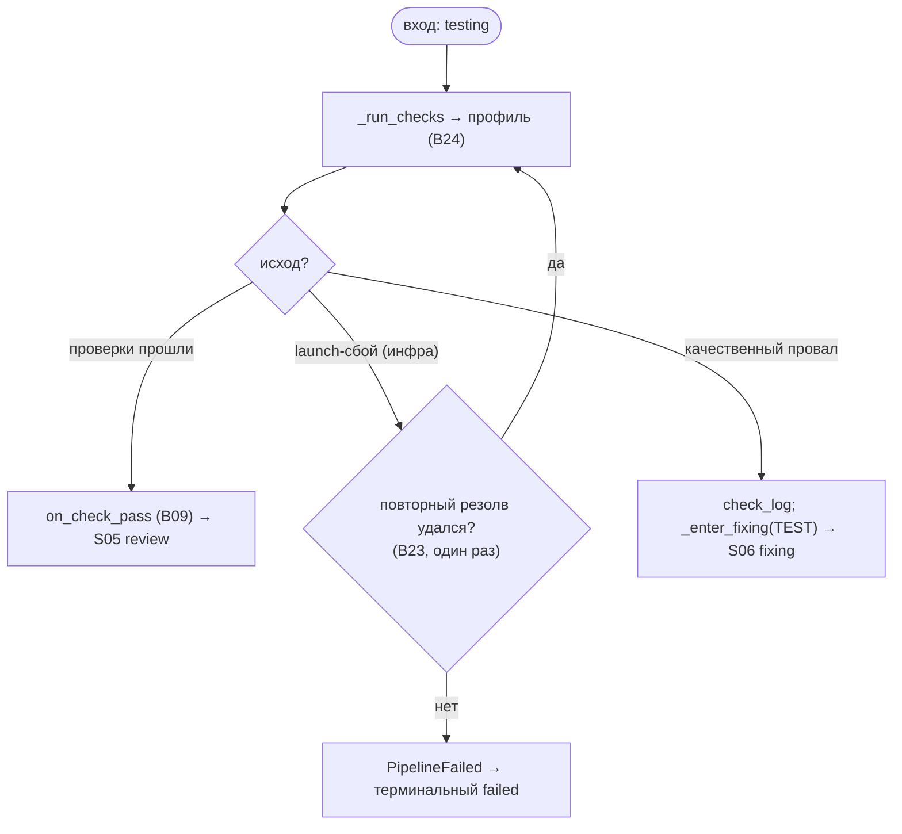

# S04 — Стадия testing

## Назначение

Первый «ворот качества» единицы: запустить разрешённый профиль проверок (тесты/линтеры) и решить
pass/fail. Это **не агентская** стадия — проверки гоняет Check Runner. Опциональна (`SKIPPABLE`).

## Ответственность

- Запустить проверки и разветвить по исходу: pass → review; качественный провал → fixing (ping-pong);
  launch-сбой → повторный резолв или терминальный провал ([orchestrator.py:1218-1242](../../../../src/wastech_orchestrator/core/orchestrator.py#L1218)).

## Границы шага

### Входит в ответственность шага

- Ветвление по исходу проверок; сброс test-счётчика при pass; вход в ping-pong при провале; обработка
  launch-сбоя (повторный резолв один раз).

### Не входит в ответственность шага

- **Запуск проверок** (argv без shell, логи, различение launch/quality) — [B24](../../blocks/B24-check-execution.md).
- **Резолв профиля проверок** — [B23](../../blocks/B23-check-discovery.md); **лимиты циклов** — [B09](../../blocks/B09-fix-loop-control.md).

## Точки входа

- `_run_unit` ветка `TESTING` ([orchestrator.py:1218](../../../../src/wastech_orchestrator/core/orchestrator.py#L1218)).
- `_run_checks(p, subtask)` ([orchestrator.py:2204](../../../../src/wastech_orchestrator/core/orchestrator.py#L2204)) → [B24](../../blocks/B24-check-execution.md).

## Входные данные и состояние

Профиль проверок ([B23](../../blocks/B23-check-discovery.md)); рабочее дерево. Статус `testing`.
Артефакты — логи проверок ([B24](../../blocks/B24-check-execution.md)); при провале — `p.check_log` (путь к логу первого провала).

## Основной сценарий

1. `_run_checks` ([B24](../../blocks/B24-check-execution.md)).
2. `passed` → `on_check_pass` ([B09](../../blocks/B09-fix-loop-control.md)) → переход в `REVIEWING`.
3. `launch_failed` (инфраструктура) → `_reresolve_on_launch_failure` ([B23](../../blocks/B23-check-discovery.md)) **один раз** → повтор; иначе → `PipelineFailed`.
4. Иначе (качественный провал) → запомнить `check_log`, `_enter_fixing(TEST)` ([S06](./S06-fixing.md)/[B09](../../blocks/B09-fix-loop-control.md)) → ping-pong.

## Проверки и ограничения

- testing в `SKIPPABLE_STAGES` ([schema.py:55-63](../../../../src/wastech_orchestrator/config/schema.py#L55)); при пропуске skip фиксируется на стадии implementation, а `_after_edit_target` направляет implementation/fixing сразу к review.
- launch-сбой ≠ качественный провал: только launch-сбой может перерезолвить команды (один раз); качественный провал команды **не** меняет (§1.2, [B23](../../blocks/B23-check-discovery.md)/[B24](../../blocks/B24-check-execution.md)).
- Первый провал короткозамыкает — остальные проверки не запускаются ([B24](../../blocks/B24-check-execution.md)).

## Результат / переход

pass → [S05 review](./S05-review.md); качественный провал → [S06 fixing](./S06-fixing.md); launch-сбой →
повтор или терминальный `failed`.

## Побочные эффекты

- Запуск дочерних процессов проверок и запись логов ([B24](../../blocks/B24-check-execution.md)/[B19](../../blocks/B19-subprocess-runner.md)); heartbeat ([B27](../../blocks/B27-observability.md)).

## Ошибки и граничные случаи

- Проверку нельзя запустить и повторный резолв не помог → `PipelineFailed` → терминальный `failed` ([orchestrator.py:1230-1233](../../../../src/wastech_orchestrator/core/orchestrator.py#L1230)).
- Таймаут проверки → провал → fixing ([B24](../../blocks/B24-check-execution.md)).

## Связи

### Использует

- [B24](../../blocks/B24-check-execution.md), [B23](../../blocks/B23-check-discovery.md), [B09](../../blocks/B09-fix-loop-control.md), [B19](../../blocks/B19-subprocess-runner.md), [B27](../../blocks/B27-observability.md).

### Используется в

- [S05 review](./S05-review.md) (pass) / [S06 fixing](./S06-fixing.md) (провал); [B06](../../blocks/B06-orchestrator-pipeline.md) — драйвер.

## Место в потоке

Первый из двух «ворот качества» единицы; вместе с review образует ping-pong с fixing. См. [обзор потока](./index.md).

## Подтверждение в коде

- [orchestrator.py:1218-1242](../../../../src/wastech_orchestrator/core/orchestrator.py#L1218) — ветка `TESTING`.
- [orchestrator.py:982-1015](../../../../src/wastech_orchestrator/core/orchestrator.py#L982) — `_reresolve_on_launch_failure`.
- [orchestrator.py:2204-2211](../../../../src/wastech_orchestrator/core/orchestrator.py#L2204) — `_run_checks`.
- Тесты: [tests/check/test_check_runner.py](../../../../tests/check/test_check_runner.py), [tests/core/test_check_discovery_hitl.py](../../../../tests/core/test_check_discovery_hitl.py), [tests/core/test_orchestrator.py](../../../../tests/core/test_orchestrator.py).
