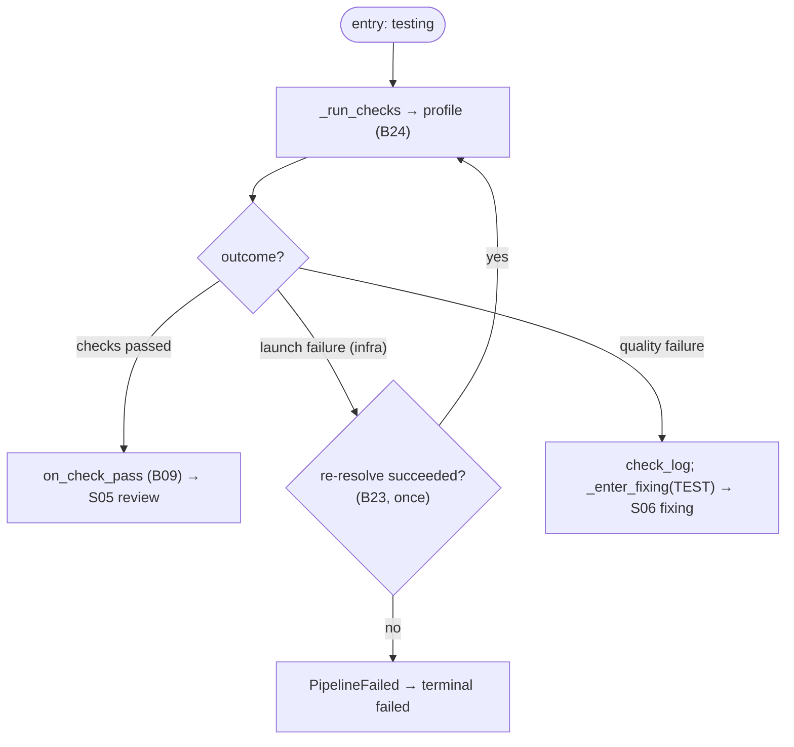

# S04 — testing stage

## Purpose

The first unit quality gate: run the allowed check profile (tests/linters) and decide pass/fail. This is **not an agent** stage — checks are run by the Check Runner. Optional (`SKIPPABLE`).

## Responsibility

- Run checks and branch on the outcome: pass → review; quality failure → fixing (ping-pong); launch failure → re-resolve or terminal failure ([orchestrator.py:1218-1242](../../../../src/wastech_orchestrator/core/orchestrator.py#L1218)).

## Step boundaries

### Within scope

- Branching on check outcome; resetting the test counter on pass; entering ping-pong on failure; handling a launch failure (re-resolve once).

### Out of scope

- **Running checks** (argv without shell, logs, distinguishing launch/quality) — [B24](../../blocks/B24-check-execution.md).
- **Check profile resolution** — [B23](../../blocks/B23-check-discovery.md); **loop limits** — [B09](../../blocks/B09-fix-loop-control.md).

## Entry points

- `_run_unit` branch `TESTING` ([orchestrator.py:1218](../../../../src/wastech_orchestrator/core/orchestrator.py#L1218)).
- `_run_checks(p, subtask)` ([orchestrator.py:2204](../../../../src/wastech_orchestrator/core/orchestrator.py#L2204)) → [B24](../../blocks/B24-check-execution.md).

## Input data and state

Check profile ([B23](../../blocks/B23-check-discovery.md)); working tree. Status `testing`. Artifacts — check logs ([B24](../../blocks/B24-check-execution.md)); on failure — `p.check_log` (path to the first failure log).

## Main scenario

1. `_run_checks` ([B24](../../blocks/B24-check-execution.md)).
2. `passed` → `on_check_pass` ([B09](../../blocks/B09-fix-loop-control.md)) → transition to `REVIEWING`.
3. `launch_failed` (infrastructure) → `_reresolve_on_launch_failure` ([B23](../../blocks/B23-check-discovery.md)) **once** → retry; otherwise → `PipelineFailed`.
4. Otherwise (quality failure) → store `check_log`, `_enter_fixing(TEST)` ([S06](./S06-fixing.md)/[B09](../../blocks/B09-fix-loop-control.md)) → ping-pong.

## Checks and constraints

- testing is in `SKIPPABLE_STAGES` ([schema.py:55-63](../../../../src/wastech_orchestrator/config/schema.py#L55)); when skipped, the skip is recorded at the implementation stage and `_after_edit_target` routes implementation/fixing directly to review.
- launch failure ≠ quality failure: only a launch failure can re-resolve commands (once); a quality failure does **not** change commands (§1.2, [B23](../../blocks/B23-check-discovery.md)/[B24](../../blocks/B24-check-execution.md)).
- The first failure short-circuits — remaining checks are not run ([B24](../../blocks/B24-check-execution.md)).

## Result / transition

pass → [S05 review](./S05-review.md); quality failure → [S06 fixing](./S06-fixing.md); launch failure → retry or terminal `failed`.

## Side effects

- Spawning check child processes and writing logs ([B24](../../blocks/B24-check-execution.md)/[B19](../../blocks/B19-subprocess-runner.md)); heartbeat ([B27](../../blocks/B27-observability.md)).

## Errors and edge cases

- Check cannot be launched and re-resolve did not help → `PipelineFailed` → terminal `failed` ([orchestrator.py:1230-1233](../../../../src/wastech_orchestrator/core/orchestrator.py#L1230)).
- Check timeout → failure → fixing ([B24](../../blocks/B24-check-execution.md)).

## Relations

### Uses

- [B24](../../blocks/B24-check-execution.md), [B23](../../blocks/B23-check-discovery.md), [B09](../../blocks/B09-fix-loop-control.md), [B19](../../blocks/B19-subprocess-runner.md), [B27](../../blocks/B27-observability.md).

### Used by

- [S05 review](./S05-review.md) (pass) / [S06 fixing](./S06-fixing.md) (failure); [B06](../../blocks/B06-orchestrator-pipeline.md) — driver.

## Position in the flow

The first of two unit quality gates; together with review it forms a ping-pong with fixing. See [flow overview](./index.md).

## Code confirmation

- [orchestrator.py:1218-1242](../../../../src/wastech_orchestrator/core/orchestrator.py#L1218) — `TESTING` branch.
- [orchestrator.py:982-1015](../../../../src/wastech_orchestrator/core/orchestrator.py#L982) — `_reresolve_on_launch_failure`.
- [orchestrator.py:2204-2211](../../../../src/wastech_orchestrator/core/orchestrator.py#L2204) — `_run_checks`.
- Tests: [tests/check/test_check_runner.py](../../../../tests/check/test_check_runner.py), [tests/core/test_check_discovery_hitl.py](../../../../tests/core/test_check_discovery_hitl.py), [tests/core/test_orchestrator.py](../../../../tests/core/test_orchestrator.py).
