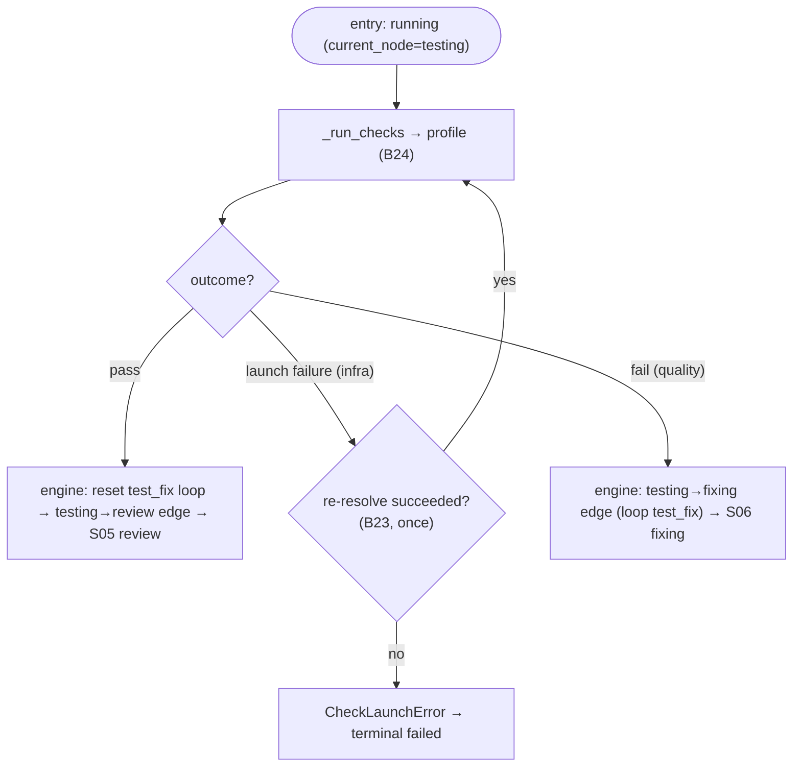

# S04 — testing stage

## Purpose

The first unit quality gate: run the allowed check profile (tests/linters) and decide pass/fail. This is **not an agent** stage — checks are run by the Check Runner. Optional (`SKIPPABLE`).

- Run checks and return a `pass`/`fail` outcome; the engine takes the matching edge (pass → review, fail → fixing with `loop: test_fix`). A launch failure is re-resolved once (gated) or raises `CheckLaunchError` ([nodes/checks.py:25](../../../../src/wastech_orchestrator/core/flow/nodes/checks.py#L25), `run()` at [nodes/checks.py:32](../../../../src/wastech_orchestrator/core/flow/nodes/checks.py#L32)).
- **Mutation guard (P2.4, core-owned).** The runner snapshots the working tree before and after the checks; if a _passing_ check mutated commit-candidate files (e.g. an auto-formatter rewrote sources), it fails closed to `NodeManualRequired` — a green-but-dirtying check must not pass silently. The guard is a property of the `checks` node (it cannot be declared away by a flow) and is active whenever a `checks` node is present; a flow without one simply has no guard. No-op when no snapshot hook is wired.

## Step boundaries

### Within scope

- Running checks and returning the `pass`/`fail` outcome; handling a launch failure (re-resolve once). (The edge selection and the test_fix counter reset on pass are the engine's, not the node's.)

### Out of scope

- **Running checks** (argv without shell, logs, distinguishing launch/quality) — [B24](../../blocks/B24-check-execution.md).
- **Check profile resolution** — [B23](../../blocks/B23-check-discovery.md); **loop limits** — [B09](../../blocks/B09-fix-loop-control.md).

## Entry points

- `ChecksNodeRunner.run` for the `testing` node ([nodes/checks.py:32](../../../../src/wastech_orchestrator/core/flow/nodes/checks.py#L32)) → [B24](../../blocks/B24-check-execution.md). The skip is the engine's `when: config.testing_enabled` check ([engine.py:291-312](../../../../src/wastech_orchestrator/core/flow/engine.py#L291)).
- `check_reresolve` callback — the runner re-resolves the command set once on a launch failure ([nodes/checks.py:45-50](../../../../src/wastech_orchestrator/core/flow/nodes/checks.py#L45)); the orchestrator injects it as `_engine_check_reresolve` ([orchestrator.py:977-981](../../../../src/wastech_orchestrator/core/orchestrator.py#L977), wired at [orchestrator.py:861](../../../../src/wastech_orchestrator/core/orchestrator.py#L861)).

## Input data and state

Check profile ([B23](../../blocks/B23-check-discovery.md)); working tree. The task status is `running` (`current_node = testing`). Artifacts — check logs ([B24](../../blocks/B24-check-execution.md)); on failure — the path to the first failure log.

## Main scenario

1. `_run_checks` ([B24](../../blocks/B24-check-execution.md)).
2. `passed` → outcome `pass`; the engine takes the `testing → review` edge and resets the `test_fix` loop counter as it leaves the node.
3. `launch_failed` (infrastructure) → `check_reresolve` ([B23](../../blocks/B23-check-discovery.md)) **once** → retry; otherwise → `CheckLaunchError` (never a `fail` outcome).
4. Otherwise (quality failure) → outcome `fail`; the engine takes the `testing → fixing` edge (`loop: test_fix`, [S06](./S06-fixing.md)/[B09](../../blocks/B09-fix-loop-control.md)) → ping-pong.

## Checks and constraints

- testing is in `SKIPPABLE_STAGES` ([schema.py:66-74](../../../../src/wastech_orchestrator/config/schema.py#L66)); when the `when: config.testing_enabled` node condition is false the engine records the skip and the node yields its pass-through `pass` outcome, so the `testing → review` edge is taken (and the `fixing → testing` return edge reaches a skipped node that immediately passes through to review) ([engine.py:303-312](../../../../src/wastech_orchestrator/core/flow/engine.py#L303)).
- launch failure ≠ quality failure: only a launch failure can re-resolve commands (once); a quality failure does **not** change commands (§1.2, [B23](../../blocks/B23-check-discovery.md)/[B24](../../blocks/B24-check-execution.md)).
- mutation guard: a passing check that changed the working-tree diff checksum across the run → `NodeManualRequired` (terminal `manual_action_required`), recorded as a `dirtied_working_tree` node run ([nodes/checks.py](../../../../src/wastech_orchestrator/core/flow/nodes/checks.py)).
- The first failure short-circuits — remaining checks are not run ([B24](../../blocks/B24-check-execution.md)).

## Result / transition

pass → [S05 review](./S05-review.md); quality failure → [S06 fixing](./S06-fixing.md); launch failure → retry or terminal `failed`.

## Side effects

- Spawning check child processes and writing logs ([B24](../../blocks/B24-check-execution.md)/[B19](../../blocks/B19-subprocess-runner.md)); heartbeat ([B27](../../blocks/B27-observability.md)).

## Errors and edge cases

- Check cannot be launched and re-resolve did not help → `CheckLaunchError` (a `NodeInfraError`) → terminal `failed` ([nodes/checks.py:51-57](../../../../src/wastech_orchestrator/core/flow/nodes/checks.py#L51)).
- Check timeout → `fail` outcome → fixing ([B24](../../blocks/B24-check-execution.md)).

## Relations

### Uses

- [B24](../../blocks/B24-check-execution.md), [B23](../../blocks/B23-check-discovery.md), [B09](../../blocks/B09-fix-loop-control.md), [B19](../../blocks/B19-subprocess-runner.md), [B27](../../blocks/B27-observability.md).

### Used by

- [S05 review](./S05-review.md) (pass) / [S06 fixing](./S06-fixing.md) (failure); [B06](../../blocks/B06-orchestrator-pipeline.md) — driver.

## Position in the flow

The first of two unit quality gates; together with review it forms a ping-pong with fixing. See [flow overview](./index.md).

## Code confirmation

- [nodes/checks.py:25](../../../../src/wastech_orchestrator/core/flow/nodes/checks.py#L25) — `ChecksNodeRunner`; `run()` (outcome `pass`/`fail`, launch re-resolve) at [nodes/checks.py:32](../../../../src/wastech_orchestrator/core/flow/nodes/checks.py#L32).
- [orchestrator.py:977-981](../../../../src/wastech_orchestrator/core/orchestrator.py#L977) — `_engine_check_reresolve` (the gated once-per-task re-resolve callback).
- [implementation.yaml:73-74](../../../../src/wastech_orchestrator/core/flow/packaged/implementation.yaml#L73) — the `testing → review` (pass) / `testing → fixing` (fail, `loop: test_fix`) edges.
- Tests: [tests/check/test_check_runner.py](../../../../tests/check/test_check_runner.py), [tests/core/test_flow_node_runners.py](../../../../tests/core/test_flow_node_runners.py), [tests/core/test_check_discovery_hitl.py](../../../../tests/core/test_check_discovery_hitl.py), [tests/core/test_orchestrator.py](../../../../tests/core/test_orchestrator.py).
