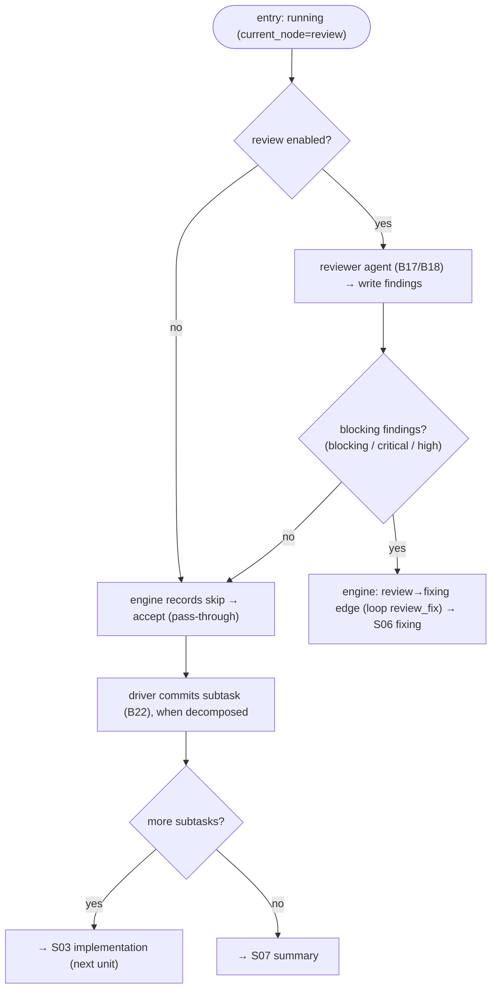

# S05 — review stage

## Purpose

The second quality gate: a reviewer agent looks for blocking issues. This stage is optional (`SKIPPABLE`, requires `agents.allow_review_skip`). When blocking findings are detected — ping-pong into fixing; otherwise — commit the unit and proceed to the next unit or to summary.

- Run the reviewer agent (read-only), classify findings by severity, and return a verdict outcome: no blockers → `accept`, blocking findings → `rework`. The engine takes the matching edge (`review → summary` on accept, `review → fixing` with `loop: review_fix` on rework) ([nodes/evaluator.py:35](../../../../src/wastech_orchestrator/core/flow/nodes/evaluator.py#L35), `run()` at [nodes/evaluator.py:42](../../../../src/wastech_orchestrator/core/flow/nodes/evaluator.py#L42)).

## Step boundaries

- Running the review; determining "blocking" findings; writing the findings artifact; returning the `accept`/`rework` outcome. (The cycle-counter reset on accept, the subtask commit between region runs, and the next-unit/summary routing are the engine's and the driver's, not the node's.)

### Outside the step's responsibility

- **Agent launch** — [B17](../../blocks/B17-agent-router-and-fallback.md)/[B18](../../blocks/B18-agent-providers.md); **output validation** — [B12](../../blocks/B12-hitl-and-typed-output.md).
- **Cycle limits** — [B09](../../blocks/B09-fix-loop-control.md); **subtask commit** — [B22](../../blocks/B22-git-manager.md).

## Entry points

- `EvaluatorNodeRunner.run` for the `review` node ([nodes/evaluator.py:42](../../../../src/wastech_orchestrator/core/flow/nodes/evaluator.py#L42)); the skip is the engine's `when: config.review_enabled` check ([engine.py:291-312](../../../../src/wastech_orchestrator/core/flow/engine.py#L291)).
- `_write_findings(...)` ([nodes/evaluator.py:99](../../../../src/wastech_orchestrator/core/flow/nodes/evaluator.py#L99)) — persists the findings artifact and exposes it downstream as `{review_path}`.

## Input data and state

Typed review output; the set of blocking severities `_BLOCKING_SEVERITIES = {blocking, critical, high}` ([nodes/evaluator.py:32](../../../../src/wastech_orchestrator/core/flow/nodes/evaluator.py#L32)). The task status is `running` (`current_node = review`). Artifacts — `review/*` (findings).

## Main scenario

1. **Skip** (`config.review_enabled` false): the engine records the skip; an evaluator node yields its pass-through `accept` outcome → `review → summary` edge.
2. Otherwise: the `EvaluatorNodeRunner` runs the reviewer agent ([B17](../../blocks/B17-agent-router-and-fallback.md)/[B18](../../blocks/B18-agent-providers.md)) → writes the findings → maps the verdict.
3. **No blockers** → `accept`; the engine takes the `review → summary` edge and resets the `review_fix` loop counter as it leaves the node. When decomposed, the driver commits the subtask between region runs ([B22](../../blocks/B22-git-manager.md)).
4. **Blockers** → `rework`; the engine takes the `review → fixing` edge (`loop: review_fix`, [S06](./S06-fixing.md)/[B09](../../blocks/B09-fix-loop-control.md)) → ping-pong.

## Checks and constraints

- review is in `SKIPPABLE_STAGES` ([schema.py:66-74](../../../../src/wastech_orchestrator/config/schema.py#L66)); review-skip (the `when: config.review_enabled` node condition) requires `agents.allow_review_skip` (validated on entry, [B16](../../blocks/B16-task-parsing-and-validation-gate.md)/[B05](../../blocks/B05-configuration.md)).
- "Blocking" = severities `blocking`/`critical`/`high` ([nodes/evaluator.py:32](../../../../src/wastech_orchestrator/core/flow/nodes/evaluator.py#L32), `_is_blocking` at [nodes/evaluator.py:192-196](../../../../src/wastech_orchestrator/core/flow/nodes/evaluator.py#L192)).
- `review` is a **blocking** evaluator: it reworks every time it finds a blocking issue, and the engine's named-loop budget bounds the cycles (exhaustion → manual). The shared evaluator runner also supports **non-blocking** evaluators (e.g. a `test_quality` node an operator adds to their own flow, P2.4): a non-blocking evaluator reworks only until its own per-instance budget (`max_rework_per_stage`) is spent — counted from its immutable `in_flow_verdict` rows — then takes `accept` (→ continue), never manual ([nodes/evaluator.py](../../../../src/wastech_orchestrator/core/flow/nodes/evaluator.py), `_verdict`). It is not part of the default packaged flow.
- Each subtask (including the last one) receives a local commit on the single branch — the driver commits between region runs, not the node ([orchestrator.py:963-970](../../../../src/wastech_orchestrator/core/orchestrator.py#L963), [B22](../../blocks/B22-git-manager.md) §5.1).

## Result / transition

No blockers and more subtasks remain → next [S03 implementation](./S03-implementation.md); otherwise → [S07 summary](./S07-summary.md). Blockers → [S06 fixing](./S06-fixing.md).

## Side effects

- Writing `review/*`; local subtask commit ([B22](../../blocks/B22-git-manager.md)); agent launch ([B18](../../blocks/B18-agent-providers.md)).

## Errors and edge cases

- No review result (infrastructure failure on all attempts) → `NodeInfraError` → terminal stage failure ([B17](../../blocks/B17-agent-router-and-fallback.md)).
- On `accept` the engine resets the `review_fix` loop counter as it leaves the node ([engine.py:363-375](../../../../src/wastech_orchestrator/core/flow/engine.py#L363)).

## Connections

### Uses

- [B17](../../blocks/B17-agent-router-and-fallback.md)/[B18](../../blocks/B18-agent-providers.md), [B12](../../blocks/B12-hitl-and-typed-output.md), [B09](../../blocks/B09-fix-loop-control.md), [B22](../../blocks/B22-git-manager.md) (subtask commit).

### Used by

- [S06 fixing](./S06-fixing.md) (blockers) / [S03 implementation](./S03-implementation.md) (next subtask) / [S07 summary](./S07-summary.md); [B06](../../blocks/B06-orchestrator-pipeline.md) — driver.

## Position in the flow

The second quality gate; the unit commit point and the "more subtasks?" branch. See the [flow overview](./index.md).

## Code confirmation

- [nodes/evaluator.py:35](../../../../src/wastech_orchestrator/core/flow/nodes/evaluator.py#L35) — `EvaluatorNodeRunner`; `run()` (verdict → accept/rework) at [nodes/evaluator.py:42](../../../../src/wastech_orchestrator/core/flow/nodes/evaluator.py#L42).
- [nodes/evaluator.py:32,192-196](../../../../src/wastech_orchestrator/core/flow/nodes/evaluator.py#L32) — `_BLOCKING_SEVERITIES` / `_is_blocking`.
- [orchestrator.py:963-970](../../../../src/wastech_orchestrator/core/orchestrator.py#L963) — `_commit_subtask` (subtask commit between region runs).
- [implementation.yaml:75-76](../../../../src/wastech_orchestrator/core/flow/packaged/implementation.yaml#L75) — the `review → summary` (accept) / `review → fixing` (rework, `loop: review_fix`) edges.
- Tests: [tests/core/test_flow_node_runners.py](../../../../tests/core/test_flow_node_runners.py), [tests/core/test_orchestrator.py](../../../../tests/core/test_orchestrator.py).
