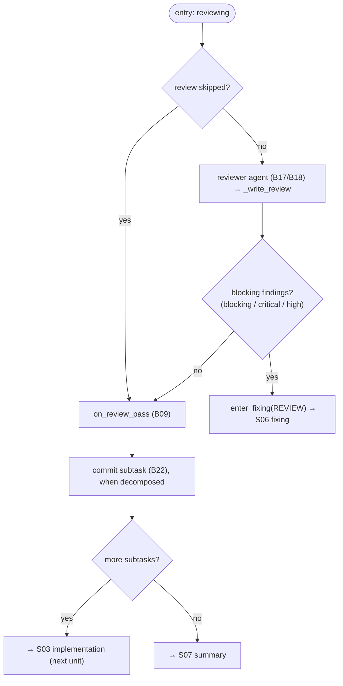

# S05 — review stage

## Purpose

The second quality gate: a reviewer agent looks for blocking issues. This stage is optional (`SKIPPABLE`, requires `agents.allow_review_skip`). When blocking findings are detected — ping-pong into fixing; otherwise — commit the unit and proceed to the next unit or to summary.

## Responsibility

- Launch the review (or skip it), classify findings by severity, and branch: no blockers → commit unit/proceed; blockers → fixing ([orchestrator.py:1244-1263](../../../../src/wastech_orchestrator/core/orchestrator.py#L1244)).

## Step boundaries

### Within the step's responsibility

- Running/skipping the review; determining "blocking" findings; resetting cycle counters on pass; committing the subtask and transitioning to the next unit/summary (`_on_review_passed`).

### Outside the step's responsibility

- **Agent launch** — [B17](../../blocks/B17-agent-router-and-fallback.md)/[B18](../../blocks/B18-agent-providers.md); **output validation** — [B12](../../blocks/B12-hitl-and-typed-output.md).
- **Cycle limits** — [B09](../../blocks/B09-fix-loop-control.md); **subtask commit** — [B22](../../blocks/B22-git-manager.md).

## Entry points

- `_run_unit` branch `REVIEWING` ([orchestrator.py:1244](../../../../src/wastech_orchestrator/core/orchestrator.py#L1244)).
- `_write_review(...)` ([orchestrator.py:2304](../../../../src/wastech_orchestrator/core/orchestrator.py#L2304)); `_on_review_passed(...)` ([orchestrator.py:1276](../../../../src/wastech_orchestrator/core/orchestrator.py#L1276)).

## Input data and state

Typed review output; the set of blocking severities `_BLOCKING_SEVERITIES = {blocking, critical, high}` ([orchestrator.py:137](../../../../src/wastech_orchestrator/core/orchestrator.py#L137)). Status `reviewing`. Artifacts — `review/*` (findings).

## Main scenario

1. **Skip** (review in skip): `record_skip` + `on_review_pass` → `_on_review_passed`.
2. Otherwise: `_run_stage(REVIEW)` ([B17](../../blocks/B17-agent-router-and-fallback.md)/[B18](../../blocks/B18-agent-providers.md)) → `_write_review` → blockers present?
3. **No blockers** → `on_review_pass` ([B09](../../blocks/B09-fix-loop-control.md)) → `_on_review_passed`: commit subtask ([B22](../../blocks/B22-git-manager.md)), then next unit or summary.
4. **Blockers** → `_enter_fixing(REVIEW)` ([S06](./S06-fixing.md)/[B09](../../blocks/B09-fix-loop-control.md)) → ping-pong.

## Checks and constraints

- review is in `SKIPPABLE_STAGES`; review-skip requires `agents.allow_review_skip` (validated on entry, [B16](../../blocks/B16-task-parsing-and-validation-gate.md)/[B05](../../blocks/B05-configuration.md)).
- "Blocking" = severities `blocking`/`critical`/`high` ([orchestrator.py:137](../../../../src/wastech_orchestrator/core/orchestrator.py#L137)).
- Each subtask (including the last one) receives a local commit on the single branch ([B22](../../blocks/B22-git-manager.md), §5.1).

## Result / transition

No blockers and more subtasks remain → next [S03 implementation](./S03-implementation.md); otherwise → [S07 summary](./S07-summary.md). Blockers → [S06 fixing](./S06-fixing.md).

## Side effects

- Writing `review/*`; local subtask commit ([B22](../../blocks/B22-git-manager.md)); agent launch ([B18](../../blocks/B18-agent-providers.md)).

## Errors and edge cases

- No review result (infrastructure failure on all attempts) → terminal stage failure ([B17](../../blocks/B17-agent-router-and-fallback.md)).
- `on_review_pass` resets **both** cycle counters ([B09](../../blocks/B09-fix-loop-control.md)).

## Connections

### Uses

- [B17](../../blocks/B17-agent-router-and-fallback.md)/[B18](../../blocks/B18-agent-providers.md), [B12](../../blocks/B12-hitl-and-typed-output.md), [B09](../../blocks/B09-fix-loop-control.md), [B22](../../blocks/B22-git-manager.md) (subtask commit).

### Used by

- [S06 fixing](./S06-fixing.md) (blockers) / [S03 implementation](./S03-implementation.md) (next subtask) / [S07 summary](./S07-summary.md); [B06](../../blocks/B06-orchestrator-pipeline.md) — driver.

## Position in the flow

The second quality gate; the unit commit point and the "more subtasks?" branch. See the [flow overview](./index.md).

## Code confirmation

- [orchestrator.py:1244-1296](../../../../src/wastech_orchestrator/core/orchestrator.py#L1244) — `REVIEWING` branch + `_on_review_passed`.
- [orchestrator.py:137](../../../../src/wastech_orchestrator/core/orchestrator.py#L137) — `_BLOCKING_SEVERITIES`.
- [orchestrator.py:2304-2334](../../../../src/wastech_orchestrator/core/orchestrator.py#L2304) — `_write_review`.
- Tests: [tests/core/test_orchestrator.py](../../../../tests/core/test_orchestrator.py).
