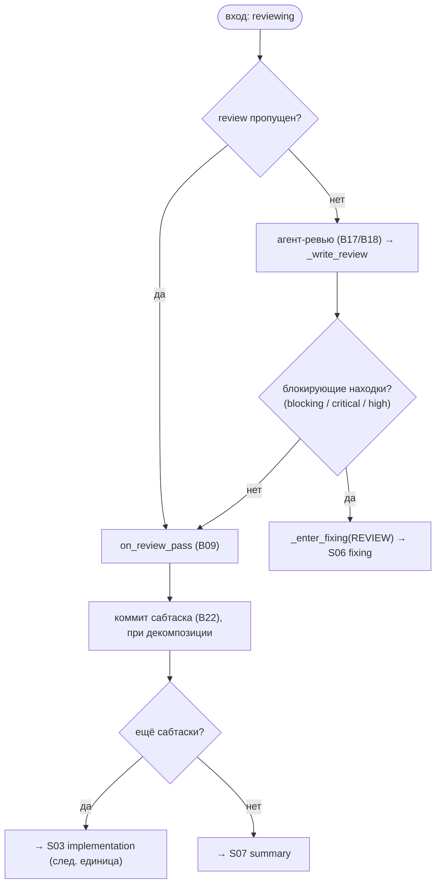

# S05 — Стадия review

## Назначение

Второй «ворот качества»: агент-ревьюер ищет блокирующие проблемы. Опциональна (`SKIPPABLE`, требует
`agents.allow_review_skip`). При блокирующих находках — ping-pong в fixing; иначе — коммит единицы и
переход к следующей единице или к summary.

## Ответственность

- Запустить ревью (или пропустить), классифицировать находки по severity и разветвить: без блокеров →
  коммит единицы/переход; блокеры → fixing ([orchestrator.py:1244-1263](../../../../src/wastech_orchestrator/core/orchestrator.py#L1244)).

## Границы шага

### Входит в ответственность шага

- Запуск/пропуск ревью; определение «блокирующих» находок; сброс циклов при прохождении; коммит
  сабтаска и переход к следующей единице/summary (`_on_review_passed`).

### Не входит в ответственность шага

- **Запуск агента** — [B17](../../blocks/B17-agent-router-and-fallback.md)/[B18](../../blocks/B18-agent-providers.md); **валидация вывода** — [B12](../../blocks/B12-hitl-and-typed-output.md).
- **Лимиты циклов** — [B09](../../blocks/B09-fix-loop-control.md); **коммит сабтаска** — [B22](../../blocks/B22-git-manager.md).

## Точки входа

- `_run_unit` ветка `REVIEWING` ([orchestrator.py:1244](../../../../src/wastech_orchestrator/core/orchestrator.py#L1244)).
- `_write_review(...)` ([orchestrator.py:2304](../../../../src/wastech_orchestrator/core/orchestrator.py#L2304)); `_on_review_passed(...)` ([orchestrator.py:1276](../../../../src/wastech_orchestrator/core/orchestrator.py#L1276)).

## Входные данные и состояние

Типизированный вывод ревью; набор блокирующих severity `_BLOCKING_SEVERITIES = {blocking, critical,
high}` ([orchestrator.py:137](../../../../src/wastech_orchestrator/core/orchestrator.py#L137)). Статус
`reviewing`. Артефакты — `review/*` (findings).

## Основной сценарий

1. **Пропуск** (review в skip): `record_skip` + `on_review_pass` → `_on_review_passed`.
2. Иначе: `_run_stage(REVIEW)` ([B17](../../blocks/B17-agent-router-and-fallback.md)/[B18](../../blocks/B18-agent-providers.md)) → `_write_review` → есть блокеры?
3. **Нет блокеров** → `on_review_pass` ([B09](../../blocks/B09-fix-loop-control.md)) → `_on_review_passed`: коммит сабтаска ([B22](../../blocks/B22-git-manager.md)), затем следующая единица или summary.
4. **Блокеры** → `_enter_fixing(REVIEW)` ([S06](./S06-fixing.md)/[B09](../../blocks/B09-fix-loop-control.md)) → ping-pong.

## Проверки и ограничения

- review в `SKIPPABLE_STAGES`; review-skip требует `agents.allow_review_skip` (валидируется на входе, [B16](../../blocks/B16-task-parsing-and-validation-gate.md)/[B05](../../blocks/B05-configuration.md)).
- «Блокирующие» = severities `blocking`/`critical`/`high` ([orchestrator.py:137](../../../../src/wastech_orchestrator/core/orchestrator.py#L137)).
- Каждый сабтаск (включая последний) получает локальный коммит на единственной ветке ([B22](../../blocks/B22-git-manager.md), §5.1).

## Результат / переход

Без блокеров и есть ещё сабтаски → следующая [S03 implementation](./S03-implementation.md); иначе →
[S07 summary](./S07-summary.md). Блокеры → [S06 fixing](./S06-fixing.md).

## Побочные эффекты

- Запись `review/*`; локальный коммит сабтаска ([B22](../../blocks/B22-git-manager.md)); запуск агента ([B18](../../blocks/B18-agent-providers.md)).

## Ошибки и граничные случаи

- Нет результата ревью (инфра-сбой всех попыток) → терминальный провал стадии ([B17](../../blocks/B17-agent-router-and-fallback.md)).
- `on_review_pass` сбрасывает **оба** цикла счётчиков ([B09](../../blocks/B09-fix-loop-control.md)).

## Связи

### Использует

- [B17](../../blocks/B17-agent-router-and-fallback.md)/[B18](../../blocks/B18-agent-providers.md), [B12](../../blocks/B12-hitl-and-typed-output.md), [B09](../../blocks/B09-fix-loop-control.md), [B22](../../blocks/B22-git-manager.md) (коммит сабтаска).

### Используется в

- [S06 fixing](./S06-fixing.md) (блокеры) / [S03 implementation](./S03-implementation.md) (следующий сабтаск) / [S07 summary](./S07-summary.md); [B06](../../blocks/B06-orchestrator-pipeline.md) — драйвер.

## Место в потоке

Второй ворот качества; точка коммита единицы и развилки «ещё сабтаски?». См. [обзор потока](./index.md).

## Подтверждение в коде

- [orchestrator.py:1244-1296](../../../../src/wastech_orchestrator/core/orchestrator.py#L1244) — ветка `REVIEWING` + `_on_review_passed`.
- [orchestrator.py:137](../../../../src/wastech_orchestrator/core/orchestrator.py#L137) — `_BLOCKING_SEVERITIES`.
- [orchestrator.py:2304-2334](../../../../src/wastech_orchestrator/core/orchestrator.py#L2304) — `_write_review`.
- Тесты: [tests/core/test_orchestrator.py](../../../../tests/core/test_orchestrator.py).
