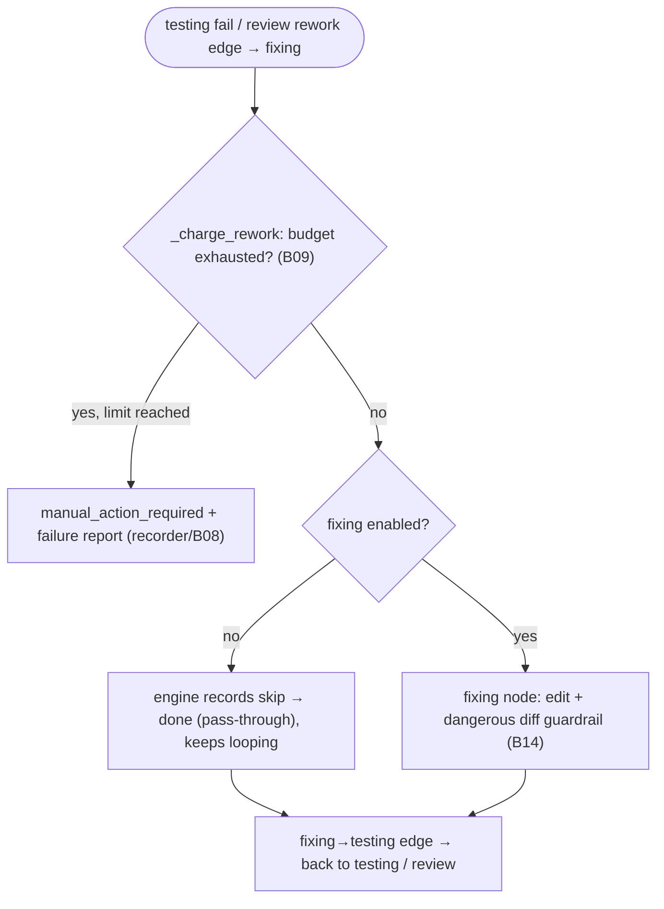

# S06 — fixing stage

## Purpose

The goal is a ping-pong loop: after a test failure or a blocking review, the agent edits the code and the engine routes the `fixing → testing` edge back to the quality gates. The `fixing` node is reached **only** via a `fail`/`rework` edge. Each such edge is charged against the engine's loop counters ([B09](../../blocks/B09-fix-loop-control.md)); when a limit is exhausted the engine ends the run at `manual_action_required` with a failure report.

## Responsibility

- Run the editing agent with the dangerous-diff guard — the `fixing` node is an `agent` node (`role_file: roles/fixing.md`), run by the same `AgentNodeRunner` + `_apply_post_edit_guard` as implementation ([nodes/agent.py:65](../../../../src/wastech_orchestrator/core/flow/nodes/agent.py#L65), guard at [nodes/agent.py:235](../../../../src/wastech_orchestrator/core/flow/nodes/agent.py#L235)).
- Return an unconditional `done` outcome; the engine takes the `fixing → testing` edge (reaching `review` when testing is skipped, via the pass-through).

## Step boundaries

- Running the edit stage of fixing with the guardrail; returning the `done` outcome. (The "stuck/disabled" decision and the budget charge are the engine's, not the node's.)

### Outside this step's responsibility

- **Counter rules and limits, the stuck decision** — the engine ([engine.py:342-382](../../../../src/wastech_orchestrator/core/flow/engine.py#L342))/[B09](../../blocks/B09-fix-loop-control.md); **failure report** — `StateStoreRunRecorder.write_failure_report` ([recorder.py:47](../../../../src/wastech_orchestrator/core/flow/recorder.py#L47))/[B08](../../blocks/B08-ledger-and-failure-reports.md).
- **Dangerous diff classification** — [B14](../../blocks/B14-dangerous-diff-guardrail.md); **agent launch** — [B17](../../blocks/B17-agent-router-and-fallback.md)/[B18](../../blocks/B18-agent-providers.md).

## Entry points

- `AgentNodeRunner.run` for the `fixing` node ([nodes/agent.py:65](../../../../src/wastech_orchestrator/core/flow/nodes/agent.py#L65)) — the actual edit (same `_apply_post_edit_guard` as in [S03](./S03-implementation.md)).
- The budget charge that gates entry is the engine's `_charge_rework` on the inbound `fail`/`rework` edge ([engine.py:342-361](../../../../src/wastech_orchestrator/core/flow/engine.py#L342)).

## Input data and state

The run's `loop_counters` in `FlowRunState` (named loops `test_fix`/`review_fix` + the global counter, [B09](../../blocks/B09-fix-loop-control.md)); the failure context (the checks log / review findings) is read by the agent from `{checks_path}` / `{review_path}`. The task status is `running` (`current_node = fixing`).

## Main scenario

1. The engine takes a `fail`/`rework` edge into `fixing` and calls `_charge_rework`: it bumps the named loop counter + the global counter. If a cap is reached → `write_failure_report` (recorder) + `manual_action_required`.
2. Otherwise the engine sets `current_node = fixing`. If the node carries `when: config.fixing_enabled` and it is **false**, the engine records the skip and the node yields its pass-through `done` outcome — the `fixing → testing` edge is taken without editing, so the loop keeps charging the rework budget until it exhausts → `manual_action_required` + report.
3. Otherwise the `AgentNodeRunner` edits via the dangerous-diff guard ([B14](../../blocks/B14-dangerous-diff-guardrail.md)) and returns `done`; the engine takes the `fixing → testing` edge (reaching review when testing is skipped, via the pass-through).

## Checks and constraints

- fixing in `SKIPPABLE_STAGES` ([schema.py:66-74](../../../../src/wastech_orchestrator/config/schema.py#L66)): a disabled `fixing` node (`when: config.fixing_enabled` false) passes through every cycle, so the rework budget exhausts and the run ends at `manual_action_required` + report.
- Two limits enforced generically by the engine: the per-loop cap `min(flow_budget, agents.max_fix_cycles)` and the global cap `min(flow_budget, agents.max_total_fix_iterations)`; the global counter accumulates across all subtasks ([engine.py:377-382](../../../../src/wastech_orchestrator/core/flow/engine.py#L377), [B09](../../blocks/B09-fix-loop-control.md)).
- The dangerous diff guardrail applies here as well — same as in [S03](./S03-implementation.md).

## Result / transition

Back to [S04 testing](./S04-testing.md) (or to [S05 review](./S05-review.md) if testing is skipped). On stuck/disabled — terminal `manual_action_required` + `failure_report.json`/`stuck.md` ([B08](../../blocks/B08-ledger-and-failure-reports.md)).

## Side effects

- Writing `current.diff`; on stuck — failure report (recorder → [B08](../../blocks/B08-ledger-and-failure-reports.md)); agent editing of the working tree.

## Errors and edge cases

- Stuck on limit → the engine writes the failure report and returns `manual_action_required` ([engine.py:239-256](../../../../src/wastech_orchestrator/core/flow/engine.py#L239)).
- HITL guardrail failure / dangerous content remaining after rejection → `manual_action_required` (`NodeManualRequired`; see [S03](./S03-implementation.md), [B14](../../blocks/B14-dangerous-diff-guardrail.md)).

## Relations

### Uses

- [B09](../../blocks/B09-fix-loop-control.md), [B08](../../blocks/B08-ledger-and-failure-reports.md), [B14](../../blocks/B14-dangerous-diff-guardrail.md), [B17](../../blocks/B17-agent-router-and-fallback.md)/[B18](../../blocks/B18-agent-providers.md), [B22](../../blocks/B22-git-manager.md) (diff).

### Used by

- [S04 testing](./S04-testing.md)/[S05 review](./S05-review.md) — return after editing; [B06](../../blocks/B06-orchestrator-pipeline.md) — driver.

## Position in the flow

Closes the ping-pong loop: the only path from a checks/review failure back to the quality gates — or into manual resolution when the limit is exhausted. See [flow overview](./index.md).

## Code confirmation

- [nodes/agent.py:58](../../../../src/wastech_orchestrator/core/flow/nodes/agent.py#L58) — `AgentNodeRunner` (the `fixing` node runner, `role_file: roles/fixing.md`); guard at [nodes/agent.py:235](../../../../src/wastech_orchestrator/core/flow/nodes/agent.py#L235).
- [engine.py:342-382](../../../../src/wastech_orchestrator/core/flow/engine.py#L342) — `_charge_rework` / `_reset_loops_at` / the budget caps (the stuck decision).
- [recorder.py:47-69](../../../../src/wastech_orchestrator/core/flow/recorder.py#L47) — `write_failure_report` on exhaustion.
- [implementation.yaml:50-56,77](../../../../src/wastech_orchestrator/core/flow/packaged/implementation.yaml#L50) — the `fixing` node + the `fixing → testing` forward edge.
- Tests: [tests/core/test_flow_engine.py](../../../../tests/core/test_flow_engine.py), [tests/core/test_flow_node_runners.py](../../../../tests/core/test_flow_node_runners.py), [tests/core/test_orchestrator.py](../../../../tests/core/test_orchestrator.py).
