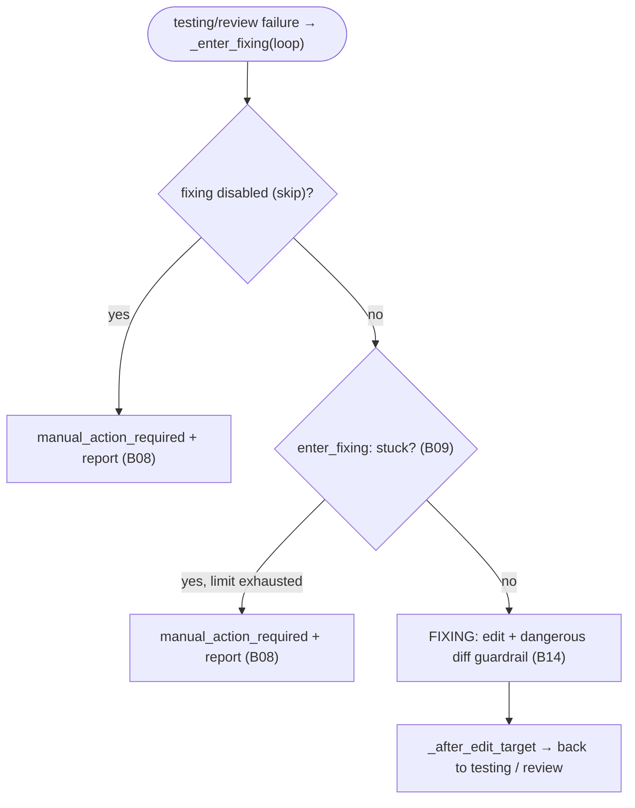

# S06 — fixing stage

## Purpose

The goal is a ping-pong loop: after a test failure or a blocking review, the agent edits the code and returns the unit to the checks/review gates. Entered **only** on failure. Operates under the limits in B09; when those are exhausted (or if fixing is disabled) — terminal `manual_action_required` with a failure report.

## Responsibility

- Decide whether to enter fixing: disabled (manual), stuck on limits (manual + report), or launch ([orchestrator.py:1468-1501](../../../../src/wastech_orchestrator/core/orchestrator.py#L1468)).
- Run the editing stage with the guardrail and return to testing/review ([orchestrator.py:1265-1274](../../../../src/wastech_orchestrator/core/orchestrator.py#L1265)).

## Step boundaries

### Within this step's responsibility

- The decision "fix / stuck / disabled"; launching the edit stage of fixing; returning to testing/review.

### Outside this step's responsibility

- **Counter rules and limits** — [B09](../../blocks/B09-fix-loop-control.md); **failure report** — [B08](../../blocks/B08-ledger-and-failure-reports.md).
- **Dangerous diff classification** — [B14](../../blocks/B14-dangerous-diff-guardrail.md); **agent launch** — [B17](../../blocks/B17-agent-router-and-fallback.md)/[B18](../../blocks/B18-agent-providers.md).

## Entry points

- `_enter_fixing(p, loop)` ([orchestrator.py:1468](../../../../src/wastech_orchestrator/core/orchestrator.py#L1468)) — called from testing/review on failure.
- `_run_unit` branch `FIXING` ([orchestrator.py:1265](../../../../src/wastech_orchestrator/core/orchestrator.py#L1265)) — the actual edit (same guardrail as in [S03](./S03-implementation.md)).

## Input data and state

`LoopCounters` ([B09](../../blocks/B09-fix-loop-control.md)); `FixLoop` (TEST/REVIEW); failure context (`fixing-context.json`: path to the checks log or to the review findings). Status `fixing`.

## Main scenario

1. `_enter_fixing`: if fixing is in skip → `record_skip` + report ([B08](../../blocks/B08-ledger-and-failure-reports.md)) + `manual_action_required` ("fixing disabled") — the first failure is immediately terminal.
2. Otherwise `enter_fixing` ([B09](../../blocks/B09-fix-loop-control.md)) increments counters; if `stuck` → report + `manual_action_required`.
3. Otherwise write `fixing-context.json`, transition to `FIXING`; edit via `_run_edit_stage_with_guardrail` ([B14](../../blocks/B14-dangerous-diff-guardrail.md)); `_after_edit_target` → back to testing (or to review if testing is skipped).

## Checks and constraints

- fixing in `SKIPPABLE_STAGES`: skip = "max_fix_attempts: 0" (first failure → manual + report).
- Two limits in B09: per-loop `max_fix_cycles` and global `max_total_fix_iterations` (accumulated across all subtasks).
- The dangerous diff guardrail applies here as well — same as in [S03](./S03-implementation.md).

## Result / transition

Back to [S04 testing](./S04-testing.md) (or to [S05 review](./S05-review.md) if testing is skipped). On stuck/disabled — terminal `manual_action_required` + `failure_report.json`/`stuck.md` ([B08](../../blocks/B08-ledger-and-failure-reports.md)).

## Side effects

- Writing `fixing-context.json`, `current.diff`; on stuck — failure report ([B08](../../blocks/B08-ledger-and-failure-reports.md)); agent editing of the working tree.

## Errors and edge cases

- Stuck on limit → `manual_action_required` + report ([orchestrator.py:1489-1497](../../../../src/wastech_orchestrator/core/orchestrator.py#L1489)).
- HITL guardrail failure / dangerous content remaining after rejection → `manual_action_required` (see [S03](./S03-implementation.md), [B14](../../blocks/B14-dangerous-diff-guardrail.md)).

## Relations

### Uses

- [B09](../../blocks/B09-fix-loop-control.md), [B08](../../blocks/B08-ledger-and-failure-reports.md), [B14](../../blocks/B14-dangerous-diff-guardrail.md), [B17](../../blocks/B17-agent-router-and-fallback.md)/[B18](../../blocks/B18-agent-providers.md), [B22](../../blocks/B22-git-manager.md) (diff).

### Used by

- [S04 testing](./S04-testing.md)/[S05 review](./S05-review.md) — return after editing; [B06](../../blocks/B06-orchestrator-pipeline.md) — driver.

## Position in the flow

Closes the ping-pong loop: the only path from a checks/review failure back to the quality gates — or into manual resolution when the limit is exhausted. See [flow overview](./index.md).

## Code confirmation

- [orchestrator.py:1468-1501](../../../../src/wastech_orchestrator/core/orchestrator.py#L1468) — `_enter_fixing` (skip / stuck / launch).
- [orchestrator.py:1265-1274](../../../../src/wastech_orchestrator/core/orchestrator.py#L1265) — `FIXING` branch in `_run_unit`.
- [orchestrator.py:1503-1514](../../../../src/wastech_orchestrator/core/orchestrator.py#L1503) — `_write_fixing_context`.
- Tests: [tests/core/test_loop_control.py](../../../../tests/core/test_loop_control.py), [tests/core/test_orchestrator.py](../../../../tests/core/test_orchestrator.py).
