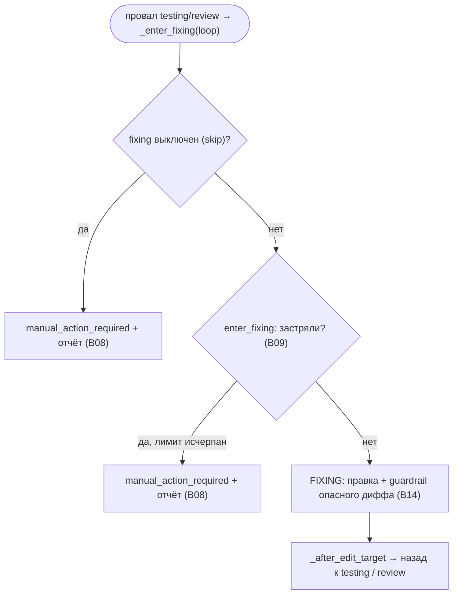

# S06 — Стадия fixing

## Назначение

Цель ping-pong: после провала тестов или блокирующего ревью агент правит код и возвращает единицу к проверкам/ревью. Входится **только** при провале. Работает под лимитами B09; при их исчерпании (или если fixing выключен) — терминальный `manual_action_required` с отчётом о провале.

## Ответственность

- Решить вход в fixing: выключено (manual), застревание по лимитам (manual + отчёт) или запуск ([orchestrator.py:1468-1501](../../../../src/wastech_orchestrator/core/orchestrator.py#L1468)).
- Прогнать редактирующую стадию с guardrail и вернуться к testing/review ([orchestrator.py:1265-1274](../../../../src/wastech_orchestrator/core/orchestrator.py#L1265)).

## Границы шага

### Входит в ответственность шага

- Решение «чинить / застрял / выключено»; запуск edit-стадии fixing; возврат к testing/review.

### Не входит в ответственность шага

- **Правила счётчиков и лимиты** — [B09](../../blocks/B09-fix-loop-control.md); **отчёт о провале** — [B08](../../blocks/B08-ledger-and-failure-reports.md).
- **Классификация опасного диффа** — [B14](../../blocks/B14-dangerous-diff-guardrail.md); **запуск агента** — [B17](../../blocks/B17-agent-router-and-fallback.md)/[B18](../../blocks/B18-agent-providers.md).

## Точки входа

- `_enter_fixing(p, loop)` ([orchestrator.py:1468](../../../../src/wastech_orchestrator/core/orchestrator.py#L1468)) — вызывается из testing/review при провале.
- `_run_unit` ветка `FIXING` ([orchestrator.py:1265](../../../../src/wastech_orchestrator/core/orchestrator.py#L1265)) — сама правка (тот же guardrail, что в [S03](./S03-implementation.md)).

## Входные данные и состояние

`LoopCounters` ([B09](../../blocks/B09-fix-loop-control.md)); `FixLoop` (TEST/REVIEW); контекст провала (`fixing-context.json`: путь к логу проверок или к находкам ревью). Статус `fixing`.

## Основной сценарий

1. `_enter_fixing`: если fixing в skip → `record_skip` + отчёт ([B08](../../blocks/B08-ledger-and-failure-reports.md)) + `manual_action_required` («fixing disabled») — первый провал сразу терминален.
2. Иначе `enter_fixing` ([B09](../../blocks/B09-fix-loop-control.md)) инкрементирует счётчики; если `stuck` → отчёт + `manual_action_required`.
3. Иначе записать `fixing-context.json`, перейти в `FIXING`; правка через `_run_edit_stage_with_guardrail` ([B14](../../blocks/B14-dangerous-diff-guardrail.md)); `_after_edit_target` → назад к testing (или к review, если testing пропущен).

## Проверки и ограничения

- fixing в `SKIPPABLE_STAGES`: пропуск = «max_fix_attempts: 0» (первый провал → manual + отчёт).
- Два лимита B09: per-loop `max_fix_cycles` и глобальный `max_total_fix_iterations` (копится через все сабтаски).
- Guardrail опасного диффа применяется и здесь — так же, как в [S03](./S03-implementation.md).

## Результат / переход

Назад к [S04 testing](./S04-testing.md) (или к [S05 review](./S05-review.md), если testing пропущен). При застревании/выключении — терминальный `manual_action_required` + `failure_report.json`/`stuck.md` ([B08](../../blocks/B08-ledger-and-failure-reports.md)).

## Побочные эффекты

- Запись `fixing-context.json`, `current.diff`; при застревании — отчёт о провале ([B08](../../blocks/B08-ledger-and-failure-reports.md)); правка рабочего дерева агентом.

## Ошибки и граничные случаи

- Застревание по лимиту → `manual_action_required` + отчёт ([orchestrator.py:1489-1497](../../../../src/wastech_orchestrator/core/orchestrator.py#L1489)).
- Сбой HITL guardrail / опасное осталось после отказа → `manual_action_required` (см. [S03](./S03-implementation.md), [B14](../../blocks/B14-dangerous-diff-guardrail.md)).

## Связи

### Использует

- [B09](../../blocks/B09-fix-loop-control.md), [B08](../../blocks/B08-ledger-and-failure-reports.md), [B14](../../blocks/B14-dangerous-diff-guardrail.md), [B17](../../blocks/B17-agent-router-and-fallback.md)/[B18](../../blocks/B18-agent-providers.md), [B22](../../blocks/B22-git-manager.md) (дифф).

### Используется в

- [S04 testing](./S04-testing.md)/[S05 review](./S05-review.md) — возврат после правки; [B06](../../blocks/B06-orchestrator-pipeline.md) — драйвер.

## Место в потоке

Закрывает петлю ping-pong: единственный путь из провала проверок/ревью обратно к воротам качества — или в ручной разбор при исчерпании лимита. См. [обзор потока](./index.md).

## Подтверждение в коде

- [orchestrator.py:1468-1501](../../../../src/wastech_orchestrator/core/orchestrator.py#L1468) — `_enter_fixing` (skip / stuck / запуск).
- [orchestrator.py:1265-1274](../../../../src/wastech_orchestrator/core/orchestrator.py#L1265) — ветка `FIXING` в `_run_unit`.
- [orchestrator.py:1503-1514](../../../../src/wastech_orchestrator/core/orchestrator.py#L1503) — `_write_fixing_context`.
- Тесты: [tests/core/test_loop_control.py](../../../../tests/core/test_loop_control.py), [tests/core/test_orchestrator.py](../../../../tests/core/test_orchestrator.py).
