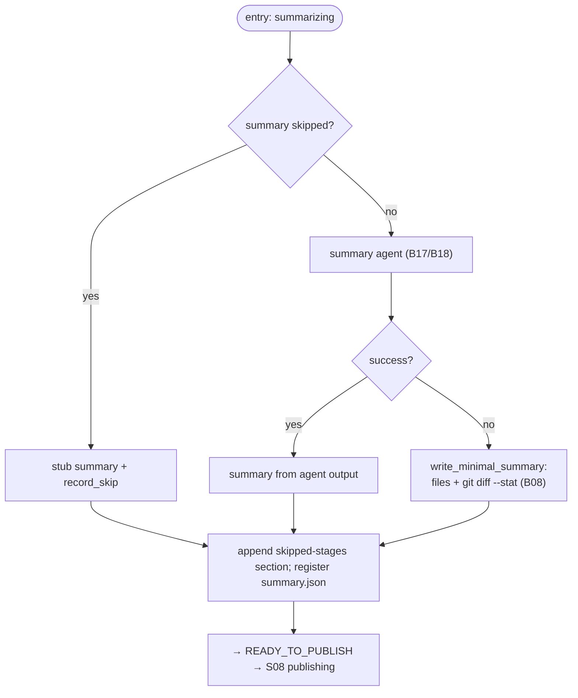

# S07 — summary stage

## Purpose

Prepare the body of the future PR (`summary.md`). The stage is **best-effort** and optional (`SKIPPABLE`): if it is skipped or no provider succeeds, a compact deterministic summary is written so that the PR always has a body.

## Responsibility

- Obtain a summary via one of three paths (agent / stub on skip / minimal when no agent), append the skipped-stages audit section, and transition to publishing ([orchestrator.py:1298-1326](../../../../src/wastech_orchestrator/core/orchestrator.py#L1298)).

## Step boundaries

### Within the step's responsibility

- Choosing the summary source; writing `summary.{md,json}`; the skipped-stages section; transitioning to publishing.

### Outside the step's responsibility

- **Minimal fallback summary** (`git diff --stat`, without the full patch) — [B08](../../blocks/B08-ledger-and-failure-reports.md).
- **Launching the agent** — [B17](../../blocks/B17-agent-router-and-fallback.md)/[B18](../../blocks/B18-agent-providers.md); **committing/moving the file** — [S08](./S08-publishing.md)/[B22](../../blocks/B22-git-manager.md).

## Entry points

- `_summary(p)` ([orchestrator.py:1298](../../../../src/wastech_orchestrator/core/orchestrator.py#L1298)) — called from `_run_units_and_finish` after the units loop.

## Input data and state

Result of the units' work (branch diff); optional output of the summary agent. Status `summarizing` → `ready_to_publish`. Artifacts — `summary.md` (next to the task, committed later) and `summary.json` (under `logs/`, not committed).

## Main scenario

1. **Skip** (summary in skip): stub summary, `record_skip`.
2. Otherwise `_run_stage(SUMMARY)` ([B17](../../blocks/B17-agent-router-and-fallback.md)/[B18](../../blocks/B18-agent-providers.md)): success → summary from agent output; otherwise best-effort `write_minimal_summary` (files + `git diff --stat`, without full patch; [B08](../../blocks/B08-ledger-and-failure-reports.md)).
3. Append the skipped-stages section; register `summary.json`; transition to `READY_TO_PUBLISH`.

## Checks and constraints

- summary is in `SKIPPABLE_STAGES` ([schema.py:55-63](../../../../src/wastech_orchestrator/config/schema.py#L55)).
- Best-effort: absence of an agent is **not** a task failure; a compact summary is written (without full patch/description; §5.2, [B08](../../blocks/B08-ledger-and-failure-reports.md)).
- `summary.md` — next to the task (committed during publishing); `summary.json` — working artifact under `logs/`, not committed.

## Result / transition

Transition to `READY_TO_PUBLISH` → [S08 publishing](./S08-publishing.md). Artifacts `summary.md`/`summary.json`.

## Side effects

- Writing `summary.md`/`summary.json`; launching the agent ([B18](../../blocks/B18-agent-providers.md)); on fallback — `git diff --stat` via [B22](../../blocks/B22-git-manager.md).

## Errors and edge cases

- No provider produced a summary → minimal summary (not a failure).
- The stage does not prompt a human (HITL is only for refinement/planning, [B12](../../blocks/B12-hitl-and-typed-output.md)).

## Relationships

### Uses

- [B17](../../blocks/B17-agent-router-and-fallback.md)/[B18](../../blocks/B18-agent-providers.md), [B08](../../blocks/B08-ledger-and-failure-reports.md) (minimal summary), [B22](../../blocks/B22-git-manager.md) (`diff_stat`).

### Used by

- [S08 publishing](./S08-publishing.md) — PR body; [B06](../../blocks/B06-orchestrator-pipeline.md) — driver.

## Position in the flow

Second-to-last stage: guarantees that the PR will have a body even without an agent. See [flow overview](./index.md).

## Code confirmation

- [orchestrator.py:1298-1326](../../../../src/wastech_orchestrator/core/orchestrator.py#L1298) — `_summary` (three sources, skipped-stages section, transition).
- [orchestrator.py:1425-1466](../../../../src/wastech_orchestrator/core/orchestrator.py#L1425) — `_summary_md_body` (summary body).
- Tests: [tests/core/test_ledger.py](../../../../tests/core/test_ledger.py) (minimal summary), [tests/core/test_orchestrator.py](../../../../tests/core/test_orchestrator.py).
