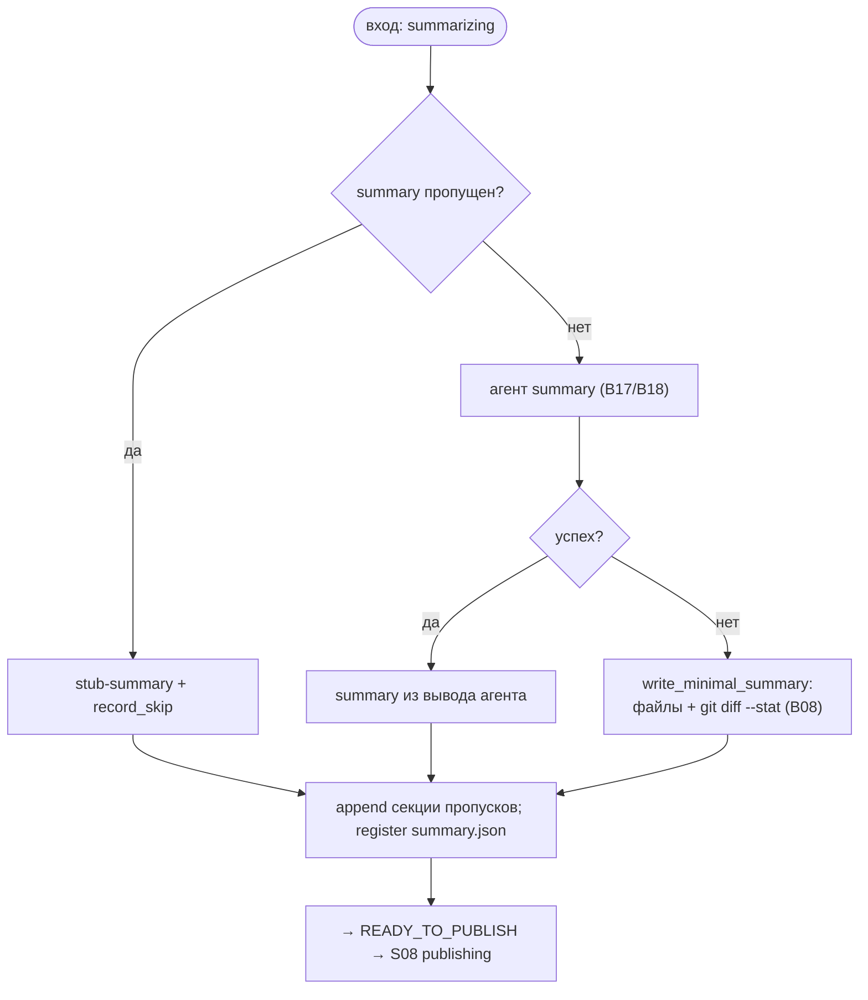

# S07 — Стадия summary

## Назначение

Подготовить тело будущего PR (`summary.md`). Стадия **best-effort** и опциональна (`SKIPPABLE`): если
её пропустить или ни один провайдер не справится — пишется компактный детерминированный summary, чтобы
у PR всегда было тело.

## Ответственность

- Получить summary одним из трёх путей (агент / stub при пропуске / минимальный при отсутствии
  агента), дописать аудит пропусков, перейти к публикации ([orchestrator.py:1298-1326](../../../../src/wastech_orchestrator/core/orchestrator.py#L1298)).

## Границы шага

### Входит в ответственность шага

- Выбор источника summary; запись `summary.{md,json}`; секция пропущенных стадий; переход к публикации.

### Не входит в ответственность шага

- **Минимальный fallback-summary** (`git diff --stat`, без полного патча) — [B08](../../blocks/B08-ledger-and-failure-reports.md).
- **Запуск агента** — [B17](../../blocks/B17-agent-router-and-fallback.md)/[B18](../../blocks/B18-agent-providers.md); **коммит/перенос файла** — [S08](./S08-publishing.md)/[B22](../../blocks/B22-git-manager.md).

## Точки входа

- `_summary(p)` ([orchestrator.py:1298](../../../../src/wastech_orchestrator/core/orchestrator.py#L1298)) — вызывается из `_run_units_and_finish` после цикла единиц.

## Входные данные и состояние

Итог работы единиц (дифф ветки); опц. вывод агента summary. Статус `summarizing` → `ready_to_publish`.
Артефакты — `summary.md` (рядом с задачей, коммитится позже) и `summary.json` (под `logs/`, не коммитится).

## Основной сценарий

1. **Пропуск** (summary в skip): stub-summary, `record_skip`.
2. Иначе `_run_stage(SUMMARY)` ([B17](../../blocks/B17-agent-router-and-fallback.md)/[B18](../../blocks/B18-agent-providers.md)): успех → summary из вывода агента; иначе best-effort `write_minimal_summary` (файлы + `git diff --stat`, без полного патча; [B08](../../blocks/B08-ledger-and-failure-reports.md)).
3. Дописать секцию пропущенных стадий; зарегистрировать `summary.json`; перейти в `READY_TO_PUBLISH`.

## Проверки и ограничения

- summary в `SKIPPABLE_STAGES` ([schema.py:55-63](../../../../src/wastech_orchestrator/config/schema.py#L55)).
- Best-effort: отсутствие агента — **не** провал задачи; пишется компактный summary (без полного патча/описания; §5.2, [B08](../../blocks/B08-ledger-and-failure-reports.md)).
- `summary.md` — рядом с задачей (коммитится при публикации); `summary.json` — рабочий артефакт под `logs/`, не коммитится.

## Результат / переход

Переход в `READY_TO_PUBLISH` → [S08 publishing](./S08-publishing.md). Артефакты `summary.md`/`summary.json`.

## Побочные эффекты

- Запись `summary.md`/`summary.json`; запуск агента ([B18](../../blocks/B18-agent-providers.md)); при fallback — `git diff --stat` через [B22](../../blocks/B22-git-manager.md).

## Ошибки и граничные случаи

- Ни один провайдер не дал summary → минимальный summary (а не провал).
- Стадия не запрашивает человека (HITL только refinement/planning, [B12](../../blocks/B12-hitl-and-typed-output.md)).

## Связи

### Использует

- [B17](../../blocks/B17-agent-router-and-fallback.md)/[B18](../../blocks/B18-agent-providers.md), [B08](../../blocks/B08-ledger-and-failure-reports.md) (минимальный summary), [B22](../../blocks/B22-git-manager.md) (`diff_stat`).

### Используется в

- [S08 publishing](./S08-publishing.md) — тело PR; [B06](../../blocks/B06-orchestrator-pipeline.md) — драйвер.

## Место в потоке

Предпоследняя стадия: гарантирует, что у PR будет тело даже без агента. См. [обзор потока](./index.md).

## Подтверждение в коде

- [orchestrator.py:1298-1326](../../../../src/wastech_orchestrator/core/orchestrator.py#L1298) — `_summary` (три источника, секция пропусков, переход).
- [orchestrator.py:1425-1466](../../../../src/wastech_orchestrator/core/orchestrator.py#L1425) — `_summary_md_body` (тело summary).
- Тесты: [tests/core/test_ledger.py](../../../../tests/core/test_ledger.py) (минимальный summary), [tests/core/test_orchestrator.py](../../../../tests/core/test_orchestrator.py).
