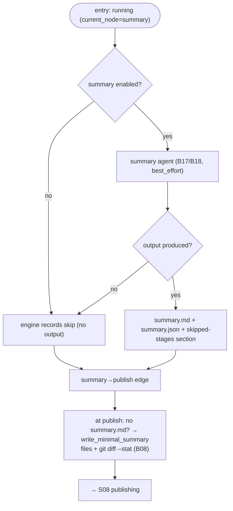

# S07 — summary stage

## Purpose

Prepare the body of the future PR (`summary.md`). The stage is **best-effort** and optional (`SKIPPABLE`): if it is skipped or no provider succeeds, a compact deterministic summary is written so that the PR always has a body.

- Obtain a summary via one of three paths (agent / skip / minimal fallback) and append the skipped-stages audit section. The `summary` node is a best-effort `agent` node (`when: config.summary_enabled`, `best_effort: true`); the engine then takes the `summary → publish` edge ([nodes/agent.py:65](../../../../src/wastech_orchestrator/core/flow/nodes/agent.py#L65); summary post-processing in `_engine_post_node` at [orchestrator.py:1022-1026](../../../../src/wastech_orchestrator/core/orchestrator.py#L1022)).

## Step boundaries

### Within the step's responsibility

- Choosing the summary source; writing `summary.{md,json}`; the skipped-stages section; transitioning to publishing.

### Outside the step's responsibility

- **Minimal fallback summary** (`git diff --stat`, without the full patch) — [B08](../../blocks/B08-ledger-and-failure-reports.md).
- **Launching the agent** — [B17](../../blocks/B17-agent-router-and-fallback.md)/[B18](../../blocks/B18-agent-providers.md); **committing/moving the file** — [S08](./S08-publishing.md)/[B22](../../blocks/B22-git-manager.md).

## Entry points

- `AgentNodeRunner.run` for the `summary` node ([nodes/agent.py:65](../../../../src/wastech_orchestrator/core/flow/nodes/agent.py#L65)); the skip is the engine's `when: config.summary_enabled` check ([engine.py:291-312](../../../../src/wastech_orchestrator/core/flow/engine.py#L291)).
- The minimal-summary fallback lives in `_summary_md_body` (called from `_finalize_task_artifacts` at publish time) ([orchestrator.py:1389-1401](../../../../src/wastech_orchestrator/core/orchestrator.py#L1389)).

## Input data and state

Result of the units' work (branch diff); optional output of the summary agent. The task status is `running` (`current_node = summary`). Artifacts — `summary.md` (next to the task, committed later) and `summary.json` (under `logs/`, not committed).

## Main scenario

1. **Skip** (`config.summary_enabled` false): the engine records the skip; no agent output. The minimal summary is written later at finalize.
2. Otherwise the `AgentNodeRunner` runs the summary agent ([B17](../../blocks/B17-agent-router-and-fallback.md)/[B18](../../blocks/B18-agent-providers.md)). Because the node is `best_effort`, an infra-exhausted run returns `done` with no output rather than failing the task ([nodes/agent.py:74-78](../../../../src/wastech_orchestrator/core/flow/nodes/agent.py#L74)). On output, the post-node hook writes `summary.json` + appends the skipped-stages section.
3. The engine takes the `summary → publish` edge. At publish, if no `summary.md` exists on disk, `_summary_md_body` writes the deterministic minimal summary (files + `git diff --stat`, without full patch; [B08](../../blocks/B08-ledger-and-failure-reports.md)).

## Checks and constraints

- summary is in `SKIPPABLE_STAGES` ([schema.py:66-74](../../../../src/wastech_orchestrator/config/schema.py#L66)).
- Best-effort (`best_effort: true` on the node): absence of an agent is **not** a task failure; a compact summary is written at publish (without full patch/description; §5.2, [B08](../../blocks/B08-ledger-and-failure-reports.md)).
- `summary.md` — next to the task (committed during publishing); `summary.json` — working artifact under `logs/`, not committed.

## Result / transition

Forward edge (`summary → publish`) to [S08 publishing](./S08-publishing.md); the task status stays `running`. Artifacts `summary.md`/`summary.json`.

## Side effects

- Writing `summary.md`/`summary.json`; launching the agent ([B18](../../blocks/B18-agent-providers.md)); on fallback — `git diff --stat` via [B22](../../blocks/B22-git-manager.md).

## Errors and edge cases

- No provider produced a summary → minimal summary (not a failure).
- The stage does not prompt a human (HITL is only for refinement/planning, [B12](../../blocks/B12-hitl-and-typed-output.md)).

## Relationships

### Uses

- [B17](../../blocks/B17-agent-router-and-fallback.md)/[B18](../../blocks/B18-agent-providers.md), [B08](../../blocks/B08-ledger-and-failure-reports.md) (minimal summary), [B22](../../blocks/B22-git-manager.md) (`diff_stat`).

### Used by

- [S08 publishing](./S08-publishing.md) — PR body; [B06](../../blocks/B06-orchestrator-pipeline.md) — driver.

## Position in the flow

Second-to-last stage: guarantees that the PR will have a body even without an agent. See [flow overview](./index.md).

## Code confirmation

- [nodes/agent.py:58](../../../../src/wastech_orchestrator/core/flow/nodes/agent.py#L58) — `AgentNodeRunner` (the best-effort `summary` node); the no-output fallback at [nodes/agent.py:74-78](../../../../src/wastech_orchestrator/core/flow/nodes/agent.py#L74).
- [orchestrator.py:1071-1079](../../../../src/wastech_orchestrator/core/orchestrator.py#L1071) — `_engine_write_summary_json` (the local-only summary.json + skipped-stages section, in the post-node hook).
- [orchestrator.py:1389-1401](../../../../src/wastech_orchestrator/core/orchestrator.py#L1389) — `_summary_md_body` (minimal-summary fallback at finalize).
- Tests: [tests/core/test_ledger.py](../../../../tests/core/test_ledger.py) (minimal summary), [tests/core/test_orchestrator.py](../../../../tests/core/test_orchestrator.py).
