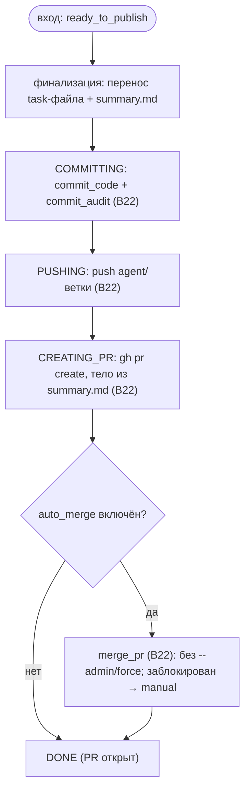

# S08 — Стадия publishing

## Назначение

Выход системы в Git/GitHub: закоммитить, запушить и открыть Pull Request (опционально — авто-merge).
Это **не агентская** стадия — всё делает Git Manager; агенты commit/push/PR не делают **никогда**.
publishing не пропускается.

## Ответственность

- Финализировать артефакты задачи, провести цепочку `commit → push → PR` (опц. merge) идемпотентно и
  завершить задачу ([orchestrator.py:1348-1386](../../../../src/wastech_orchestrator/core/orchestrator.py#L1348)).

## Границы шага

### Входит в ответственность шага

- Порядок и переходы публикации (`committing → pushing → creating_pr → done`); решение об авто-merge;
  терминальное завершение.

### Не входит в ответственность шага

- **Сами git/gh-операции, идемпотентность, scoped-стейджинг** — [B22](../../blocks/B22-git-manager.md).
- **Строки идемпотентности `publish_operations`** — [B07](../../blocks/B07-state-machine-and-store.md); **запись в ledger** — [B08](../../blocks/B08-ledger-and-failure-reports.md).

## Точки входа

- `_publish(p)` ([orchestrator.py:1348](../../../../src/wastech_orchestrator/core/orchestrator.py#L1348)) — вызывается из `_run_units_and_finish` после summary.
- `_auto_merge(p, pr_url)` ([orchestrator.py:1388](../../../../src/wastech_orchestrator/core/orchestrator.py#L1388)) — при включённом авто-merge.

## Входные данные и состояние

Ветка `agent/<id>-<slug>`, `summary.md` (тело PR), флаги `git.auto_merge*`. Статус `ready_to_publish` →
`committing` → `pushing` → `creating_pr` → `done`. Идемпотентность — через `publish_operations` ([B07](../../blocks/B07-state-machine-and-store.md)).

## Основной сценарий

1. Финализировать артефакты (перенос task-файла + `summary.md`) **до** коммита.
2. `COMMITTING`: `commit_code` (scoped-стейджинг кода) + `commit_audit` (`tasks/`) ([B22](../../blocks/B22-git-manager.md)).
3. `PUSHING`: `push` ветки в `origin` (отказ пушить в base) ([B22](../../blocks/B22-git-manager.md)).
4. `CREATING_PR`: `create_pr` (тело из `summary.md`) ([B22](../../blocks/B22-git-manager.md)).
5. (опц.) при `auto_merge` — `_auto_merge` → `merge_pr`; иначе → `_go_terminal(DONE)` (PR открыт).

## Проверки и ограничения

- publishing не в `SKIPPABLE_STAGES` ([schema.py:50-63](../../../../src/wastech_orchestrator/config/schema.py#L50)) — это выход системы.
- Только оркестратор делает commit/push/PR; всё через argv без shell ([B22](../../blocks/B22-git-manager.md)).
- Каждый шаг идемпотентен (повтор после рестарта не дублирует операцию, [B22](../../blocks/B22-git-manager.md)/[B07](../../blocks/B07-state-machine-and-store.md)).
- `review` пропущен **и** `auto_merge` — предупреждение «merge без ревью»; заблокированный merge → `manual_action_required` (PR остаётся открытым; никогда `--admin`/force) ([orchestrator.py:1371-1419](../../../../src/wastech_orchestrator/core/orchestrator.py#L1371)).

## Результат / переход

Терминальный `done` (через `_go_terminal`) с URL PR; при заблокированном авто-merge — `manual_action_required`.
Затем терминальная очистка и запись в [B08](../../blocks/B08-ledger-and-failure-reports.md) (в [B06](../../blocks/B06-orchestrator-pipeline.md)).

## Побочные эффекты

- Git-мутации (коммиты/ветка), сеть (`push`/PR/merge через `gh`); строки `publish_operations` ([B07](../../blocks/B07-state-machine-and-store.md)); heartbeat ([B27](../../blocks/B27-observability.md)).

## Ошибки и граничные случаи

- Обязательный git/gh-сбой → `GitCommandError` → терминальный `failed` (best-effort публикация неудачной попытки, [B06](../../blocks/B06-orchestrator-pipeline.md)/[B22](../../blocks/B22-git-manager.md)).
- Заблокированный merge (защита ветки/конфликт) → `manual_action_required`, PR открыт.
- Небезопасная терминальная очистка при успехе → итог `manual_action_required` ([B06](../../blocks/B06-orchestrator-pipeline.md)).

## Связи

### Использует

- [B22](../../blocks/B22-git-manager.md) (commit/push/PR/merge), [B07](../../blocks/B07-state-machine-and-store.md) (идемпотентность), [B27](../../blocks/B27-observability.md) (heartbeat).

### Используется в

- [B06](../../blocks/B06-orchestrator-pipeline.md) — драйвер; после publishing — терминальная очистка и [B08](../../blocks/B08-ledger-and-failure-reports.md).

## Место в потоке

Финальная стадия: превращает результат работы в PR. Единственное место, где система пишет в Git. См.
[обзор потока](./index.md).

## Подтверждение в коде

- [orchestrator.py:1348-1386](../../../../src/wastech_orchestrator/core/orchestrator.py#L1348) — `_publish` (commit/push/PR, переходы).
- [orchestrator.py:1388-1419](../../../../src/wastech_orchestrator/core/orchestrator.py#L1388) — `_auto_merge` (idempotent, без `--admin`).
- Тесты: [tests/git/test_git_manager.py](../../../../tests/git/test_git_manager.py), [tests/core/test_orchestrator.py](../../../../tests/core/test_orchestrator.py).
