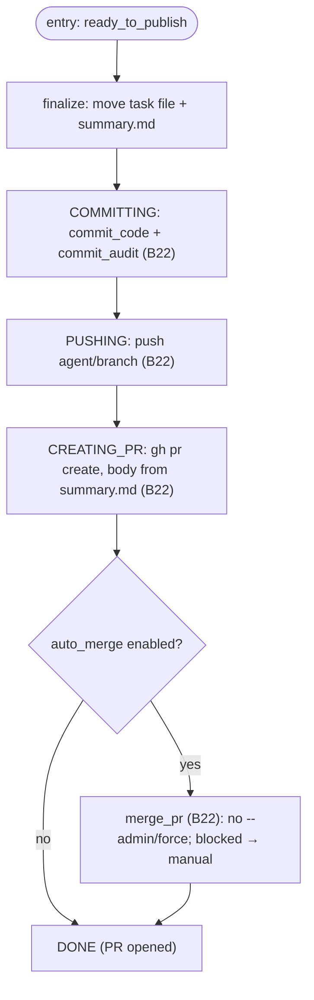

# S08 — publishing stage

## Purpose

The system's exit point to Git/GitHub: commit, push, and open a Pull Request (optionally with auto-merge). This is **not an agent** stage — everything is done by the Git Manager; agents never perform commit/push/PR operations. publishing is never skipped.

## Responsibility

- Finalize task artifacts, execute the `commit → push → PR` chain (optionally merge) idempotently, and terminate the task ([orchestrator.py:1348-1386](../../../../src/wastech_orchestrator/core/orchestrator.py#L1348)).

## Step boundaries

### Within this step's responsibility

- Publishing order and transitions (`committing → pushing → creating_pr → done`); auto-merge decision; terminal completion.

### Outside this step's responsibility

- **The git/gh operations themselves, idempotency, scoped staging** — [B22](../../blocks/B22-git-manager.md).
- **Idempotency strings `publish_operations`** — [B07](../../blocks/B07-state-machine-and-store.md); **ledger writes** — [B08](../../blocks/B08-ledger-and-failure-reports.md).

## Entry points

- `_publish(p)` ([orchestrator.py:1348](../../../../src/wastech_orchestrator/core/orchestrator.py#L1348)) — called from `_run_units_and_finish` after summary.
- `_auto_merge(p, pr_url)` ([orchestrator.py:1388](../../../../src/wastech_orchestrator/core/orchestrator.py#L1388)) — when auto-merge is enabled.

## Input data and state

Branch `agent/<id>-<slug>`, `summary.md` (PR body), flags `git.auto_merge*`. Status `ready_to_publish` → `committing` → `pushing` → `creating_pr` → `done`. Idempotency is managed via `publish_operations` ([B07](../../blocks/B07-state-machine-and-store.md)).

## Main scenario

1. Finalize artifacts (move task file + `summary.md`) **before** committing.
2. `COMMITTING`: `commit_code` (scoped staging of code) + `commit_audit` (`tasks/`) ([B22](../../blocks/B22-git-manager.md)).
3. `PUSHING`: `push` branch to `origin` (refuses to push to base) ([B22](../../blocks/B22-git-manager.md)).
4. `CREATING_PR`: `create_pr` (body from `summary.md`) ([B22](../../blocks/B22-git-manager.md)).
5. (optional) if `auto_merge` — `_auto_merge` → `merge_pr`; otherwise → `_go_terminal(DONE)` (PR opened).

## Checks and constraints

- publishing is not in `SKIPPABLE_STAGES` ([schema.py:50-63](../../../../src/wastech_orchestrator/config/schema.py#L50)) — it is the system's exit point.
- Only the orchestrator performs commit/push/PR; everything goes through argv without shell ([B22](../../blocks/B22-git-manager.md)).
- Each step is idempotent (a retry after restart does not duplicate the operation, [B22](../../blocks/B22-git-manager.md)/[B07](../../blocks/B07-state-machine-and-store.md)).
- `review` skipped **and** `auto_merge` enabled — warning "merge without review"; blocked merge → `manual_action_required` (PR stays open; never `--admin`/force) ([orchestrator.py:1371-1419](../../../../src/wastech_orchestrator/core/orchestrator.py#L1371)).

## Result / transition

Terminal `done` (via `_go_terminal`) with PR URL; if auto-merge is blocked — `manual_action_required`. Then terminal cleanup and write to [B08](../../blocks/B08-ledger-and-failure-reports.md) (in [B06](../../blocks/B06-orchestrator-pipeline.md)).

## Side effects

- Git mutations (commits/branch), network (`push`/PR/merge via `gh`); `publish_operations` strings ([B07](../../blocks/B07-state-machine-and-store.md)); heartbeat ([B27](../../blocks/B27-observability.md)).

## Errors and edge cases

- Required git/gh failure → `GitCommandError` → terminal `failed` (best-effort publication of the failed attempt, [B06](../../blocks/B06-orchestrator-pipeline.md)/[B22](../../blocks/B22-git-manager.md)).
- Blocked merge (branch protection/conflict) → `manual_action_required`, PR stays open.
- Unsafe terminal cleanup on success → result `manual_action_required` ([B06](../../blocks/B06-orchestrator-pipeline.md)).

## Relationships

### Uses

- [B22](../../blocks/B22-git-manager.md) (commit/push/PR/merge), [B07](../../blocks/B07-state-machine-and-store.md) (idempotency), [B27](../../blocks/B27-observability.md) (heartbeat).

### Used by

- [B06](../../blocks/B06-orchestrator-pipeline.md) — driver; after publishing — terminal cleanup and [B08](../../blocks/B08-ledger-and-failure-reports.md).

## Position in the flow

Final stage: turns the work result into a PR. The only place where the system writes to Git. See [flow overview](./index.md).

## Code confirmation

- [orchestrator.py:1348-1386](../../../../src/wastech_orchestrator/core/orchestrator.py#L1348) — `_publish` (commit/push/PR, transitions).
- [orchestrator.py:1388-1419](../../../../src/wastech_orchestrator/core/orchestrator.py#L1388) — `_auto_merge` (idempotent, no `--admin`).
- Tests: [tests/git/test_git_manager.py](../../../../tests/git/test_git_manager.py), [tests/core/test_orchestrator.py](../../../../tests/core/test_orchestrator.py).
